**Kubernetes- Application Lifecycle Management**

 

**Rolling Updates and Rollbacks**

***Updates and Rollbacks - Deployment***

 

\- When you first create a deployment, it triggers a rollout. A new
rollout creates a new deployment revision

\- In the future, when the application is upgraded which means the
container version is updated to new one. A new rollout is triggered and
new deployment revision is created. This helps to keep track the change
made on application and rollback to previous version of deployment if
necessary

 

kubectl rollout status deployment \<deployment name\> ; status of
rollout trigger

kubectl rollout history deployment \<deployment name\> ; show revisions
and history of deployment

 

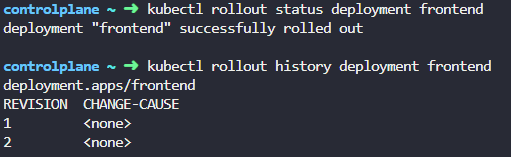

 

spec:

minReadySeconds: 20

progressDeadlineSeconds: 600

replicas: 4

revisionHistoryLimit: 10

selector:

matchLabels:

name: webapp

strategy:

rollingUpdate:

maxSurge: 25%

maxUnavailable: 25%

type: RollingUpdate

template:

metadata:

creationTimestamp: null

labels:

name: webapp

spec:

containers:

\- image: kodekloud/webapp-color:v2

imagePullPolicy: IfNotPresent

name: simple-webapp

ports:

\- containerPort: 8080

protocol: TCP

resources: {}

terminationMessagePath: /dev/termination-log

terminationMessagePolicy: File

dnsPolicy: ClusterFirst

restartPolicy: Always

schedulerName: default-scheduler

securityContext: {}

terminationGracePeriodSeconds: 30

 

When trigger new rollout or rollback, deployment creates new replicaset
and remain old replicaset in the system

 

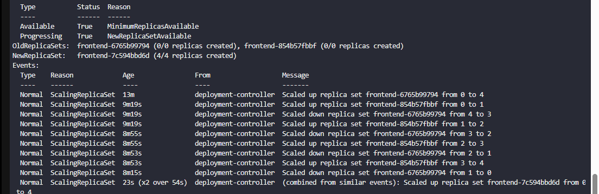

 

<https://www.techopsexamples.com/p/kubernetes-upgrades-how-not-to-mess-up>

 

***Deployment strategy***

 

*Recreate strategy*

\- If the deployment has 5 replicas, it destroys all replicas at once
and create a new replicaset with required replicas with the newer
version. The issue is that during the period of deletion and recreation
of pods, there is a downtime for users are not accessible the
application

\- Event in describe command indicates that old ReplicaSet is scaled
down to 0 first and then new ReplicaSet is scaled up to 5

\- When rollout happens in recreate strategy, it shows 502 bad gateway
error on web app

 

*RollingUpdate strategy*

\- The default deployment strategy if you don’t specify explicitly

\- Take down older version and bring up newer version on pod one by one.
Hence no downtime experience to application and upgrade is seamless.

\- Event in describe command indicates that old ReplicaSet is scaled
down one pod at a time, simultaneously new ReplicaSet is scaled up one
pod at a time.

\- We can specify how many pods in ReplicaSet should be unavailable at a
time using ***RollingUpdate*** parameters in RollingUpdateStrategy

 

-You may update deployment exactly for updating application version,
updating docker container use, updating labels, updating the number of
replicas

 

kubectl apply -f deployment-definition.yaml ; update new deployment

 

kubectl set image deployment \<name of deployment \> \<current container
name\>=nginx:1.9.1 ; set new image version in existing deployment
definition file. You can set image on multiple containers in same
command

 

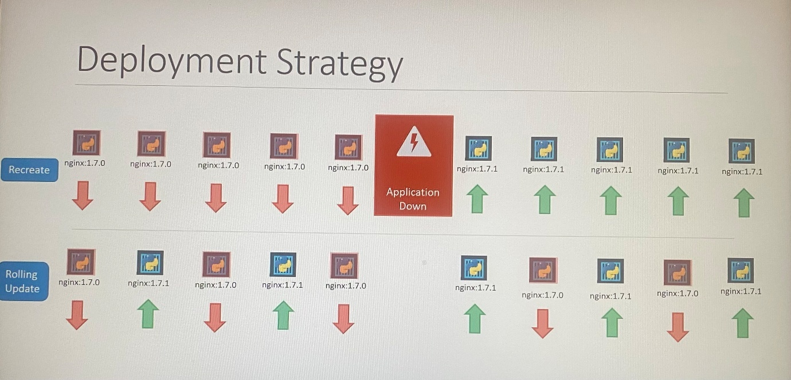

 

 

*Upgrades*

\- It creates new ReplicaSet automatically and create the number of pods
one at a time to meet the desired number of replicas

-When you upgrade the application, Kubernetes deployment create new
replica set and starts creating pods. At the same time, taking down pods
in old ReplicaSet. This behavior will indicate by checking the event
section in command *kubectl get replicaset*

 

*Rollback*

\- When you need to rollback to previous deployment revision after
latest upgrade is complete. Then the deployment will destroy the pods in
new ReplicaSet and brings the older one up with the old ReplicaSet. Note
that old replicaset will remain on the system in case it need rollback
the deployment in future.

 

kubectl rollout undo deployment \<name of deployment \>

 

Alternatively, you can rollback to a specific revision by specifying it
with --to-revision:

 

kubectl rollout undo deployment/nginx-deployment --to-revision=2

 

 

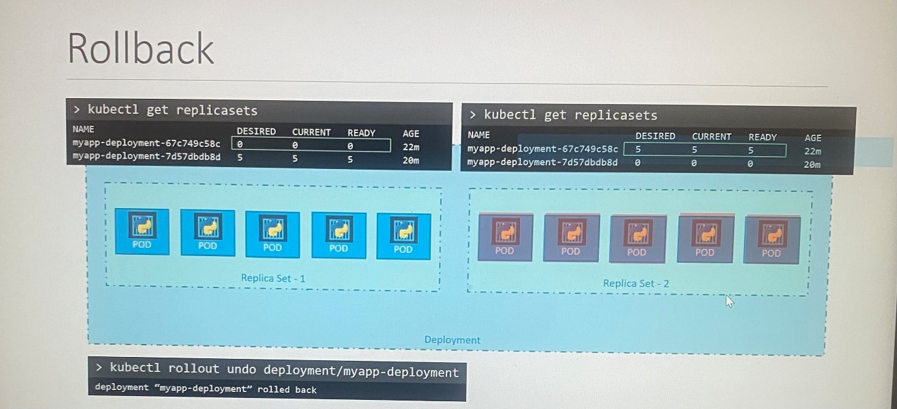

 

 

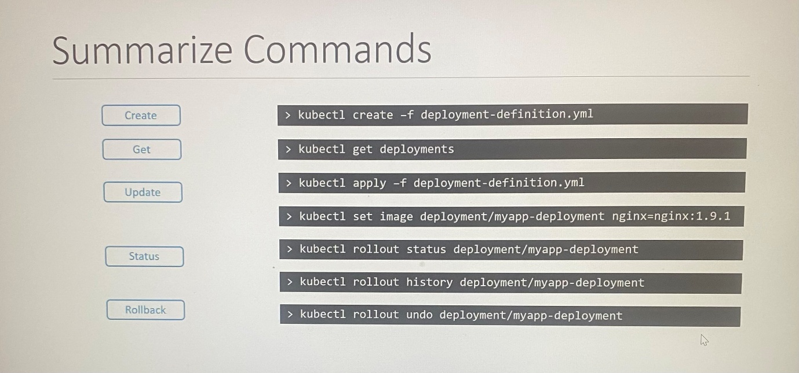

 

Use k alias for kubectl in the command line.

 

**Configure Applications**

 

Configuring applications comprises of understanding the following
concepts.

\- Configuring command and arguments on applications

\- Configuring Environmental Variables

\- Configuring Secrets

 

 

**Commands**

\*\* What if you run a docker container from an Ubuntu image, when you
run ***docker run ubuntu ,*** it runs an instance of ubuntu image and
exits immediately. The container lists as exited state. Unlike virtual
machine, containers are not meant to host an operating system.
Containers are meant to run specific service and application( task or
process) such as instance of web server, application server, database or
to carry some kind of computation or analysis task. Once the task is
complete, the container exits. A container only lives as long as the
process is alive.

 

If you look Dockerfile of Ubuntu image, it uses bash as default command.
The bash is not a process like a web server or database server. It is a
shell that listens inputs from terminal. If it cannot find the terminal,
it exits. Docker doesn't by default attach the terminal to a container
when it is run.

 

Ubuntu is an image of an OS that is used as the base image for other
applications. There is no process or application running in it by
default.

 

In this case, you can instruct to run a process with docker run command,
it overrides the default command specified within the image. For
example, a sleep command with a duration. When container starts , it
runs to sleep command and goes into sleep after the duration completes.
When the sleep command stops running, then container exits.

 

An option is to append command to docker run command which overrides the
command specified within the image.

 

docker run ubuntu \[COMMAND\]

 

docker run ubuntu sleep 5 ; the appended command will run 5 seconds and
exits

 

If you need to run the sleep command always when the container starts,
specify the sleep command in the image.

 

FROM Ubuntu

CMD sleep 5

 

CMD command param1 CMD sleep 5 ; shell form

CMD\["command","param1"\] CMD \["sleep","5"\] ; JSON array format where
first element of the array should be executable. Do not specify command
and parameter like this. CMD \["sleep 5"\]

 

docker run ubuntu 10 ; If you specify ENTRYPOINT instruction within the
Dockerfile, parameter append to the command in ENTRYPOINT will be
invoked by the number of seconds that container should sleep which is
specified in docker run command

 

\*ENTRYPOINT is the command to run at startup.

\*CMD is the default parameter pass to the command.

 

Thus, command defines with docker run take precedence over within the
instruction in Dockerfile whereas in the case of ENTRYPOINT, command
line parameter will be appended.

 

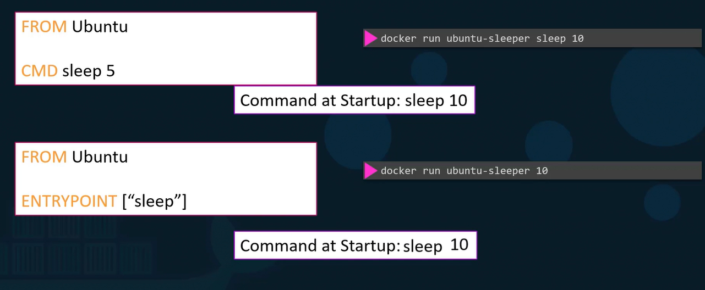

 

 

If you run docker run ubuntu-sleeper without command line parameter, it
shows error as missing operand because it only runs sleep command
without an operand at startup.

 

To set default vale as operand when you don't specify parameter in
command line, we use ENTRYPOINT and CMD together in Dockerfile where CMD
instruction will be appended to ENTRYPOINT instruction.

 

If you specify command line parameter in docker run command, it
overrides the CMD and ENTRYPOINT instruction in Dockerfile. In order to
happen this, you should specify command and ENTRYPOINT in JSON array
format.

 

If you specify ENTRYPOINT parameter in command line, it overrides the
instruction specified in Dockerfile

 

 

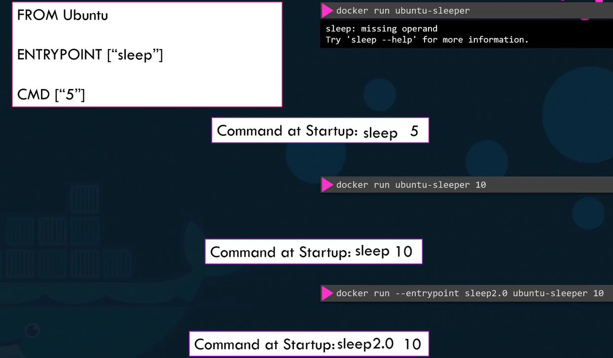

 

 

Bash script - To send multiple requests to test the web application

 

for i in {1.35}; do

kubectl exec --namespace=kube-public curl -- sh -c 'test=\`wget -qO- -T
2 <http://webapp-service.default.svc.cluster.local:8080/info> 2\>&1\` &&
echo "\$test OK" \|\| echo "Failed"';

echo ""

done

 

 

**Commands and Arguments**

 

docker run - -name ubuntu-sleeper ubuntu-sleeper 10

 

Anything append to docker run command will go to args property of the
pod definition file

 

-With the args option of pod definition file, it overrides CMD
instruction in Dockerfile

-With command option in pod definition file, it overrides ENTRYPOINT
instruction in the Dockerfile.

 

All the element under the command must be string.

 

apiVersion: v1

kind: Pod

metadata:

name: ubuntu-sleeper-pod

spec:

containers:

\- name: ubuntu-sleeper

image: ubuntu-sleeper

command: \[“sleep2.0”\]

args: \[“10”\]

 

OR

 

command:

\- “sleep”

\- “1200”

 

OR

 

command: \["sleep2.0" , "10" \]

 

kubectl run --restart=Never --image=busybox static-busybox
--dry-run=client -o yaml --command -- sleep 1000 \>
/etc/kubernetes/manifests/static-busybox.yaml

 

 

 

kubectl run \<pod name\> - -image=\<image name\> -- --color green ; If
the docker image is built and pod is running with the image, only
specify the arguments using kubectl where left side of -- are options
for kubectl utility and right side of -- are options for container.

 

 

 

**Environment variables**

 

\- Use **env** property to set environment variable in pod definition
file

\- Env is an **array** where every items consist **name** and **value**
property as key and value pair. **name** is name of environment variable
and **value** is its value

 

 

*ENV value types*

 

1\. Plain key value

 

env:

\- name: APP_COLOR

value: pink

\- name: APP_MODE

value: prod

 

Example:

 

spec:

containers:

\- env:

\- name: APP_COLOR

value: pink

image: kodekloud/webapp-color

imagePullPolicy: Always

name: webapp-color

resources: {}

 

 

2\. ConfigMap

 

env:

\- name: APP_COLOR

valueFrom:

configMapKeyRef:

name: \<ConfigMap_Name\>

key: \<Key_Name\>

 

3\. Secret

 

env:

\- name: APP_COLOR

valueFrom:

secretKeyRef:

 

 

------------------------------------

 

NODE_NAME is sourced from fieldRef: spec.nodeName, which injects the
actual node name into the container’s environment at runtime.

 

env:

\- name: NODE_NAME

valueFrom:

fieldRef:

fieldPath: spec.nodeName

 

 

------------------------------------------------

 

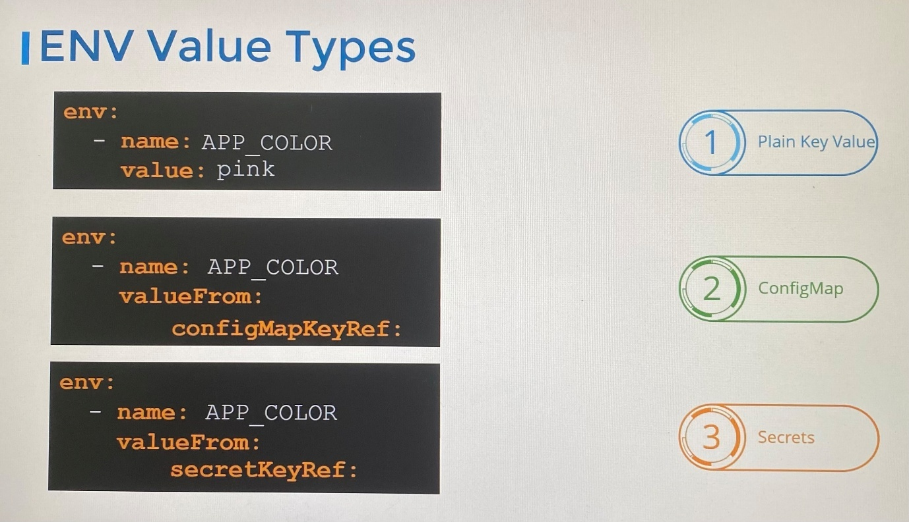

 

**ConfigMaps**

 

-A ConfigMap is an API object used to store non-confidential data in
key-value pairs. Pods can consume ConfigMaps for environment variables,
command-line arguments, or configure them as configuration files in a
volume.

\- If you adjust any change on image or whatever on your app, you have
to rebuild it and deploy with whole process using pod definition file.
When you have lot of pod definition files, it is difficult to manage
environment variables stored with query’s file, ConfigMap helps to take
this information out of pod definition file and also to centrally
manage.

\- ConfigMaps are used to pass configuration data in the form of key
value pair in Kubernetes and inject environment variable for application
hosted inside the container in the pod

\- It contains configuration data such as URL of database, database
credentials, some other services

\- ConfigMaps store data in plaintext format

\- Two phases involved in configuring config maps: Create ConfigMaps and
Inject ConfigMaps

 

***Creating ConfigMaps***

 

Imperative approach : kubectl create configmap

 

Option 1: kubectl create configmap \<configmap name\> -
-from-literal=\<key\>=\<value\>

 

kubectl create configmap app-config - -from-literal=APP_COLOR=blue ; you
can specify multiple key value pair with multiple - -from-literal

 

kubectl create configmap app-config --from-literal=APP_COLOR=blue \\

--from-literal=APP_MOD=prod

 

Option 2: kubectl create configmap \<configmap name\> -
-from-file=\<path-to-file\> -n kube-system

 

kubectl create configmap \<configmap name\> -
-from-file=/root/my-schedule-config.yaml -n kube-system

 

Declarative approach: kubectl create -f

 

apiVersion: v1

kind: ConfigMap

metadata:

name: app-config

data:

APP_COLOR: blue

APP_MODE: prod

 

Kubectl get configmaps \| cm ; to view configmaps

 

kubectl describe configmaps; list configuration data o data section

 

 

***Inject ConfigMaps to pod***

 

\- Add new property to the container list called **envFrom**

\- envFrom is a list where we can pass many environment variable as we
required with **configMapRef** property

-Each item of the list corresponds to a configmap item

-envFrom is a parameter that is part of containers list in the pod

 

Option 1: using envFrom property

 

spec:

containers:

\- name: simple-web app-color

image: simple-web app-color

 

envFrom:

\- configMapRef:

name: app-config ; map the ConfigMap created where app-config is the
name of configmap

 

 

Option 2: using Single ENV

 

env:

\- name: APP_COLOR

valueFrom:

configMapKeyRef:

name: app-config

key: APP_COLOR

 

 

Example:

 

---

apiVersion: v1

kind: Pod

metadata:

labels:

name: webapp-color

name: webapp-color

namespace: default

spec:

containers:

\- env:

\- name: APP_COLOR

valueFrom:

configMapKeyRef:

name: webapp-config-map

key: APP_COLOR

image: kodekloud/webapp-color

name: webapp-color

 

 

Option3 : using ConfigMap as volume

 

volumes:

\- name: app-config-volume

configMap:

name: app-config

 

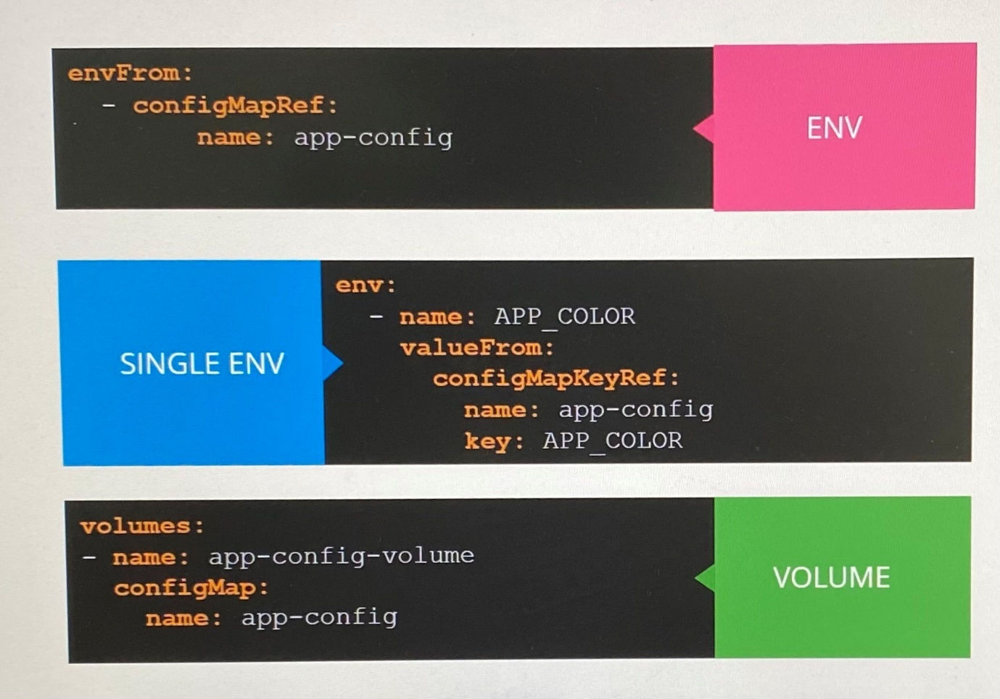

 

 

----------------------------------

You have probably never used this useful Configmap option👇

 

In Kubernetes,

 

When you reference a ConfigMap in your Pod spec, it must exist before
the Pod starts.

 

You can't deploy your application if the ConfigMap is missing.

 

For example,

 

If your Pod references "common-config" ConfigMap, Kubernetes will crash
the Pod with ImagePullBackOff or similar errors if that ConfigMap
doesn't exist.

 

However, when you set optional: true in your pod spec,

 

Pod starts even if ConfigMap doesn't exist. You can also use this option
in the volume section.

 

A simple real world use case for this is,

 

When you want to deploy your application with default settings first,
and later apply environment-specific configurations without needing to
restart the pods.

 

𝗡𝗼𝘁𝗲: When using optional Configmap, your application should still
handle missing Configmap data gracefully.

 

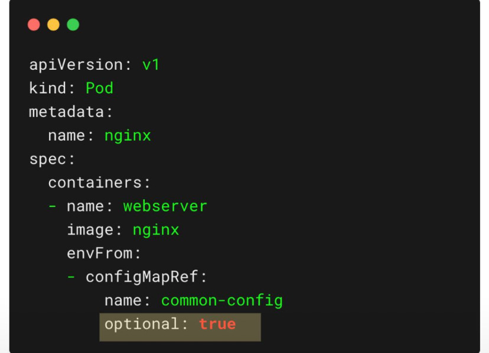

 

--------------------------------------

 

 

**Secrets**

 

\- Don’t put credentials into ConfigMap as they are frequently change
and it store data in plaintext.

\- Secret uses to store sensitive information such as password, keys in
base64 encoded format

\- The built-in security mechanism is not enabled by default.

-Two steps involve in working with secret: Create the secret and Inject
secret to the pod

 

***Create secrets***

 

*Imperative approach*

 

Option1:

 

kubectl create secret generic \<secret-name\> -
-from-literal=\<key\>=\<value\>

 

Example:

 

kubectl create secret generic app-secret --from-literal=DB_Host=mysql
--from-literal=DB_User=root --from-literal=DB_Password=passwrd ; specify
from-literal option multiple time if you need to add additional key
value pair

 

Option2:

 

kubectl create secret generic \<secret-name\> -
-from-file=\<path-to-file\> ; when you have multiple secrets to specify

 

*Declarative approach*

 

kubectl create -f

 

apiVersion: v1

kind: Secret

metadata:

name: app-secret

data:

DB_Host: \<encoded password \>

DB_User: \<encoded password \>

 

----------------------

 

*Encode secret*

 

On a Linux host, run the command to encode the password,

 

echo -n ‘password’ \| base64

 

kubectl get secrets ; shows name, type, number of data in secret and age

kubectl describe secrets \<secret name\> ; shows attributes in the
secret but hide the values in it

kubectl get secret app-secret -o yaml ; to see the values with encoded
format

 

 

*Decode secret*

 

On a Linux host, run the command to encode the password,

 

echo -n ‘encoded password’ \| base64 - -decode

 

echo "encoded password" \| base64 - -decode

 

***Inject secrets to pod***

 

Option 1: using envFrom property

 

spec:

containers:

\- name: simple-web app-color

image: simple-web app-color

port:

\- containerPort: 8080

 

envFrom:

\- secretRef:

name: app-secret ; map the name of secret created to get all secrets

 

Option 2: using Single ENV

 

env:

\- name: DB_Password

valueFrom:

secretKeyRef:

name: app-secret

key: DB_Password ; to get single environment variable from secret file

 

Option 3: Secret as Volume

 

volumes:

\- name: app-secret-volume

secret:

secretName: app-secret

 

 

Create TLS secret webhook-server-tls for secure webhook communication in
webhook-demo namespace. We have already created below cert and key for
webhook server which should be used to create secret.

 

Certificate : /root/keys/webhook-server-tls.crt

Key : /root/keys/webhook-server-tls.key

 

kubectl -n webhook-demo create secret tls webhook-server-tls \\

--cert "/root/keys/webhook-server-tls.crt" \\

--key "/root/keys/webhook-server-tls.key"

 

 

-If there are n number of attributes in secret file, n number of files
are created

 

\- Secrets are not encrypted.Only encoded

\- Do not check-in secrets objects to Source Control Management along
with code in source code repositories

\- Secrets are not encrypted in ETCD. None of the data in ETCD is
encrypted.

\- Enable encryption at rest using ***EncryptionConfiguration***
object -
<https://kubernetes.io/docs/tasks/administer-cluster/encrypt-data/>

 

**apiVersion**: apiserver.config.k8s.io/v1  
**kind**: EncryptionConfiguration  
**resources**:  
- **resources**:  
- secrets  
- configmaps  
- pandas.awesome.bears.example  
**providers**:  
- **aescbc**:  
**keys**:  
- **name**: key1  
*\# See the following text for more details about the secret value*  
**secret**: \<BASE 64 ENCODED SECRET\>  
- **identity**: {} *\# this fallback allows reading unencrypted
secrets;*  
*\# for example, during initial migration*

 

 

\- Anyone able to create pods/deployments in the same namespace can
access the secrets

\- Configure least-privileges access to Secrets-RBAC

\- Consider third party secrets store providers, AWS provider, Azure
provider, GCP provider, Vault provider

 

Data in ConfigMap and Secret in the pod can use as environment variables
or as a properties file

 

Also the way kubernetes handles secrets. Such as:

 

- A secret is only sent to a node if a pod on that node requires it.

- Kubelet stores the secret into a tmpfs so that the secret is not
  written to disk storage.

- Once the Pod that depends on the secret is deleted, kubelet will
  delete its local copy of the secret data as well.

 

Read about
the [protections ](https://kubernetes.io/docs/concepts/configuration/secret/#protections)and [risks](https://kubernetes.io/docs/concepts/configuration/secret/#risks) of
using
secrets [here](https://kubernetes.io/docs/concepts/configuration/secret/#risks)

 

There are other better ways of handling sensitive data like passwords in
Kubernetes, such as using tools like Helm Secrets, HashiCorp Vault, AWS
Secrets Manager, Google Secrets Manager and Azure Key Vault

 

**Secret Store CSI Driver**

 

- Secrets Store CSI Driver synchronizes secrets from secrets external
  APIs and mounts them into containers as volumes

- Allows you to manage secrets in a central place like Hashicorp Vault
  or AWS Secrets Manager

- Don't need to check secrets into Git

 

Dive deep into the world of Kubernetes security with our comprehensive
guide to Secret Store CSI Driver.

 

<https://www.youtube.com/watch?v=MTnQW9MxnRI>

 

* *

 

x\`

 

 

 

**Encrypting secret data at rest**

 

We focus on how data is stored in ETCD server. etcdctl command passing
the CA certificates for authentication.

 

\>etcdctl ; check etcdctl command line

\>apt-get install etcd-client ; install etcd client utility in the
system

 

ETCDCTL_API=3 etcdctl **\\  **
--cacert=/etc/kubernetes/pki/etcd/ca.crt **\\  **
--cert=/etc/kubernetes/pki/etcd/server.crt **\\  **
--key=/etc/kubernetes/pki/etcd/server.key **\\  **
get /registry/secrets/default/secret1 \| hexdump -C ; replace secret1
with your secret to see the unencrypted format of secret. This command
to see the value of secret

 

 

[Encrypting Confidential Data at Rest \|
Kubernetes](https://kubernetes.io/docs/tasks/administer-cluster/encrypt-data/)

 

The secret data is stored in ETCD as unencrypted format.

 

The kube-apiserver process accepts an argument -
-***encryption-provider-config*** the controls how API data is encrypted
in etcd.

 

ps -aux \| grep kube-api ; check kube-apiserver runs as process

 

ps -aux \| grep kube-api \| grep “encryption-provider-config” ; to check
encryption at rest is already enabled. If it doesn't return a result
which means encryption is not enabled.

 

Otherwise, checks the option - -***encryption-provider-config*** in
kubeapi-server manifest file stores in /etc/kubernetes/manifests path

 

-In **EncryptionConfiguration** object you can specify the **resources**
that need to be encrypted at rest such as secrets , **providers** that
specify encryption algorithm with custom keys such as secretbox,
AES-GCM, AES-CBC. With the providers, you can specify the keys that
should use for encryption. The providers and keys are list/array. The
provider on top of the list takes to encrypt the resources specified.

 

\*identity provider doesn't provide encryption by default

 

**apiVersion**: apiserver.config.k8s.io/v1  
**kind**: EncryptionConfiguration  
**resources**:  
- **resources**:  
- secrets  
**providers**:  
- **aescbc**:  
**keys**:  
- **name**: key1  
**secret**: \<BASE 64 ENCODED SECRET\>  
- **identity**: {} *\# REMOVE THIS LINE*

 

head -c 32 /dev/urandom \| base64 ; generate 32 byte base64 encoded
secret key for EncryptionConfiguration

 

\- You can specify EncryptionConfiguration in kubeapi server manifest
file that stored in /etc/Kubernetes/manifest using an argument
encryption-provider-config and map file to volume and volume mount.

 

apiVersion: v1

kind: Pod

metadata:

annotations:

kubeadm.kubernetes.io/kube-apiserver.advertise-address.endpoint:
10.20.30.40:443

creationTimestamp: null

labels:

app.kubernetes.io/component: kube-apiserver

tier: control-plane

name: kube-apiserver

namespace: kube-system

spec:

containers:

\- command:

\- kube-apiserver

...

\- --encryption-provider-config=/etc/kubernetes/enc/enc.yaml \# add this
line

volumeMounts:

...

\- name: enc \# add this line

mountPath: /etc/kubernetes/enc \# map the volume to directory path in
container

readOnly: true \# add this line

...

volumes:

...

\- name: enc \# add this line

hostPath: \# add this line

path: /etc/kubernetes/enc \# directory in node that has the
EncryptionConfiguration object

type: DirectoryOrCreate \# add this line

 

 

\- Then any secret after enabling encryption at rest will be encrypted
but not the secret before enabling. Once make any change or update on
secret previously created, encryption at rest is reapplied to that
secret.

 

kubectl get secrets - -all-namespace -o json \| kubectl replace -f - ;
update existing secrets with same data by applying encryption using
EncryptionConfiguration object

 

 

 

**Multi Container Pods**

 

The idea of decoupling a large monolithic application into sub
components known as microservices enables to develop and deploy a set of
independent, small, and reusable code. This architecture can then help
to scale up, scale down, as well as modify each service as required, as
opposed to modifying the entire application.

 

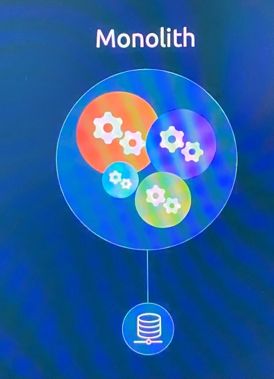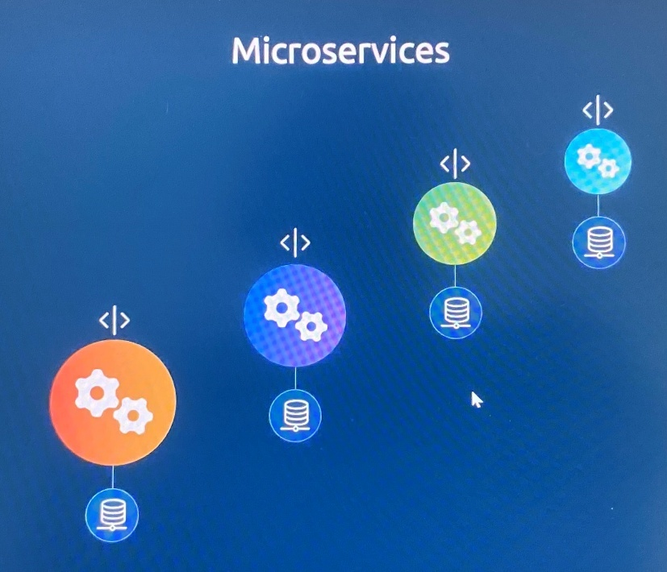

 

 

At times, you may need two services to work together, such as a web
server and a logging service. You need one agent instance per web server
instance paired together that can scale up and down together.

 

-Multi container pods that share the same pod life cycle(can create and
destroy together), network space(refer to each other as localhost) and
storage volumes(do not need volume sharing)

-Avoids volume sharing or services between the pods to enable
communication between them

 

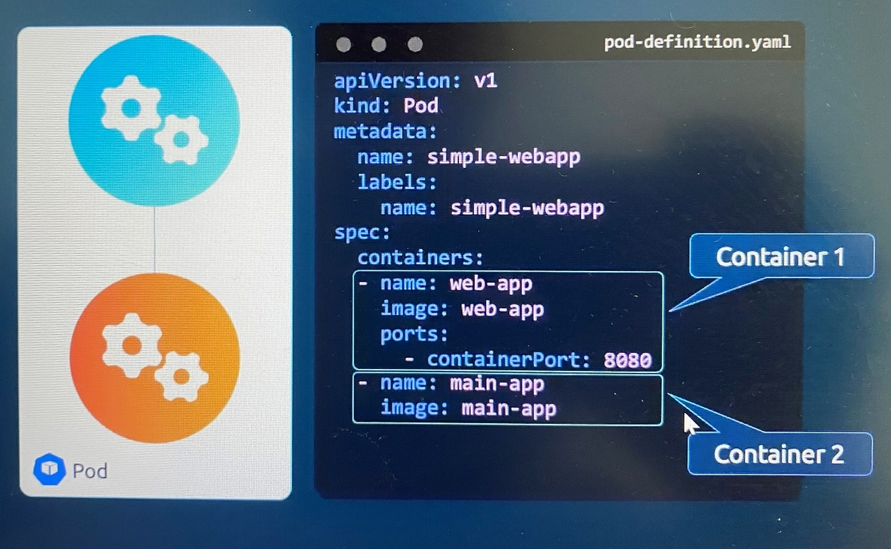

 

When log agent should run along with web server, create multiple
container in same pod adding multiple container as array into pod
definition file.

 

kubectl -n elastic-stack exec -it app -- cat /log/app.log ; inspect logs
of container in interactive mode

 

\*\*\*Exam tips: If you need to create multi-container pod, first get
create pod manifest file with single container with dry-run option. Then
modify the pod manifest file by adding additional containers.

 

**Multi-container Pods Design Patterns**

 

There are 3 common patterns, when it comes to designing multi-container
PODs.

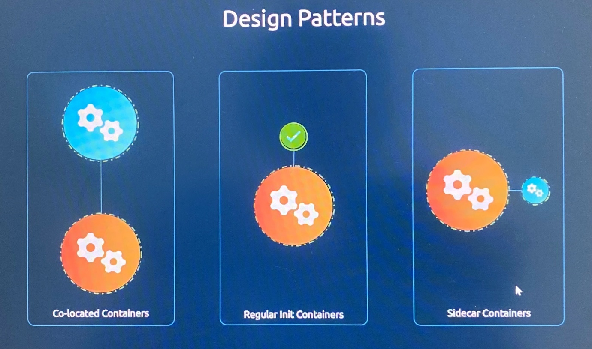

 

 

*Co-located Containers*

 

-This original form of multi-containers.

-Two containers running in a pod when two services are dependent on each
other.

-Both containers run throughout entire pod lifecycle.

-Both containers start together and there is no guarantee which one
would start before the other.

 

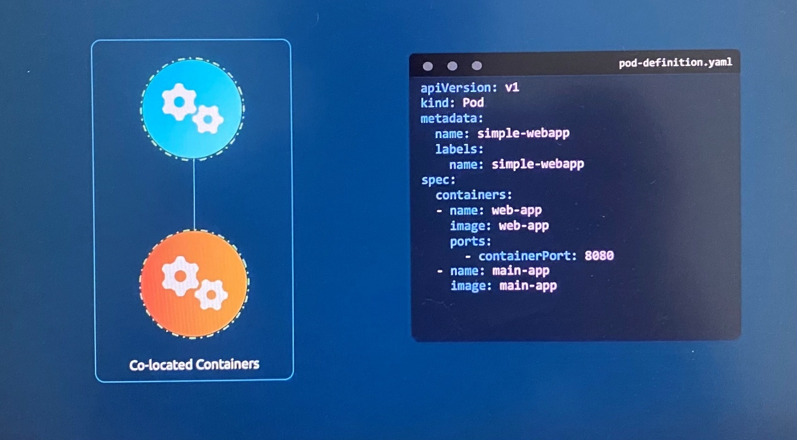

 

*Regular Init Containers*

 

-This is used when there are initialization steps to be performed when a
pod starts before the main application itself. For example, this could
be an init container that waits for a database to be ready before
starting the main application.

-The init container does the job and ends its job, and then the main
application starts.

-Instead of adding another container as second items in the container
list, define separate property **intContainers** and add multiple init
containers as list to be run sequentially.

 

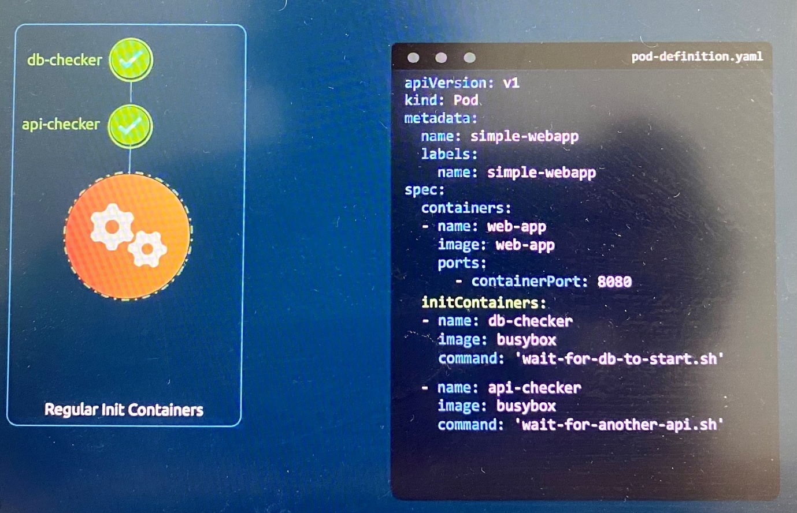

 

*Sidecar Containers*

 

\- A sidecar container is set up like an init container where the
sidecar starts first, does its job, but instead of ending its run, it
continues to run throughout the life cycle of the pod as it has
**restartPolicy** set to **always**.

-The main application starts after the sidecar container starts.

-This is useful when you have a log shipper of sorts that needs to be
run, along with the main application that needs to start before the main
app starts, but continue to run as long as the main app runs and then
end after the main app ends.

-The main difference sidecar and co-located container is sidecar
containers option provides the ability to specify an order of startup
and then continue to run throughout the pod lifecycle.

 

[Sidecar Containers \|
Kubernetes](https://kubernetes.io/docs/concepts/workloads/pods/sidecar-containers/)

 

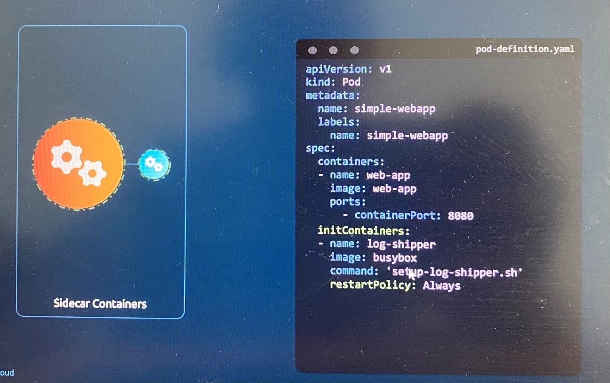

 

 

This is realistic example using the elastic search and Kibana stack.

**Elasticsearch** is itself is a component that captures the logs from
different endpoints, different applications.

**Kibana** is a visualizer that visualizes the logs which is a dashboard
that users or administrators look.

First we add a sidecar called Filebeat, which comes along with
Elasticsearch. It starts before main application starts and end after
main app ends so that it can capture any termination logs

 

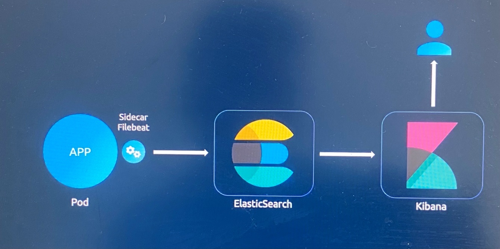

 

 

**InitContainers**

 

\- In a multi-container pod, each container is expected to run process
that stays alive as long as pod’s lifecycle

-For example in the multi-container pod that we talked about earlier
that has a web application and logging agent, both the containers are
expected to stay alive at all times. The process running in the log
agent container is expected to stay alive as long as the web application
is running. If any of them fails, the POD restarts.

\- Use initContainer is for a process that pulls binary or code from a
repository that will be used by main web application. That task will be
run only one time when the pod is created or a process that waits for an
external service or external database to be up or prepare startup script
before actual application starts.

 

An initContainer is configured in a pod like all other containers,
except that it is specified inside a initContainers section, like this:

 

apiVersion: v1

kind: Pod

metadata:

name: myapp-pod

labels:

app: myapp

spec:

containers:

\- name: myapp-container

image: busybox:1.28

command: \['sh', '-c', 'echo The app is running! && sleep 3600'\]

initContainers:

\- name: init-myservice

image: busybox

command: \['sh', '-c', 'git clone
\<some-repository-that-will-be-used-by-application\> ; done;'\]

 

-When a POD is first created the initContainer is run, and the process
in the initContainer must run to a completion before the real container
hosting the application starts.

\- You can configure multiple initContainers as well, like how we did
for multi-containers pod. In that case each init container is run one at
a time in sequential order

\- If any of InitContainers fail to complete, Kubernetes restarts the
pod repeatedly until the InitContainers succeeds

 

apiVersion: v1

kind: Pod

metadata:

name: myapp-pod

labels:

app: myapp

spec:

containers:

\- name: myapp-container

image: busybox:1.28

command: \['sh', '-c', 'echo The app is running! && sleep 3600'\]

initContainers:

\- name: init-myservice

image: busybox:1.28

command: \['sh', '-c', 'until nslookup myservice; do echo waiting for
myservice; sleep 2; done;'\]

\- name: init-mydb

image: busybox:1.28

command: \['sh', '-c', 'until nslookup mydb; do echo waiting for mydb;
sleep 2; done;'\]

 

\- Number of Init containers shows in Status as Init:0/2, if main
container in the pod is not running state.

 

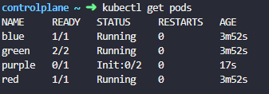

 

\- Describe command specifies ***state*** and ***reason*** of init
container. If the process is complete normally, the state should be
***Terminated*** and Reason should be ***Completed*** with ***Exit Code
is 0***

 

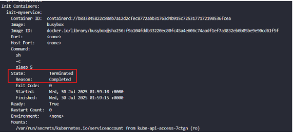

 

kubectl logs \<pod name\> -c \<container name\> ; check logs on specific
container in the pod

 

\*\*Examtips: If you need to find pods that have Init Containers, check
the describe command for all pods at one time. "kubectl describe pod"

 

 

**Self-Healing Applications**

 

Kubernetes supports self-healing applications through ReplicaSets and
Replication Controllers. The replication controller helps in ensuring
that a POD is re-created automatically when the application within the
POD crashes. It helps in ensuring desired number of replicas of the
application are running at all times.

 

Kubernetes provides additional support to check the health of
applications running within PODs and take necessary actions through
Liveness and Readiness Probes.

 

 

**Introduction to Autoscaling**

 

***Basics of scaling***

 

When load increases and run out of existing resources(CPU, memory) on
the server that host application, we need to shut down the server and
increase the size of the server vertically. That is referred as
**vertical scaling**.

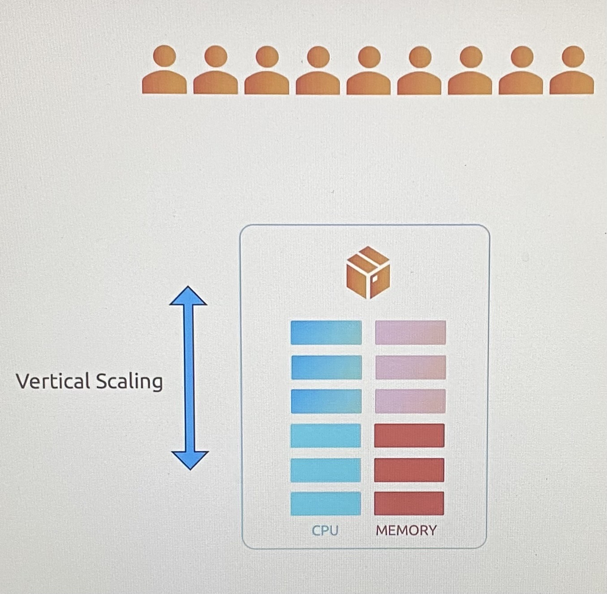

 

If the application support running in multiple instances, we can add
more servers and share load between them instead shut down servers. This
scaling is referred as **horizontal scaling**.

 

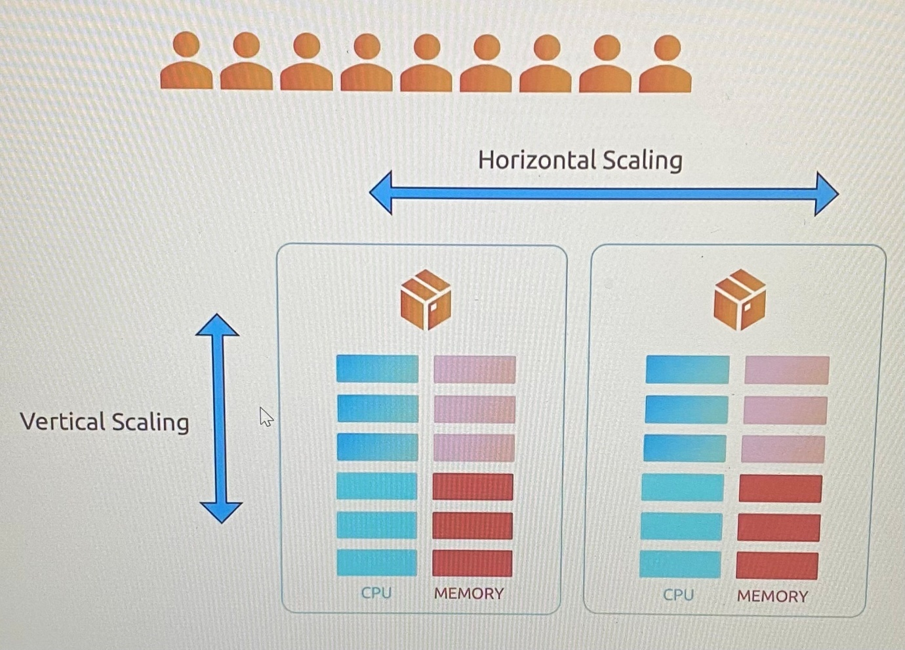

 

One of the major purposes of a container orchestrator like Kubernetes is
to host applications in the form of containers and scale up and down
based on demand.

 

There are two types of scaling in Kubernetes.

Scaling workloads - adding or removing containers or pods onto the
cluster.

Scaling Cluster Infra - adding or removing more servers or
infrastructure to cluster.

 

In scaling workloads,

horizontal scaling mean creating more pods

vertical scaling mean increasing the resources allocated to existing
pods.

 

In Scaling Cluster Infra,

 

horizontal scaling mean creating more nodes to cluster

vertical scaling mean increasing the resources allocated to existing
nodes.

 

There are two ways of scaling. There is the manual way and the automated
way.

 

 

The manual approach of horizontal scaling cluster infra is to manually
provision new nodes and then use the *kubeadm join* command to add the
new nodes to the cluster.

 

The manual approach of vertical scaling cluster infra is not common
approach because it will result in having to take down the server and
applications running on them and then add more resources to the servers
and bring it back up

 

The manual approach of horizontal scaling workloads is to run the
***kubectl scale*** command on the workload to scale up or down the
number of pods.

 

The manual approach of vertical scaling workloads is to run the
***kubectl edit*** command to go in to that deployment or stateful set
or replica set, and change the resource limits and requests associated
with the pods.

 

The automated approach of horizontal scaling cluster infra is known as
**Kubernetes Cluster Autoscaler**.

 

The automated approach of horizontal scaling cluster workloads is known
as **Horizontal Pod Autoscaler(HPA)**.

 

The automated approach of vertical scaling cluster workloads is known as
**Vertical Pod Autoscaler(VPA)**.

 

The ***kubectl scale*** command can be used to scale both deployments
and statefulsets. When scaling a statefulset, Kubernetes ensures that
the state and order of the pods are maintained, unlike in deployments
where pods can be created and destroyed in any order.

 

When you scale a deployment to a higher number of replicas than the
cluster can support due to resource constraints, Kubernetes will create
as many replicas as possible within the available resources. The
remaining replicas will be in a **pending** state until sufficient
resources are freed up or added to the cluster. This behavior allows
Kubernetes to manage resources dynamically while maintaining the desired
state as closely as possible.

 

 

 

**Horizontal Pod Autoscaler(HPA)**

 

We would manually scale a workload horizontally with *kubectl scale*
command by adding additional pods if resource usage limit reaches the
threshold value defined. The problems with this approach is that we have
to continuously monitor resource usage in order to react fast enough to
support the spike in the application or in the traffic.

To solve this, we use the Horizontal Pod Autoscaler. The Horizontal Pod
Autoscaler continuously monitors the metrics as we did manually using
the *kubectl top* command. It then automatically increases or decreases
the number of pods in a deployment, stateful set or replicaset based on
threshold set on usage of CPU, memory, or custom metrics.

 

If the CPU memory or memory usage goes too high(***observe metrics***),
HPA ***creates more pods*** to handle that and if it drops, HPA
***removes the extra pods*** to save resources through which it
***balances the thresholds***.

 

To configure a Horizontal Pod Autoscaler in imperative approach, kubectl
autoscale command targeting the deployment and specifying a CPU
threshold of 50% with minimum of 1 and maximum of 10 pods.

 

kubectl autoscale deployment my-app --cpu-percent=50 --min=1 --max=10

 

 

Kubernetes creates a Horizontal Pod Autoscaler for the deployment that
first reads the limits configured on the pod, then continuously pulls
metrics from metric server to monitor the usage. When the usage goes
beyond 50%, it modifies the number of replicas to scale up or down
depending on the usage.

 

kubectl get hpa ; view the status of the created HPA

 

kubectl get hpa --watch ; To watch the changes made to the deployment by
the HPA

kubectl delete hpa my-app ; delete the HPA created

 

kubectl events hpa nginx-deployment \| grep -i "ScalingReplicaSet" ; To
find out what the event ScalingReplicaSet means in the HPA

 

 

 

To configure a Horizontal Pod Autoscaler in declarative approach, use
these configuration.

 

API version: autoscaling/v2.

Kind: HorizontalPodAutoscaler

spec.scaleTargetRef: the target resource we want HPA to monitor

spec.minReplicas: minimum number of pods

spec.maxReplicas: maximum number of pods

spec.metrics: the metrics and resources to monitor.

 

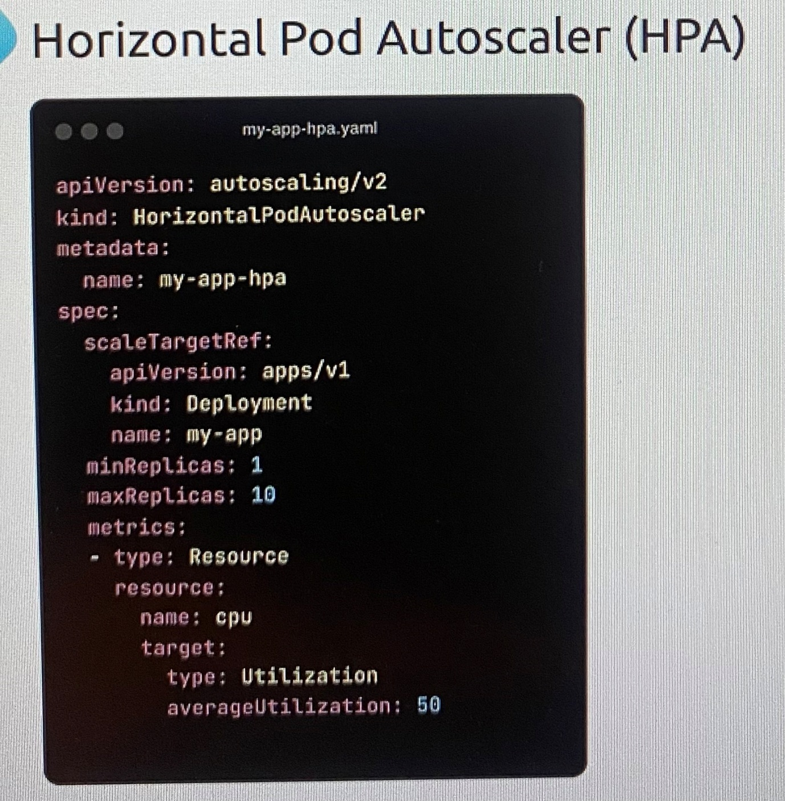

 

HPA comes built in with Kubernetes since version 1.23. Note that it
relies on metrics server so that is a prerequisite.

 

The **metrics-server** is a cluster-wide aggregator of resource usage
data, and it provides the metrics required by the HPA to make scaling
decisions.

 

There is a resource that **custom Metrics Adapter** that can retrieve
information from other internal sources like a workload deployed in a
cluster.

 

We can also refer to external sources such as tools or other instances
that are outside of the Kubernetes cluster, such as a Datadog or
Dynatrace instance using an external adapter.

 

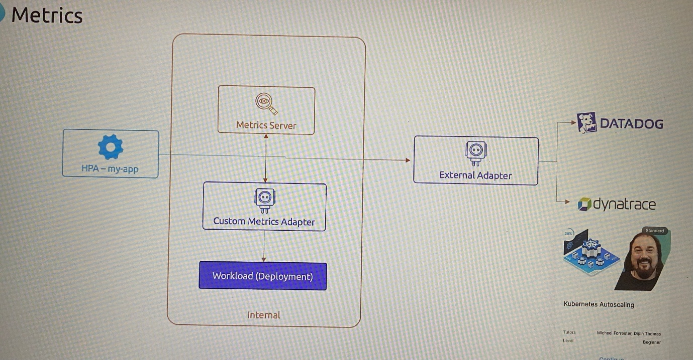

 

This HPA config change can make a huge difference in scaling.

 

In Kubernetes, HPA waits for at least 10% change in CPU/memory usage
before adding or removing pods.

 

You cant control how sensitive it was to increase or decrease in usage.

 

For example,

 

If you set 70% as the usage target, Kubernetes would only scale up if it
went above 77%, and scale down if it went below 63%.

 

The new alpha feature has a solution for this.

 

 

**In-place Resize of Pod Resources**

 

With Kubernetes version 1.32 has released, if you change resource
requirements of a pod in a deployment, the default behaviour is to
delete the existing pod and then spin up a new pod in new replica set
with the new resource definition.

 

Hence any changes to the resource definitions on a pod does not happen
in place, which means the pod needs to be killed and the new pod with
the new resource definitions need to be created. This can be disruptive
for stateful workloads. Hence there is an improvement that is called as
**in-place resize of pod resources.**

 

With Kubernetes release 1.27, this feature is not enabled by default.
However, it will be enabled when it goes to beta or stable stage in
future.

 

But the feature is still available with feature as part of Kubernetes
cluster that must be enabled.

 

\$ FEATURE_GATES=InPlacePodVerticalScaling=true ; set feature flag to
true to enable

 

Once this feature **InPlacePodVerticalScaling** is enabled, the pod
definition supports a set of **resizePolicy** parameters which allows to
specify a restart policy for each resource.

 

 

spec:

containers:

\- name: my-app

image: nginx

resizePolicy:

\- resourceName: cpu

restartPolicy: NotRequired

resourceName: memory

restartPolicy: RestartContainer

 

 

We have defined that a change in CPU resource will not require the pod
to be restarted, and a change in memory will require a restart of the
pod. Then if we make a change to a resource such as updating the CPU and
you can see that the pod does not need to be killed. Instead, it can
simply be updated with the new resources and so it can just increase in
size.

 

As of release v1.32, this feature is currently in alpha. With release
v1.33, this will be a stable feature.

 

***Limitations***

 

- Only CPU and memory resources can be changed

- Pod QoS Class cannot change

- Init containers and Ephemeral containers cannot be resized

- Resource requests and limits cannot be removed once set

- A container's memory limit may not be reduced below its usage. If a
  request puts a container in this state, the resize status will remain
  in InProgress until the desired memory limit becomes feasible

- Windows pods cannot be resized

 

**LAB: Horizontal Pod Autoscaler(HPA)**

 

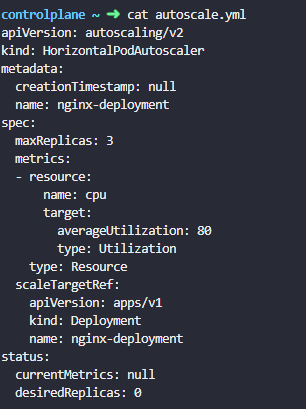

 

 

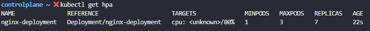

 

The **HPA status** shows **\<unknown\>/80** for the **CPU target**. what
could be a possible reason?

 

If the status of the **Horizontal Pod Autoscaler (HPA)** target
is \<UNKNOWN\>/80, it typically means that the HPA is unable to retrieve
the **current metrics** for the specified target. Run kubectl describe
hpa nginx-deployment to find more details.

 

In this case, the target deployment doesn't have any resource fields
defined where it shows Warning ***FailedGetResourceMetric***

 

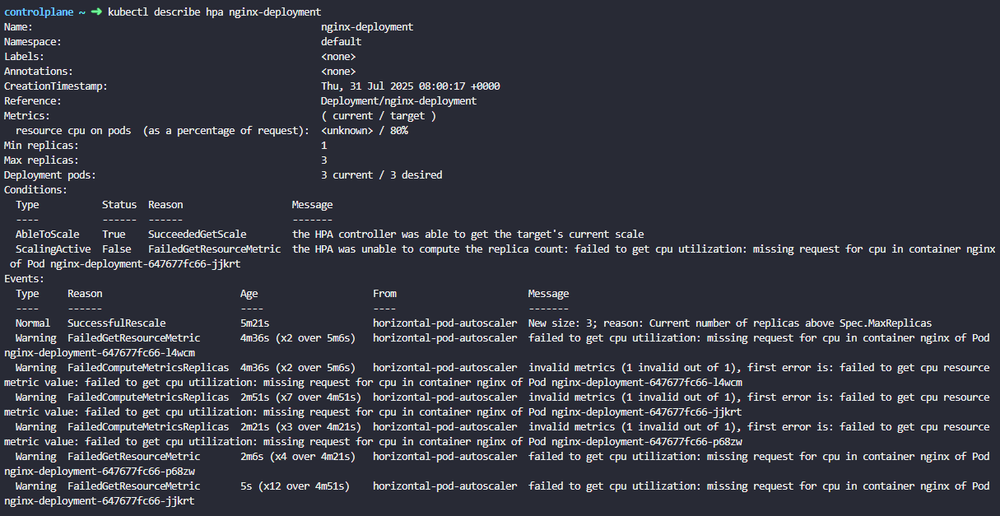

 

controlplane ~ ➜ kubectl top node

NAME CPU(cores) CPU(%) MEMORY(bytes) MEMORY(%)

controlplane 125m 0% 899Mi 0%

node01 45m 0% 1071Mi 0%

 

controlplane ~ ➜ kubectl top pods

NAME CPU(cores) MEMORY(bytes)

nginx-deployment-647677fc66-7cc4j 0m 3Mi

nginx-deployment-647677fc66-rcz7l 0m 3Mi

nginx-deployment-647677fc66-z2nl9 0m 4Mi

 

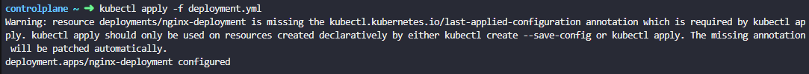

 

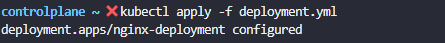

 

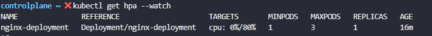

 

 

controlplane ~ ➜ kubectl get hpa --watch

NAME REFERENCE TARGETS MINPODS MAXPODS REPLICAS AGE

nginx-deployment Deployment/nginx-deployment cpu: \<unknown\>/80% 1 3 3
10m

nginx-deployment Deployment/nginx-deployment cpu: \<unknown\>/80% 1 3 3
11m

nginx-deployment Deployment/nginx-deployment cpu: \<unknown\>/80% 1 3 3
12m

nginx-deployment Deployment/nginx-deployment cpu: \<unknown\>/80% 1 3 3
12m

nginx-deployment Deployment/nginx-deployment cpu: \<unknown\>/80% 1 3 3
12m

 

 

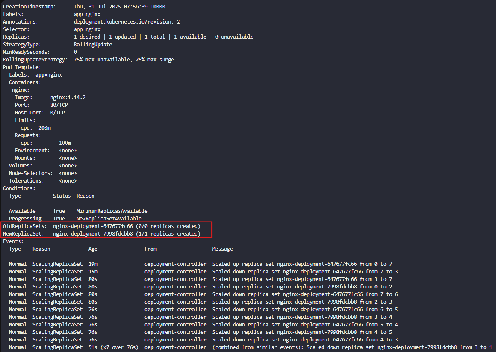

 

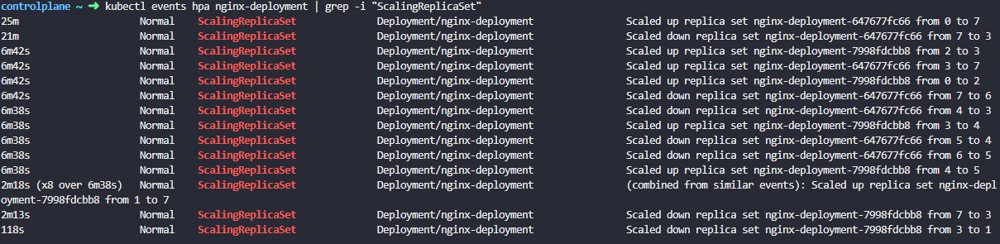

 

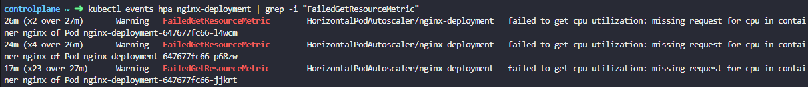

 

**Vertical Pod Autoscaling(VPA)**

 

***Scaling resources for a workload the manual way***

 

In a deployment, resource request and limit are defined. When resource
consumption reaches the threshold, we can manually scale the pod
vertically by using ***kubectl edit*** command to change the resource
request and limit for deployment. Once it saves, then existing pods will
be killed and created new pods.

 

To do automatic scaling workloads vertically, Vertical Pod Autoscaler
continuously ***observes metrics*** and then ***adjust resources***
assigned to the pods in a deployment and thus ***balances thresholds***.

 

Unlike HPA, VPA does not come built-in with Kubernetes, we must deploy
it so that we apply the VPA definition file available in the GitHub
repo. It deploys multiple components VPA Admission Controller, VPA
Recommender, VPA Updater service as pod in kube-system namespace.

 

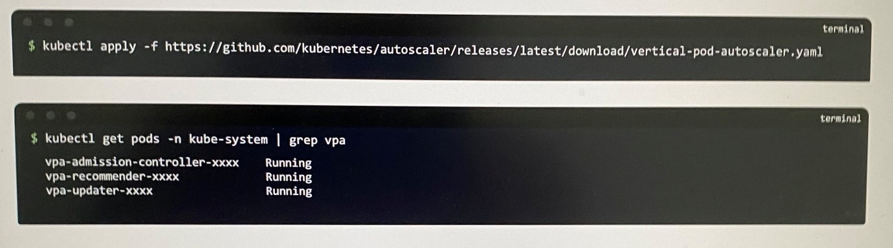

 

 

***VPA Recommender*** - continuously monitor resource usage from the
Kubernetes metrics API and collects historical and live usage data for
pods, and then provides recommendations on optimal CPU and memory
values. The Recommender itself does not modify the pod directly. It only
suggests changes.

 

***VPA Updater*** - It gets the information from the VPA Recommender and
monitors the pod, then compare collected information with actual pods,
then detects pods that are running with suboptimal resources and evicts
them when an update is needed.

 

***VPA Admission Controller*** - intervenes the pod creation process
when deployment creates new pod automatically after evicting pods by VPA
Updater, and uses the recommendations from the VPA Recommender, then
mutate the pod spec to apply the recommended CPU and memory values at
startup. It ensures that the newly created pods start with the
recommended resource requests.

 

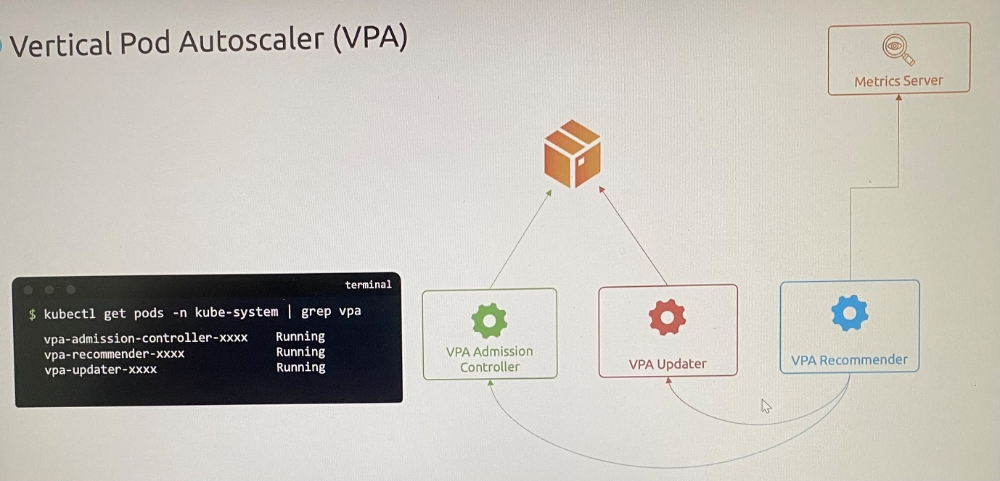

 

Note that we create VPA using resource definition file. There is no
imperative command to create VPA because it is not built-in component
line HPA.

 

To configure a Vertical Pod Autoscaler, use these configuration.

 

apiVersion: autoscaling.k8s.io/v1

kind: VerticalPodAutoscaler

targetRef: the target resource we want VPA to refer

resourcePolicy\>Container Policies: define what container is monitored
with CPU minimum allowed and maximum allowed are configured

Update Policy: There are 4 modes that VPA operates in.

 

***Update policy modes***

 

**Off** - Only recommends changes but does not change anything where it
only the VPA Recommender is working, VPA Admission Controller and VPA
Updater are not working

 

**Initial** - Only changes on pod creation, not later. When deployment
scale for some reason, the new pods come up with recommended change from
VPA Recommender. VPA Admission Controller intervenes to change pod
resource definition. In this case, VPA Updater does not work to evict
pods.

 

**Recreate** - Evicts pods if usage goes beyond range specified. VPA
Updater is also working

 

**Auto** - Updates existing pods to recommended values. For now this
behaves similar to Recreate. But when support for "In-place Update of
Pod Resources" is available that mode will be preferred over Recreate.

 

kubectl describe vpa my-app-vpa ; VPA monitor resource usage and
suggests adjustments as recommended values

 

 

 

 

-Considering scaling method, VPA optimizes individual pod performance
while HPA focuses on distributing the load across multiple instances.

 

 **LAB: Vertical Pod Autoscaling(VPA)**

 

Step 1: Install VPA Custom Resource Definitions (CRDs)

 

These CRDs allow Kubernetes to recognize the custom resources that VPA
uses to function properly. To install them, run this command:

 

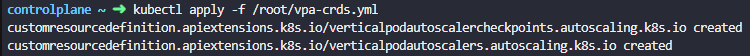

 

Step 2: Install VPA Role-Based Access Control (RBAC)

 

RBAC ensures that VPA has the appropriate permissions to operate within
your Kubernetes cluster. To install the RBAC settings, run:

 

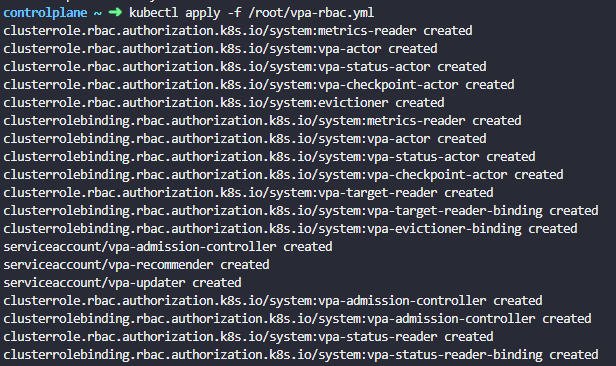

 

By running these commands, the VPA will be successfully deployed to your
cluster, ready to manage and adjust your pod resources dynamically.

 

**Clone the VPA Repository and Set Up the Vertical Pod Autoscaler**

 

You are required to clone the Kubernetes Autoscaler repository into the
/root directory and set up the Vertical Pod Autoscaler (VPA) by running
the provided script.

Steps:

 

Clone the repository:

 

First, navigate to the /root directory and clone the repository:

 

git clone <https://github.com/kubernetes/autoscaler.git>

 

Navigate to the Vertical Pod Autoscaler directory:

After cloning, move into the vertical-pod-autoscaler directory:

 

cd autoscaler/vertical-pod-autoscaler

 

Run the setup script:

Execute the provided script to deploy the Vertical Pod Autoscaler:

 

./hack/vpa-up.sh

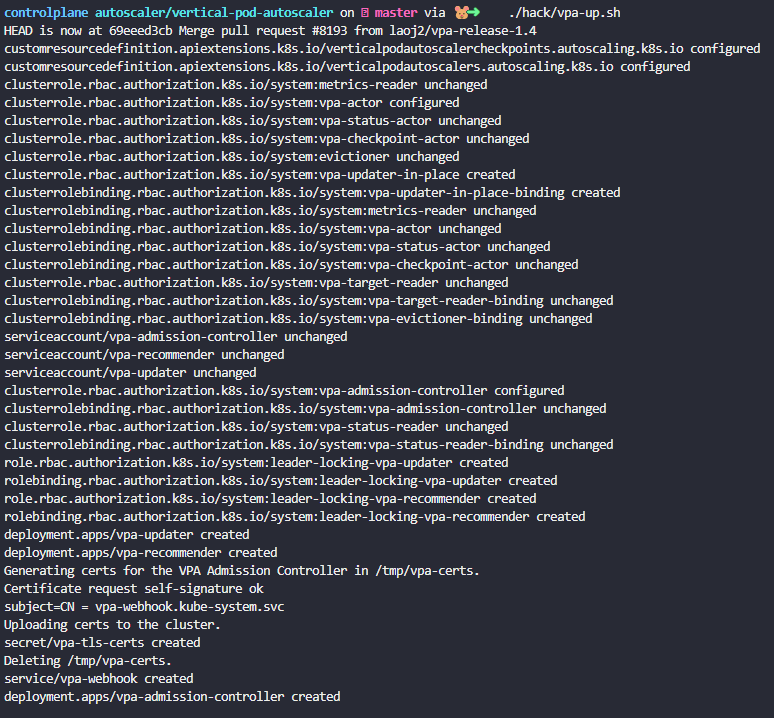

 

By following these steps, the Vertical Pod Autoscaler will be installed
and ready to manage pod resources in your Kubernetes cluster.

 

It deploys VPA components as deployment.

 

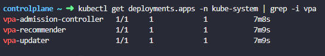

apiVersion: "autoscaling.k8s.io/v1"

kind: VerticalPodAutoscaler

metadata:

name: flask-app

spec:

\# recommenders field can be unset when using the default recommender.

\# When using an alternative recommender, the alternative recommender's
name

\# can be specified as the following in a list.

\# recommenders:

\# - name: 'alternative'

targetRef:

apiVersion: "apps/v1"

kind: Deployment

name: flask-app

updatePolicy:

updateMode: "Recreate"

evictionRequirements:

\- resources: \["cpu", "memory"\]

changeRequirement: TargetHigherThanRequests

resourcePolicy:

containerPolicies:

\- containerName: '\*'

minAllowed:

cpu: 100m

memory: 100Mi

maxAllowed:

cpu: 1

memory: 500Mi

controlledResources: \["cpu", "memory"\]

 

 

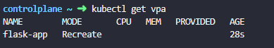

 

After deployment, check the logs of the Vertical Pod Autoscaler(VPA)
updater to ensure it is functioning correctly.

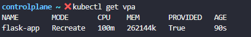

 

**Interpret VPA recommendations** by understanding key parameters in
status section yaml output of VPA like lowerBound, upperBound,
and uncappedTarget for resource management.

 

controlplane ~ ✖ echo "548m" \> /root/target

 

controlplane ~ ➜ kubectl get vpa flask-app -o yaml

apiVersion: autoscaling.k8s.io/v1

kind: VerticalPodAutoscaler

metadata:

creationTimestamp: "2025-08-01T03:45:04Z"

generation: 1

name: flask-app

namespace: default

resourceVersion: "9961"

uid: 2c038f54-c2f8-4c20-972c-7f758f258d5f

spec:

resourcePolicy:

containerPolicies:

\- containerName: '\*'

controlledResources:

\- cpu

\- memory

maxAllowed:

cpu: 1

memory: 500Mi

minAllowed:

cpu: 100m

memory: 100Mi

targetRef:

apiVersion: apps/v1

kind: Deployment

name: flask-app

updatePolicy:

evictionRequirements:

\- changeRequirement: TargetHigherThanRequests

resources:

\- cpu

\- memory

updateMode: Recreate

**status:**

**conditions:**

**- lastTransitionTime: "2025-08-01T03:45:49Z"**

**status: "True"**

**type: RecommendationProvided**

**recommendation:**

**containerRecommendations:**

**- containerName: flask-app**

**lowerBound:**

**cpu: 100m**

**memory: 262144k**

**target:**

**cpu: 100m**

**memory: 262144k**

**uncappedTarget:**

**cpu: 25m**

**memory: 262144k**

**upperBound:**

**cpu: 100m**

**memory: 262144k**

When checking the logs, you see the following error message:

pods_eviction_restriction.go:226\] \*\*too few replicas\*\* for
\*\*ReplicaSet\*\* default/\*\*flask-app-b6c9c4f78\*\*

 

kubectl logs \$(kubectl get pods -n kube-system --no-headers -o
custom-columns=":metadata.name" \| grep vpa-updater) -n kube-system

 

This command first retrieves the pod name using kubectl get pods and
then pipes it to the kubectl logs command to print the logs of
the vpa-updater pod.

 

 

controlplane ~ ✖ kubectl logs deployments/vpa-updater -n kube-system \|
grep -i "pods_eviction_restriction.go"

I0405 10:47:59.720755 1 pods_eviction_restriction.go:228\] "Too few
replicas" kind="ReplicaSet" object="default/flask-app-67b666c5fc"
livePods=1 requiredPods=2 globalMinReplicas=2

I0405 10:48:59.720842 1 pods_eviction_restriction.go:228\] "Too few
replicas" kind="ReplicaSet" object="default/flask-app-67b666c5fc"
livePods=1 requiredPods=2 globalMinReplicas=2

I0405 10:49:59.720666 1 pods_eviction_restriction.go:228\] "Too few
replicas" kind="ReplicaSet" object="default/flask-app-67b666c5fc"
livePods=1 requiredPods=2 globalMinReplicas=2

I0405 10:50:59.720880 1 pods_eviction_restriction.go:228\] "Too few
replicas" kind="ReplicaSet" object="default/flask-app-67b666c5fc"
livePods=1 requiredPods=2 globalMinReplicas=2

I0405 10:51:59.720601 1 pods_eviction_restriction.go:228\] "Too few
replicas" kind="ReplicaSet" object="default/flask-app-67b666c5fc"
livePods=1 requiredPods=2 globalMinReplicas=2

I0405 10:52:59.720972 1 pods_eviction_restriction.go:228\] "Too few
replicas" kind="ReplicaSet" object="default/flask-app-67b666c5fc"
livePods=1 requiredPods=2 globalMinReplicas=2

I0405 10:53:59.721156 1 pods_eviction_restriction.go:228\] "Too few
replicas" kind="ReplicaSet" object="default/flask-app-67b666c5fc"
livePods=1 requiredPods=2 globalMinReplicas=2

I0405 10:54:59.720820 1 pods_eviction_restriction.go:228\] "Too few
replicas" kind="ReplicaSet" object="default/flask-app-67b666c5fc"
livePods=1 requiredPods=2 globalMinReplicas=2

 

Problem Analysis:

 

- Flask application is running with only 1 replica pod.

- The Vertical Pod Autoscaler (VPA) needs to evict (remove) the existing
  pod to create a new one with updated resource settings.

- Kubernetes has a safety feature **pods_eviction_restriction.go:226\]**
  that prevents removing the last pod of a deployment to avoid service
  downtime.

- When you have only 1 replica and VPA tries to evict it, Kubernetes
  blocks this action with the error message: "too few replicas".

- VPA wants to optimize your pod's resources but cannot because
  Kubernetes is protecting your service availability.

- As a result, VPA cannot apply its resource recommendations, and
  application cannot benefit from automatic resource optimization.

 

Approach to Resolve the Issue:

 

1\. Increase the replica count:

 

kubectl scale deployment flask-app --replicas=2

 

2\. Verify the Deployment:

 

kubectl get deployment flask-app -o wide

 

Ensure that the DESIRED column shows the updated replica count, and the
CURRENT column matches the desired number.

 

3\. Check the Pod Status:

 

kubectl get pods -l app=flask-app

 

Wait until all pods show Running status.

You should see two pods (or more) in a Running state.

 

4\. Verify VPA operation:

 

kubectl describe vpa flask-app

 

This will show the current state of the VPA and any recommendations it
has made. If it's working properly, you should see resource
recommendations (for CPU and memory) in the output.

 

With 2 replicas, Kubernetes can safely remove one pod while keeping your
application running, allowing VPA to work properly.

 

 

controlplane ~ ➜ kubectl describe vpa flask-app

Name: flask-app

Namespace: default

Labels: \<none\>

Annotations: \<none\>

API Version: autoscaling.k8s.io/v1

Kind: VerticalPodAutoscaler

Metadata:

Creation Timestamp: 2025-04-05T10:47:22Z

Generation: 1

Resource Version: 4054

UID: e5d1cf06-c58f-4951-a82c-969af94c6631

Spec:

Resource Policy:

Container Policies:

Container Name: \*

Controlled Resources:

cpu

memory

Max Allowed:

Cpu: 1

Memory: 500Mi

Min Allowed:

Cpu: 100m

Memory: 100Mi

Target Ref:

API Version: apps/v1

Kind: Deployment

Name: flask-app

Update Policy:

Eviction Requirements:

Change Requirement: TargetHigherThanRequests

Resources:

cpu

memory

Update Mode: Recreate

Status:

Conditions:

Last Transition Time: 2025-04-05T10:48:00Z

Status: True

Type: RecommendationProvided

Recommendation:

Container Recommendations:

Container Name: flask-app

Lower Bound:

Cpu: 100m

Memory: 262144k

Target:

Cpu: 100m

Memory: 262144k

Uncapped Target:

Cpu: 25m

Memory: 262144k

Upper Bound:

Cpu: 100m

Memory: 262144k

Events:

Type Reason Age From Message

---- ------ ---- ---- -------

Normal EvictedPod 15s vpa-updater VPA Updater evicted Pod
flask-app-67b666c5fc-7nsft to apply resource recommendation.

 

 

 

**LAB2: VPA**

 

In this lab, you will deploy a sample application on Kubernetes, monitor
its CPU resource usage, and utilize a Vertical Pod Autoscaler (VPA) to
manage and adjust the resource allocation for the pods. The goal is to
observe how the VPA automatically recommends and adjusts memory resource
limits, particularly when the application experiences increased load.

 

Objectives:

- Deploy a sample application and verify that the pods are running
  correctly.

- Monitor pod resource usage using the kubectl top command to assess CPU
  and memory consumption.

- Deploy a Vertical Pod Autoscaler (VPA) to observe how it adjusts CPU
  and memory resource recommendations based on the application’s current
  usage.

- Introduce load to the application and monitor how VPA dynamically
  updates its recommendations in response to increased demand.

- Interpret VPA recommendations by understanding key parameters like
  lowerBound, upperBound, and uncappedTarget for resource management.

 

By the end of this lab, you will have a clear understanding of how VPA
optimizes CPU resource usage in a Kubernetes environment, improving
application performance and efficiency under varying workloads.

 

 

 
