**Kubernetes- Cluster Maintenance**

 

**OS Upgrades**

 

\- If node goes down and come back online immediately, Kubelet process
starts and then pods come back online in the node. But the node is down
more than 5 minutes, pods are terminated from the node.

\- If the pod is part of ReplicaSet, the pod will be recreated on other
node.

\- The time awaits to come the pod back online is called as ***pod
eviction timeout*** which is set on the kube controller manager with
default value of 5 minutes

 

kube-controller-manager --pod-eviction-timeout=5m0s

 

\- Whenever a node goes down, master node awaits 5 minutes for
considering the worker node is dead.

-When the node comes back online after pod eviction timeout, it comes up
as blank node without any pod is scheduled on the node.

\- If you have maintenance tasks to be performed and also if you know
the workloads running on the node have other replicas on other node and
if you are sure the node come back online within 5 minutes, you can make
quick upgrade and reboot. If you are not sure node will come up within 5
minutes, the safer way to do it is that you can purposefully drain the
node that have workloads to other nodes in the cluster.

\- Draining a node will not move pods to another node technically.
However, the pods gracefully terminated on the node and recreated on
another node.

\- Then the node is ***cordon*** and marked as ***unschedulable: true***
which means no pod can be scheduled until you specifically remove
restrictions. Now the pods are safely scheduled on other node. You can
do maintenance and reboot the node.

 

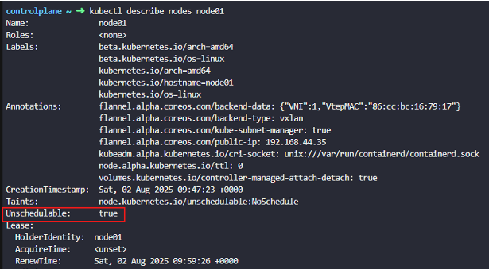

 

kubectl drain node-1 ; The status of the node becomes SchedulingDisabled
state

 

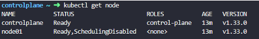

 

\- By default, kubectl drain command ignores certain system pods on the
node that cannot be killed. In that case use the option **-
-ignore-daemonsets** to ignoring systems pods are being terminated

 

kubectl uncordon node-1 ; configure the node to be schedulable and it
can resume scheduling new pods

 

\- The pods we moved to other nodes don’t automatically fall back to
same node unless new pods created in the cluster , then they are
scheduled on this node

 

kubectl cordon node-2 ; simply mark the node unschedulable. Unlike
drain, it doesn’t terminate or move existing pods. Instead it make sure
new pods are not scheduled on that node and the critical app running
pods keepalive

 

\- **PodDistruptionBudget** limits the number of pods of a replicated
application that are down simultaneously from voluntary disruption. It
ensures that the number of replicas running is never brought below the
number needed for a quorum.

 

kubectl drain node-1 - -ignore-daemonsets ; evicting the pods by
ignoring daemonsets

 

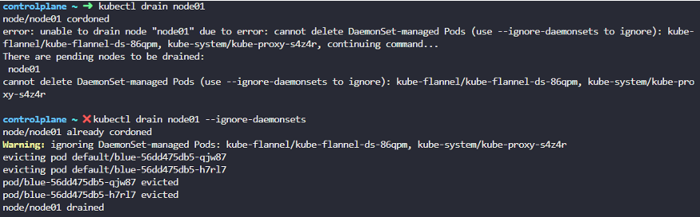

 

\- The daemonsets controller also creates pods that ignore
unschedulable:true and the taint node have which allows the new pods to
launch onto a node that you drained.

\- Pods that are not part of ReplicationController, ReplicaSet, Job,
Daemonsets or StatefulSet which means that declare no controller cannot
be terminated by draining a node. To override that, use option - -force
and which pod will be lost forever

 

kubectl drain node-1 - -ignore-daemonsets --force ; deleting pods that
declare no-controller which means there are pods which are not part of
replicaset

 

If any pod that declare no controller is drained from node, that pod
will be lost forever and the pod will not be scheduled on other node as
it is not part of replicaset.

 

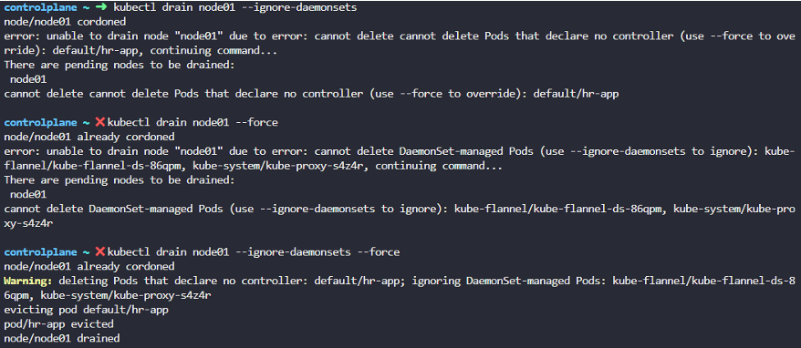

 

alias k=kubectl ; set alias k for kubectl

 

**Kubernetes Software Versions**

 

\- kubectl get nodes indicate version of Kubernetes

\- V1.11.3 depicts major.minor.patch versions

\- Minor version releases with features and functionalities every few
months

\- Patch version are released more often with critical bug fixes

\- Stable version is v1.13.0 which released in 2018

\- Before releases new minor version, it comes with alpha
tag(V1.10.0-alpha) which is buggy and features are disabled by default.
After fixing the bug which releases with beta tag(V1.10.0-beta) where
the code is tested and new features are enabled by default.

\- All Kubernetes cluster components such as kube-apiserver,
kube-scheduler, kube-controller-manger, Kubelet, kubectl, kube-proxy
with the executable bundled for all components except ETCD cluster and
CoreDNS come with new minor version . ETCD cluster and CoreDNS has their
own version as they are separate projects as well as externally
dependent applications.

 

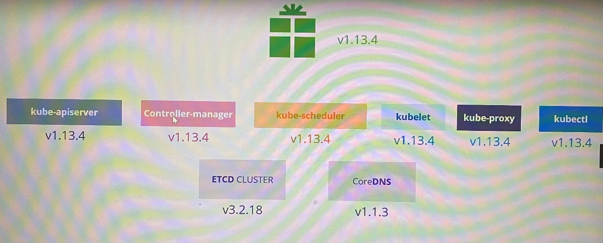

 

<https://kubernetes.io/docs/concepts/overview/kubernetes-api/>

Here is a link to kubernetes documentation if you want to learn more
about this topic (You don't need it for the exam though):

<https://github.com/kubernetes/community/blob/master/contributors/devel/sig-architecture/api-conventions.md>

<https://github.com/kubernetes/community/blob/master/contributors/devel/sig-architecture/api_changes.md>

 

 

**Cluster upgrade process**

 

\- Since kube-apiserver is the primary component of cluster, none of
others should have higher version than version of kube-apiserver. The
controller-manager and Kube-scheduler can be at one version lower.

\- If kube-apiserver is v1.10, controller-manager and kube-scheduler
could be v1.10 or v1.9, Kubelet and kube-proxy could be v1.10 or v1.9 or
v1.8

\- But kubectl could be v1.11 or v1.10 or v1.9

 

\*\*Refer version Skew Policy for more information.

 

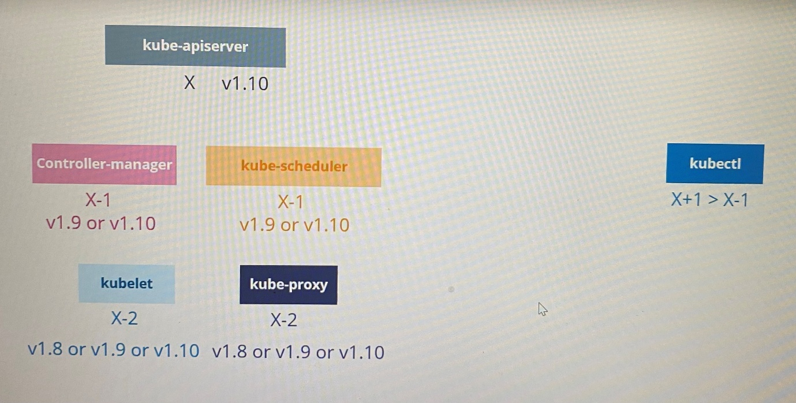

-We can perform live upgrade component by component if required

\- At any time, Kubernetes supports only up to recent 3 minor versions.
If latest Kubernetes version is 1.13, 1.12 and 1.11 are supported. 1.10
is not supported.

\- The components can be upgraded up to one higher minor version at a
time as recommended.

 

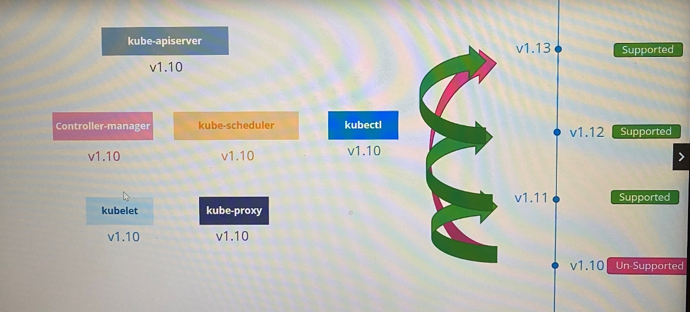

 

\- Easiness upgrading cluster using the way that cluster deploys

In a cloud platform \> kubeadm tool(kubeadm upgrade plan \| kubeadm
upgrade apply) \> from a scratch

 

 

Upgrading the cluster involves two major steps

 

*Upgrade the master node*

 

\- All the control plane components such as apiserver, scheduler,
controller-manager go down briefly

\- Master goes down doesn’t mean worker nodes or application are
impacted. However all management functions are down such as following.

 

- You cannot access cluster using kubectl or other Kubernetes API

- You cannot deploy new application or modify/delete existing app

- The controller-manager doesn’t function either, so new pod will not be
  created if a pod fails.

 

As long as nodes and pods up, the application should be up and will not
be impacted

 

Upgrade the worker nodes

 

\- Use strategies to upgrade worker nodes

 

Strategy 1 - Upgrade all nodes at once where no application will be
available. It requires downtime. In this case, pods are down, users are
no longer accessible the application.

 

Strategy 2 - Upgrade one node at a time. Pods in first node move to
other node when 1st node is upgraded. Thus nodes are upgraded to newer
version one by one without having downtime required

 

Strategy 3 - Add new nodes with newer software version to cluster and
move workloads over to new and remove old ones until cluster has nodes
with newer version. This is easier in cloud platform to provision new
nodes and decommission old ones. Finally all worker nodes are in newer
version.

 

**Kubeadm - upgrade**

 

 

kubeadm upgrade plan ; provide information in cluster version, kubeadm
version, latest stable version of cluster, current version of cluster
components, stable version of cluster components that can be upgraded,
version of Kubelet that should manually upgrade each nodes after
upgrading version of control plane component

 

 

\- Kubeadm upgrade apply command doesn’t install or upgrade Kubelet and
kubectl

\- This command shows kubeadm tool should be upgraded before upgrade the
cluster

\- Kubeadm tool follows same software version as Kubernetes

 

[Upgrading kubeadm clusters \|
Kubernetes](https://kubernetes.io/docs/tasks/administer-cluster/kubeadm/kubeadm-upgrade/)

 

***Upgrading control plane nodes***

 

- Changing the Kubernetes package repository on controlplane nodes
  [Changing The Kubernetes Package Repository \|
  Kubernetes](https://kubernetes.io/docs/tasks/administer-cluster/kubeadm/change-package-repository/#verifying-if-the-kubernetes-package-repositories-are-used)

 

Use any text editor you prefer to open the file that defines the
Kubernetes apt repository.

 

vim /etc/apt/sources.list.d/kubernetes.list

 

Update the version in the URL to the next available minor release, i.e
v1.31.

 

deb \[signed-by=/etc/apt/keyrings/kubernetes-apt-keyring.gpg\]
<https://pkgs.k8s.io/core:/stable:/v1.31/deb/> /

 

After making changes, save the file and exit from your text editor.
Proceed with the next instruction.

 

 

- Determine which version to upgrade on controlplane node

 

sudo apt update

sudo apt-cache madison kubeadm

 

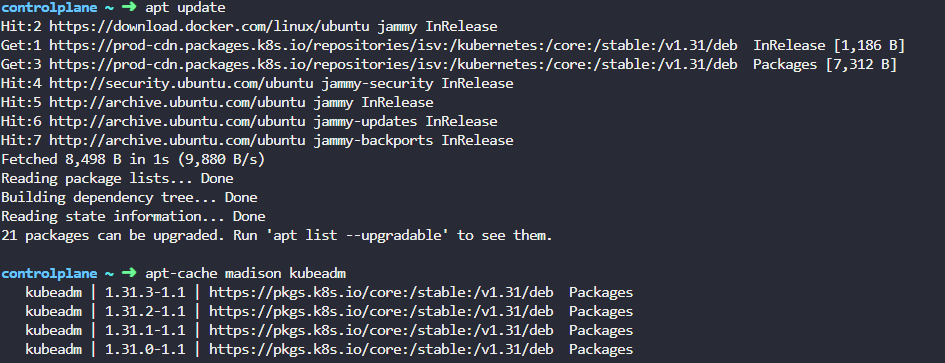

 

- Upgrade Kubeadm on controlplane node

 

Based on the version information displayed by apt-cache madison kubeadm,
it indicates that for Kubernetes package repository upgradable with
versions, the available package version are 1.31.0-1.1 - 1.31.3-1.1.
Therefore, to install kubeadm for Kubernetes v1.31.0, use the following
command:

 

apt-get install kubeadm=1.31.0-1.1

 

Or

 

sudo apt-mark unhold kubeadm && \\

sudo apt-get update && sudo apt-get install -y kubeadm='1.31.0-1.1' &&
\\

sudo apt-mark hold kubeadm

 

 

kubeadm version ; verify upgraded kubeadm version

 

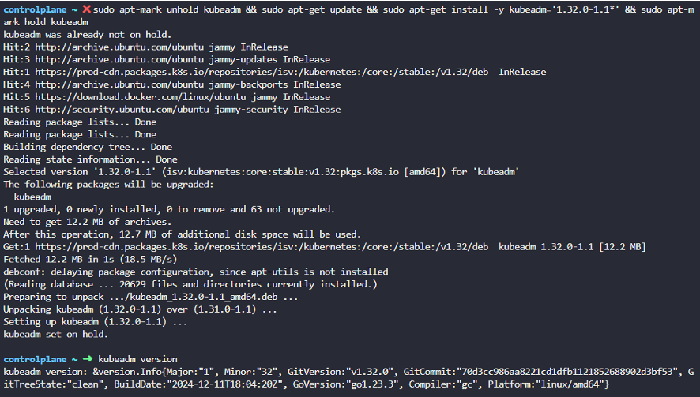

 

 

 

- Upgrade control plane components

 

sudo kubeadm upgrade plan --allow-release-candidate-upgrades ; verify
the upgrade plan

 

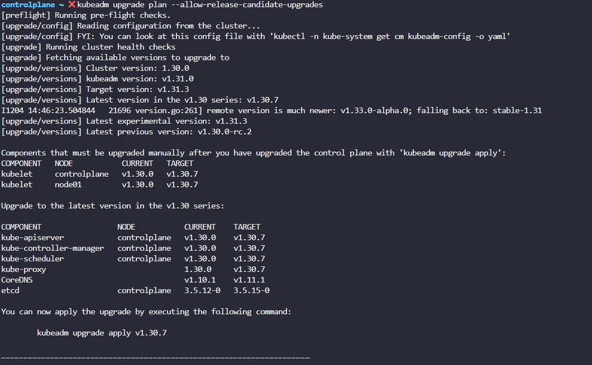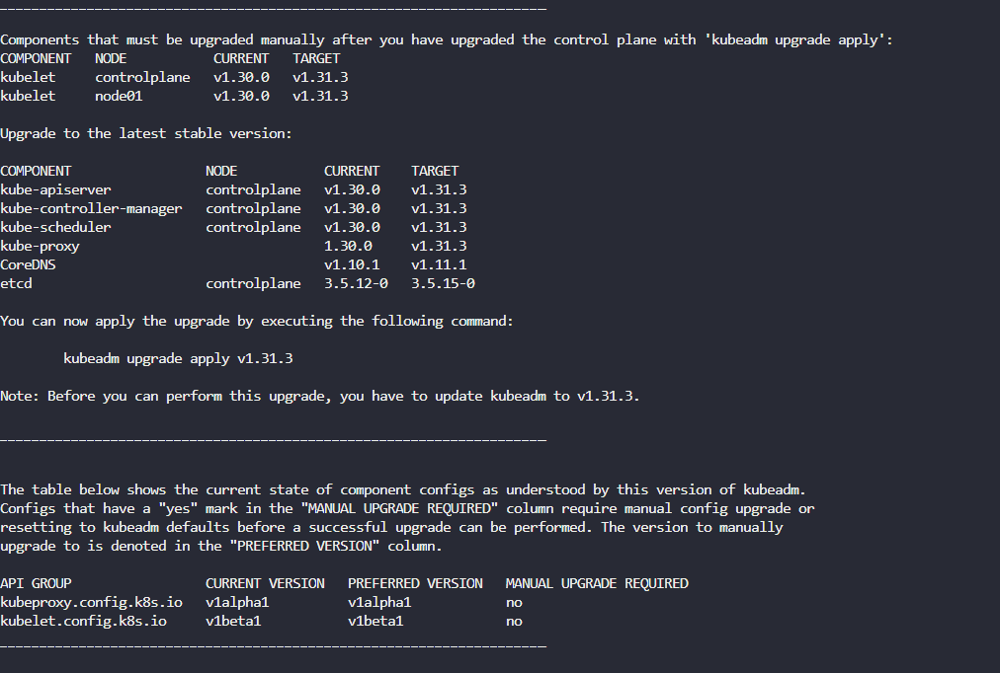

 

 

Run the following command to upgrade the Kubernetes cluster where
upgrade Kubeapi server, Kube -Controller manager, Kube-scheduler and
kube-proxy

 

kubeadm upgrade apply v1.31.0 ; With this command, upgrade on
Kube-apiserver, kube-controller-manager, kube-schduler , kube-proxy

 

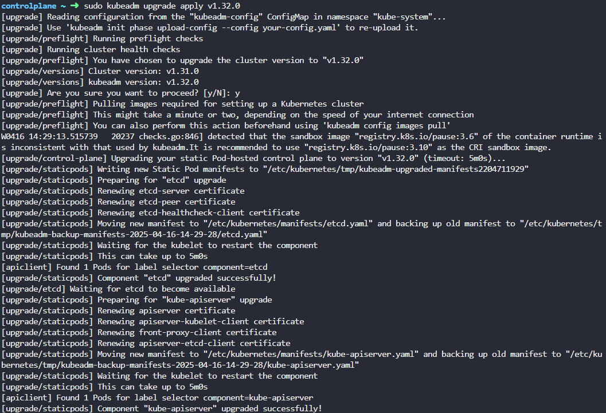

 

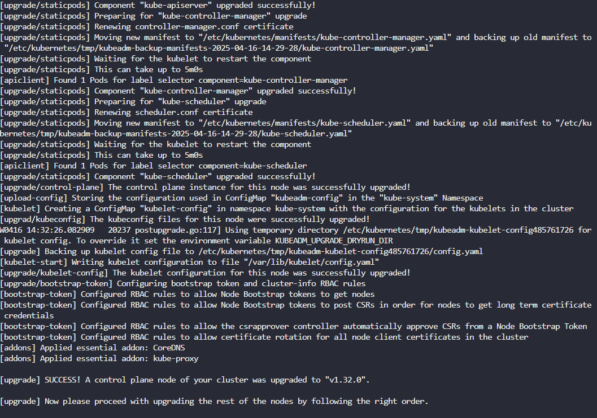

If the cluster has multiple control plane node, run the following. Drain
the node before running the command.

 

sudo kubeadm upgrade node ; run this command instead of sudo kubeadm
upgrade apply

 

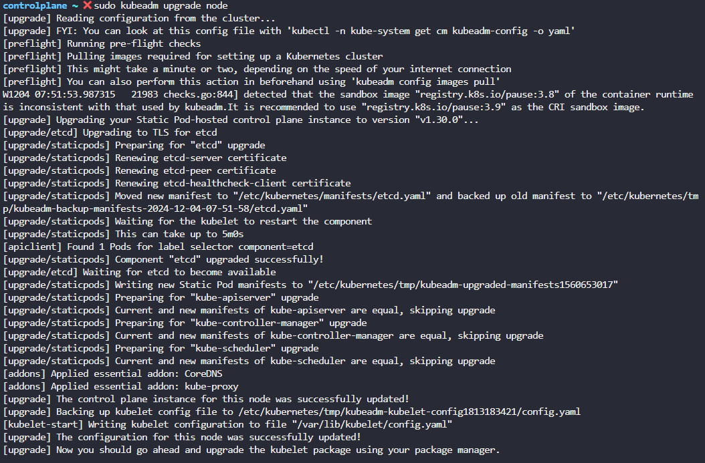

 

- Drain the control plane node

 

kubectl drain \<node-to-drain\> - -ignore-daemonsets

 

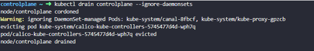

 

- Upgrade Kubelet and kubectl in control plane node

 

\- If you run *kubectl get nodes*, it shows the version of Kubelet of
each nodes registered with kube-apiserver which haven't been upgraded

\- Some cluster deploy with kubeadm tool may have or may not have
Kubelet running on master node

 

Now, upgrade the Kubelet version. Then, mark the node (in this case, the
"controlplane" node) as schedulable.

 

 

apt-get install kubelet=1.31.0-1.1

 

Or

 

sudo apt-mark unhold kubelet kubectl && \\

sudo apt-get update && sudo apt-get install -y kubelet='1.31.0-1.1'
kubectl='1.31.0-1.1' && \\

sudo apt-mark hold kubelet kubectl

 

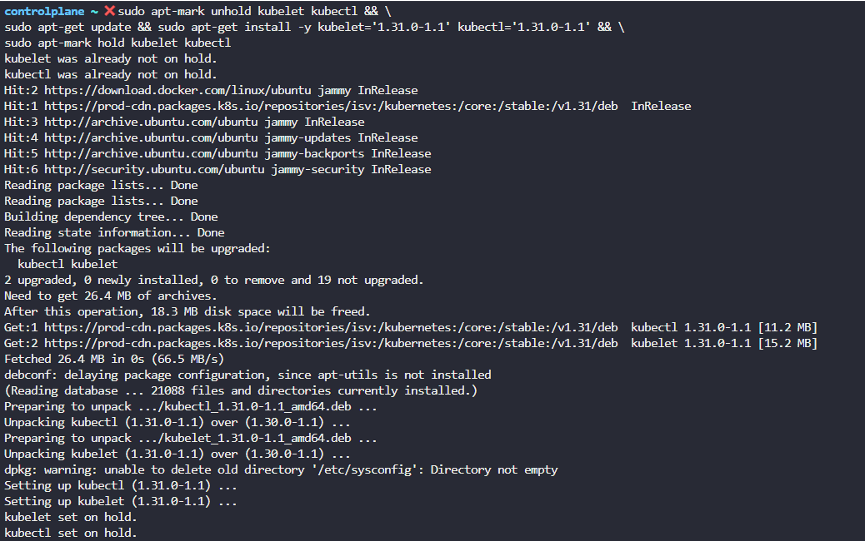

 

Run the following commands to refresh the systemd configuration and
apply changes to the Kubelet service:

 

sudo systemctl daemon-reload

sudo systemctl restart kubelet

 

- Uncordon the control plane node

 

kubectl uncordon \<node-to-drain\>

 

 

***Upgrading worker nodes***

 

- Drain the worker node

 

kubectl drain node1 - -ignore-daemonsets; drain the pods and mark as
schedulable for new pods. This command should run in control plane

 

- Changing the package repository on worker nodes

 

Use any text editor you prefer to open the file that defines the
Kubernetes apt repository.

 

vim /etc/apt/sources.list.d/kubernetes.list

 

Update the version in the URL to the next available minor release, i.e
v1.31.

 

deb \[signed-by=/etc/apt/keyrings/kubernetes-apt-keyring.gpg\]
<https://pkgs.k8s.io/core:/stable:/v1.31/deb/> /

 

After making changes, save the file and exit from your text editor.
Proceed with the next instruction.

 

 

- Determine which version to upgrade to on all nodes

 

sudo apt update

sudo apt-cache madison kubeadm

 

 

- Upgrade Kubeadm tool on worker node

 

Based on the version information displayed by apt-cache madison, it
indicates that for Kubernetes version 1.31.0, the available package
version is 1.31.0-1.1. Therefore, to install kubeadm for
Kubernetes v1.31.0, use the following command:

 

apt-get install kubeadm=1.31.0-1.1 ; upgrade kubeadm tool first to minor
version in worker node

 

Or

 

sudo apt-mark unhold kubeadm && **\\  **
sudo apt-get update && sudo apt-get install -y kubeadm='1.33.x-\*' &&
**\\  **
sudo apt-mark hold kubeadm

 

 

kubeadm upgrade node ; upgrade the local kubelet configuration on worker
node

 

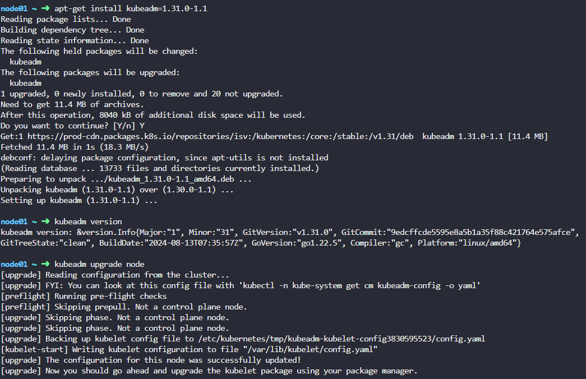

 

 

- Upgrade Kubelet in worker node

 

apt-get install kubelet=1.31.0-1.1 ; upgrade kubelet packages on worker
node to minor version

 

kubeadm upgrade node config - -kubelet-version v1.12.0 ; update node
configuration for the new Kubelet version

 

 

Run the following commands to refresh the systemd configuration and
apply changes to the Kubelet service:

 

sudo systemctl daemon-reload

sudo systemctl restart kubelet

 

 

- Uncordon the worker node

 

kubectl uncordon node01 ; mark the upgraded node as schedulable. It is
not necessary to pods fall back to the node that marked as schedulable.
It may happen when new pod creates or a pod drained from other node

 

Likewise, same process follows for each node one by one

 

cat /etc/\*release\* ; to show release file of Linux distribution. Based
on Linux distribution version the way of upgrade will be changed

 

kubeadm version ; shows version of kubeadm with Major, Minor and
GitVersion

 

kubectl command should be running on control plane node not worker node

 

The latest stable version shows as remote version in kubeadm upgrade
plan

 

\*\*\*Exam tips: To verify the nodes that can host workloads check the
taints on the nodes. Use "kubectl get nodes \| grep Taints"

 

**Summary of cluster upgrade plan**

 

\- Drain the control plane

\- Check pods status

-Changing Kubernestes package repository on controlplane nodes

-Determine which version to upgrade kubeadm

\- Upgrade kubeadm tool on control plane node

\- Verify the upgrade plan using kubeadm upgrade plan

\- Upgrade Kubernetes master node components using kubeadm upgrade apply
\<version\>

\- Upgrade Kubelet and kubectl

\- Restart the kubelet

\- Uncordon the control plane

\- Drain the worker node

\- Check pods status

-Connect to worker node

-Changing Kubernestes package repository on controlplane nodes

-Determine which version to upgrade kubeadm

\- Upgrade kubeadm on worker node

\- Upgrade the local kubelet configuration using kubeadm upgrade node

\- Upgrade Kubelet and kubectl

\- Restart the kubelet

\- Uncordon the worker node

 

 **Summary- Kubeadm - upgrade**

 

***Upgrading controlplane nodes***

 

1.  Changing the Kubernetes package repository on controlplane nodes

 

vim /etc/apt/sources.list.d/kubernetes.list

 

2.  Determine which version to upgrade on controlplane node

 

sudo apt update

sudo apt-cache madison kubeadm

 

apt-cache madison kubeadm displays available kubeadm packages with
version that can be upgraded

 

3.  Upgrade Kubeadm on controlplane node

 

sudo apt-mark unhold kubeadm && \\

sudo apt-get update && sudo apt-get install -y kubeadm='1.31.0-1.1' &&
\\

sudo apt-mark hold kubeadm

 

kubeadm version ; verify upgraded kubeadm version

 

4.  Upgrade controlplane components

 

sudo kubeadm upgrade plan ; verify the upgrade plan

 

sudo kubeadm upgrade apply v1.31.0 ; With this command, upgrade on etcd,
Kube-apiserver, kube-controller-manager, kube-scheduler, kube-proxy and
CoreDNS

 

sudo kubeadm upgrade node ; run this command instead of sudo kubeadm
upgrade apply if the cluster has multiple control plane node

 

5.  Drain the controlplane node

 

kubectl drain \<node-to-drain\> - -ignore-daemonsets

 

6.  Upgrade Kubelet and kubectl in control plane node

 

Use same package version that used when upgrade kubeadm

 

sudo apt-mark unhold kubelet kubectl && \\

sudo apt-get update && sudo apt-get install -y kubelet='1.31.0-1.1'
kubectl='1.31.0-1.1' && \\

sudo apt-mark hold kubelet kubectl

 

 

Run the following commands to refresh the systemd configuration and
apply changes to the Kubelet service:

 

sudo systemctl daemon-reload

sudo systemctl restart kubelet

 

 

7.  Uncordon the control plane node

 

kubectl uncordon \<node-to-drain\>

 

 

 

***Upgrading worker nodes***

 

 

1.  Changing the Kubernetes package repository on controlplane nodes

 

vim /etc/apt/sources.list.d/kubernetes.list

 

2.  Determine which version to upgrade on controlplane node

 

sudo apt update

sudo apt-cache madison kubeadm

 

apt-cache madison kubeadm displays available kubeadm packages with
version that can be upgraded

 

3.  Upgrade Kubeadm on worker node

 

sudo apt-mark unhold kubeadm && \\

sudo apt-get update && sudo apt-get install -y kubeadm='1.31.x-\*' && \\

sudo apt-mark hold kubeadm

 

 

kubeadm version ; verify upgraded kubeadm version

 

sudo kubeadm upgrade node ; upgrade the local kubelet configuration on
worker node

 

4.  Drain the worker node

 

kubectl drain \<node-to-drain\> - -ignore-daemonsets

 

 

5.  Upgrade Kubelet in worker node

 

sudo apt-mark unhold kubelet kubectl && \\

sudo apt-get update && sudo apt-get install -y kubelet='1.31.x-\*'
kubectl='1.31.x-\*' && \\

sudo apt-mark hold kubelet kubectl

 

Run the following commands to refresh the systemd configuration and
apply changes to the Kubelet service:

 

sudo systemctl daemon-reload

sudo systemctl restart kubelet

 

 

6.  Uncordon the control plane node

 

kubectl uncordon \<node-to-drain\>

 

Likewise, same process follows for each node one by one

 

**Backup and restore methods**

 

***Backup Candidates***

 

- Resource Configuration

- ETCD Cluster

- Persistent Volumes

 

\*ETCD and persistent volumes are stateful

\*Master and worker nodes are stateless.

 

This means we don't need to restore exact copy of previous version in
case of failure. We can spin up new cluster, restore the ETCD data and
persistent volumes data to restore the applications/services

 

***Backup- Resource configuration***

 

You may use to create objects in imperative way or declarative way.
Declarative way is preferred approach if you want save the configuration
because you have all the objects required for single application in the
form of object definition files in single folder that can be reused and
shared with others. Object definition file can be stored in source code
repository such as GitHub and maintain for a team.

 

\- Best way for backing up resource configuration is to query
kube-apiserver using kubectl or by accessing kube-apiserver directly and
save all resource configuration for objects created on the cluster as a
copy

 

kubectl get all - -all-namespaces -o yaml \> all-deploy-services.yaml ;
extract output of all object definition file in yaml format. This is
just for few resource group. When number of resources group grows, this
process is not easy. In that case, we can use **Ark** or **VELERO** by
HeptIO which help taking backup of Kubernetes cluster using the
kubernetes API.

 

***Backup- ETCD***

 

-ETCD cluster stores information about the state of the cluster
resources such as nodes, pods, deployments, services etc

\- Information about Kubernetes objects are stored on ETCD. Instead
backing up each resources as before, periodically backing up the ETCD
cluster data is important to recover Kubernetes cluster upon disaster
scenario such as losing all control plane nodes

-While configuring ETCD, we specify a location where ETCD server stores
data of the cluster in that location

**data-dir=/var/lib/etcd**

\- This data directory can be configured to be backed by backup tool

 

 

\- ETCD comes with built-in snapshot solution [Operating etcd clusters
for Kubernetes \|
Kubernetes](https://kubernetes.io/docs/tasks/administer-cluster/configure-upgrade-etcd/)

\- You can take a snapshot of the etcd database by using ETCDTCTL
utility's **etcdctl snapshot save** or by copying the member/snap/db
file from an etcd data directory that is not currently used by an etcd
process

 

 

ETCDCTL_API=3 etcdctl \\

snapshot save snapshot.db ; save snapshot taken with naming snapshot.db

 

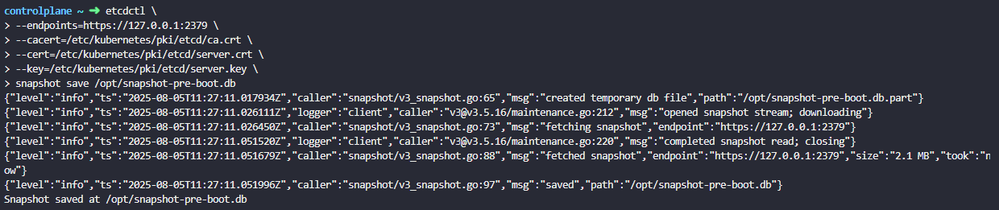

 

etcdutl --write-out=table snapshot status /opt/snapshot-pre-boot.db ;
shows the size and hash of snapshot taken

 

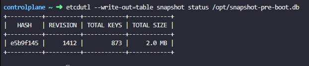

 

 

 

***Restore- ETCD***

 

To restore snapshot taken;

 

1.service kube-apiserver stop ; stop kube-api sever service as restore
process will require to restart etcd cluster and kube-api server depends
on it

 

2.ETCDCTL_API=3 etcdctl \\

snapshot restore snapshot.db \\

\- -data-dir /var/lib/etcd-from-backup

 

/var/lib/etcd-from-backup : path set to the path of the backup file
which is snapshot.db file will be restored

 

etcdutl --data-dir \<data-dir-location\> snapshot restore snapshot.db

 

 

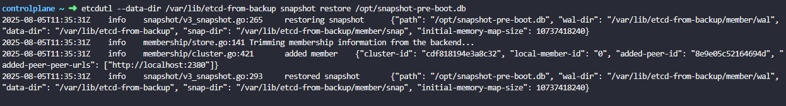

 

This command initialize new cluster configuration and configures members
of ETCD as new members to a new cluster which specify new data directory
for etcd server. This is to prevent a new member from accidentally
joining an existing cluster.

 

We don't need to specify the endpoints or the certificate details when
restoring backup because this particular operation of restoring data
from an etcd backup is not done by communicating with the etcd server.

 

3.Configure the etcd configuration file to use new data directory in
etcd.service \> - -data-dir /var/lib/etcd-from-backup

 

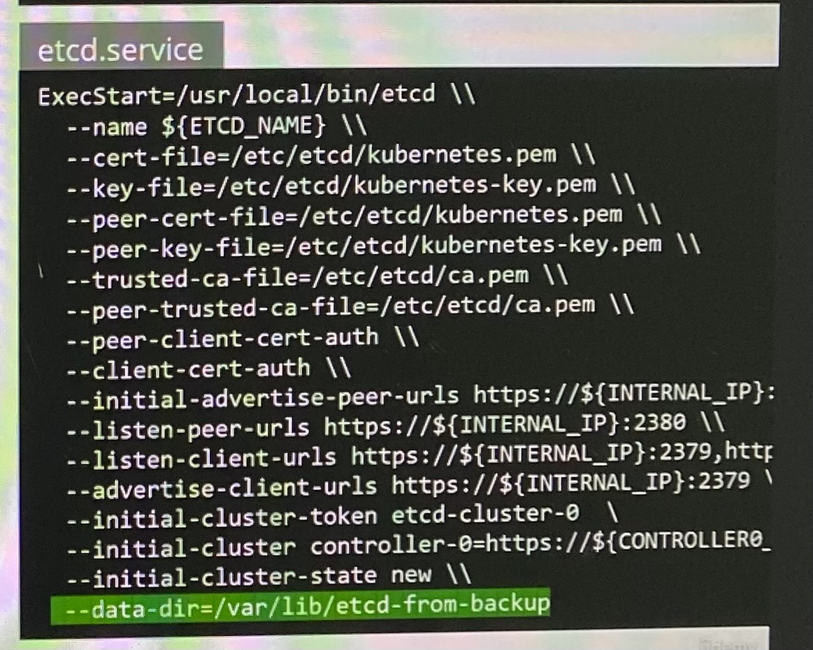

 

4.systemctl daemon-reload ; reload service daemon

 

service etcd restart ; restart etcd service

 

5.service kube-apiserver start ; start kube api service

 

Your cluster should now be back in the original state.

 

With all the etcd commands, remember to specify the certificate files
for authentication, specify the endpoint to the etcd cluster and the CA
certificate, the etcd server certificate, and the key.

 

ETCDCTL_API=3 etcdctl \\

snapshot save /opt/snapshot-pre-boot.db \\

--endpoints=https://127.0.0.1:2379 \\

--cacert=/etc/kubernetes/pki/etcd/ca.crt \\

--cert=/etc/kubernetes/pki/etcd/server.crt

--key=/etc/kubernetes/pki/etcd/server.key

 

If you're using a managed Kubernetes environment, you may not even
access to the etcd cluster. In that case, backup by querying the Kube
API server is the better way.

 

 

**Backup and Restore ETCD - when ETCD is deployed as pod**

 

***Take the snapshot of ETCD cluster***

 

Check the pod manifest file of ETCD in /etc/Kubernetes/manifest
directory in order to find following attributes. It configures
volumeMounts specifying path of etcd data store and these attributes

 

ETCDCTL_API=3 etcdctl \\

snapshot save snapshot.db \\

\- -endpoints=https://127.0.0.1:2379\\

\- -cacert=/etc/etcd/ca.crt \\

\- -cert=/etc/etcd/etcd-server.crt \\

\- -key=/etc/etcd/etcd-server.key\\ ; For all ETCD command, specify
certificate files for authentication

 

Check availability of deployment, pods and services

 

New command:

 

ETCDCTL_API=3 etcdctl --endpoints=https://127.0.0.1:2379 \\

--cacert=/etc/kubernetes/pki/etcd/ca.crt
--cert=/etc/kubernetes/pki/etcd/server.crt
--key=/etc/kubernetes/pki/etcd/server.key \\

snapshot save /opt/snapshot-pre-boot.db

 

 

***Restore the snapshot to new file in data directory***

 

controlplane ~ ➜ export ETCDCTL_API=3

 

controlplane ~ ➜ etcdctl --data-dir /var/lib/etcd-from-backup snapshot
restore /opt/snapshot-pre-boot.db

2024-12-06 11:08:06.464238 I \| mvcc: restore compact to 2846

2024-12-06 11:08:06.467210 I \| etcdserver/membership: added member
8e9e05c52164694d \[<http://localhost:2380>\] to cluster cdf818194e3a8c32

 

Note: In this case, we are restoring the snapshot to a different
directory but in the same server where we took the backup (the
controlplane node) As a result, the only required option for the restore
command is the --data-dir. Specify path to restore the backup where
extract the data to new file in the data directory

 

controlplane ~ ➜ ls /var/lib/etcd-from-backup ; check the data in new
directory

**member**

 

Then need to update new file path in pod manifest file
/etc/kubernetes/manifests/etcd.yaml is to change the hostPath for the
volume called etcd-data from old directory (/var/lib/etcd) to the new
directory (/var/lib/etcd-from-backup).

 

volumes:

\- hostPath:

path: /var/lib/etcd-from-backup

type: DirectoryOrCreate

name: etcd-data

 

With this change, /var/lib/etcd on the container points to
/var/lib/etcd-from-backup on the controlplane

 

When this file is updated, the ETCD pod is automatically re-created as
this is a static pod placed under the /etc/kubernetes/manifests
directory.

 

watch crictl ps

 

Note 1: As the ETCD pod has changed it will automatically restart, and
also kube-controller-manager and kube-scheduler will restart. Wait 1-2
to mins for this pods to restart. You can run the command: watch "crictl
ps \| grep etcd" to see when the ETCD pod is restarted. Check liveness
and startup probes in command "kubectl describe pod -n kube-system
etcd-controlplane"

 

Note 2: If the etcd pod is not getting Ready 1/1 or pending state, then
restart it by kubectl delete pod -n kube-system etcd-controlplane and
wait 1 minute.

 

Note 3: This is the simplest way to make sure that ETCD uses the
restored data after the ETCD pod is recreated. You don't have to change
anything else.

 

If you do change --data-dir to /var/lib/etcd-from-backup in the ETCD
YAML file, make sure that the volumeMounts for etcd-data is updated as
well, with the mountPath pointing to /var/lib/etcd-from-backup (THIS
COMPLETE STEP IS OPTIONAL AND NEED NOT BE DONE FOR COMPLETING THE
RESTORE)

 

 

**Working with ETCDCTL**

 

\- ETCD key-value database is deployed as a static pod on the master
node

\- To make use of etcdctl for tasks as backup and restore, make sure to
set the ETCDCTL_API to 3. This can be done by exporting the ETCDCTL_API
as environment variable prior to using the etcdctl client on master node

 

export ETCDCTL_API=3

 

On the Master Node:

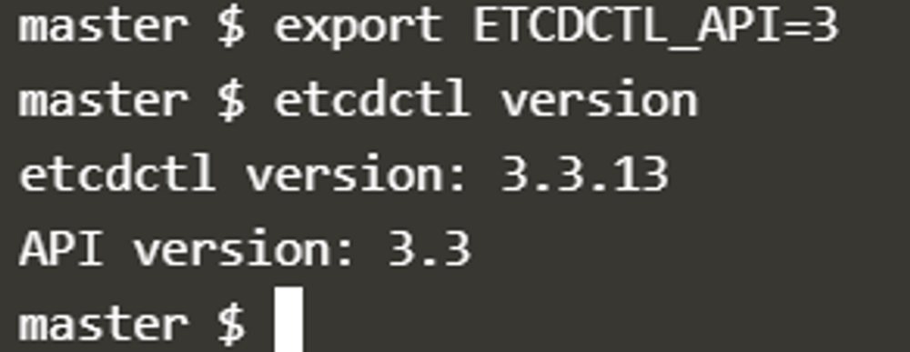

 

For example, if you want to take a snapshot of etcd, use:

 

**etcdctl snapshot save -h** and keep a note of the mandatory global
options.

 

 

\- To see all sub commands, use -h or - -help

 

etcdctl snapshot -h

 

\- Since our ETCD database is TLS enabled, the following options are
mandatory:

 

\- -cacert ; verify certificate of TLS-enabled secure servers using this
CA bundle

 

\- -cert ; identify secure client using this TLS certificate file

 

\- -endpoints=https://127.0.0.1:2379 ; this is the default as ETCD is
running on master node and exposed on localhost 2379

 

\- -key ; identify secure client using TLS key file

 

 

**etcdctl snapshot restore -h** ; restoring the snapshot

 

\- ETCD server certificate is located in
/etc/kubernetes/pki/etcd/server.crt

\- ETCD CA server certificate is located in
/etc/kubernetes/pki/etcd/ca.crt

 

 

 

**Configure access to multiple clusters**

 

kubectl config ; check options for multiple clusters

 

kubectl config get-clusters ; display clusters defined from the
kubeconfig

 

student-node ~ ➜ kubectl config use-context cluster1

Switched to context "cluster1". ; get switch to context in cluster1

 

You can ssh to all nodes from the nodes and use ***logout*** to
***exit*** from node

 

student-node ~ ➜ kubectl config view ; Display merged kubeconfig
settings or a specified kubeconfig file

apiVersion: v1

clusters:

\- cluster:

certificate-authority-data: DATA+OMITTED

server: <https://cluster1-controlplane:6443>

name: cluster1

\- cluster:

certificate-authority-data: DATA+OMITTED

server: <https://192.1.78.10:6443>

name: cluster2

contexts:

\- context:

cluster: cluster1

user: cluster1

name: cluster1

\- context:

cluster: cluster2

user: cluster2

name: cluster2

current-context: cluster1

kind: Config

preferences: {}

users:

\- name: cluster1

user:

client-certificate-data: DATA+OMITTED

client-key-data: DATA+OMITTED

\- name: cluster2

user:

client-certificate-data: DATA+OMITTED

client-key-data: DATA+OMITTED

 

kubectl config view command shows the number of clusters configured.

 

ETCD can be configured as external or stacked.

 

***To determine how ETCD configured - Stacked ETCD***

 

- If the ETCD is running as a pod, this means that ETCD is set up as a
  ***Stacked ETCD Topology*** where the distributed data storage cluster
  provided by etcd is stacked on top of the cluster formed by the nodes
  managed by kubeadm that run control plane components.

 

- The other way is to inspect Kube-apiserver with describe command which
  shows the URL that Kube-apiserver will actually need to communicate
  with ETCD server. If it has localhost IP address which runs on
  controlplane node means stacked ETCD.

 

***To determine how ETCD configured - External ETCD***

 

- Inspect ETCD process on controlplane to find where ETCD is placed on
  and check IP address of control plane node and ETCD server

 

cluster2-controlplane ~ ➜ ps -ef \| grep etcd

root 2949 2543 0 00:52 ? 00:03:06 kube-apiserver
--advertise-address=192.1.78.10 --allow-privileged=true
--authorization-mode=Node,RBAC
--client-ca-file=/etc/kubernetes/pki/ca.crt
--enable-admission-plugins=NodeRestriction
--enable-bootstrap-token-auth=true
--etcd-cafile=/etc/kubernetes/pki/etcd/ca.pem
--etcd-certfile=/etc/kubernetes/pki/etcd/etcd.pem
--etcd-keyfile=/etc/kubernetes/pki/etcd/etcd-key.pem
--etcd-servers=https://192.1.78.19:2379
--kubelet-client-certificate=/etc/kubernetes/pki/apiserver-kubelet-client.crt
--kubelet-client-key=/etc/kubernetes/pki/apiserver-kubelet-client.key
--kubelet-preferred-address-types=InternalIP,ExternalIP,Hostname
--proxy-client-cert-file=/etc/kubernetes/pki/front-proxy-client.crt
--proxy-client-key-file=/etc/kubernetes/pki/front-proxy-client.key
--requestheader-allowed-names=front-proxy-client
--requestheader-client-ca-file=/etc/kubernetes/pki/front-proxy-ca.crt
--requestheader-extra-headers-prefix=X-Remote-Extra-
--requestheader-group-headers=X-Remote-Group
--requestheader-username-headers=X-Remote-User --secure-port=6443
--service-account-issuer=https://kubernetes.default.svc.cluster.local
--service-account-key-file=/etc/kubernetes/pki/sa.pub
--service-account-signing-key-file=/etc/kubernetes/pki/sa.key
--service-cluster-ip-range=10.96.0.0/12
--tls-cert-file=/etc/kubernetes/pki/apiserver.crt
--tls-private-key-file=/etc/kubernetes/pki/apiserver.key

root 12733 12118 0 02:38 pts/0 00:00:00 grep etcd

 

 

 

- Inspect describe command of kube-api server pod command options and
  check IP address of control plane node and ETCD server. If the IP
  address of ETCD server is not the IP address of controlplane node,
  ETCD is configured as an ***External ETCD***

 

cluster2-controlplane ~ ➜ kubectl -n kube-system describe pod
kube-apiserver-cluster2-controlplane

 

--etcd-servers=https://192.160.244.3:2379

 

- Check the static pod manifest files in the path
  (/etc/kubernetes/manifests) in controlplane node

 

 

If ETCD is an external ETCD, ssh to the IP and inspect the process of
ETCD to get more information such as

default data directory (data-dir)

 

etcd-server ~ ➜ ps aux \| grep -i etcd

etcd 831 0.0 0.0 11217856 66848 ? Ssl 00:52 1:32 /usr/local/bin/etcd
--name etcd-server --data-dir=/var/lib/etcd-data
--cert-file=/etc/etcd/pki/etcd.pem --key-file=/etc/etcd/pki/etcd-key.pem
--peer-cert-file=/etc/etcd/pki/etcd.pem
--peer-key-file=/etc/etcd/pki/etcd-key.pem
--trusted-ca-file=/etc/etcd/pki/ca.pem
--peer-trusted-ca-file=/etc/etcd/pki/ca.pem --peer-client-cert-auth
--client-cert-auth --initial-advertise-peer-urls
<https://192.1.78.19:2380> --listen-peer-urls <https://192.1.78.19:2380>
--advertise-client-urls <https://192.1.78.19:2379> --listen-client-urls
[https://192.1.78.19:2379,https://127.0.0.1:2379](https://192.1.78.19:2379,https:/127.0.0.1:2379)
--initial-cluster-token etcd-cluster-1 --initial-cluster
etcd-server=https://192.1.78.19:2380 --initial-cluster-state new

root 1058 0.0 0.0 13444 1028 pts/0 S+ 02:59 0:00 grep -i etcd

 

***To check the members in the ETCD cluster***

 

etcd-server ~ ➜ ETCDCTL_API=3 etcdctl \\

--endpoints=https://127.0.0.1:2379 \\

--cacert=/etc/etcd/pki/ca.pem \\

--cert=/etc/etcd/pki/etcd.pem \\

--key=/etc/etcd/pki/etcd-key.pem \\

member list

59ee55985632d394, started, etcd-server, <https://192.160.244.3:2380>,
<https://192.160.244.3:2379>, false ; This external ETCD has only one
member.

 

To copy snapshot or backup from one node to another,

 

student-node ~ ➜ scp cluster1-controlplane:/opt/cluster1.db /opt

cluster1.db 100% 2088KB 112.3MB/s 00:00

 

***Restore a backup to external ETCD***

 

- Restore the snapshot on the cluster2. Since we are restoring directly
  on the etcd-server, we can use the endpoint https:/127.0.0.1. Use the
  same certificates that were identified earlier. However, using
  certificate file is not mandatory if you restore snapshot from ETCD
  server itself. Make sure to use the data-dir as
  /var/lib/etcd-data-new:

 

etcd-server ~ ➜ ETCDCTL_API=3 etcdctl --endpoints=https://127.0.0.1:2379
--cacert=/etc/etcd/pki/ca.pem --cert=/etc/etcd/pki/etcd.pem
--key=/etc/etcd/pki/etcd-key.pem snapshot restore /root/cluster2.db
--data-dir /var/lib/etcd-data-new

{"level":"info","ts":1721940922.0441437,"caller":"snapshot/v3_snapshot.go:296","msg":"restoring
snapshot","path":"/root/cluster2.db","wal-dir":"/var/lib/etcd-data-new/member/wal","data-dir":"/var/lib/etcd-data-new","snap-dir":"/var/lib/etcd-data-new/member/snap"}

{"level":"info","ts":1721940922.060755,"caller":"mvcc/kvstore.go:388","msg":"restored
last compact
revision","meta-bucket-name":"meta","meta-bucket-name-key":"finishedCompactRev","restored-compact-revision":951}

{"level":"info","ts":1721940922.0667593,"caller":"membership/cluster.go:392","msg":"added
member","cluster-id":"cdf818194e3a8c32","local-member-id":"0","added-peer-id":"8e9e05c52164694d","added-peer-peer-urls":\["http://localhost:2380"\]}

{"level":"info","ts":1721940922.0732546,"caller":"snapshot/v3_snapshot.go:309","msg":"restored
snapshot","path":"/root/cluster2.db","wal-dir":"/var/lib/etcd-data-new/member/wal","data-dir":"/var/lib/etcd-data-new","snap-dir":"/var/lib/etcd-data-new/member/snap"}

 

- Update the systemd service unit file for etcd by running vi
  /etc/systemd/system/etcd.service and add the new value for data-dir:

 

etcd-server ~ ➜ vi /etc/systemd/system/etcd.service

 

\[Unit\]

Description=etcd key-value store

Documentation=https://github.com/etcd-io/etcd

After=network.target

 

\[Service\]

User=etcd

Type=notify

ExecStart=/usr/local/bin/etcd \\

--name etcd-server \\

--data-dir=/var/lib/etcd-data-new \\

---End of Snippet---

 

- Make sure the permissions on the new directory is correct (should be
  owned by etcd user):

 

etcd-server /var/lib ➜ chown -R etcd:etcd /var/lib/etcd-data-new

etcd-server /var/lib ➜

 

etcd-server /var/lib ➜ ls -ld /var/lib/etcd-data-new/

drwx------ 3 etcd etcd 4096 Jul 15 20:55 /var/lib/etcd-data-new/

etcd-server /var/lib ➜

 

- Finally, reload and restart the etcd service.

 

etcd-server ~ ➜ systemctl daemon-reload

etcd-server ~ ➜ systemctl restart etcd

etcd-server ~ ➜

 

 

- It is recommended to restart controlplane components (e.g.
  kube-scheduler, kube-controller-manager, kubelet) to ensure that they
  don't rely on some stale data. Delete static pod -kube-scheduler,
  kube-controller-manager to restart the pods

 

student-node ~ ➜ kubectl delete pods
kube-controller-manager-cluster2-controlplane
kube-scheduler-cluster2-controlplane -n kube-system

 

cluster2-controlplane ~ ➜ systemctl restart kubelet.service

**Working with ETCDCTL and ETCDUTL**

 

etcdctl is a command line client
for [**etcd**](https://github.com/coreos/etcd).

 

In all our Kubernetes Hands-on labs, the ETCD key-value database is
deployed as a static pod on the master. The version used is v3.

 

To make use of etcdctl for tasks such as back up and restore, make sure
that you set the ETCDCTL_API to 3.

 

You can do this by exporting the variable ETCDCTL_API prior to using the
etcdctl client. This can be done as follows:

 

export ETCDCTL_API=3

 

On the **Master Node**:

 

To see all the options for a specific sub-command, make use of the** -h
or --help** flag.

 

**Backing Up ETCD**

 

**Using etcdctl (Snapshot-based Backup)**

 

To take a snapshot from a running etcd server, use:

 

1.  ETCDCTL_API=3 etcdctl \\

2.  --endpoints=https://127.0.0.1:2379 \\

3.  --cacert=/etc/kubernetes/pki/etcd/ca.crt \\

4.  --cert=/etc/kubernetes/pki/etcd/server.crt \\

5.  --key=/etc/kubernetes/pki/etcd/server.key \\

6.  snapshot save /backup/etcd-snapshot.db

 

**Required Options**

 

- **--endpoints** points to the etcd server (default: localhost:2379)

- **--cacert** path to the CA cert

- **--cert** path to the client cert

- **--key** path to the client key

 

 

Similarly use the help option for **snapshot restore **to see all
available options for restoring the backup.

etcdctl snapshot restore -h

For a detailed explanation on how to make use of the etcdctl command
line tool and work with the -h flags, check out the solution video for
the Backup and Restore Lab.

 

 

**Using etcdutl (File-based Backup)**

 

For offline file-level backup of the data directory:

 

etcdutl backup \\

--data-dir /var/lib/etcd \\

--backup-dir /backup/etcd-backup

 

This copies the etcd backend database and WAL files to the target
location.

 

**Checking Snapshot Status**

 

You can inspect the metadata of a snapshot file using:

 

etcdctl snapshot status /backup/etcd-snapshot.db \\

--write-out=table

 

This shows details like size, revision, hash, total keys, etc. It is
helpful to verify snapshot integrity before restore.

 

**Restoring ETCD**

 

**Using etcdutl**

 

To restore a snapshot to a new data directory:

 

etcdutl snapshot restore /backup/etcd-snapshot.db \\

--data-dir /var/lib/etcd-restored

 

To use a backup made with **etcdutl backup**, simply copy the backup
contents back into **/var/lib/etcd** and restart etcd.

 

Notes

 

- **etcdctl snapshot save** is used for creating **.db** snapshots from
  live etcd clusters.

- **etcdctl snapshot status** provides metadata information about the
  snapshot file.

- **etcdutl snapshot restore** is used to restore a **.db** snapshot
  file.

- **etcdutl backup** performs a raw file-level copy of etcd’s data and
  WAL files without needing etcd to be running.

 

 

**References**

 

<https://kubernetes.io/docs/tasks/administer-cluster/configure-upgrade-etcd/#backing-up-an-etcd-cluster>

<https://github.com/etcd-io/website/blob/main/content/en/docs/v3.5/op-guide/recovery.md>

<https://www.youtube.com/watch?v=qRPNuT080Hk>

 

 

**Examtips:**

 

Check the ETCD version

 

Look at the ETCD Logs using the command kubectl logs etcd-controlplane
-n kube-system or check the image used by the ETCD pod: kubectl describe
pod etcd-controlplane -n kube-system

 

root@controlplane:~# kubectl -n kube-system logs etcd-controlplane \|
grep -i 'etcd-version'

"caller":"embed/etcd.go:306","msg":"starting an etcd
server","etcd-version":"3.5.7","git-sha":"215b53cf3"

 

 

root@controlplane:~# kubectl -n kube-system describe pod
etcd-controlplane \| grep Image:

Image: registry.k8s.io/etcd:3.5.7-0

 

 

Certification Exam Tip!

Here's a quick tip. In the exam, you won't know if what you did is
correct or not as in the practice tests in this course. You must verify
your work yourself. For example, if the question is to create a pod with
a specific image, you must run the kubectl describe pod command to
verify the pod is created with the correct name and correct image.

 

<https://kubernetes.io/docs/tasks/administer-cluster/configure-upgrade-etcd/#backing-up-an-etcd-cluster>

<https://github.com/etcd-io/website/blob/main/content/en/docs/v3.5/op-guide/recovery.md>

<https://www.youtube.com/watch?v=qRPNuT080Hk>

 

NAME:

snapshot save - Stores an etcd node backend snapshot to a given file

 

USAGE:

etcdctl snapshot save \<filename\>

 

GLOBAL OPTIONS:

--cacert="" verify certificates of TLS-enabled secure servers using this
CA bundle

--cert="" identify secure client using this TLS certificate file

--command-timeout=5s timeout for short running command (excluding dial
timeout)

--debug\[=false\] enable client-side debug logging

--dial-timeout=2s dial timeout for client connections

-d, --discovery-srv="" domain name to query for SRV records describing
cluster endpoints

--endpoints=\[127.0.0.1:2379\] gRPC endpoints

--hex\[=false\] print byte strings as hex encoded strings

--insecure-discovery\[=true\] accept insecure SRV records describing
cluster endpoints

--insecure-skip-tls-verify\[=false\] skip server certificate
verification

--insecure-transport\[=true\] disable transport security for client
connections

--keepalive-time=2s keepalive time for client connections

--keepalive-timeout=6s keepalive timeout for client connections

--key="" identify secure client using this TLS key file

--user="" username\[:password\] for authentication (prompt if password
is not supplied)

-w, --write-out="simple" set the output format (fields, json, protobuf,
simple, table)

 

 

controlplane ~ ✖ ETCDCTL_API=3 etcdctl snapshot save
/opt/snapshot-pre-boot.db --cert=/etc/kubernetes/pki/etcd/server.crt
--endpoints=https://127.0.0.1:2379
--cacert=/etc/kubernetes/pki/etcd/ca.crt
--key=/etc/kubernetes/pki/etcd/server.key

Snapshot saved at /opt/snapshot-pre-boot.db

 

\*\*This command should be run on master node that etcd pod.

 

 

student-node ~ ✖ kubectl config

Modify kubeconfig files using subcommands like "kubectl config set
current-context my-context".

 

The loading order follows these rules:

 

1\. If the --kubeconfig flag is set, then only that file is loaded. The
flag may only be set once and no merging takes

place.

2\. If \$KUBECONFIG environment variable is set, then it is used as a
list of paths (normal path delimiting rules for

your system). These paths are merged. When a value is modified, it is
modified in the file that defines the stanza. When

a value is created, it is created in the first file that exists. If no
files in the chain exist, then it creates the

last file in the list.

3\. Otherwise, \${HOME}/.kube/config is used and no merging takes place.

 

Available Commands:

current-context Display the current-context

delete-cluster Delete the specified cluster from the kubeconfig

delete-context Delete the specified context from the kubeconfig

delete-user Delete the specified user from the kubeconfig

get-clusters Display clusters defined in the kubeconfig

get-contexts Describe one or many contexts

get-users Display users defined in the kubeconfig

rename-context Rename a context from the kubeconfig file

set Set an individual value in a kubeconfig file

set-cluster Set a cluster entry in kubeconfig

set-context Set a context entry in kubeconfig

set-credentials Set a user entry in kubeconfig

unset Unset an individual value in a kubeconfig file

use-context Set the current-context in a kubeconfig file

view Display merged kubeconfig settings or a specified kubeconfig file

 

Usage:

kubectl config SUBCOMMAND \[options\]

 

Use "kubectl config \<command\> --help" for more information about a
given command.

Use "kubectl options" for a list of global command-line options (applies
to all commands).

 

 

 

controlplane ~ ➜ kubectl describe pod purple

Name: purple

Namespace: default

Priority: 0

Service Account: default

Node: controlplane/192.168.96.150

Start Time: Tue, 05 Aug 2025 05:34:54 +0000

Labels: \<none\>

Annotations: \<none\>

Status: Pending

IP: 10.22.0.12

IPs:

IP: 10.22.0.12

Init Containers:

warm-up-1:

Container ID:
containerd://9743511b06cc683a17138ba2572b515ff869984b35e87db5793afd7eb907239d

Image: busybox:1.28

Image ID:
docker.io/library/busybox@sha256:141c253bc4c3fd0a201d32dc1f493bcf3fff003b6df416dea4f41046e0f37d47

Port: \<none\>

Host Port: \<none\>

Command:

sh

-c

sleep 600

State: Running

Started: Tue, 05 Aug 2025 05:34:55 +0000

Ready: False

Restart Count: 0

Environment: \<none\>

Mounts:

/var/run/secrets/kubernetes.io/serviceaccount from kube-api-access-n25k8
(ro)

warm-up-2:

Container ID:

Image: busybox:1.28

Image ID:

Port: \<none\>

Host Port: \<none\>

Command:

sh

-c

sleep 1200

State: Waiting

Reason: PodInitializing

Ready: False

Restart Count: 0

Environment: \<none\>

Mounts:

/var/run/secrets/kubernetes.io/serviceaccount from kube-api-access-n25k8
(ro)

Containers:

purple-container:

Container ID:

Image: busybox:1.28

Image ID:

Port: \<none\>

Host Port: \<none\>

Command:

sh

-c

echo The app is running! && sleep 3600

State: Waiting

Reason: PodInitializing

Ready: False

Restart Count: 0

Environment: \<none\>

Mounts:

/var/run/secrets/kubernetes.io/serviceaccount from kube-api-access-n25k8
(ro)

Conditions:

Type Status

PodReadyToStartContainers True

Initialized False

Ready False

ContainersReady False

PodScheduled True

Volumes:

kube-api-access-n25k8:

Type: Projected (a volume that contains injected data from multiple
sources)

TokenExpirationSeconds: 3607

ConfigMapName: kube-root-ca.crt

Optional: false

DownwardAPI: true

QoS Class: BestEffort

Node-Selectors: \<none\>

Tolerations: node.kubernetes.io/not-ready:NoExecute op=Exists for 300s

node.kubernetes.io/unreachable:NoExecute op=Exists for 300s

Events:

Type Reason Age From Message

---- ------ ---- ---- -------

Normal Scheduled 107s default-scheduler Successfully assigned
default/purple to controlplane

Normal Pulled 107s kubelet Container image "busybox:1.28" already
present on machine

Normal Created 107s kubelet Created container: warm-up-1

Normal Started 107s kubelet Started container warm-up-1
