# Kubernetes - Core Concepts

The purpose of Kubernetes is to host your applications in the form of
containers in an automated fashion so that you can easily deploy
instances of your application and enable communication between different
services within your application.

**Docker vs ContainerD**

ContainerD is a container runtime engine like rkt 

Docker and Kubernetes was initially tightly coupled together. With
Kubernetes introduced ***container runtime interfaces(CRI)***, any
vendor allows to work with Kubernetes as long as adhere with ***Open
Container Initiative(OCI)***.

 

**Open Container Initiative(OCI)**

 

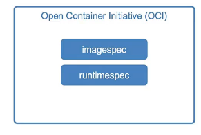

 

imagespec - specification in how image should be built

runtimespec - define how any container runtime should be developed

 

Rkt and other container runtimes that adhered to the OCI standards were
now supported as container runtime for Kubernetes via CRI

 

However, Docker wasn’t built to support CRI standards as it was
developed before CRI.

 

***Dockershim*** is a way to support docker outside the CRI and it is
CRI compliant layer between the Kubelet and Docker daemon. Dockershim
was deprecated and support for the docker was also deprecated with
Kubernetes version 1.24. All the images built before docker removes ,
continues to function after Kubernetes version 1.24 releases because
docker also adhere imagespec standards in OCI. ContainerD uses as
container runtime after Kubernetes release 1.24.

 

Docker isn’t just a container runtime alone. Docker consists with
multiple tools such as CLI, API, BUILD, VOLUMES, AUTH, SECURITY,
container runtime is called RUNC and the daemon manages RUNC that is
called containerD.

 

ContainerD is CRI compatible. Hence, containerD can be used separate
from Docker with Kubernetes. You can install the containerD alone as
container runtime.

You can install ContainerD without having docker itself and run with
following CLI utilities to connect any CRI compatible container runtime.

 

**CLI -ctr**

 

\- Use only for debugging the container

\- ctr comes with ContainerD

\- Not very user friendly

\- Only supports limited features

\- Developed by ContainerD community

 

ctr images pull docker.io/library/redis:alpine ; pull an image with
address of the image

 

ctr run docker.io/library/redis:alpine redis ; run a container with the
image pulled

 

**CLI - nerdctl**

 

\- nerdctl provides a Docker-like CLI for containerD

\- Developed by ContainerD community

\- nerdctl supports docker compose

\- nerdctl supports newest features in containerD

\- Encrypted container images

- Lazy pulling

- P2P image distribution

- Image signing and verifying

- Namespace in Kubernetes

 

nerdctl run - -name redis redis:alpine ; create a container with an
image

 

nerdctl run - -name webserver -p 80:80 -d nginx ; port forwarding for
the container

 

**CLI - crictl**

 

\- crictl provides a CLI for CRI compatible container runtimes such as
rocket, containerD that is developed by Kubernetes community.

\- Installed separately

\- Used to inspect and debug container runtimes for debugging purpose

\- Not to create containers ideally

\- Work across different runtime

\- Work along with kubelet

-Crictl is aware of pods

 

crictl pull busybox

 

crictl images

 

crictl ps -a

 

crictl exec -i -t hsjdbdjjsnsnsnsnsn ls

 

crictl logs bsidbdjsnsjksn

crictl pods ; list the pods

 

crictl - -runtime-endpoint

 

export CONTAINER_RUNTIME_ENDPOINT ; export sockets

 

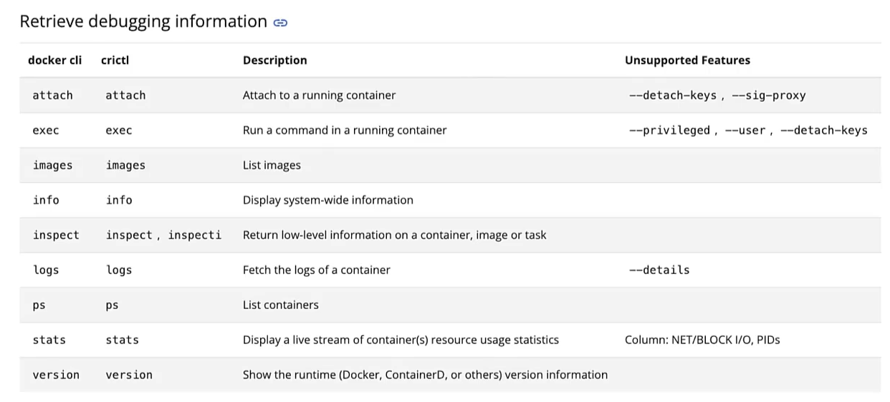

 

 

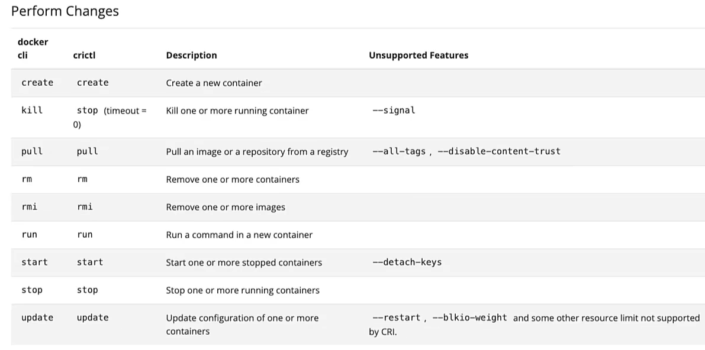

Prior to Kubernetes release 1.24, the crictl utility was connected to
runtime endpoint. But later Kubernetes release, those endpoints were
changed.

 

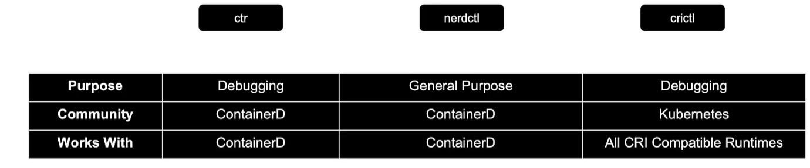

 

 

 

**Kubernetes Cluster Architecture**

 

 

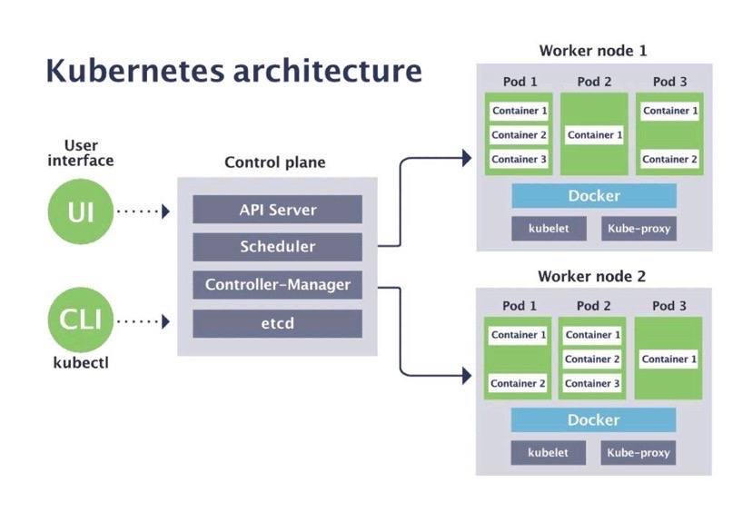

 

**Master Node**

 

\- Use to interact with the cluster

\- Schedule pod

\- Monitor pods

\- Re-schedule and restart pods

\- Join a new node

 

**Master Node Processes**

 

\- 4 processes run on every master node

\- control Custer state and worker nodes

\- Need less resources

 

**Worker Node Processes**

 

\- Each node has multiple pods on it

\- 3 processes must be installed on every node to manage those pods

\- Worker nodes do the actual work

\- Need more resources for nodes

 

**Container runtime**

 

\- Runtime engine for containers such as Docker, containerD, rocket,
RedHat podman

 

 

**ETCD**

 

\- ***Distributed reliable key-value store*** for cluster states that is
simple, secure and fast unlike traditional tabular/Relational database

-ETCD is a database that stores information in a key value format which
is in the form of documents and pages

-We transact the data format like JSON or YAML

 

\- ETCD stores information about the cluster such as nodes, pods,
configmaps, secrets, accounts, roles, rolebindings and others. All
information from ***kubectl get*** command retrieve from ETCD server

\- Cluster state changes get stored in the key value store such as
health of cluster, number of pods in nodes

\- All mechanism of scheduler and controller manager is based on data in
ETCD

\- Application data is not stored in ETCD

 

**Setup - Manual**

 

wget -q - -https-only \\

“<https://github.com/etcd-io/etcd/releases/download/v3.3.11/etcd-v3.3.11-linux-amd64.tar.gz>”
; download the binaries of etcd

 

kubeapi server reaches etcd server using advertised client URL

 

**Setup - kubeadm**

 

Kubeadm deploys the ETCD server as a pod in the kube-system namespace.
The pod is named as ***etcd-master***

 

kubectl get pods -n kube-system ; get ETCD master that deploy as a pod

 

kubectl exec etcd-master -n kube-system etcdctl get / - -prefix
-keys-only ; to list all keys stored by Kubernetes, this should run
inside the etcd-master Pod

 

Kubernetes stores data in specific directory structure. The root
directory is /registry. There are many Kubernetes constructs such as
minions, pods, replicasets, deployments, roles, secrets

 

In HA environment, there are multiple ETCD instances spread across
master nodes in the cluster. It shows as ***initial-cluster***
controllers in etcd.service

 

**Install ETCD**

 

1.  Download binaries : curl -L
    <https://github.com/etcd-io/etcd/releases/download/v3.3.11/etcd-v3.3.11-linux-amd64.tar.gz>
    -o etcd-v3.3.11-linux-amd64.tar.gz

2.  Extract : tar xzvf etcd-v3.3.11-linux-amd64.tar.gz

3.  Run ETCD service : ./etcd

 

- Then it starts a service that listens on ***port 2379*** by default.

- You can attach any client to ETCD service to store and retrieve
  information. The default client that comes with ETCD is ETCDCTL client
  which is command line client.

 

./etcdctl set key1 value1 ; to store key value entry on the database

 

./etcdctl get key1 ; to retrieve key value entry

 

./etcdctl ; to show all available commands

 

ETCDCTL version 2 supports the following commands:

 

etcdctl backup

etcdctl cluster-health

etcdctl mk

etcdctl mkdir

 

- With the release of version 3.4 the default API version is set to 3.

 

./etcdctl - -version ; show version of ETCDCTL utility and API version

 

ETCDCTL_API=3 ./etcdctl version ; set environment variable of API
version to 3 and check version

 

export ETCDCTL_API=3

./etcdctl version ; export API version 3 as environment variable for
whole session

 

***ETCDCTL V3***

 

./etcdctl put key1 value1 ; set the key value entry in the DB in ETCD V3

 

./etcdctl get key1 ; to retrieve key value entry in ETCD V3

 

etcdctl snapshot save

etcdctl endpoint health

 

When API version set to each version, only works for the command
supports for each version

 

The certificate files are available in the etcd-master at the following
path.

 

--cacert /etc/kubernetes/pki/etcd/ca.crt

--cert /etc/kubernetes/pki/etcd/server.crt

--key /etc/kubernetes/pki/etcd/server.key

 

You must specify path to certificate files so the ETCDCTL can
authenticate to the ETCD API server.

 

kubectl exec etcd-master -n kube-system - - sh - c “ETCDCTL_API=3
etcdctl get / - -prefix - -keys-only - -limit=10 - -cacert
/etc/kubernetes/pki/etcd/ca.crt - -cert
/etc/kubernetes/pki/etcd/server.crt - -key
/etc/kubernetes/pki/etcd/server.key” ; specify ETCDCTL API version and
path to certificate files

 

 

**Kube-api Server**

 

\- The primary management component in the Kubernetes architecture

\- When user needs to deploy app on Kubernetes cluster, they use a
client such as UI, Kubernetes dashboard , command line utility like
Kubectl or Kubernetes API to interact with API server

\- A cluster gateway which get initial request of any update into
cluster and any queries from cluster

\- Act as a gatekeeper for authentication that comes through

\- API server gets request, validate and forward request to other
processes such as ***authenticate user\> validate request\> retrieve
data from ETCD \> update ETCD***

\- The only component that directly interacts with ETCD datastore

\- Single entry point into the cluster

\- Other components ***kube-scheduler, kube- controller manager,
Kubelet*** uses kube-api server to perform updates in the cluster on
their respective areas

kubectl get pods -n kube-system ; shows ***kube-apiserver-master***
instance in control plane

 

cat /etc/kubernetes/manifests/kube-apiserver.yaml ; inspect api-server
options when it deployed through Kubeadm setup

 

cat /etc/systemd/system/kube-apiserver.service ; inspect api-server
options when it deployed through kube-apiserver binaries

 

ps -aux \| grep kube-apiserver ; search running processes and effective
option in master node for kube-apiserver

 

 

**Installing kube-api server**

 

wget
<https://storage.googleapis.com/kubernetes-release/release/v1.13.0/bin/limuxamd64/kube-apiserver>

 

 

**The flow of Kubernetes operation**

 

1\. The request is validated and authenticated by Kube-api server

2\. Create initial pod specification

3\. Kube-api server update the information in the ETCD server and update
the user that the pod has been created by retrieving data from ETCD
server

4\. Kube-scheduler continuously monitors Kube-api server and identify
that there is a new pod that is not scheduled

5\. Kube-scheduler selects the right node based on resource requirement
and nodes scoring to place new pod onto a node and communicates the
worker node selected back to Kube-api server

6\. Kube-api server updates ETCD and Kube-api server passes that
information to Kubelet in the appropriate worker node

7\. Kubelet then starts creating the pod on the node and instruct
container runtime engine to pull container images, then kubelet does pod
network setup, container startup and volume mounting

8\. Kubelet update the status back to Kube-api server and then Kube-api
server update health check implementation, status updated and final
running states back to ETCD server

 

 

**Kube Controller manager**

 

\- A controller is a process that continuously monitors states of
various components in the system and work towards bringing the
components into desired functioning state. As examples,

 

***Node-controller*** is responsible to monitor the status of the nodes
and take necessary actions to keep the application running. It does that
through Kube-api server and checks status every 5 seconds(***Node
Monitor Period***). If the node is unreachable, it waits for 40 seconds
before marking it unreachable(***Node Monitor Grace Period***). After
node is marked as unreachable, it gives 5 minutes the node to be come
back up. If it doesn't, then it removes pods assigned to that node and
schedule them on a healthy node.(***POD Eviction timeout***)

 

***Replication-controller*** monitors the status of replicaset and
ensure desired number of pods are available within the set. If any pod
dies, it creates another one.

 

\- Detects cluster state changes when pod crashes or dies and try to
recover cluster states through Kube-api server

\- Controller manager makes request and forward to scheduler to make
decision to reschedule with Kubelet

\- Manage controllers that take care of different controllers

\- By default, all controllers are enabled in kube-controller manager
such as Node, replication, replicaset, endpoint, namespace, deployment,
CronJob, Job, service-account, stateful-set, PV-Protection. But you can
choose what controllers to be installed selectively

-When install Kube-controller manager, the different controllers get
installed as well

\- Can install kube-controller-manager by downloading binaries from
Kubernetes release page, extract and run as a
service(kube-controller-manager.service )

 

wget
<https://storage.googleapis.com/kubernetes-release/release/v1.13.0/bin/linux/amd64/kube-controller-manager>

.m CNN

 

cat /etc/kubernetes/manifest/kube-controller-manger.yaml ; inspect
kube-controller-manger options when it deploys through Kubeadm setup

 

cat /etc/systemd/system/kube-controller-manger.service ; inspect
kube-controller manager options when it deploys through non Kubeadm
setup

 

ps -aux \| grep kube-controller-manager ; check running process and
effective options

 

<https://www.techopsexamples.com/p/why-you-need-a-kubernetes-controller>

 

 

**kube-scheduler**

 

\- If a client schedule a pod, the API server validate the request and
forward it to scheduler

\- Scheduler only decides the new pod should go to which node
intelligently, then Kubelet creates the pods on the node

-Scheduler decides on which nodes that the pods are placed on depending
on certain criteria such as resource requirement of pods, cluster has
dedicated node for certain applications

\- Scheduler goes through 2 phases

 

Filter nodes - the nodes will be filtered out that doesn’t have
sufficient CPU, memory resources requested by pods

 

Rank nodes - it uses priority function to assign score to nodes from 0
to 10 where the scheduler calculates the amount of resources that would
be free on the nodes after placing the pod on them. If pod needs 10 CPU,
then a node has 16 CPU has 6 score. The node with highest score will
win.

 

This process can be customized and you can write your own scheduler.

 

\- Resource requirement and limits

\- Taints and toleration

\- Node selectors/affinity

 

We can install kube-scheduler by downloading binaries from Kubernetes
release page, extract and run as a service(kube-scheduler.service

 

wget
<https://storage.googleapis.com/kubernetes-release/release/v1.13.0/bin/linux/amd64/kube-scheduler>

 

cat /etc/kubernetes/manifest/kube-scheduler.yaml ; inspect
kube-scheduler options when it deploys through Kubeadm setup

 

cat /etc/systemd/system/kube-scheduler.service ; inspect kube-scheduler
options when it deploys through non Kubeadm setup

 

ps -aux \| grep kube-scheduler; check running process and effective
options

 

 

**Kubelet**

 

\- Register node with Kubernetes cluster

\- Kubelet interface the container runtime and node

-When configuration receives to Kubelet from Kube-api server, it request
runtime engine to pull the image and run the instance

\- Kubelet create and run pods with container inside it, assign
resources CPU, RAM from node to container

-Kubelet continues to monitor the status of the pods and containers,
then reports to Kube-api server in timely basis

\- If you use kubeadm tool, it doesn’t automatically deploy kubelet on
worker nodes. It always need to install manually

 

wget
<https://storage.googleapis.com/kubernetes-release/release/v1.13.0/bin/linux/amd64/kubelet>

 

ps -aux \| grep kubelet ; to view running kubelet process and effective
options by listing process

 

 

**Kube Proxy**

 

-Within Kubernetes cluster, every pod can reach every other pods by
using pod networking solution to the cluster

-Pod virtual network is an internal virtual network that spans across
all the nodes in the cluster to which all the pods connect to.

-Kubernetes uses service to expose one pod to others across the cluster
where the pods use name of the service. The service also gets an IP
address assigned to it.

-When pod reaches the service from using its name or IP address, the
service forwards the traffic to other pod

\- Service cannot join the pod network because service is not an actual
thing like pods or containers. The service doesn't have any interfaces
or actively listening process. Services are virtual component that only
lives Kubernetes memory. Service should be accessible across the cluster
from any node. That’s where kube-proxy comes in to achieve connectivity
across nodes in the cluster.

\- Kube-proxy is a process that run on each node in the cluster

\- Its job is to look for new services and every time new service is
created, it creates the appropriate iptable rules on each node to
forward traffic to those services to the backend pod.

 

wget
<https://storage.googleapis.com/kubernetes-release/release/v1.13.0/bin/linux/amd64/kube-proxy>
; download kube-proxy binaries from Kubernetes release page. Then
extract and run it as a service

 

The kubeadm tool deploys kubeproxy as pod in each node. In fact, it
deploys as daemonset which creates single pod in each node in the
cluster.

 

 

When cluster has multiple master nodes, API server of each master nodes
is load balanced, etcd forms distributed storage for all master nodes.

 

To add master/worker nodes to existing cluster;

 

1\. Get new bare server

2\. Install all the master/worker node processes

3\. Add it to the cluster

 

 

 

**Pod**

 

\- Smallest object in the Kubernetes

\- containers are encapsulated into a pod. A pod is an single instance
of an application

\- Pod creates running environment or layer on top of the container

\- You only interact with the Kubernetes layer so that no need to deal
with container technology

\- Usually we maintain one application container per pod. Pod has 1-to-1
relationship with containers

\- We do not add additional container into an existing pod to scale
application when our intention is to scale the application with multiple
containers

 

***Multi-Container Pods***

 

\- A pod can have multiple containers, but they should not be same kind

\- However, if any container needs helper container that might be doing
supportive task such as processing user entered data, processing file
uploaded by user, a helper container can be live alongside primary
container in same pod. Thus, they should have same lifecycle as helper
container that creates when pod creates and helper container deletes
when pod deletes. Also they shares same network space and same storage
space.

\- Each pod gets its own IP address(private IP address)

\- New IP address assign on recreation of pod, which is where K8s use
service

 

***Create and edit pods***

 

\- kubectl run nginx - - image nginx ; create a container by creating a
pod naming nginx that has nginx image

\- kubectl run nginx - - image nginx - -port=8080 ; create a nginx pod
by exposing container port 8080

\- kubectl get pods ; get status of pod, Ready 0/1 means pod created but
container inside the pod isn’t running. status will change as running
when ready is 1/1

 

kubectl apply -f pod-definition.yaml ; create pods from pod definition
or manifest file with YAML

kubectl create -f pod-definition.yaml

 

\- kubectl delete pod \<name of pod \> ; delete pod with the name
specified

 

\- kubectl get all ; get all objects created in Kubernetes cluster

\- kubectl get nodes ; get status of nodes

 

 

\- kubectl create - - help ; get all commands for kubectl create with
examples

\- kubectl run redis - - image= redis123 - - dry-run=client -o yaml ;
generate pod manifest YAML file in dry-run option, don’t create it(-
-dry-run)

\- kubectl run redis - - image= redis123 - - dry-run=client - o yaml \>
redis-definition.yaml ; generate YAML output and redirect it to YAML
file specified

 

-kubectl run hazelcast --image=hazelcast/hazelcast
--labels="app=hazelcast,env=prod"

 

\- kubectl get pod -o wide ; wide range of output on pod with node that
pods are scheduled, ip address

\- kubectl get pods \<pod-name\> -o yaml; screen the pod definition file
with yaml format

\- kubectl get pods - -watch ; show the change status of pod
continuously. If you want to check the status of an object, use --watch
option

 

\- - dry-run : the resource will be created as soon as the command is
run. This command is deprecated.

 

\- - dry-run=client : this will not create the resource, instead, tell
you whether the resource can be created if your command is right

 

-o yaml: this will output the resource definition in YAML format in
screen

 

-o yaml \> definition.yaml : Redirect the YAML output the file

 

\- -labels=“tier=db” ; specify the label in imperative command

 

 

 

\*\*If a pod has not been created and it is in **Error/Waiting** state,
you can edit the pod using ***kubectl edit pod \<pod name\>*** and make
necessary changes and save the changes which will not save changes in a
temporary location.

 

***Edit pod***

 

You cannot edit specifications of an existing pod other than below

\- spec.containers\[\*\].image

\- spec.initContainers\[\*\].image

\- spec.activeDeadlineSeconds

\- spec.tolerations

 

For example you cannot edit the environment variables, service accounts,
resource limit of a running pod. But if you really want to, you have 2
options

 

1\. kubectl edit pod \<pod name\> ; this will open pod specification
file on an editor. Then edit required properties. When try to save it,
it will be denied. This is because the field on the pod is not editable.

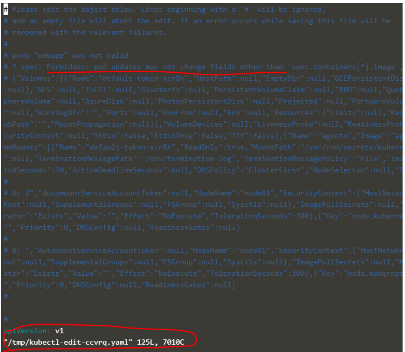

 

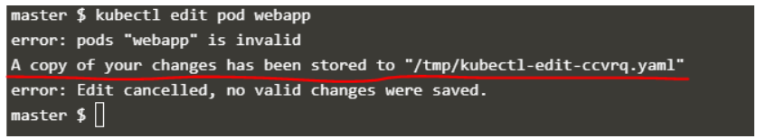

A copy of the file with the changes is saved in a temporary location.

 

Then delete the running pod by running ‘kubectl delete pod web app’ and
create new pod with the changes using the temporary file

 

Then create a new pod with your changes using the temporary file

kubectl create -f /tmp/kubectl-edit-ccvrq.yaml

 

2\. Extract the pod definition in YAML format to a file, make changes to
the exported file using an editor. Then delete the existing pod and
create a new pod with the edited file.

 

***Debugging pods***

 

\- kubectl logs \<pod name\> ; log to console

\- kubectl describe pod \<pod name\> ; details of pod, when created,
what label assigned to it, what docker container part of it

\- kubectl get pods -o wide ; detail of pods with the node that running,
age, IP address, status

\- kubectl exec -it \[pod name\] -- bin/bash ; it shows what’s going
inside the pod getting interactive terminal of app container

\- kubectl -n elastic-stack exec -it app -- cat /log/ ; store logs in
particular location in the pod

 

<https://www.techopsexamples.com/p/kubernetes-pod-lifecycle-behind-the-scenes>

 

 

**YAML Configuration File in Kubernetes**

 

-Kubernetes use YAML files as inputs for the creation of objects such as
pods, replicaset, deployments, services etc.

-Top level or root level properties must have in configuration file

 

\- apiVersion - version of Kubernetes API to create an object. The form
is string.

 

POD : v1

Service : v1

ReplicaSet : apps/v1

Deployment: apps/v1

 

apiVersion: v1

 

\- kind - type of object we are trying to create such as pod, service,
deployment, ReplicaSet. The form is string. The first letter of kind
should be capital because it is case sensitive.

 

kind: Pod

 

\- metadata - The metadata about the object such name, labels. Metadata
is a dictionary. Label is a dictionary in metadata dictionary. You can
specify anything that Kubernetes expects to be under metadata.

 

metadata:

name: myapp-end

labels:

app: myapp

type: front-end

 

\- spec- The additional information to Kubernetes pertaining to that
object. The spec is a dictionary, add properties under it. Containers is
a list/array of dictionaries because a pod can have multiple containers.

 

spec:

containers:

\- name: nginx-controller

image: nginx

 

kubectl describe pod myapp-pod ; information about pod such as when it
was created, what labels are assigned to it, what docker containers are
part of it, events associated with that pod

 

kubectl describe node \<node name\> ; to get detailed information on the
node's condition:

 

***MemoryPressure***: Node is low on memory.

***DiskPressure***: Node is running out of disk space.

***PIDPressure***: Node has too many processes running.

 

 

***Pods with YAML***

 

We use vi or vim editor in Linux systems and notepad/notepad ++ in
Windows systems to create object definition file with
YAML(pod-definition.yaml or pod-definition.yml)

 

apiVersion: v1

kind: Pod

metadata:

name: nginx

labels:

app: nginx

type: frontend

spec:

containers:

\- name: nginx

image: nginx

\- name: busybox

image: busybox

 

**Kubernetes Controllers**

 

-This is deprecated, still works but not recommended

-The processes that monitors Kubernetes objects and responds accordingly

 

**Replication controller**

 

High availability - The replication controller helps us to run multiple
instances of single pod in the Kubernetes cluster. Even if you have
single pod, the replication controller can help by automatically
bringing up a new pod when the existing one fails. Thus replication
controller ensures that specified number of pods are running at all
times.

 

Load Balancing & Scaling - The replication controller helps to balance
the load across multiple pods that span on different nodes in the
cluster when the demand increases

 

\- Replication controller is older technology compare to ReplicaSet

\- Monitoring the status of pod and ensure desired number of pods are
running in the replication controller

\- If application in pod crashes, it creates another pod(=,==)

 

selector:  
app: nginx

 

\- Replication controller support only exact label matches

\- Create replication controller definition YAML file with pod template

\- Replication controller ensures that a new POD is recreated
automatically when the application within the POD crashes

-In replication controller definition file, the template and replicas
are direct children of spec section

-The selector is not required field in the Replication controller but it
is still available. If not it assumes it has to be the same as the label
provided in template section in pod definition file.

 

\- kubectl create -f rc-definition.yaml

\- kubectl get replicationcontroller; details of replication controller

\- kubectl get pods ; list the pods created by replication controller
where all pods are followed naming of replication controller

 

apiVersion: v1

kind: ReplicationController

metadata:

name: myapp-rc

labels:

app: myapp

type: front-end

 

spec:

replicas: 3

selector:

app: myapp

template:

metadata:

name: myapp-pod

labels:

app: myapp

type: frontend

spec:

containers:

\- name: nginx-container

image: nginx

 

 

 

**Replica Set**

 

\- Supported apiversion for K8s is ***apps/v1***

\- Only major difference between Replica Set and replication controller
is that Replica Set supports set-based selector definition that helps to
identify what pods are under the Replica Set

 

selector:  
matchLabels:  
app: nginx  
matchExpressions:  
- {key: tier, operator: In, values: \[frontend, backend\]}

 

→ Can match Pods with app=nginx AND tier=frontend or tier=backend

 

\- Thereby, ReplicaSet can also manage individual pods that were not
created as part of the Replica Set creation

\- If there are pods created before the creation of Replica Set that
match labels specified in the selector, the Replica Set will also take
those pods into consideration after creating the replicaset. Based on
the number of specified replicas in the definition file, Replica Set
decides how many pods have to be created if there are any pods already
exist in the cluster that match with selector labels.

-The Replicaset selector also provided many options for matching labels
such as ***matchExpressions***

\- Replica Set monitor pods under it and bring up if any pod fails. With
labels and selectors, replicaset knows which pods should be monitored
among thousands of pods

\- ReplicaSet ensures desired number of pods always run

\- When you create ReplicaSet using ReplicaSet definition file , it
shows where the error is if there is an issue

\- Replica Set must need template section with specification for the pod
to create in case any pod fails or crashes

\- If you make change on ReplicaSet definition template, existing pods
needs to be deleted to create new pods with the change applied

 

 

\- kubectl create\|apply -f ReplicaSet-definition.yaml ; create a
ReplicaSet using YAML file

 

\- kubectl delete replicaset myapp-replicaset ; delete all underlying
pods which includes in replicaset. Can delete multiple replicaset in
single command

 

\- kubectl edit replicaset new-replica-set ; modify ReplicaSet
definition file which should automatically create pods with changes
applied. If not, you should delete all pods, then it recreates new pods
with applying changes modified

 

\- kubectl get \<replicaset \| rs \>; list the existing ReplicaSet

 

\- kubectl replace -f ReplicaSet-definition.yaml ; create new replicas
after updating number of replicas in same ReplicaSet definition file

 

\- kubectl scale - -replicas=6 -f ReplicaSet-definition.yaml ; modify
number of replicas in command line without modifying the file

 

\- kubectl scale replicaset myapp-replicaset - -replicas=6; scale up
number of replicas with type and name format of replica set(for
imperative approach)

 

The number of replicas specified in Replica Set definition file will not
be updated if you use scale option to update the number of replicas.

 

There is an advanced option to scale up the number of pods in Replica
Set based the load increase.

 

\- kubectl explain replicaset ; more detail of replica set such as
APIversion, kind. To get more explanation on any Kubernetes object, use
explain command

 

apiVersion: apps/v1

kind: ReplicaSet

metadata:

name: myapp-replicaset

labels:

app: myapp

type: front-end

 

spec:

template:

metadata:

name: myapp-pod

labels:

app: myapp

type: front-end

spec:

containers:

\- name: nginx-container

image: nginx

 

replicas: 3

selector:

matchLabels:

type: front-end

 

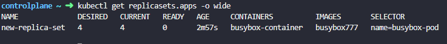

 

\*\*If pods in replicaset has not been created yet and also in
Error/ImagePullBackOff state,

- you can edit the image of pod using ***kubectl edit replicaset
  \<replicaset name\>***

- Then, delete all pods in replicaset that were error state to recreate
  the pods

 

controlplane ~ ➜ kubectl create -f replicaset-definition-1.yaml

error: resource mapping not found for name: "replicaset-1" namespace: ""
from "replicaset-definition-1.yaml": no matches for kind "ReplicaSet" in
version "v1"

ensure CRDs are installed first

 

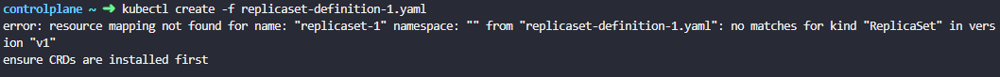

 

controlplane ~ ➜ kubectl create -f replicaset-definition-2.yaml

The ReplicaSet "replicaset-2" is invalid: spec.template.metadata.labels:
Invalid value: map\[string\]string{"tier":"nginx"}: \`selector\` does
not match template \`labels\`

 

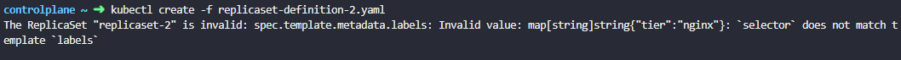

 

 

The following error occurs when the image doesn't exist in DockerHub
registry.

 

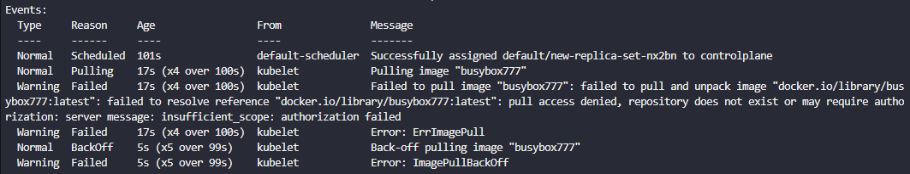

 

When you scale up and scale down replicaset, it creates and deletes pods
within same replicaset

 

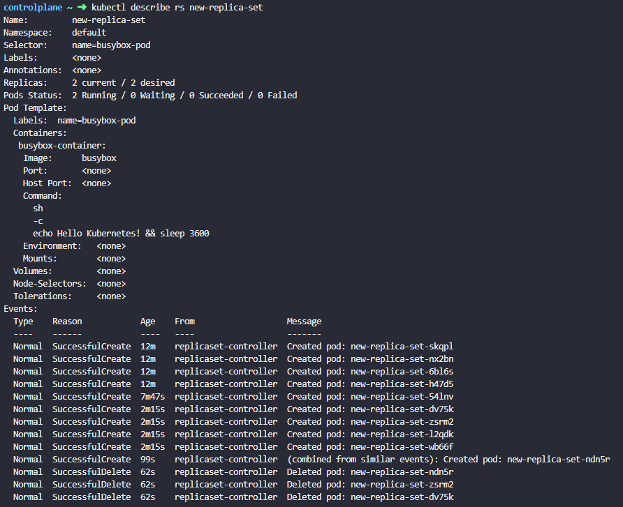

 

 

 

**Deployment**

 

\- If pod dies or crashes, you must restart the pod in production where
user should not feel downtime on app. In that case, you should have
replica pods for application that both app pod and replica pod are
connected with service for load balancing where deployment creates
replica pod on behalf of administrator

\- Deployment defines blueprint for pod in order to replicating pods,
upgrade application on replica pods, scale up and scaling down

\- Administrator can specify number of replica pods you need for
deployment, how should scale

\- Abstraction of pods

\- Deployment for stateless apps

 

1\. blueprint for creating pods

2\. Most basic configuration for deployment (name and image to use)

3\. rest defaults

 

\- Higher in the hierarchy

\- Deployment provides capability to upgrade underlying instances
seamlessly using rolling updates, rolling back for undoing changes,
pause and resume after making multiple changes to environment such as
upgrade underlying web server version

\- Deployments automatically creates new replica set with prefixing name
of deployment on it, then pods are created based on number of replicas
has the name of replica set prefixing on name of pods

 

<https://kubernetes.io/docs/reference/kubectl/conventions/>

 

**Layers of abstraction**

 

1\. Deployment manages a ReplicaSet

2\. ReplicaSet manages a Pod

3\. Pod is an abstraction of container

 

1\. Everything below deployment is handled by Kubernetes

 

\- kubectl delete deployment \[name\] ; Delete deployment

\- kubectl get nodes \| pod \| services \| replicaset \| deployment

 

\- kubectl apply -f \[file name\] or kubectl create -f \[file name\] ;
apply configuration YAML file created

\- kubectl delete -f \[file name\] ; delete configuration YAML file

 

 

 

-kubectl get all ; get all objects created with deployment

\- kubectl create deployment nginx-deploy - - image=nginx ; create
deployment with a name nginx-deploy

 

\- kubectl create deployment - -help ; check more commands

 

\- kubectl expose deployment nginx - -port=8080 ; expose the deployment
with specified port

 

\- kubectl edit deployment nginx ; edit existing deployment definition
file

 

\- kubectl scale deployment nginx - -replicas=5 ; scale up or down the
number of pods

 

\- kubectl set image deployment nginx nginx=nginx:1.18 ; update the
image of existing deployment nginx by replacing image of container name
nginx with nginx:1.18

 

\- kubectl create deployment - -image=nginx - -dry-run=client -o yaml ;
generate deployment manifest YAML file in dry-run option, don’t create
it(- -dry-run)

 

\- kubectl create deployment nginx - - image= nginx - - dry-run=client -
o yaml \> nginx-definition.yaml ; direct deployment manifest YAML file
generated and save it to YAML file specified

 

\- kubectl create -f nginx-deployment.yaml

 

\- kubectl create deployment nginx - - image= nginx - - replicas=4 - -
dry-run=client - o yaml \> nginx-definition.yaml; save to YAML file with
4 replicas

 

\- kubectl get deployment; get status of deployment

 

\- kubectl edit deployment ; it allows auto-generated configuration file
with default values

 

\- kubectl get deployment \[deployment name\] -o yaml ; resulting
updated configuration of deployment

 

\- kubectl get deployment \[deployment name\] -o yaml \> file name.yaml
; result to save in a file

 

apiVersion: apps/v1

kind: Deployment

metadata:

name: myapp-deployment

labels:

app: myapp

type: front-end

 

spec:

template:

metadata:

name: myapp-pod

labels:

app: myapp

type: front-end

spec:

containers:

\- name: nginx-container

image: nginx

 

replicas: 3

selector:

matchLabels:

type: front-end

 

controlplane ~ ➜ kubectl create -f deployment-definition-1.yaml

Error from server (BadRequest): error when creating
"deployment-definition-1.yaml": deployment in version "v1" cannot be
handled as a Deployment: no kind "deployment" is registered for version
"apps/v1" in scheme
"k8s.io/apimachinery@v1.31.0-k3s3/pkg/runtime/scheme.go:100"

 

 

***Edit deployment***

 

With deployment, can easily edit any field/property of the pod template.
Since the pod template is a child of the deployment specification, with
every change the deployment will automatically delete and create a new
pod with the new change.

 

kubectl edit deployment my-deployment

 

kubectl edit deployment \<deployment-name\> typically does not cause
downtime if the Deployment is configured correctly. However, the
behavior depends on your Deployment strategy (RollingUpdate vs Recreate)

 

1\. Default Behavior (RollingUpdate) → No Downtime

 

Kubernetes gradually replaces old Pods with new ones (one by one or in
batches).

Traffic shifts smoothly to the new Pods (assuming a Service is
load-balancing correctly).

No downtime if your application can handle concurrent old + new
versions.

 

2\. If Using Recreate Strategy → Downtime

 

Kubernetes first kills all old Pods before creating new ones.

Downtime occurs until the new Pods start successfully.

 

Best Practices to Avoid Downtime

 

Use RollingUpdate (default):

 

yaml

strategy:

type: RollingUpdate

rollingUpdate:

maxUnavailable: 1 \# How many Pods can be down during update

maxSurge: 1 \# How many extra Pods can be created

 

Ensure proper readinessProbe and livenessProbe:

 

yaml

readinessProbe:

httpGet:

path: /health

port: 8080

initialDelaySeconds: 5

periodSeconds: 5

Scale up before updating (for critical workloads):

Temporarily increase replicas to absorb traffic during updates.

 

Test in staging first to catch image issues.

 

**kubectl replace -f vs kubectl replace --force -f**

 

 

| Feature | replace -f (Standard) | replace --force -f (Forced) |
|----|----|----|
| Resource Existence | Fails if resource doesn’t exist | Creates if resource doesn’t exist |
| Immutable Fields | Fails (e.g., clusterIP, selector) | Succeeds (recreates resource) |
| Downtime | Minimal (if RollingUpdate) | Yes (deletes before recreate) |
| Atomicity | Single operation | Two operations (delete + create) |
| Equivalent To | kubectl apply --server-side | kubectl delete && kubectl create |

 

 

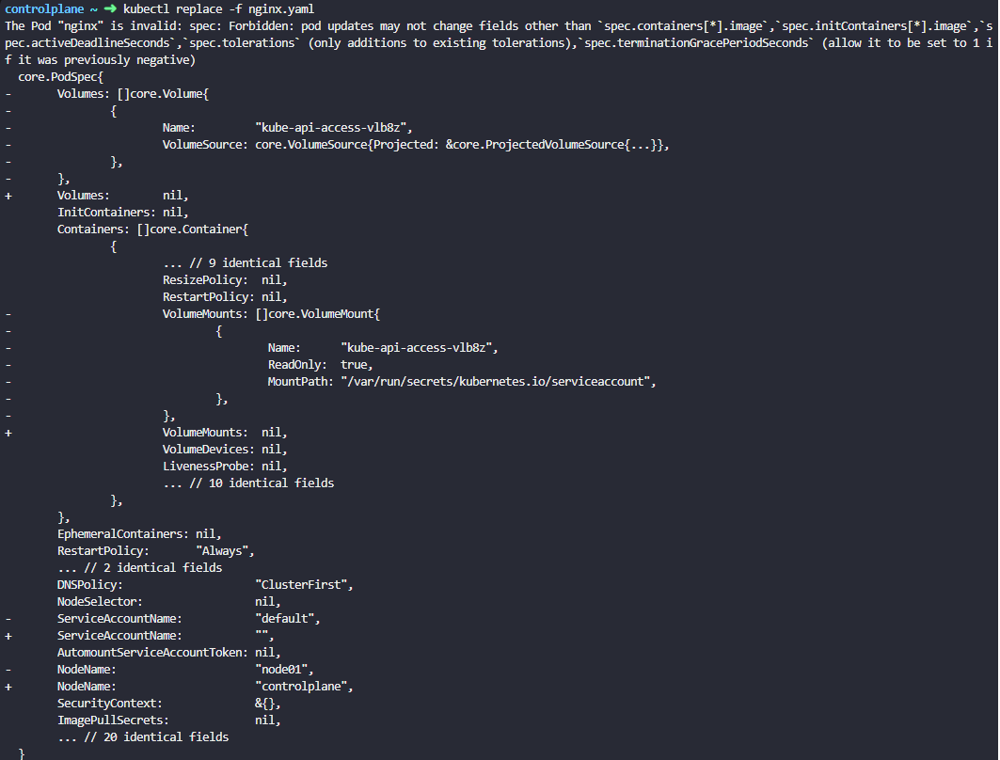

 

 

 

**Namespace**

 

\- Kubernetes creates object automatically with default namespace ;
default, kube-system, kube-public

\- Kubernetes objects that creates for network(CNI plugin), DNS
services(CoreDNS) are under namespace kube-system which isolate from
other objects and prevent accidentally deleting and modifying

\- Kube-public is where all resources that should be made available to
users are created.

\- When Kubernetes cluster grows, it should use multiple Kubernetes
namespaces such as development, production

\- Namespace has set of policies that own through which we can define
resource limit, who can do what

\- Pod can access a service inside the same namespace with using just a
name, however pod should use full FQDN whenever access a service in
different namespace

 

DNS namespace of service ;

 

my.connect(“DB-service.dev.svc.cluster.local”)

 

\<Service Name\>.\<namespace\>.\<type service\>.\<domain\>

 

\- kubectl create -f pod-definition.yml - -namespace=dev ; Create pods
specifying namespace dev

 

\- kubectl get pods - - namespace=dev or -n=dev; get pods under
namespace dev

 

\- kubectl config set-context \$(kubectl config current-context) -
-namespace=dev ; permanently set namespace to dev

 

\- Kubectl get pods - - all-namespaces or -A; get pods of all namespaces
in the cluster

 

\- kubectl get namespaces \| ns ; get all namespaces in the cluster

 

Can specify name space under metadata section in pod definition file;
namespace:dev

 

apiVersion: v1

kind: Pod

metadata:

name: myapp-pod

namespace: dev ; specify namespace in metadata section

 

***Create namespace***

 

apiVersion: v1

kind: Namespace

metadata:

name: dev

 

\- kubectl create -f namespace-dev.yaml ; create namespace with YAML
file

 

\- kubectl create namespace dev ; create namespace imperatively

 

 

To limit resources to specific namespace, create ResourceQuota
specifying the resource limit and namespace.

 

apiVersion: v1

kind: ResourceQuota

metadata:

name: Compute-quota

namespace: dev

spec:

hard:

pods: “10”

requests.cpu: “4”

requests.memory: 5Gi

limit.cpu: “10”

limits.memory: 10Gi

 

 

 

**Service**

 

\- Allow connect application together with other applications or users

\- Services enable loose coupling between microservices in application

\- Services helps to map external requests that receive to node that
consist the internal pod that is on different network in same node.

\- Service cannot join the pod network because service is not an actual
thing like pods or containers. The service doesn't have any interfaces
or actively listening process. Services are virtual component that only
lives Kubernetes memory. Service should be accessible across the cluster
from any node. That’s where kube-proxy comes in to achieve connectivity
across nodes in the cluster.

\- Kube-proxy is a process that run on each node in the cluster. Its job
is to look for new services and every time new service is created, it
creates the appropriate iptable rules on each node to forward traffic to
those services to the backend pod.

-Service is an object like pod, replica set and deployment.

\- Permanent or static IP address with DNS name

\- Lifecycle of Pod and Service is NOT connected

\- App should be accessible through browser so that it uses external
service(NodePort)-
[https://public_IP_address:port](https://public_IP_address:port)

\- Database might not need to be publicly accessible where it uses
Internal service(ClusterIP)

\- Service endpoints are basically pods that the service has identified
that is going to direct traffic based on the selector specified on the
service and labels on the pods

 

***Service- NodePort***

 

-It is like virtual server inside the node. It has its own IP address
inside the cluster which is called ClusterIP of the service

-This service listens to a port on the node and forward request on that
port on service to a port on the pod running the web application.
NodePort makes an internal port accessible on a port on the node as well

\- To expose external facing application run on worker node to external
users

\- Mapping port on the node to port on a pod

\- Must be valid port range 30000- 32767

\- Api version : v1

 

\- kubectl create -f service-definition.yml - create service using
service definition file

\- kubectl get services (svc); list the services along with name, type,
Cluster-IP, External-IP, ports, age

\- curl <http://192.168.1.2:30008> ; access the web server using
NodePort mapped

\- Endpoints are pods that service identifies labels based on selector
specified to direct traffic to

 

apiVersion: v1

kind: Service

metadata:

name: myapp-service

 

spec:

type: NodePort

ports:

\- targetPort: 80 ; port on pod

port: 80 ; port on service object

nodePort: 30080 ; port on node

selector:

app: myapp

type: front-end ; link the service to the pod using label of the pods

 

\- Port is the mandatory in ports array.

\- If targetPort is not specified, by default it takes value of port on
service

\- If nodePort is not specified, a free port in range 30000- 32767 is
automatically allocated.

-You can have multiple port mapping in single service

\- Pull labels from pod definition file and put it under selector
section to link pod with a service. The service then automatically
selects all the Pods as endpoints to forward the external request coming
from users. The service uses random algorithm to distribute the traffic
and act as built in load balancer.

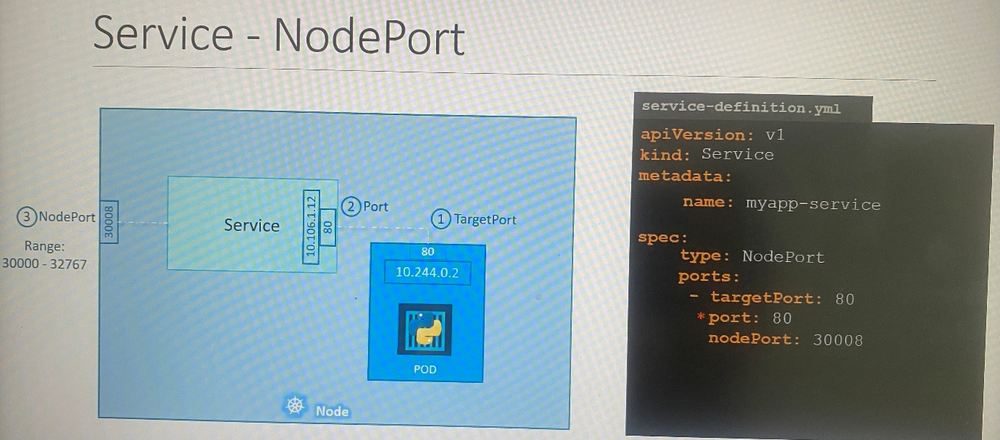

 

\*You can't specify the Node Port in imperative command so that you
should create the service with port, targetPort and type options and
then edit the service with the nodePort.

 

\- Service is created exactly same without having to do any additional
step in following scenarios

 

1\. Single pod in single node

2\. Multiple pods in single node - link pods with labels

3\. Multiple pods in multiple nodes - Kubernetes automatically creates a
service that span across all the nodes in the cluster and maps the
targetPort to the same nodePort on all the node in the cluster. You can
access pods externally each IP address of node

 

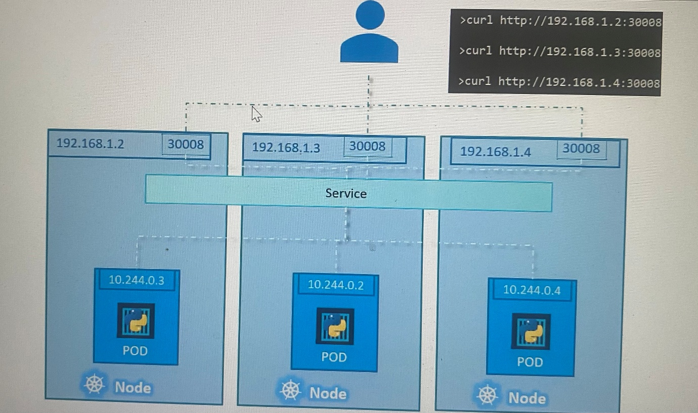

 

 

 

***Service- ClusterIP***

 

\- Full stack web application typically has different kind of pods
hosting different part of application in different tiers such as
front-end, back-end

\- Helps effectively deploy multi trier microservice based application
in Kubernetes cluster

-The service creates a virtual IP inside the cluster to enable
communication between different services

\- ClusterIP service groups multiple pods together in each tier and
provide single interface to access the pods in a group. The requests are
forwarded one of the pods under the service randomly.

-The service has name and IP address that other pods use them to access
backend pods of the service

\- Default type of service even when you don’t specify in service
definition file

 

apiVersion: v1

kind: Service

metadata:

name: myapp-service

 

spec:

type: ClusterIP

ports:

\- targetPort: 80 ; port where the backend pod expose

port: 80 ; port on service object

selector:

app: myapp

type: back-end

 

 

***Service - Load balancer***

 

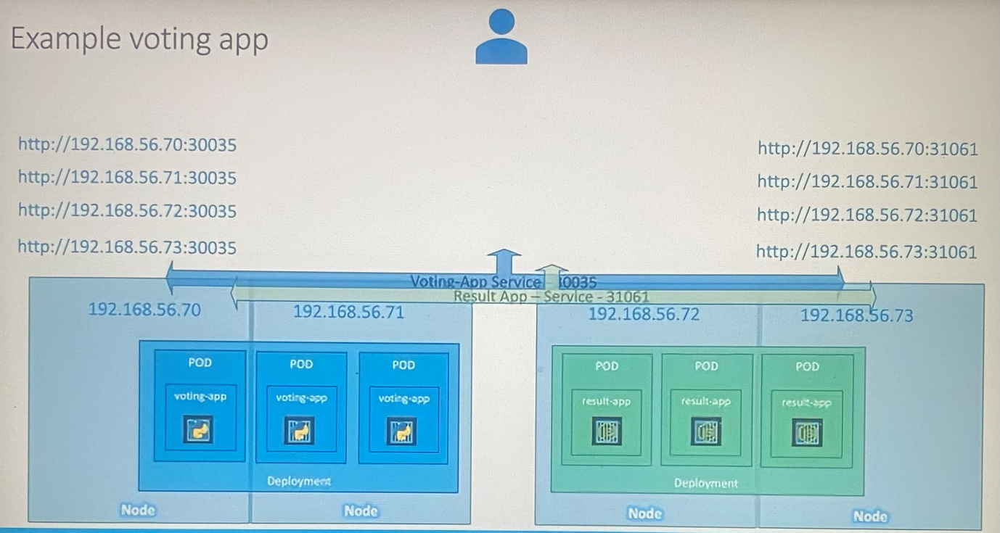

 

\- multiple pods running in different nodes are accessible using ip
address of each node along with same port. But requirement is to access
application using single DNS entry without specifying port number in URL

\- To achieve that we can use native load balancer in cloud platform to
configure load balancer to route the traffic to underlying nodes

-service just changing type of service in service configuration file

 

apiVersion: v1

kind: Service

metadata:

name: myapp-service

 

spec:

type: LoadBalancer

ports:

\- targetPort: 80 ; port on pod

port: 80 ; port on service object

nodePort: 30080 ; port on node

 

\- kubectl expose pod redis - - port=6379 ; create a service specified
with port to expose a pod specified. expose command detects labels on
pod as selector.

 

\- kubectl expose pod redis - - port=6379 - - name=redis-service -
-dry-run=client -o yaml ; create a service named redis-service of type
ClusterIP to expose pod redis on port 6379, this will automatically use
the pod’s labels as selectors

 

\- kubectl expose deployment redis - - port=6379 - -
name=redis-service - -dry-run=client -o yaml ; create a service named
redis-service of type ClusterIP to expose deployment redis on port 6379,
this will automatically use the pod’s labels as selectors

 

\- kubectl create service clusterip redis - -tcp=6379:6379 -
-dry-run=client -o yaml ; This will not use the pods labels as
selectors, instead it will assume selectors as app=redis. You cannot
pass in selectors as an option. So it does not work very well if your
pod has a different label set. So generate the file and modify the
selectors before creating the service

 

\- kubectl expose pod redis - -type=NodePort - - port=80 - -
name=redis-service - -dry-run=client -o yaml ; This will automatically
use the pod's labels as selectors, but you cannot specify the node port.
You have to generate a definition file and then add the node port in
manually before creating the service with the pod

 

-kubectl create service nodeport nginx --tcp=80:80 --node-port=30080
--dry-run=client -o yaml ; create a service type NodePort to expose
nginx pod port 80 on port 30080 on the nodes, This will not use the pods
labels as selectors

 

\- kubectl get svc ; list services in screen

 

\- kubectl describe svc \<name of service\> ; more details on service,
endpoints that service direct traffic to, target IP

 

-kubectl run httpd --image=httpd:alpine --port=80 --expose=true ; create
a pod along with service exposing from target port

 

Both the above commands have their own challenges. While one of it
cannot accept a selector the other cannot accept a node port. I would
recommend going with the kubectl expose command. If you need to specify
a node port, generate a definition file using the same command and
manually input the nodeport before creating the service.

 

 

 

**Imperative vs Declarative**

 

***Imperative***

 

Imperative approach is that specifying what to do and how to do more
importantly to the system.

 

Imperative commands connect with user session and it disappears when
session disconnects. It is hard to work with large and complex
environment.

 

In IaC,

 

1\. Provision a VM by the name ‘web-server’

2\. Install NGINX software on it

3\. Edit configuration file to use port ‘8080’

4\. Edit configuration file to web path’/var/www/nginx’

5\. Load web pages to ’/var/www/nginx’ from GIT repo -X

6\. Start NGINX server

 

Example;

 

***Create Objects***

 

\> kubectl run nginx - -image=nginx

\> kubectl create deployment - -image=nginx nginx

\> kubectl expose deployment nginx - -port 80 --name=\<service name\> ;
Create a service for a deployment, which serves on port 80 with the
service name

\> kubectl run nginx - -image=nginx - -port 80 - -expose=true ; create a
pod and service altogether exposing the port with the same name for both
pod and service

 

controlplane ~ ➜ kubectl run httpd --image httpd:alpine --port 80
--expose=true

service/httpd created

pod/httpd created

 

\*\*expose option should be with '='

 

***Update Objects***

 

\> kubectl edit deployment nginx

\> kubectl scale deployment nginx - -replicas=5

\> kubectl set image deployment nginx nginx=nginx:1.18

 

When use kubectl edit command, it opens similar object definition file
within Kubernetes memory. Once we save definition file, changes will be
applied. But the update we have done does not appear in object
definition file we used to create object. This change cannot be tracked
when we review object definition file in local files later. Hence, you
can't rely on local file of object configuration in future if you do
modification using kubectl edit \| scale \| set image

 

 

In order to track the changes, edit the configuration in object
configuration file and use kubectl replace -f configfile.yml to update
the object.

 

\> kubectl create -f nginx.yaml ; create an object that used to create
from object definition file

\> kubectl replace -f nginx.yaml ; apply change after editing object
definition file

\> kubectl delete -f nginx.yaml ; delete an object that used to create
from object definition file

\> kubectl replace - -force -f nginx.yaml ; delete the existing pod and
create pods forcefully by the file defined

 

***Declarative***

 

Declarative approach is that specifying what to do not how to do to the
system. Also it is best way to apply some of changes into system later
such as version upgrade of web server.

 

In IaC,

 

VM name: web-server

Package: nginx:1.18

Port: 8080

Path: /var/www/nginx

Code: GIT repo X

 

In Kubernetes, you will run kubectl apply command for creating, updating
and deleting an object. Apply command figure out what changes need to be
made to the system to bring to the expected state by comparing last
applied configuration.

 

***Create Objects***

 

kubectl apply -f nginx.yaml; apply command is intelligent enough to
create/update/delete an object if it doesn’t already exist

 

Kubectl apply -f /path/to/config-files ; specify all configuration files
in directory path to create all objects relates in object configuration
files

 

***Update Objects***

 

kubectl apply -f nginx.yaml; apply command is intelligent enough to
create/update/delete an object if it doesn’t already exist

 

\- When we run with kubectl apply command with local configuration file,
new object is created if object doesn’t exist. Thereafter it takes into
consideration with local configuration file of object that is similar to
what we created locally is created within Kubernetes memory along with
additional fields to store status of the object which is called **Live
object configuration** no matter what approach you used to create the
object either imperative or declarative approach.

\- At the same time when you run kubectl apply command, YAML
configuration of local configuration file is converted to JSON format
and it is then stored as **Last applied configuration**. Going forward,
these 3 files help to identify what fields have been
added/updated/removed from the local configuration file.

\- If we change image name on local configuration file and run kubectl
apply command, it compares value in live object configuration and update
it if there is a difference, then also update JSON format of last
applied configuration.

-The last applied configuration is mostly required when a field is
removed from local configuration file where local configuration file can
compare with last applied configuration and identify the change, then it
removes the field from live object configuration. If a field present in
live object configuration but not present local or last applied
configuration, the field will be left in live object configuration.

 

 

\- The last applied configuration is stored in live object configuration
on kubernetes cluster itself as an annotation named as
last-applied-configuration:
***kubectl.kubernetes.io/last-applied-confguration***. Kubectl create or
replace command don’t store last-applied-configuration like this. You
must keep in mind not to mix up imperative and declarative approaches
while managing the Kubernetes objects.

 

 

 

 

If we need change a property of object that used to create
declaratively, it should be applied using kubectl apply. The following
message will be shown you.

 

controlplane ~ ➜ kubectl create -f redis.yaml

Error from server (AlreadyExists): error when creating "redis.yaml":
pods "redis" already exists

 

 

controlplane ~ ✖ kubectl apply -f redis.yaml

Warning: resource pods/redis is missing the
kubectl.kubernetes.io/last-applied-configuration annotation which is
required by kubectl apply. kubectl apply should only be used on
resources created declaratively by either kubectl create --save-config
or kubectl apply. The missing annotation will be patched automatically.

pod/redis configured

 

 

kubectl api-resources ; name of resource, shortname, apiVersion,
namespaced(true/false), kind

 

 

kubectl explain pod.spec.containers

 

This command drills down into the containers field within the Pod spec,
showing you all available fields for container configuration such as:

- name (required)

- image (required)

- ports

- env

- volumeMounts

- resources

- and many more

This is extremely helpful when writing Pod manifests to understand what
options are available.

 

 

The --recursive flag is useful for getting a complete view of a
resource's structure which shows all nested fields recursively in a
single output:

 

kubectl explain pod.spec --recursive

 

This will show:

 

All top-level fields under spec

All nested fields within those fields

The complete hierarchy in one output

Compare this to the default behavior:

 

kubectl explain pod.spec

 

This only shows the immediate fields under spec, requiring you to drill
down manually to see nested fields.

 

Use --recursive when:

 

You want to see the complete structure quickly

You're searching for a specific field but don't know its exact path

You want to understand the full scope of available options

 

 

**Minikube and Kubectl**

 

Minikube

\- Master and worker processes run on one machine

\- Create Virtual box on the laptop( need a hypervisor)

\- 1 node K8s cluster

\- For testing purposes

\- To interact with cluster and configure required component, it needs
Kubectl for start up/deleting the cluster

 

Kubectl

\- Command line tool for K8s cluster

\- Most powerful of 3 clients

\- Kubectl can be used for Minikube, cloud or hybrid clusters

 

Installation of Minikube

\- Virtualization on your machine needed

\- Install hypervisor

\- Minikube has Kubectl as dependency

\- Specify which hypervisor should be started which install container
runtime as well

\- Check available commands after installation, kubectl, minikube

 

minikube start

 

kubectl get nodes ; get status of nodes

 

minikube status

 

kubectl version ;get client and server version which implies K8s cluster
is configured

 

 

**Ingress**

\- To forward traffic to external service securely(https://my-app.com)
K8s uses a component which is called Ingress

 

**Volumes**

 

\- If container or pod restarts, data would be gone which is where
Volume comes

\- Data may store in storage on local machine or remote, outside of the
K8s cluster which may be cloud or on-premise storage.

\- K8s doesn’t explicitly manage data persistence, hence administrator
must be responsible to conserve data backup and replication on external
storage

 

**StatefulSet**

 

\- If DB pod dies or crashes, the app wouldn’t be accessible where we
needs DB pod replicas. However, DB pods can’t be replicated via
Deployment because DB has a state which means its data. Replica pods
needs to access shared storage, there should be a mechanism which pod
writes or reads from shared storage in order to avoid data
inconsistency. This mechanism is offered by StatefulSet

\- StatefulSet for stateful apps or databases

\- StatefulSet replicates pods, scaling up and scaling down, make sure
database reads and writes are synchronized with shared storage.

\- It is best practice DB app are often hosted outside K8s cluster as it
is so tedious to manage other than stateless app

 

25 Blogs to Learn 25 Kubernetes Concepts:

 

1\) Kubernetes Architecture: <https://lnkd.in/gmRDrusm>

2\) POD Lifecycle: <https://lnkd.in/g9cbpma4>

3\) etcd Setup: <https://lnkd.in/guD6EeuY>

4\) etcd Locks: <https://lnkd.in/gYbtKsK2>

5\) crashloopbackoff: <https://lnkd.in/gyKyBRt2>

6\) OOMKilled: <https://lnkd.in/gznwimNr>

7\) ImagePullBackOff: <https://lnkd.in/gzCTSWRG>

8\) CreateContainerConfigError: <https://lnkd.in/g6Z5TdBt>

9\) CreateContainerError: <https://lnkd.in/gG_2nHb7>

10\) RunContainerError: <https://lnkd.in/ggQcqi5t>

11\) Node Disk Pressure: <https://lnkd.in/gu9eFiRw>

12\) Node Not Ready:        <https://lnkd.in/gksPqZYF>

13\) Pod Disruption Budget: <https://lnkd.in/gNZNxewk>

14\) RBAC: <https://lnkd.in/g2Pr_aA5>

15\) DNS Optimization: <https://lnkd.in/gmNkjZeV>

16\) Kubernetes Controller: <https://lnkd.in/gZ6pkzMt>

17\) pod.yaml Breakdown: <https://lnkd.in/g7yhk_tS>

18\) Kubernetes Upgrades: <https://lnkd.in/g3nwTgwA>

19\) KEDA vs Karpenter: <https://lnkd.in/gED3Vypc>

20\) Operator vs Helm: <https://lnkd.in/gSeg56ME>

21\) Kubernetes Air Gap: <https://lnkd.in/gxxqWdEE>

22\) QoS Classes: <https://lnkd.in/gr_QU8BN> 

23\) Kubernetes CI/CD: <https://lnkd.in/gpk_Et74>

24\) Deployment Strategies: <https://lnkd.in/gdU_8A38>

25\) Security Contexts: <https://lnkd.in/gNQizuFy>

 

42K+ read my free newsletter: <https://lnkd.in/gg3RQsRK>

 

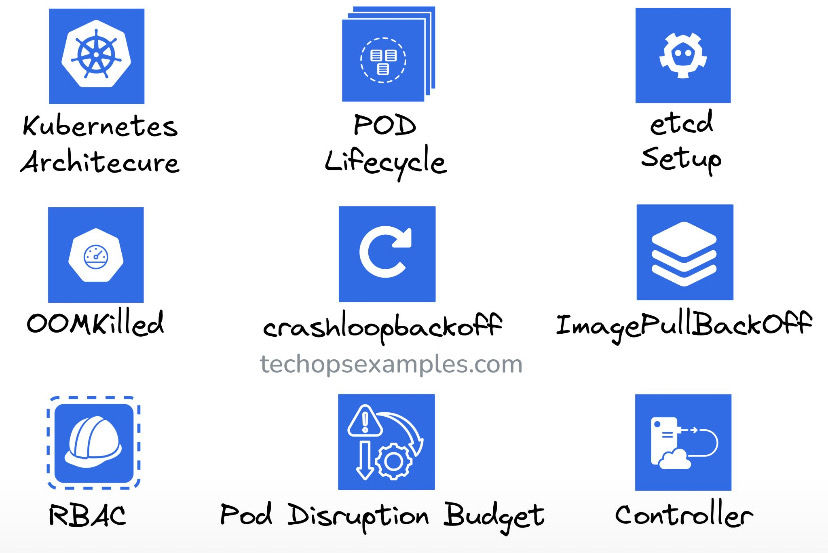

 

 

If you are starting with Kubernetes – this will help you. 

 

I spent 10 hours digging into Kubernetes concepts, tools, and best
practices this week – so you don’t have to. 

 

Here are 20 must-know updates and tips to get started with Kubernetes: 

 

1\. Always start with \`kubectl\` – it's your gateway to the cluster.  

2\. Use Minikube or Kind to practice Kubernetes locally.  

3\. Master the YAML syntax – it's everywhere in Kubernetes.  

4\. Learn the difference between Deployments, StatefulSets, and
DaemonSets.  

5\. Namespace everything to avoid conflicts in multi-team setups.  

6\. Use ConfigMaps and Secrets to separate configuration from code.  

7\. Set up resource requests/limits to prevent pod starvation.  

8\. Understand Kubernetes Services – ClusterIP, NodePort, and
LoadBalancer.  

9\. Learn about Ingress for HTTP routing into your cluster.  

10\. Use liveness and readiness probes to manage container health.  

11\. Avoid storing credentials in plain YAML files – use Secrets
instead.  

12\. Familiarize yourself with Helm for managing application releases.  

13\. Explore Kustomize for environment-specific configuration.  

14\. Use metrics-server for resource monitoring.  

15\. Set up Role-Based Access Control (RBAC) for secure operations.  

16\. Start with a simple CNI plugin like Flannel for networking.  

17\. Use Kubernetes Dashboard cautiously – it's great for beginners but
can expose your cluster.  

18\. Experiment with auto-scaling – both HPA (pods) and Cluster
Autoscaler (nodes).  

19\. Regularly clean up unused resources like pods, services, and
images.  

20\. Document everything – Kubernetes has a steep learning curve. 

 

 

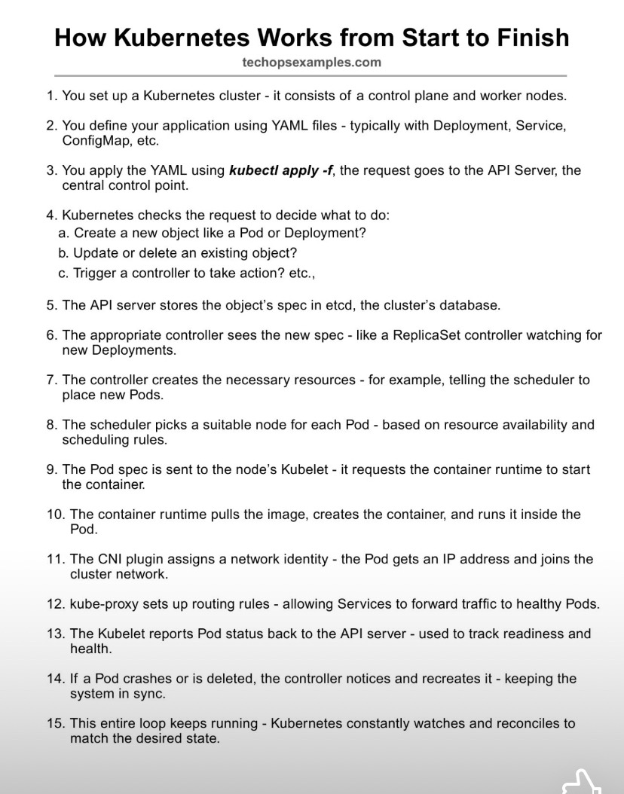

 

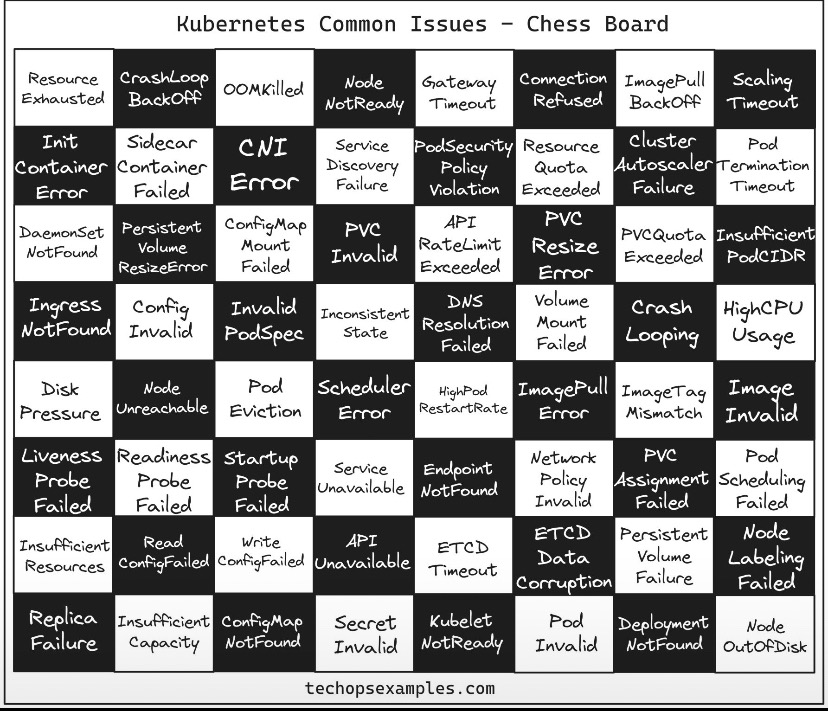

 

 

 
