**Kubernetes- Design and Install a Kubernetes Cluster**

 

**Design a Kubernetes Cluster**

 

Before designing a cluster, you should consider these factors.

 

- Purpose : Education, Development, Testing, Hosting production
  application

- Platform to be managed : Cloud or OnPrem

- Kind of workloads run on the cluster

- Number of application to be hosted

- Kind of application : Web, Big Data/Analytics

- Application resource requirement: CPU intensive, Memory Intensive

- Network traffic : Heavy traffic, Burst traffic

 

***Purpose***

 

Education

 

- Minikube

- Single node cluster with kubeadm deploy in local VM or cloud provider
  GCP/AWS

 

Development and Testing

 

- Mult-node cluster with a Single Master and Multiple worker nodes

- Setup using kubeadm tool or quick provision on GKE, EKS, or AKS

Hosting Production Applications

 

- High Availability Multi node cluster with multiple master nodes

- Kubeadm or GCP or Kops on AWS or other supported platforms

- Upto 5000 nodes

- Upto 150,000 PODs in the cluster

- Upto 300,000 Total Containers

- Upto 100 PODs per node

 

Depending on the size of your cluster, the resource requirement of your
node varies. Cloud service providers like GCP and AWS automatically
selects the right size nodes for you based on the number of nodes in the
cluster.

 

This table shows size of instances for specific number of nodes. You can
use these numbers if you deploy Kubernetes cluster in onprem nodes.

 

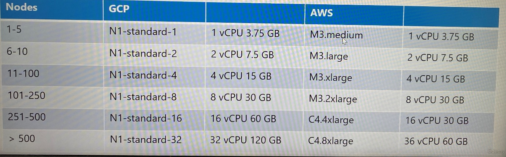

 

 

***Cloud or OnPrem***

 

- Use Kubeadm for on-prem

- GKE for GCP

- Kops for AWS

- Azure Kubernetes Service(AKS) for Azure

 

***Storage***

 

Depending on the workloads the node and disk configuration may vary.

 

- High performance - SSD Backed Storage

- Multiple Concurrent connections - Network based storage

- Persistent shared volumes for shared access across multiple PODs.
  Define different classes of storage and allocate the right class to
  right applications

- Label node with specific disk types and use Node Selectors to assign
  applications to nodes with specific disk types

 

***Nodes***

 

- Virtual or Physical machines

- Minimum of 4 Node Cluster(Size based on workload)

- Master vs Worker nodes

- Linux X86_64 Architecture

 

- Master nodes can host workloads

- As best practice is not to host workloads on master nodes, dedicate
  master node for controlplane component only, especially in production
  environment.

- Kubeadm tool prevent workloads from being hosted on master nodes by
  adding a taint to master node.

 

***Master Nodes***

 

In large clusters, you may choose to separate the ETCD clusters from the
master node to its own cluster nodes.

 

 

**Choosing Kubernetes Infrastructure**

 

We consider available options for the infrastructure hosting a
Kubernetes cluster. Kubernetes can be deployed on various systems in
different ways.

 

***Local machine***

 

Linux - Installing the binaries manually and setting up a local cluster

 

Windows - You cannot set up Kubernetes natively as there are no Windows
binaries. You must rely on virtualization software such as Hyper-V,
VMware Workstation or Oracle VirtualBox to create Linux VMs. There are
solutions available to run as Docker containers on Windows VMs.

 

The Docker images are Linux based which run on a small Linux OS created
by HyperV for running Linux Docker containers.

 

***Minikube*** deploys a single node cluster that relies on one of the
virtualization software like Oracle VirtualBox to create virtual
machines **itself** that run the Kubernetes cluster components.

 

***Kubeadm*** tool can be used to deploy a single node or a multi-node
cluster that provision the required host with supported configuration
**yourself**.

 

 

There are many ways to get started with a Kubernetes cluster, both in a
private or a public cloud environment.

 

***Turnkey solutions***

 

Turnkey solutions are where you provision the required VMs and use kind
of tools or script to configure Kubernetes cluster on them. You are
responsible to provision, configure VMs, use scripts to deploy cluster
and maintain those VMs by patching and upgrading. As example Kubernetes
on AWS using KOPS tool.

 

These are few of Kubernetes certified solution that make easy to deploy
and manage a Kubernetes cluster within your organization.

 

**OpenShift** is on-prem Kubernetes platform by RedHat. It is an open
source container application platform and is built on top of Kubernetes.
It provides a set of additional tools and a nice GUI to create and
manage Kubernetes constructs and easily integrate with CI/CD pipelines

 

**Cloud Foundry Container Runtime** is an open source project from Cloud
Foundry that helps in deploying and managing highly available Kubernetes
clusters using their open source tool called BOSH.

 

**VMware Cloud PKS** solution is if you wish to leverage, your existing
VMware environment for Kubernetes.

 

**Vagrant** provides a set of useful scripts to deploy a Kubernetes
cluster on different cloud service providers.

 

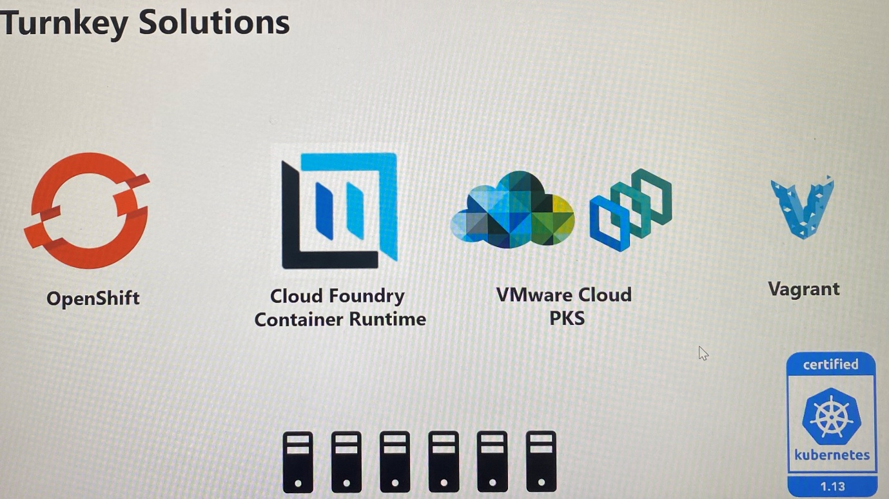

 

***Hosted solutions***

 

Hosted solutions are more like Kubernetes as a service solution where
provider is responsible to provision, configure and maintain VMs,
configure Kubernetes. Following are the example for Kubernetes as a
service.

 

**Google Container Engine(GKE)** offering on GCP

**OpenShift Online** offering on RedHat

**Azure Kubernetes Service(AKS)** offering on Azure

**Amazon Elastic Container Service(EKS)** for Kubernetes offering on
Amazon

 

 

**Configure High Availability**

 

As long as the worker nodes are up, containers are alive even when you
lose the master node in your cluster.

 

Users can access the application on worker nodes until pod start to
fail. If a container or pod on the worker nodes crashes and if the pod
was part of replica set, the replication controller is not functional to
instruct worker nodes to load new pod as the master node is not
available. No scheduler to create or schedule pod on worker nodes. No
one can access the cluster externally via kubectl utility as
kube-apiserver is not available.

 

This is why you must consider multiple master nodes in a high
availability configuration in your production environment.

 

A high availability configuration is where you have redundancy across
every component in the cluster so as to avoid a single point of failure
which are master nodes, worker nodes, control plane components and
applications. In a HA setup with an additional master node you have the
same controlplane components running on the new master as well.

 

**Kube-apiserver** that process requests in HA setup can be alive and
running at same time in an active-active mode on all cluster nodes.
Kubectl utility talks to API servers on both nodes by pointing Kubectl
utility to reach master node on port 6443. This is configured in
kubeconfig.yaml file. <https://master1:6443> and <https://mater2:6443>

 

It shouldn't be sending same request to both of API servers so that it
is better to configure load balancer in front of master nodes that split
traffic between the APIs servers. Then we point kubectl utility to that
load balancer. <https://loadbalancer:6443> . You can use NGINX or
HAPROXY or any load balancer for the purpose.

 

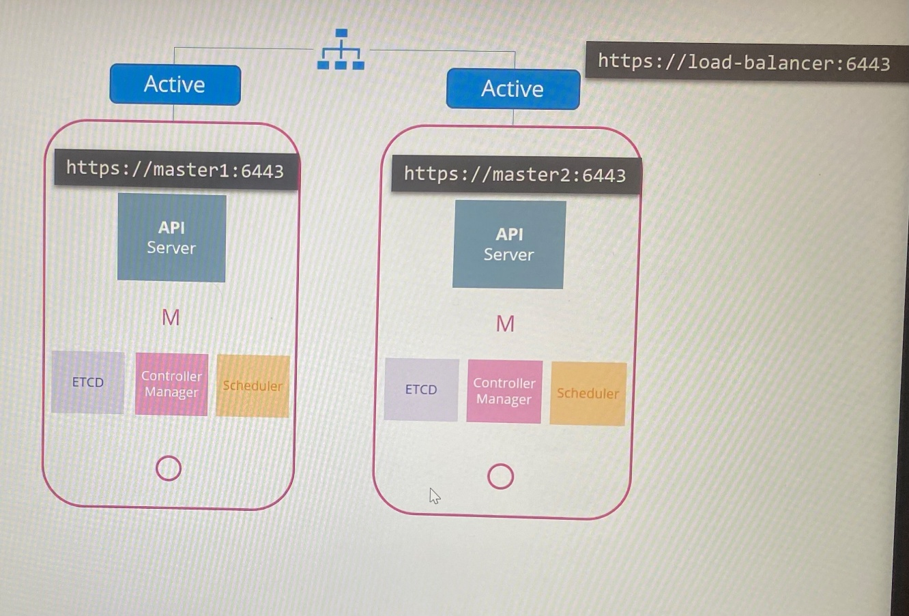

 

The **scheduler** and the **controller manager** are controllers that
watch the state of the cluster and take actions like replication
controller constantly watching the state of pods and taking necessary
actions to create new pods when one fails. If multiple instances of
these components run in parallel leads to duplicate actions resulting in
more pods than actually needed. The same is true for scheduler. As such
they must not run in parallel which must run in active standby mode.

 

To decide which among the two is active or passive, we use leader
election process.

 

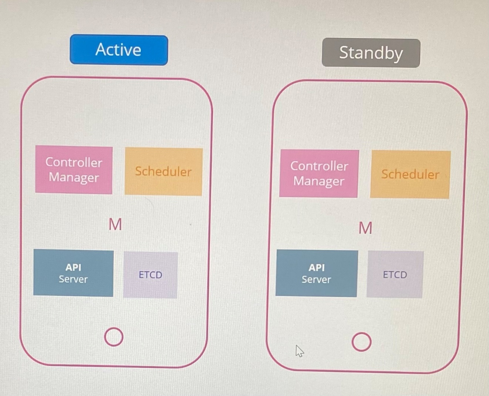

 

 

When a controller manager process is configured you may specify the
leader elect option which is by default set to true with this option.

 

kube-controller-manager --leader-elect true \[other options\]

 

When the controller manager process starts it tries to gain a lease or a
lock on an endpoint object in Kubernetes named as kube controller
manager endpoint. Whichever process first updates the endpoint with its
information gains the lease and becomes the active of the two, the other
becomes passive.

 

It holds the lock for the lease duration specified using the leader
elect lease duration option, which is by default set to 15 seconds.

 

kube-controller-manager --leader-elect-lease-duration 15s

 

The active process then renews the lease every 10 seconds which is the
default value for the option leader elect renew deadline.

 

kube-controller-manager --leader-elect-renew-deadline 10s

 

Both the processes try to become the leader every 2 seconds set by the
leader elect retry period option. Thus one process fails maybe because
the first master crashes, then second process can acquire the log and
become the leader.

 

kube-controller-manager --leader-elect-retry-period 2s

 

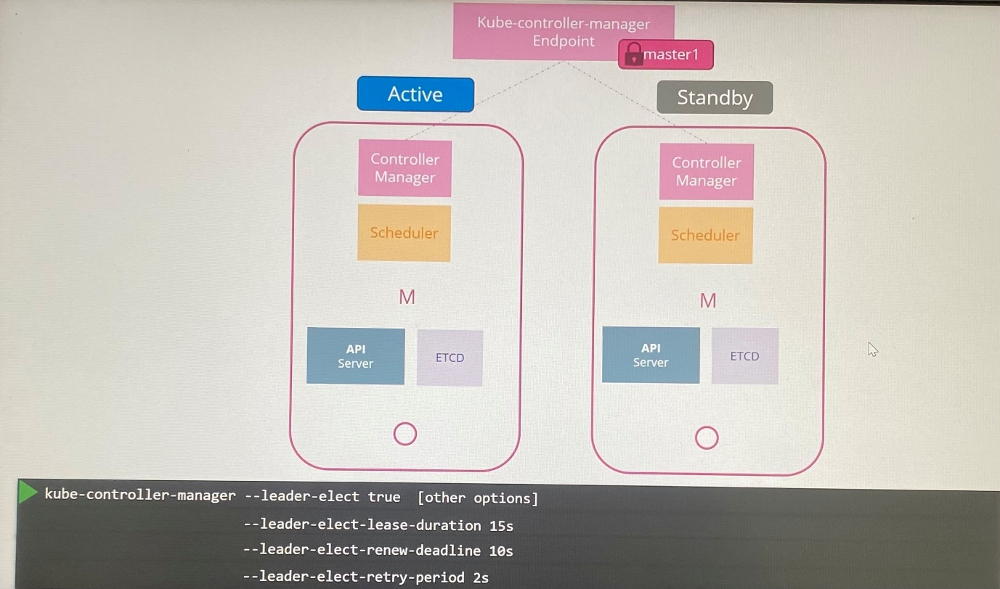

 

 

Similarly, the scheduler follows same approach and has same command line
options.

 

ETCD has two topologies that you can configure in Kubernetes

 

***Stacked Topology***

 

-ETCD is part of the Kubernetes master nodes

-Easier to set up and manage, requires few nodes

-If one node goes down, an ETCD member and controlplane instances are
lost and the redundancy is compromised.

 

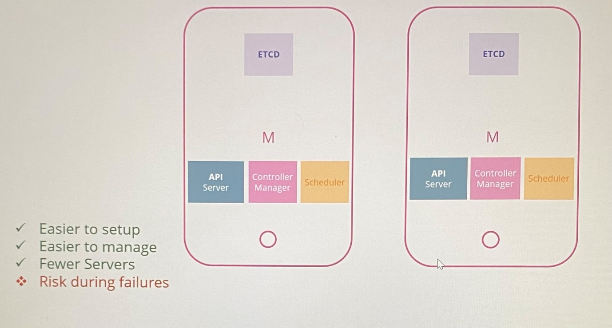

 

 

***External ETCD Topology***

 

-ETCD is separated from control plane nodes and run on its own set of
servers

-This is less risky as it does not impact the ETCD cluster and data it
stores if it fails control plane node

-Harder to set up and requires twice the number of server for external
ETCD servers

 

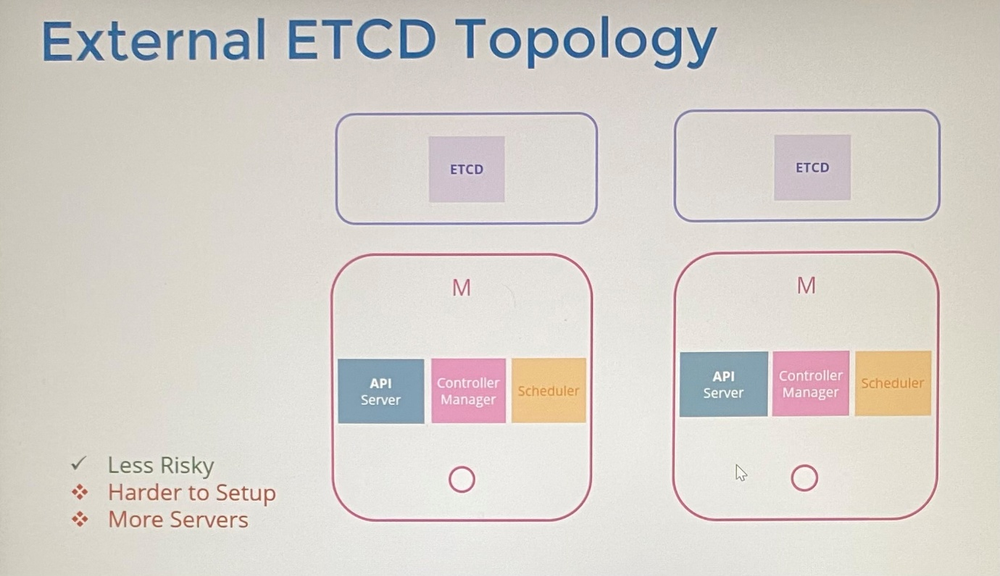

 

 

API server is the only component that talks to the ETCD server. In the
API service configuration, we have option specifying where the ETCD
servers are regardless the topology we use.

 

cat /etc/systemd/system/kube-apiserver.service

 

--etcd-servers=https://10.240.0.10:2379,https://10.240.0.11:2379

 

ETCD is a distributed system, so the API server or any other component
that wishes to talk to ETCD can reach the ETCD server at any of ETCD
instances. You can read and write data through any of the available ETCD
server instances.

 

 

**ETCD in HA**

 

\- ***Distributed reliable key-value store*** for cluster states that is
simple, secure and fast unlike traditional tabular/Relational database

-ETCD is a database that stores information in a key value format which
is in the form of documents and pages

-Each individual get a document and all information about that
individual is stored within that file

-ETCD transact the data format like JSON or YAML

 

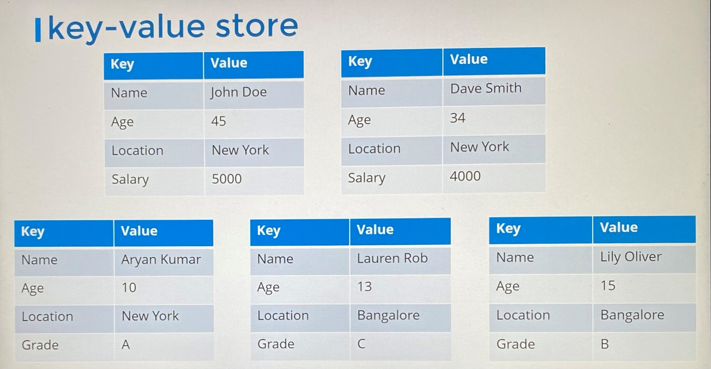

 

\-***Distributed*** means to have data store across multiple servers
where all maintaining an identical copy of database.

-ETCD instances are ***consistent***, you can write to any instance and
read your data from any instance. ETCD ensures that the same consistent
copy of the data is available on all instances at the same time.

 

With ***reads***, you can easily read data from any instances.

 

What if two writes requests coming on two different instances? At same
time, we cannot have these two different data on two different two
nodes.

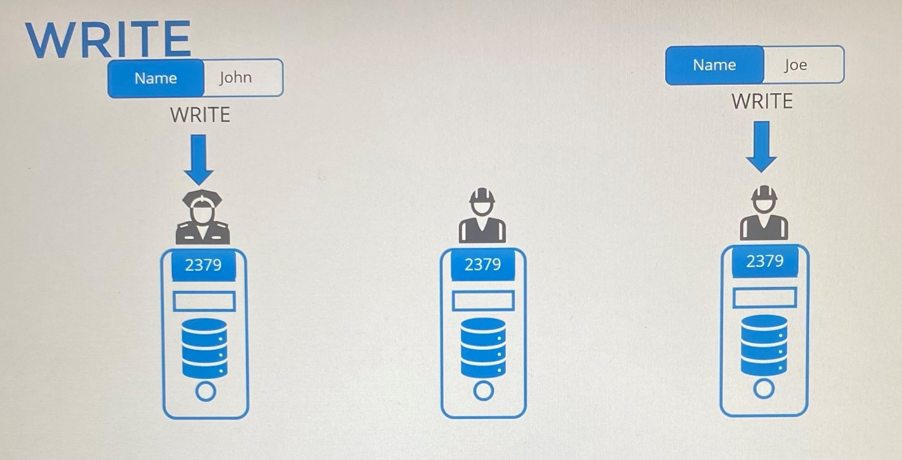

 

 

With ***writes***, ETCD does not process the writes on each node.
Instead only one of instances is responsible for processing the writes.

 

Internally, the two nodes elects a leader among total instances. One
node becomes the leader and the other node becomes the followers.

 

If the writes came in through the leader node, then the leader processes
the write. The leader makes sure that the other nodes are sent a copy of
the data. If the writes came in through any of the other follower nodes,
then they forward the writes to the leader internally and then the
leader processes the writes by ensuring copies of the write are
distributed to other instance in the cluster. Thus, a write is only
considered complete if the leader gets consent from the other members in
the cluster.

 

**Leader Election - RAFT**

 

-ETCD implements distributed consensus using RAFT protocol. This is how
that works for three node cluster to elect a leader.

-RAFT algorithm uses random timers for initiating requests where a
random timers is kicked off on the three managers. The first one to
finish the timer sends out a request to the other nodes requesting
permission to be the leader. The other managers on receiving the request
response with their vote, and the node assumes the leader role.

 

-The current leader send out notification at regular intervals to other
managers informing them that it is resuming leader role. In case the
other nodes do not receive a notification from the leader which could
either be due to the leader going down or losing network connectivity.
At that time other nodes initiate a re-election process among
themselves, and a new leader is identified.

 

The write is only considered complete only once it is replicated to
other instance in the cluster and if the leader gets consent from other
follower.

 

If any instance is offline in the cluster, the write is considered to be
complete when it can be written to ***majority*** of the nodes in the
cluster. In the case of three nodes, the majority is two. Once the node
becomes online, the data is copied to that as well.

 

What is the majority?

 

***Quorum*** is the minimum number of nodes that must be available for
the cluster to function properly or make a successful write.

 

Quorum = N/2 + 1

 

If you have 2 instance in the cluster, the quorum is 2. If one node
fails, there is no quorum met. Hence, the writes will not be processed.

 

Having two instances is like having one instance. It doesn't offer you
any real value as quorum cannot be met, which is why it is recommended
to have a minimum of three instances in an ETCD cluster. It is fault
tolerance if one node fails and you still have quorum to function the
cluster properly.

 

***Fault tolerance***, the number of nodes that you can afford to lose
while keeping the cluster alive.

 

Fault tolerance= Instance - Quorum

 

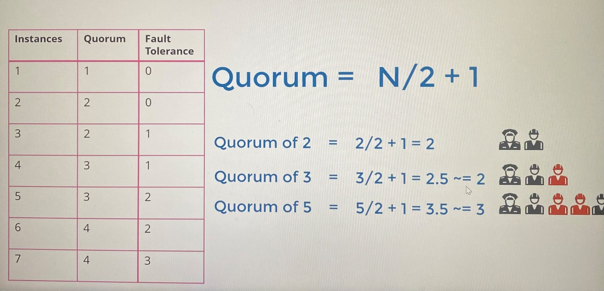

 

\*\*It is recommended to select an odd number when deciding on the
number of master node such as 3, 5, 7 and so on.

 

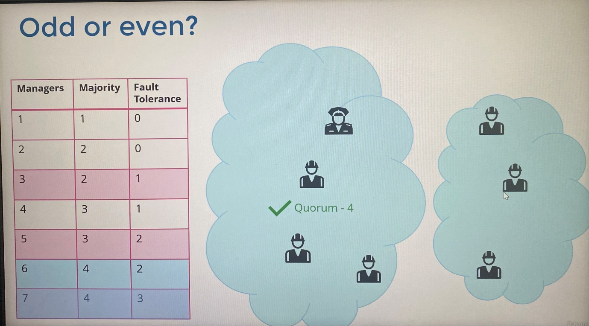

 

*Why not even number of nodes*

 

Assume you have six node cluster where quorum is 4 and fault tolerance
is 2. It fails and causes the network to partition due to a disruption
in the network.

 

If the network got partition in a different way, resulting in nodes
being distributed equally between two groups where neither of groups has
four managers as quorum for the quorum for the cluster to stay alive is
four, so it results in a failed cluster.

 

So with even number of nodes, there is possibility of the cluster
failing during a network segmentation.

 

*Why odd number of nodes*

 

Assume you have seven node cluster, we have four on one segmented
network and three on the other after the network segmentation.

 

And so our cluster still lives on the group with four managers, as it
meets the quorum of four. No matter how the network segments, there are
better chances for your cluster to stay alive with odd number of nodes.

 

So an odd number of nodes is preferred over even number.

 

\*\*Unless you require higher number of fault tolerance, odd number of
nodes in the cluster beyond 5 nodes is not necessary.

 

To install ETCD on a server,

 

- Download the latest supported binary and extract it

 

wget -q - -https-only \\

“<https://github.com/etcd-io/etcd/releases/download/v3.3.11/etcd-v3.3.11-linux-amd64.tar.gz>”

 

tar -xvf etcd-v3.3.11-linux-amd64.tar.gz

 

- Create the required directory structure and copy over the certificate
  files generated for ETCD

 

mv etcd-v3.3.11-linux-amd64.tar.gz/etcd\* /usr/local/bin/

 

mkdir -p /etc/etcd /var/lib/etcd

 

cp ca.pem kubernetes-key.pem kubernetes.pem /etc/etcd/

 

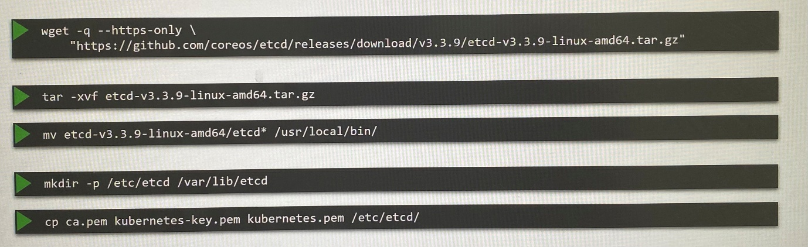

 

- Configure ETCD service

 

The initial cluster option where we pass the peer information that is
how ETCD service knows where its peers are.

 

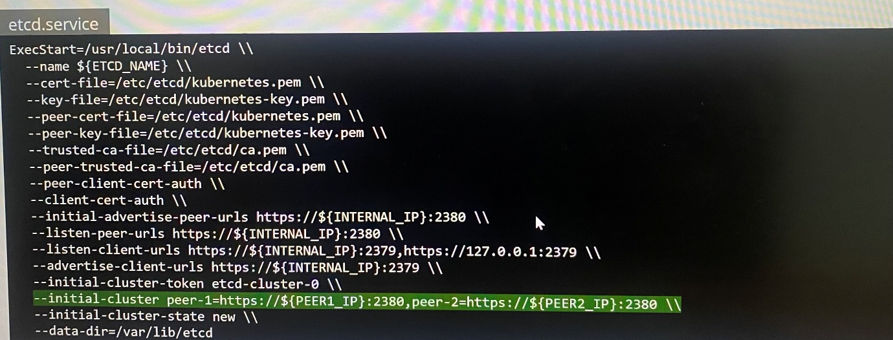

 

 

Once installed and configured, use the ETCDCTL utility to store and
retrieve data. ECDCTL utility has two API version, V2 and V3.

 

export ETCDCTL_API=3 ; set environment variable

 

etcdctl put name john ; put command specify key and value pairs

 

etcdctl get name ; To retrieve data from ETCD datastore for value of
name key

 

etcdctl get / --prefix --keys-only ; To get all keys

 

 

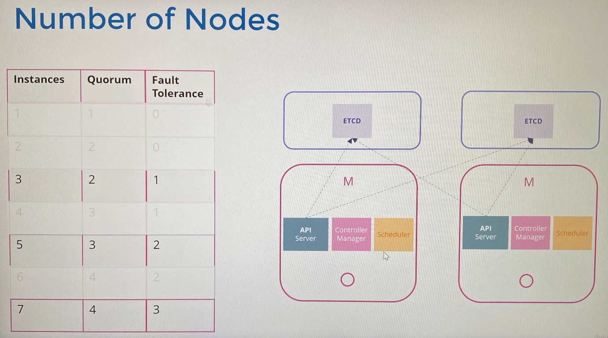

 

It is better to have 3 master node in the cluster consider HA
functionality in ETCD. However, we go with 2 master node with stacked
topology and 2 worker node considering the capacity of the laptop in our
design.

 

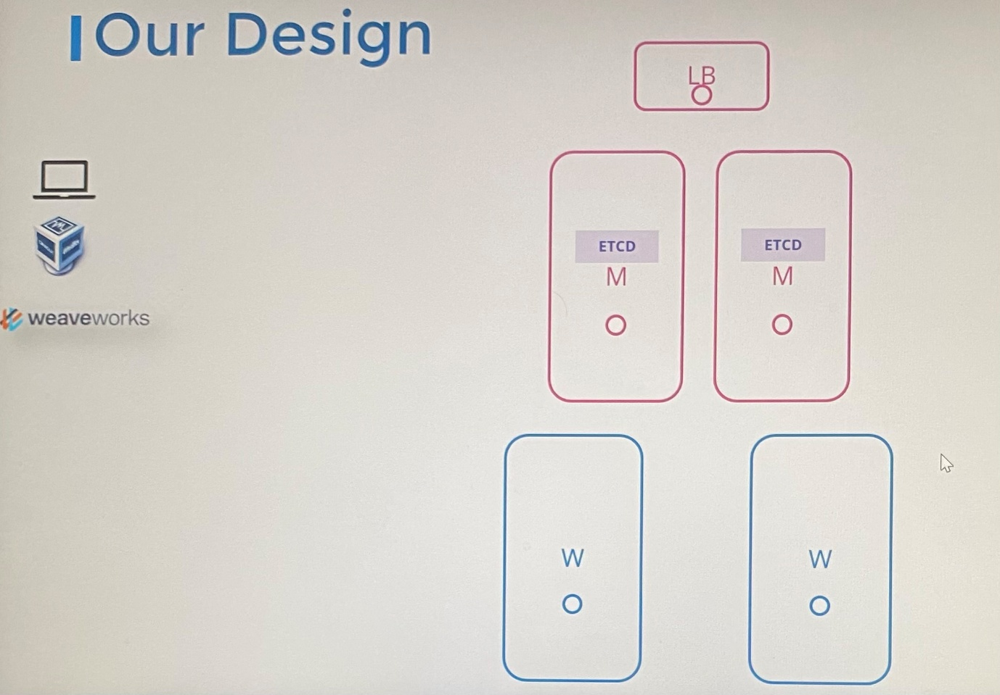

 

 

 

**Important Update: Kubernetes the Hard Way**

 

Installing Kubernetes the hard way can help you gain a better
understanding of putting together the different components manually.

 

An optional series on this is available at our youtube channel here:

 

<https://www.youtube.com/watch?v=uUupRagM7m0&list=PL2We04F3Y_41jYdadX55fdJplDvgNGENo>

 

The GIT Repo for this tutorial can be found here:
<https://github.com/mmumshad/kubernetes-the-hard-way>

 

 

**Install "Kubernetes the Kubeadm way"**

 

**Introduction to Deployment with Kubeadm**

 

Installing all of Kubernetes components individually across different
nodes and modifying all of the necessary configuration files to make
sure all the components point to each other and setting up certificates
to make it work is a tedious task.

 

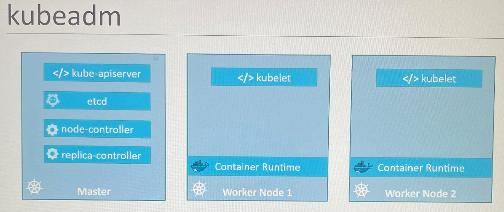

 

The kubeadm tool helps us by taking care of all of these tasks.

 

1.  Provision multiple VMs. Designate one VM as master and rest as
    worker nodes

2.  Install a container runtime 'containerd' on the all nodes

3.  Install the kubeadm tool on all the nodes where Kubeadm tool helps
    bootstrap by installing all the necessary components on the right
    nodes in right order

4.  Initialize the master nodes where all necessary components are
    installed and configured on master node. Once master node has been
    initialized, you must ensure network prerequisites are met prior to
    joining the worker nodes to the cluster

5.  Set up POD network between the master and worker nodes by using
    special networking solution

6.  Join the worker nodes with master node

 

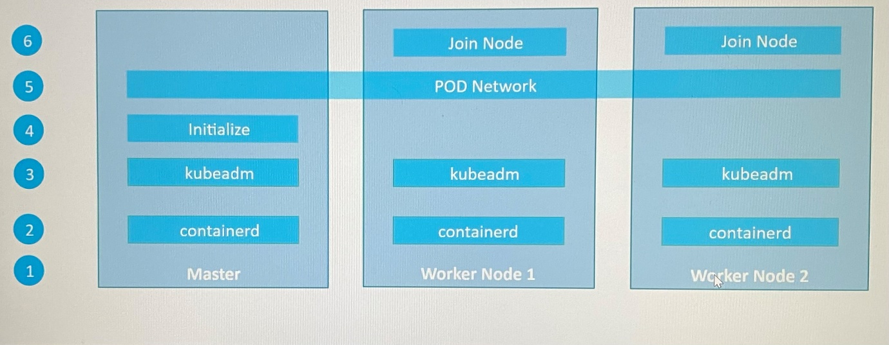

 

 

***Resources***

 

The vagrant file used in the next video is available here:

 

<https://github.com/kodekloudhub/certified-kubernetes-administrator-course>

 

Here's the link to the documentation:

 

<https://kubernetes.io/docs/setup/production-environment/tools/kubeadm/install-kubeadm/>

 

 

**Deploy with Kubeadm - Provision VMs with Vagrant**

 

- Install Git, Oracle Virtualbox and Vagrant on the machine

- Clone the repository to the machine
  <https://github.com/kodekloudhub/certified-kubernetes-administrator-course>

- Navigate to directory that has Vagrant file

- Check the Vagrant file

- Run following command

 

vagrant status ; check VM status

 

vagrant up ; provision VMs for Kubeadm deployment or power up the VMs

vagrant ssh controlplane ; connect to VM

 

vagrant halt ; gracefully shutdown the VMs
