**Helm Basics**

 

**What is Helm**

 

We humans tend to struggle with complexity at managing complex
infrastructure. A typical app is usually made up of a collection of
objects that need to interconnect to make everything work such as

 

a deployment to run Web or MySQL database servers,

a persistent volume to store the database,

a persistent volume claim,

a service to expose the web server running in a pod to the internet,

a secret to store credentials like admin passwords and other things,

and more stuff line periodic backups , jobs and so on

 

We need separate YAML file for every object and run kubectl apply
command for the each object is tedious task.

 

Assume that you need more storage by editing PV and PVC, upgrade some
components in the app or delete the app with all objects later.

 

 

These YAML files should be somewhat organized when you need to make
changes and troubleshoot an issue.

 

Kubernetes doesn't really care about our app as a whole. All it knows is
that we declared various objects. But Helm changes this paradigm.

 

Helm is built to ground up to manage all Kubernetes objects as a package
manager and also as release manager to help upgrade or rollback
applications. Those objects as part of a big package as a group.
Whenever we need to perform an action, we don't tell Helm the objects
that it should touch, we tell it what package we want to act on
regardless number of objects in the package like our WordPress app
package.

 

\$ helm install wordpress ; install entire app

 

We can customize the settings we want for the app or package by
specifying desired values at installed time.

 

Instead of having to edit multiple values in the multiple YAML files, we
have a single location where we can declare every custom setting such as
size of PV, name of app, admin password of database in a file like
values.yaml

 

\$ helm upgrade wordpress ; upgrade the application as Helm knows what
objects need to change

 

\$ helm rollback wordpress ; roll back to previous revision as Helm
tracks the all the changes made to the app files

 

\$ helm uninstall wordpress ; uninstall the apps, Helm knows what to
remove as it tracks the all the change

 

The most important thing is that Helm lets us treat our Kubernetes apps
as apps instead of just a collection of objects. Thus, Helm takes a huge
burden off our shoulders as we don't have to micromanage each Kubernetes
object anymore.

 

 

**Installation and configuration**

 

[Helm \| Quickstart Guide](https://helm.sh/docs/intro/quickstart/)

 

Before installing Helm,

 

-you must first have a functional Kubernetes cluster

-kubectl installed and configured on your local computer with the right
login details set up the kubeconfig file to play with the Kubernetes
cluster.

 

Helm can be installed on Linux, Windows or MacOS systems.

 

For Linux,

 

\$ sudo snap install helm --classic ; install Helm with system with snap

 

Use the classic option to install a more relaxed sandbox that gives the
app a bit more access to the whole system rather than strictly isolating
it to its separate environment. In this way, Helm can easily access the
kubeconfig file in your home directory, so it knows how to connect to
our Kubernetes cluster.

 

For the APT based system such as Debian and Ubuntu, follow the
instructions to add key and sources list before installing Helm.

 

\$ curl <https://baltocdn.com/helm/signing.asc> \| sudo apt-key add -

sudo apt-get install apt-transport-https --yes

echo "deb <https://baltocdn.com/helm/stable/debian/> all main" \| sudo
tee /etc/apt/sources.list.d/helm-stable.li

sudo apt-get update

sudo apt-get install helm

 

\$ pkg install helm ; run package install

 

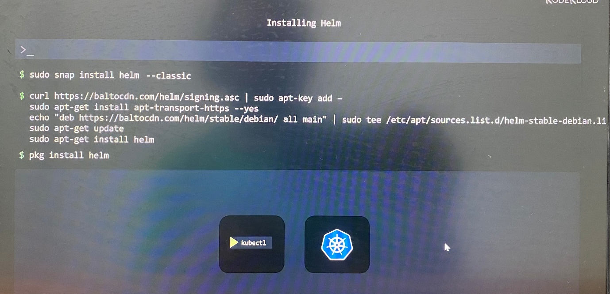

 

***From Script***

 

Helm now has an installer script that will automatically grab the latest
version of Helm and install it locally.

 

[Helm \| Installing
Helm](https://helm.sh/docs/intro/install/#from-script)

 

You can fetch that script, and then execute it locally. It's well
documented so that you can read through it and understand what it is
doing before you run it.

 

\$ curl -fsSL -o get_helm.sh
<https://raw.githubusercontent.com/helm/helm/main/scripts/get-helm-3>

\$ chmod 700 get_helm.sh

\$ ./get_helm.sh

 

controlplane ~ ➜ helm version ; to check the helm version.

version.BuildInfo{Version:"v3.17.0",
GitCommit:"301108edc7ac2a8ba79e4ebf5701b0b6ce6a31e4",
GitTreeState:"clean", GoVersion:"go1.23.4"}

 

 

 

helm --help ; command options

 

\$HELM_DEBUG \| indicate whether or not Helm is running in Debug mode

 

helm get --help

 

Available Commands:

all download all information for a named release

hooks download all hooks for a named release

manifest download the manifest for a named release

metadata This command fetches metadata for a given release

notes download the notes for a named release

values download the values file for a named release

 

 

**Helm2 vs Helm3**

 

-Helm has CLI client installed on your local PC to perform Helm-specific
actions

 

| **Feature**                 | **Helm2** | **Helm 3** |
|-----------------------------|-----------|------------|
| Tiller                      | Have      | Not have   |
| 3-Way Strategic Merge Patch | Not have  | Have       |

 

**Helm 2**

 

-Helm2 has no features Role Based Access Control, Custom Resource
Definitions. To allow Helm to do this, an extra component called Tiller
had to be installed on the Kubernetes cluster

-Helm client communicated with Tiller when it performs Helm specific
operation

-Tiller was the middlemen that communicates with Kubernetes and proceed
to take actions. This way Tiller adds complexity and makes some security
concerns.

-By default, Tiller had the privileges to do anything that it wanted.
This was bad since it allowed any user with Tiller access to do whatever
they wanted in the cluster.

-With RBAC, CRD appears on Kubernetes cluster, the need for Tiller
decreased. Then Tiller was entirely removed in Helm3

 

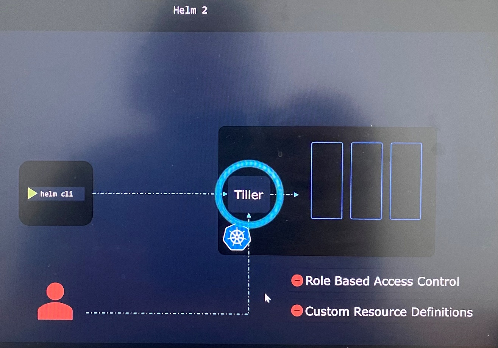

 

 

-Helm has snapshot feature that is exact stage of Kubernetes package at
the moment in time

-For each changes make on the cluster for example you upgrade to newer
chart to upgrade your app is referred as revision and it arrives to next
revision that can be considered as snapshot.

 

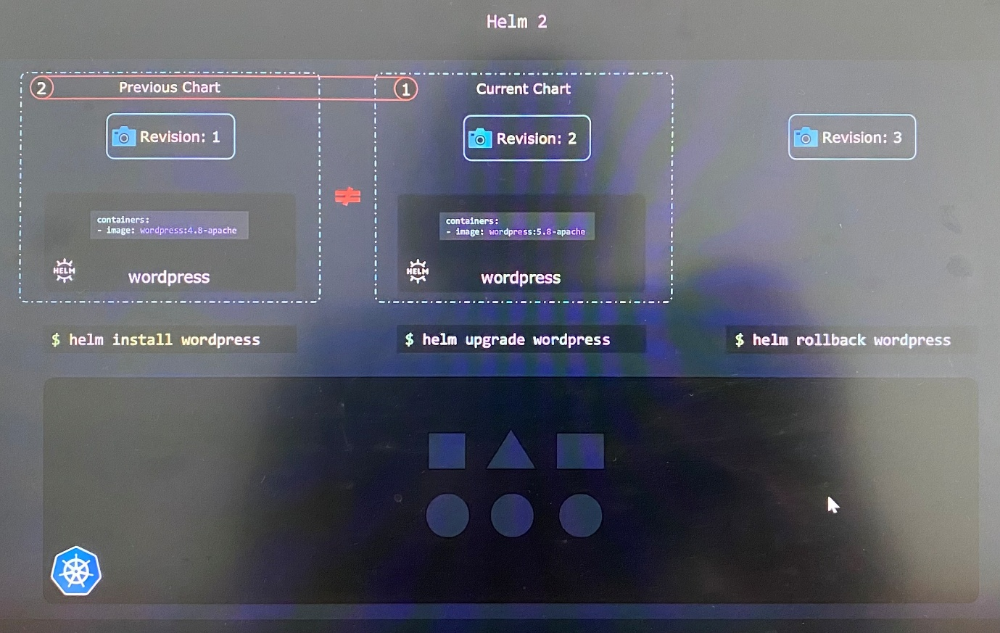

-When a rollback command is issued, Helm compares the current chart
against previous chart and identifies the different. Then it applied the
previous chart based on revision.

 

 

**Helm 3**

 

-Having features Role Based Access Control, Custom Resource Definitions,
Helm 3 integrates Kubernetes cluster by removing Tiller that sit between
Helm and the cluster.

-With RBAC built from to ground up to fine-tune user permission in
Kubernetes, security is improved.

 

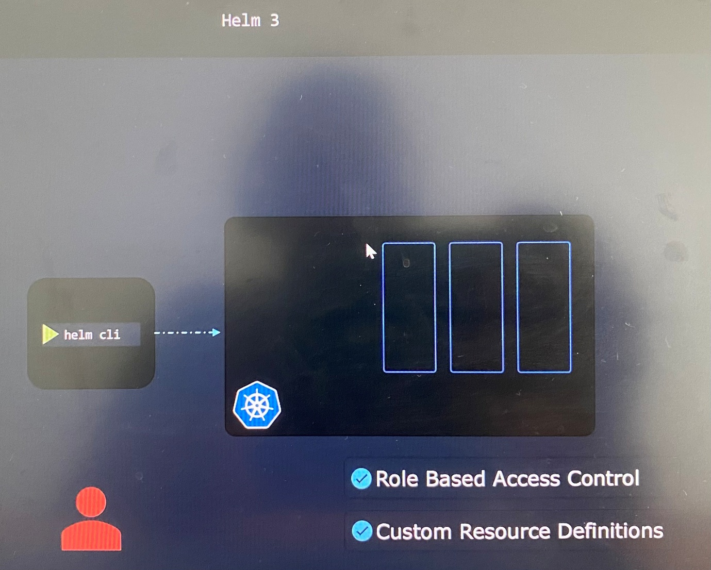

 

-The user makes changes in the cluster has same RBAC permission whatever
tool uses such as kubectl, or with Helm

 

***3-Way Strategic Merge Patch***

 

*Rollback*

 

-If user set image using *kubectl set image* command even after install
app using *helm install* command, the setting image doesn't track with
revision number by ***Helm2***. So if user perform helm rollback
command, it doesn't detect any change in Helm chart and does not roll
back any changes to the deployment. The manual change that user made is
still active.

 

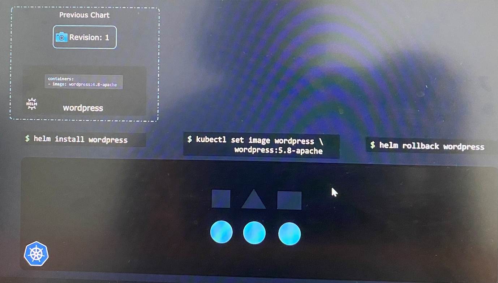

 

 

-In ***Helm3*** is intelligent to compare the chart that currently in
use, if we had created a revision that is, which we didn't. The chat we
want to revert to, and also live state, how Kubernetes objects currently
look like their declaration in the YAML form. This is where 3-Way
Strategic Merge Patch comes from.

-So if user perform helm rollback command, Helm3 makes necessary changes
to come back to original state.

 

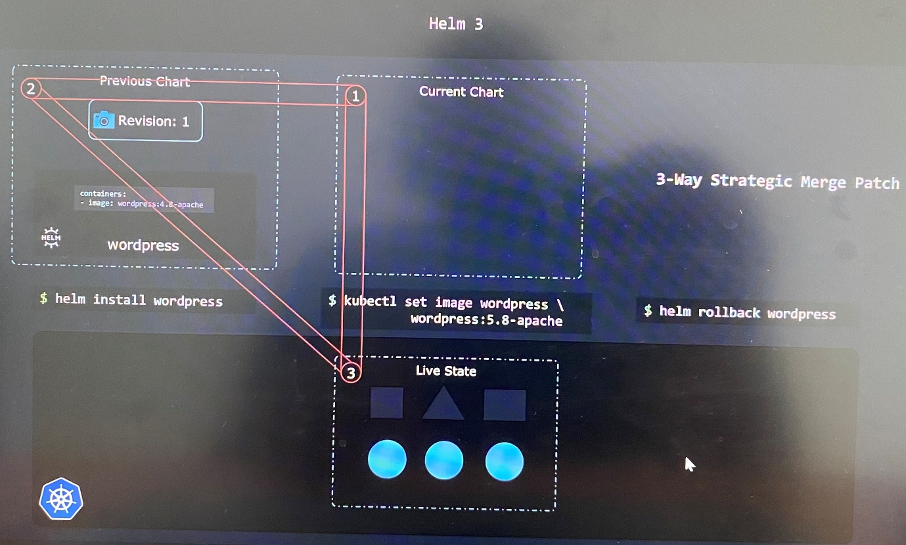

 

 

*Upgrade*

 

For example, you install a chart, then you make some changes to some of
the Kubernetes objects installed. It all works nicely until you perform
an upgrade.

 

Helm 2 looks at the old chart and then the new chart that you want to
upgrade to, and all your changes will be lost since they don't exist in
the old chart or the new chart.

 

But Helm 3, as mentioned, looks at the charts and also at the live
state, and it notices that you added some stuff of your own. So it
performs the upgrade while preserving the anything that you might have
added.

 

 

**Helm Components**

 

***Helm CLI utility*** - to perform Helm actions such as installing a
chart, upgrade, rollback

 

***Helm Charts*** - A collection of files that contain all the
instructions that Helm needs to know to be able to create the collection
of objects need in Kubernetes cluster.

 

***Release*** - A release is a single installation of an application
using a Helm chart. Helm creates a release when Helm chart is applied to
the cluster.

 

***Revision*** - Release has multiple revisions. Each revision is like
snapshot of the application. Every time a change is made on the
application such as upgrade the image, change of replicas or object, new
revision is created.

 

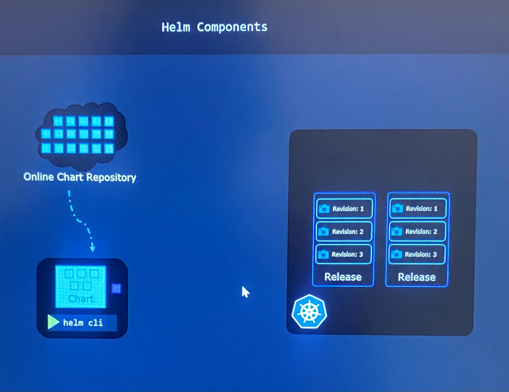

 

***Helm charts***

 

-You can easily download publicly available Helm chats for various
application from public repository and deploy applications on cluster.

-After the deploying the application, Helm needs a place to save
metadata such as the releases that it installed, the charts used,
revision states

\- Helm does the smart thing and saves this metadata directly in the
Kubernetes cluster as Kubernetes secrets instead save them in local
computer so that another user would not work with those releases through
Helm

-As long as the Kubernetes cluster survives, everyone in the team can
access the metadata and make changes

 

Assume that you create an application through deployment and expose it
through service.

 

-Image name and number of replicas are specified in a different form
using special file **values.yaml** which is called ***templating***.

 

 

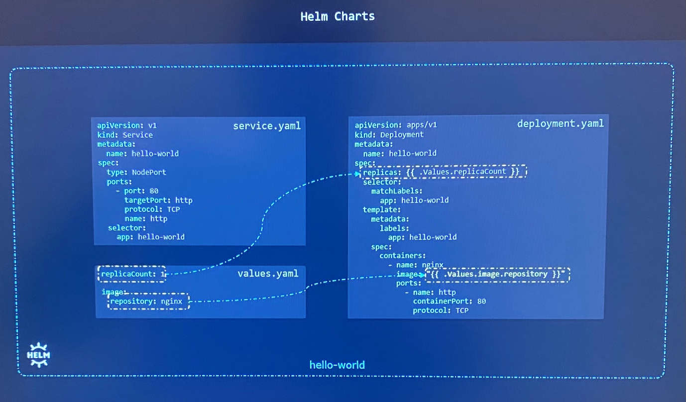

 

-The values.yaml file is where the configurable values are stored that
pass parameters to Helm chart

 

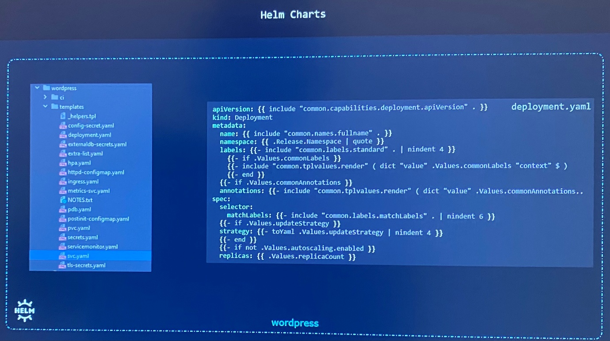

 

***Helm Releases***

 

\# helm install \[release-name\] \[chart-name\]

 

\$ helm install my-site bitnami/wordpress ; install bitnami/wordpress
Helm chart with release named my-site

 

\$ helm install bitnami/wordpress ; install bitnami/wordpress Helm chart
without release name

 

-Why we specify release name when apply Helm chart to a cluster ? To
have releases based on charts is where we can install multiple releases
based on the same chart. The releases can be tracked separately and
changed independently as different entities.

 

\$ helm install my-SECOND-site bitnami/wordpress ; install
bitnami/wordpress Helm chart with different release name

 

Having multiple releases with same chart is useful to maintain
production site while having development site that internal developers
can experiment and add new features without breaking production site.

 

***Helm Repositories***

 

-There are thousands of charts readily available at different Helm
repositories

-Helm repositories hosting charts are **Appscode, Community Operators,
TrueCharts, Bitnami** etc

-All of these repositories have listed their charts in a single location
known as the **Helm Hub** or **Artifact Hub(artifacthub.io).** So you
don't have to go these repositories and search for charts

-These Helm charts are published by actual developers of that projects

 

**Helm Charts**

 

-Helm is automation tool that will go through all the required steps to
achieve its job with the help of charts

-Charts are bunch text file that are named in a specific way with
well-defined purpose

 

values.yaml - find parameters and configuration options that can pass to
the chart

Chart.yaml - This contains information about chart itself such as API
version, app version, name of the chart, a description, type of chart

 

A Chart is a Helm package. It contains all of the resource definitions
necessary to run an application, tool, or service inside of a Kubernetes
cluster.

 

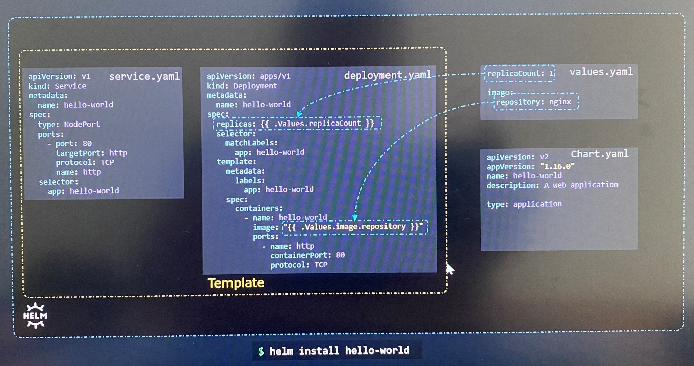

 

-Helm3 comes with apiVersion, type, dependencies fields

 

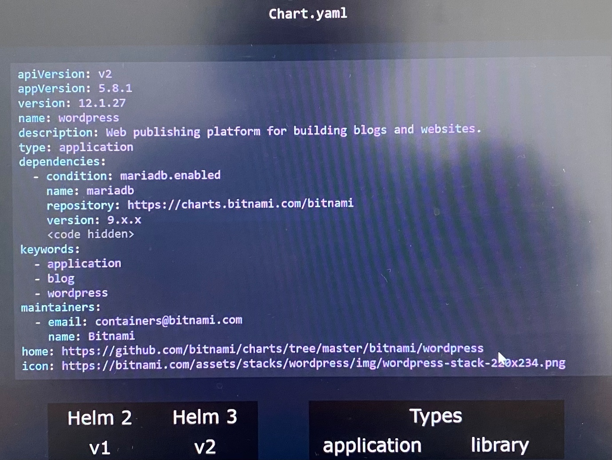

 

***apiVersion***

 

-If you build a chart for Helm2, the apiVersion must be v1. The chart
built for Helm3, the apiVersion must be v2.

-If you build a chart with the API version set to V2, but use it on Helm
2, then Helm 2 will not even consider this field, and will simply ignore
any additional fields

-If you look at a chart that does not have apiVersion value set, the
chart is built for Helm 2

 

***appVersion***

 

-Refers the version of the application that inside the chart as example
version of WordPress that this chart will deploy.

 

***Version***

 

-Every chart must have its own version that independent of the version
of the app

-This helps to track changes to the chart itself

 

***name***

 

-name of the chart

 

***Type***

 

-There are two types of application, application and library

-The default type is application, which is the charts that we can create
for deploying applications

-library is the type of chart that provides utilities that help in
building charts.

 

***dependencies***

 

-If the application is multi-tier application that has dependencies with
database

-Specify the Helm charts for database into dependencies section. This
way we don't have to merge the manifest files of database into this
particular chart.

 

***keywords***

 

-List of keywords associated with this project that can be helpful when
searching for the chart in a public chart repository

 

***maintainers***

 

-information about the maintainers

 

***home -*** URL of the homepage of the projects

***icon -*** URL to an icon

 

***Helm Chart Structure***

 

Template directory

 

-It has template files such as values.yaml, Chart.yaml

-LICENSE file that has the chart information

-README.md file that has information about the chart in a human readable
form

 

Charts directory

 

-Other charts that this chart is dependent upon

 

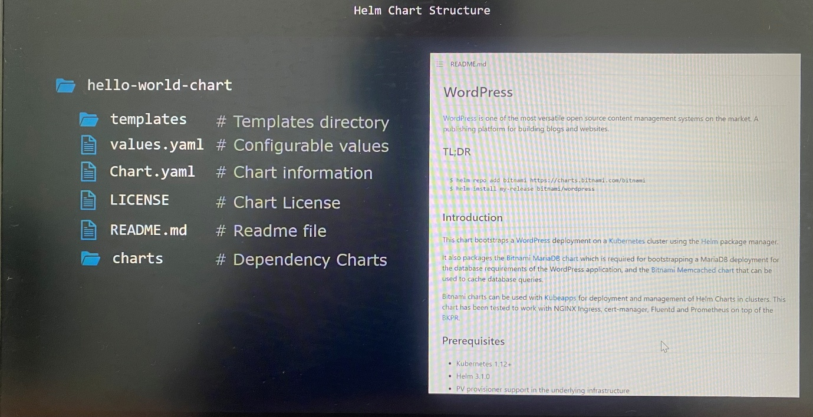

 

**Working with Helm**

 

-Run the helm command to invoke the Helm command line interface

 

\$ helm --help ; list helpful information

 

 

\$ helm repo --help ; list repository related actions

 

\$ helm repo update --help ; list subcommands of repository update

 

-all the charts are stored in the online chart repository at
artifacthub.io.

-To ensure we get a high quality chart, try to find charts that has the
official or a verified publisher badge.

-Chart has detailed page with all info, exact commands that use to
install chart, software components this uses

-Charts can search from command line itself.

 

\$ helm search wordpress ; provide available command to search charts
from either hub or repo. You must refer where to search charts from

 

\$ helm search hub wordpress ; search wordpress charts from
artifacthub.io. This command list available chats in artifacthub.io

 

\$ helm search repo wordpress ; search wordpress charts from specific
repository

 

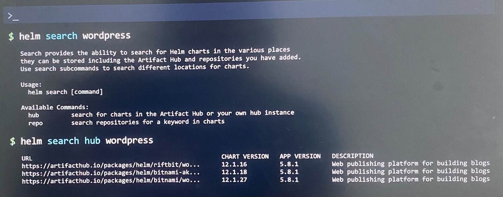

 

***Deploying Wordpress***

 

\$ helm repo add bitnami <https://charts.bitnami.com/bitnami> ; add
bitnami chart repository to local Helm setup so that helm install
commands finds where the charts must be installed from

 

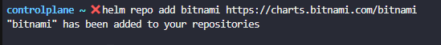

 

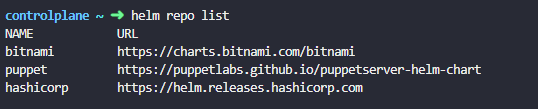

 

\$ helm install my-release bitnami/wordpress ; install the chart from
local setup

 

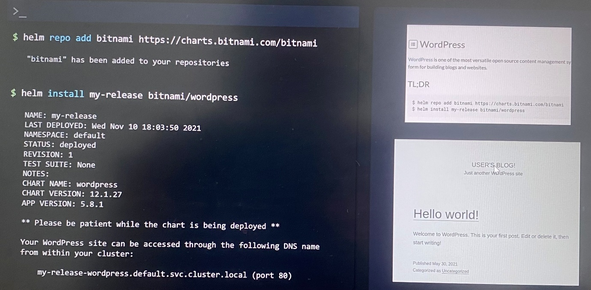

 

 

 

 

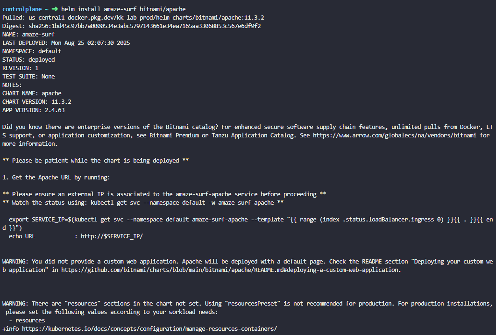

 

 

 

***Helm Releases***

 

\$ helm list ; list all existing releases. This command is useful to
identify what releases hasn't been updated in a long time

 

 

\$ helm uninstall my-release ; remove all Kubernetes object added by
release

 

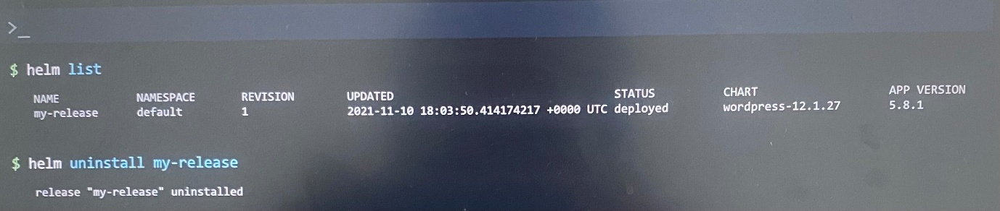

 

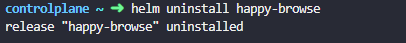

 

 

***Helm Repo***

 

\$ helm repo ; use to add, list, remove and update Helm repositories

 

\$ helm repo list ; list chart repositories

 

\$ helm repo update ; pull updated repositories from online repository
to local computer

 

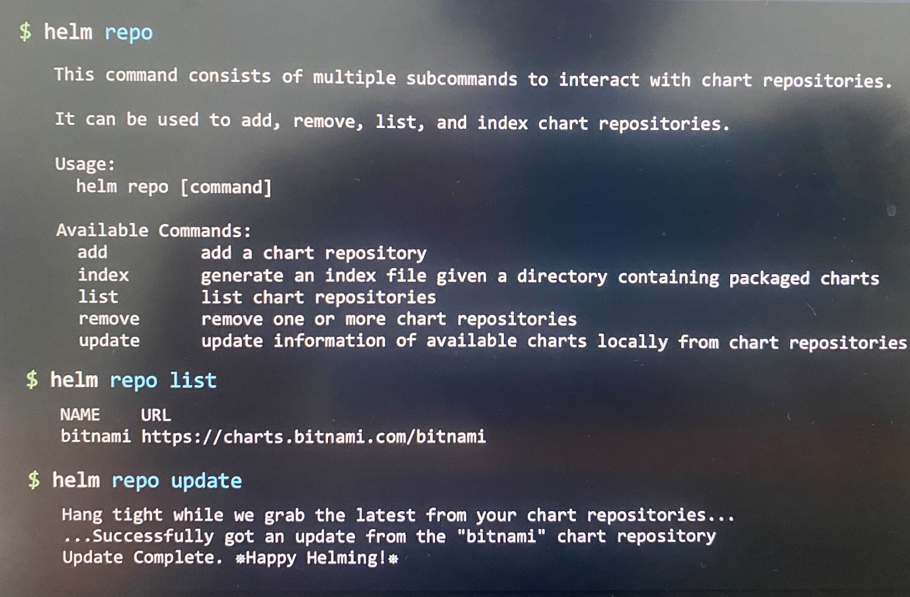

 

 

 

**Customizing chart parameters**

 

We can customize chart configurable parameters by overriding its default
values while installing a chart.

 

-helm install command pulls the chart and deploys the application, there
is no window for us to modify the value in values.yaml file.

 

***Custom Parameters in Command Line --set***

 

-One way is modify some of the default values is by passing in a command
line parameter along with the helm install command using the set option
to values.yaml file by overriding the existing values in the file

-set option can be used multiple times to pass multiple parameters to
command line to customize the deployment

 

 

\$ helm install --set wordpressBlogName="Helm Tutorials" my-release
bitnami/wordpress

--set wordpressEmail="john@example.com"

 

***Custom Parameters in Command Line --values***

 

-If there are too many of values, then another option to move these
values to custom **custom-values.yaml** file

-Since this YAML file replace the equal sign with the colon, then
specify custom-values.yaml file with values option when you run helm
install command. It picks the values from custom-values.yaml overriding
values in default values.yaml file.

 

\$ helm install --values custom-values.yaml my-release bitnami/wordpress

 

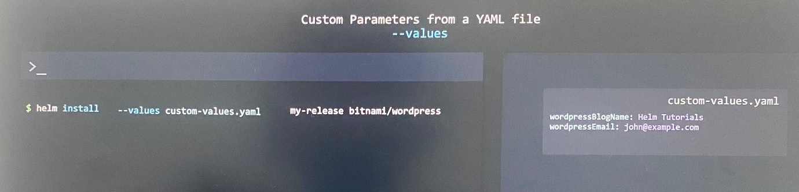

 

***Helm pull***

 

-helm install command performs both pull the charts from online
repository and apply the charts in Kubernetes cluster

-If we want to modify the built-in values.yaml file itself instead of
using the command line option --set or the custom values file with
--values, break the helm install command into two commands.

 

\$ helm pull bitnami/wordpress ; pull the chart in an archived or
compressed form

 

\$ helm pull --untar bitnami/wordpress ; unarchive or uncompress the
chart and find all the files parts of the chart in the new directory
created named wordpress

 

Then you can edit default values in values.yaml file in text editor and
run helm install command with local wordpress directory.

 

\$ helm install my-release ./wordpress ; run hem install command
specifying the path of local wordpress directory

 

 

**Lifecycle management with Helm**

 

We can manage multiple releases of same chart in single kubernetes
cluster independently.

 

***Helm Upgrade***

 

\$ helm install nginx-release bitnami/nginx --version 7.1.0 ; specify
the chart version to use to install chart with a release by creating new
revision

 

 

After installing specific application version, it may come new patch
release for the application that needs the upgrade. For example, the
newer version of Nginx may require a new environment variable to be set,
or new secret to be created, which requires changing configuration
objects and other files, part of the manifest files.

 

We use kubectl get pods and kubectl describe pod \<pod name\> to verify
version of application image running on pods.

 

\$ helm upgrade nginx-release bitnami/nginx

 

When upgrade the release of a helm chart with helm upgrade command,
revision1 is now replaced by revision 2. The revision number displays in
the output of Helm upgrade command.

 

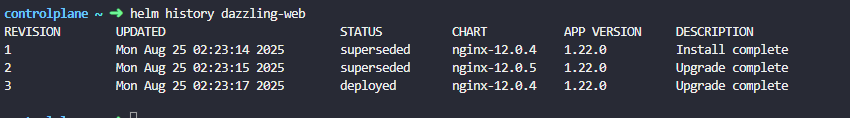

 

 

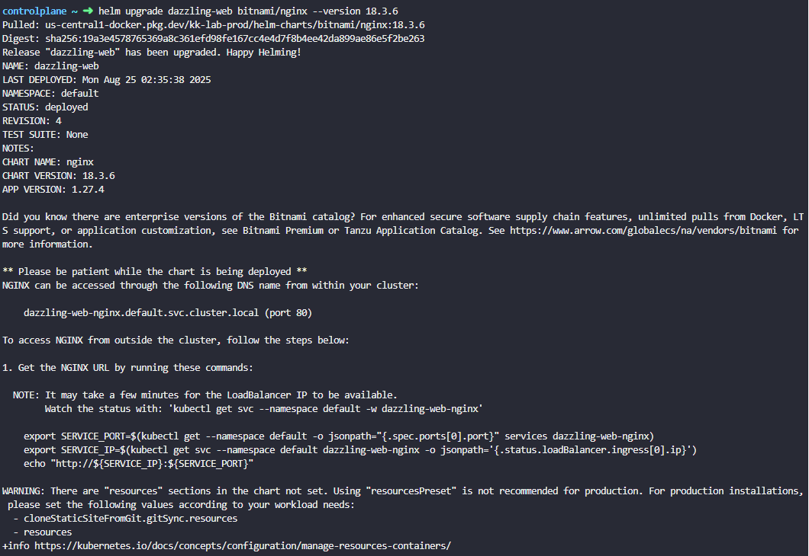

 

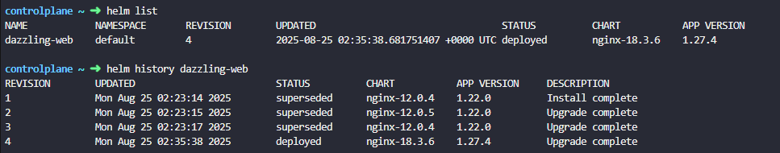

 

A release can exist for months or years, and Helm can manage its
lifecycle in many ways by keeping track of its current state, previous
states, and bring it into future states.

 

\$ helm list ; list the current releases with revision number, chart
version, app version

 

\$ helm history nginx-release ; list all revisions related to the
release that shows chart version, app version and action created for
each revision for the release whether it is upgrade, install or rollback

 

 

 

***Helm Rollback***

 

\$ helm rollback nginx-release 1 ; rollback the release to the state
that was in specified revision number 1 by creating new revision
numbering with revision 3 to the release

 

 

If you want to rollback the chart to previous revision, no need to
specify the revision number. Instead run the following.

 

\$ helm rollback dazzling-web

 

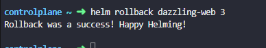

 

 

In this case, Helm cannot upgrade everything without having access to
some administrative passwords. It needs administrative access to the
database and to the WordPress website itself so that it can get
permissions to make necessary changes.

 

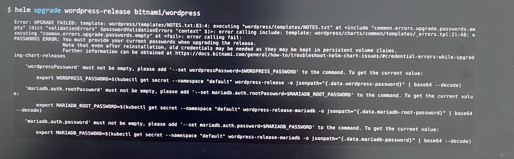

 

 

-All the rollbacks are very similar to a Backup Restore feature. It
doesn't cover file or directory data that may be created by our
applications. Instead, Helm backs up and restores the declarations or
manifest files of Kubernetes objects.

-But the things that use persistent volumes or other forms of persistent
data or something like an external database, the rollback won't backup
or restore that data. So there are options available to take consistent
backups of databases before upgrading charts, or even to roll back or
restore databases. This is done by using ***chart hooks***.

 

Summary:

 

\$ helm search hub wordpress

\$ helm repo add bitnami <https://charts.bitnami.com/bitnami>

\$ helm repo list

\$ helm install nginx-release bitnami/nginx --version 7.1.0

\$ helm list

\$ helm upgrade nginx-release bitnami/nginx --version 13

\$ helm history nginx-release

\$ helm rollback nginx-release \<revision number\>

\$ helm uninstall nginx-release
