# Pre-Requisites - JSON PATH

 

In the upcoming lecture we will explore some advanced commands with
kubectl utility. But that requires JSON PATH. If you are new to JSON
PATH queries get introduced to it first by going through the lectures
and practice tests available here.

 

<https://kodekloud.com/p/json-path-quiz>

 

 

Once you are comfortable head back here:

 

I also have some JSON PATH exercises with Kubernetes Data Objects. Make
sure you go through these:

 

<https://mmumshad.github.io/json-path-quiz/index.html#!/?questions=questionskub1>

 

<https://mmumshad.github.io/json-path-quiz/index.html#!/?questions=questionskub2>

 

 

**Introduction to YAML**

 

-Use to represent the configuration data

\- Human friendly data serialization standard for all programming
language

\- Syntax : strict indentation

\- Store the config file with your code or own git repository ( as IaC)

 

 

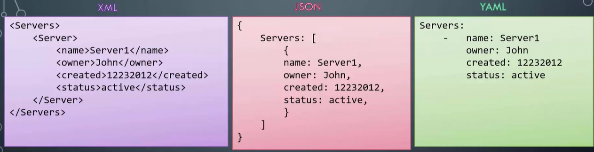

 

- It consists with key value pair

- Need a space right after colon and before the value

- The array lists the elements under it

- Dash(-) indicates an element of an array

- The dictionary is a set of properties grouped together under an item.
  Before each properties of single item must be aligned with equal
  number of spaces.

 

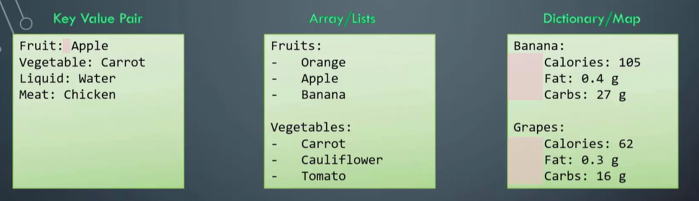

 

- Spaces defines in item should be syntactically aligned to represent
  properties of single item.

 

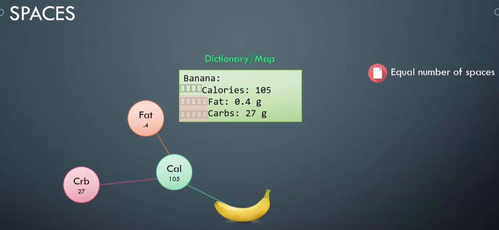

 

- You can have lists containing dictionaries containing lists

 

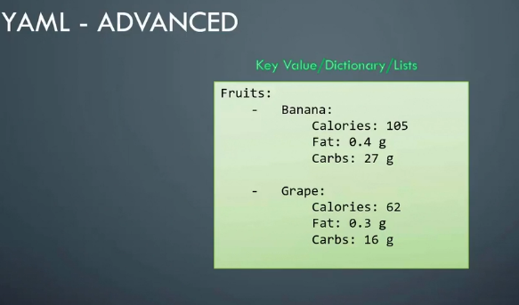

 

 

- Dictionary: To store different information or properties of a single
  object. Properties are defined in key-value format

 

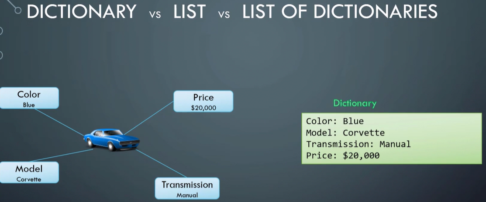

 

- Dictionary In Dictionary

 

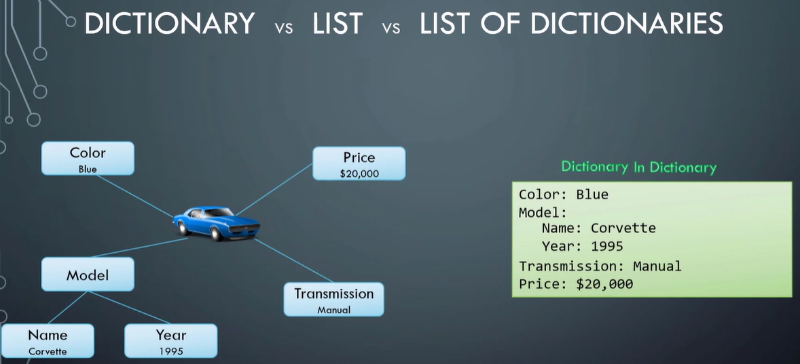

dvbvnhgjy

 

- List: To represent multiple items of the same type of object

 

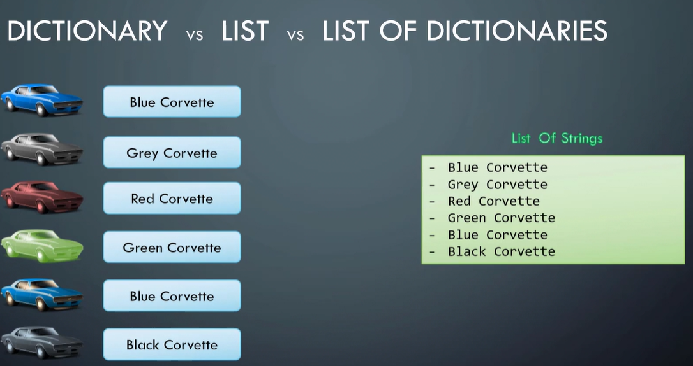

 

- List of dictionaries: Expand each item in the list and replace the
  name with dictionary

 

 

 

- Dictionary is unordered collection, arrays are ordered collection

 

 

- Any line begin with \# is considered as comment

 

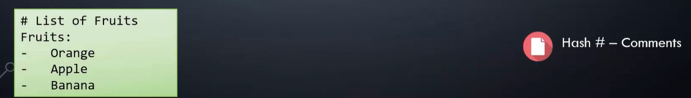

 

 

**Introduction to JSON PATH**

 

***YAML vs JSON***

 

-YAML uses indentation to organize data into lists and dictionaries,
JSON uses braces or curly brackets

 

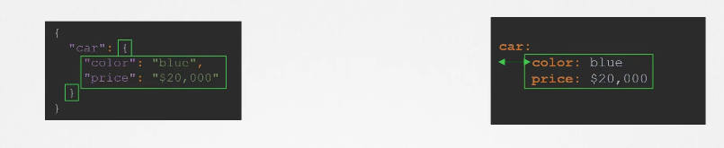

 

-YAML uses dash to denote an item in a list, JSON uses square brackets
to define a list and each item within the list is separated by comma.

 

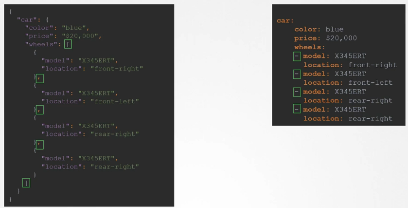

 

-You can easily convert data in YAML to JSON or JSON to YAML using
online converter(https://www.json2yaml.com) or a simple program.

-All programming language have support for reading and writing in either
of JSON or YAML format.

 

***JSON PATH***

 

-JSON path is query language that can help you parse data represented in
a JSON or YAML, like query languages in popular database software SQL.
You apply query and get result which subset of data. For example, if you
have given table of data, run query against it and extract certain
fields or rows

 

*Query with SQL*

 

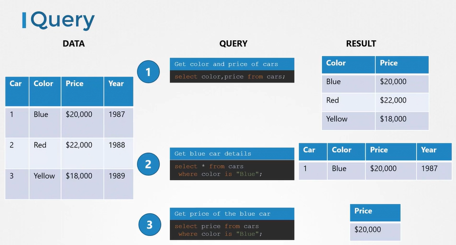

 

 

*Query with JSON PATH*

 

***JSON PATH - Dictionaries***

 

-The dot notation in the query helps you select a particular field
within a dictionary. car.price

 

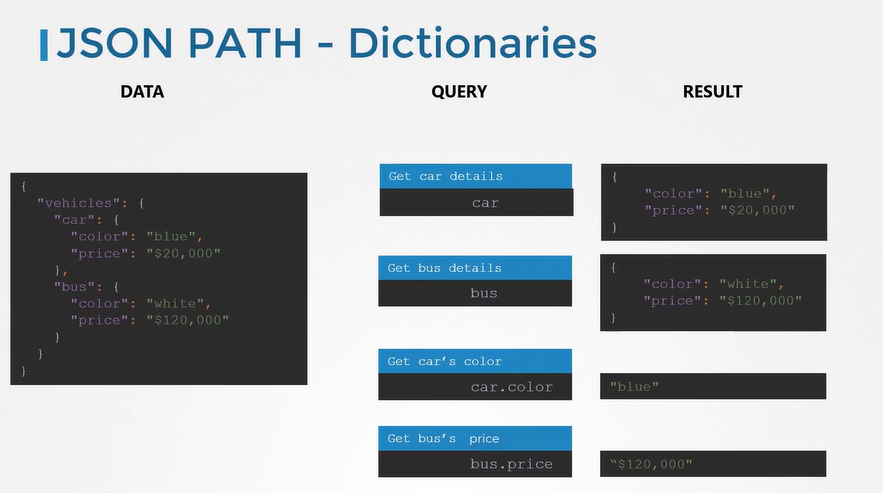

 

-Suppose we encapsulated few child dictionaries into parent dictionary.
Extract properties of dictionaries and dictionaries of dictionaries with
dot notation. Here querying data in this way won't work.

 

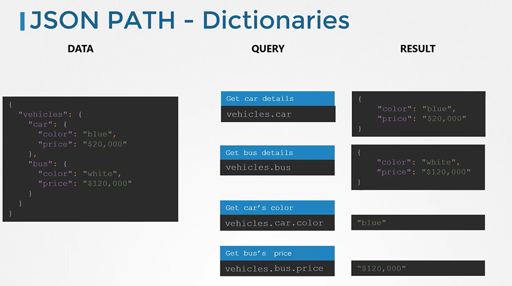

 

Let's remove vehicles as parent dictionary and see car and bus are
properties of parent dictionary. The top-level dictionary has no name is
known as the root element of a JSON document. The root element is
denoted by a dollar \$. A query created for JSON document with a
dictionary at its root start with dollar \$

 

JSON PATH query : \$.car

 

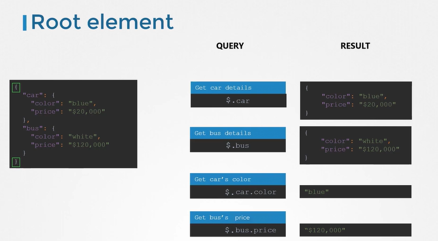

 

If you add vehicles as parent dictionary, query data with root element.

 

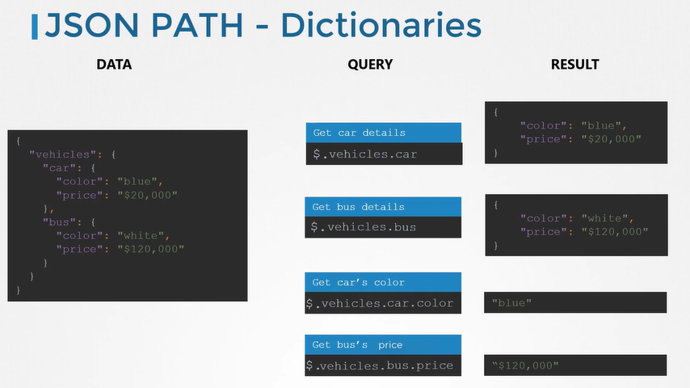

 

Even though the result you see here is what you expect, all results of
JSON path query are encapsulated within an array like within pair of
square bracket.

 

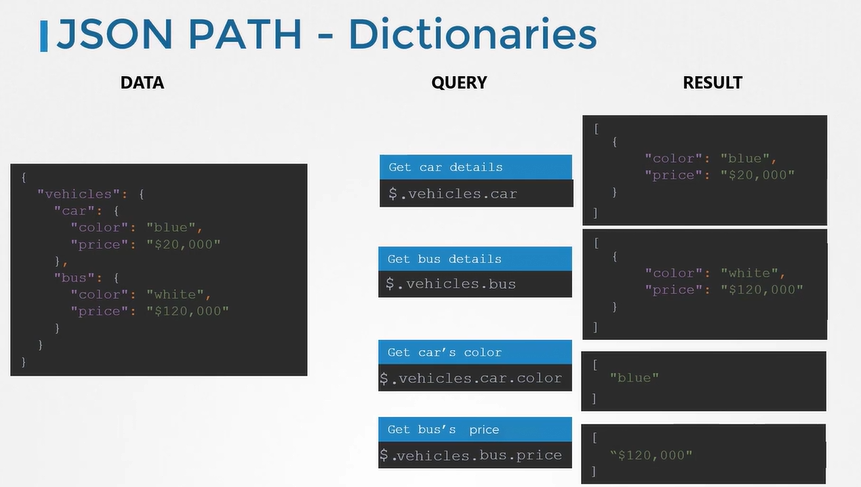

 

 

***JSON PATH - Lists***

 

The list here is names of different vehicles. Query with root element \$
mark. Use square bracket in your query and specify the position of the
item you want inside it. The indexes start at zero. Thus first element
is at zero, second one is at one, the third one is at two, etc.

 

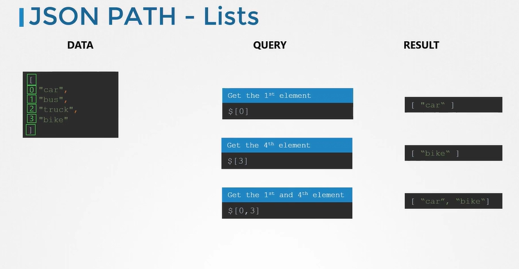

 

alpine-host ~ ➜ cat q13.json \| jpath \$\[0,3\]

\[

"bike"

\]

 

alpine-host ~ ➜ cat q13.json \| jpath '\$\[0,3\]'

\[

"car",

"bike"

\]

 

 

 

***JSON PATH - Dictionary & Lists***

 

To get the model of the 2nd wheel

 

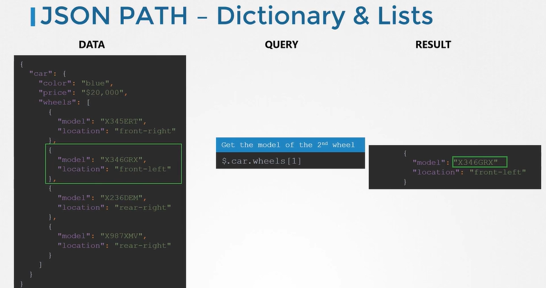

 

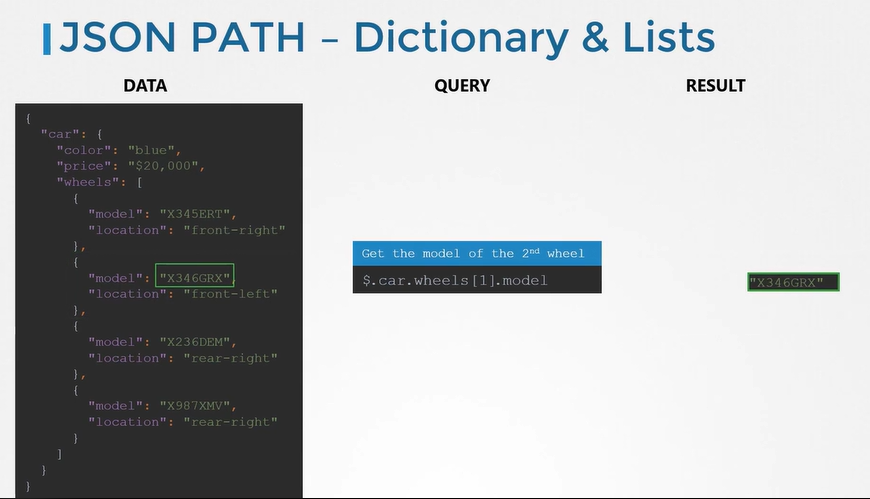

 

 

***JSON PATH - Criteria***

 

Apply criteria or conditions to query. As example, get all numbers
greater than 40.

 

In this case. There could be thousands of numbers within the square
brackets. So check if each item in the array is greater than 40.

 

\$\[ Check if each item in the array \> 40 \]

 

Check if -\> ? ()

 

The "check if " part can be replaced by a question mark, followed by
pair of brackets.

 

\$\[ ? ( each item in the array \> 40 )\]

 

each item in the list -\> @

 

\$\[ ? ( @ \> 40 )\]

 

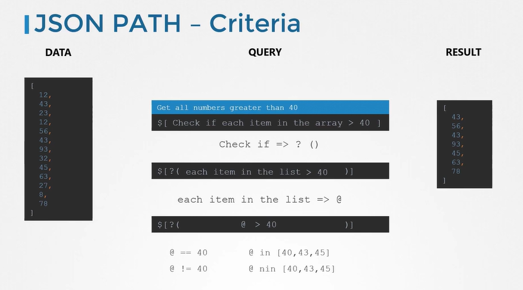

 

Other operators;

 

@ == 40 ; equal to 40 each item in the list

 

@ != 40 ; not equal to 40 each item in the list

 

@ in \[40,43,45\] ; numbers either 40,43,45 from each item in the list

 

@ nin \[40,43,45\] ; numbers are not either 40,43,45 from each item in
the list

 

 

Let see how criteria should define to list of dictionaries.

 

Get the model of rear-light wheel

 

\$.car.wheels\[2\].model

 

We can't rely on hardcoded item in the list. Use the criteria to get
model of rear-light wheel if it is any position in the list.

 

\$.car.wheels\[?(@.location == "rear-light")\].model

 

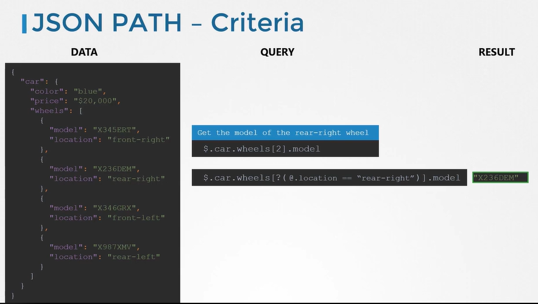

 

References

 

<https://github.com/json-path/JsonPath>

 

Use keyword jpath to query from JSON file.

 

alpine-host ~ ➜ cat q1.json \| jpath \$.property1

\[

"value1"

\]

 

 

*JSON PATH query for list of lists*

 

alpine-host ~ ➜ cat q11.json \| jpath \$.prizes\[5\].laureates\[1\]

\[

{

"id": "914",

"firstname": "Malala",

"surname": "Yousafzai",

"motivation": "\\for their struggle against the suppression of children
and young people and for the right of all children to education\\",

"share": "2"

}

\]

 

 

**JSON PATH - Wildcard**

 

*JSON PATH - Wildcard - Dictionary*

 

To query values of specific property in the dictionary, use star \* for
wildcard meaning all or any.

 

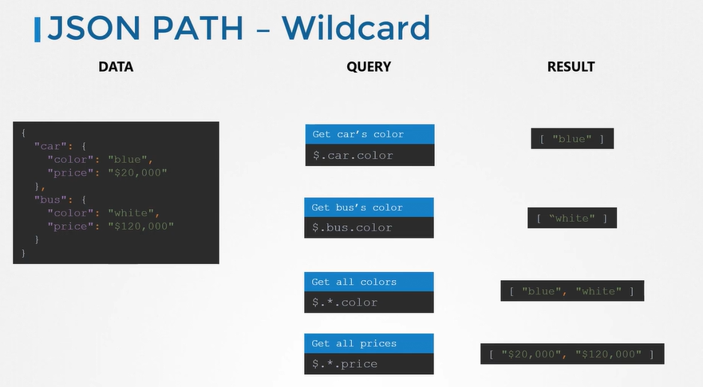

 

 

*JSON PATH - Wildcard - List of Dictionaries*

 

Similarly, use star \* or wildcard meaning all or any to query values of
specific property in the list of dictionaries.

 

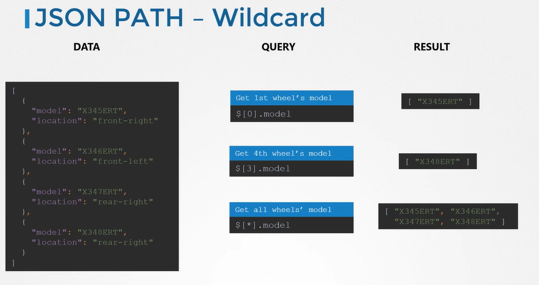

 

alpine-host ~ ✖ cat q4.json \| jpath '\$\[\*\].model'

\[

"KDJ39848T",

"MDJ39485DK",

"KCMDD3435K",

"JJDH34234KK"

\]

 

 

*JSON PATH - Wildcard - List & Dictionaries*

 

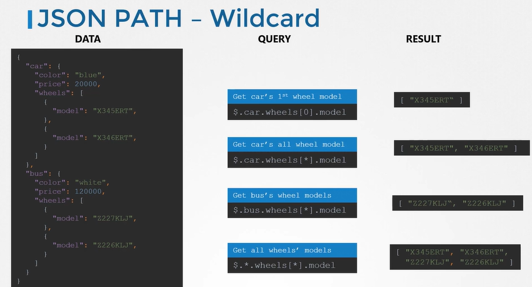

 

 

 

alpine-host ~ ➜ cat q5.json \| jpath \$.car.wheels\[\*\].model

\[

"KDJ39848T",

"MDJ39485DK",

"KCMDD3435K",

"JJDH34234KK"

\]

 

 

alpine-host ~ ➜ cat q8.json \| jpath
\$.prizes.\[\*\].laureates\[\*\].firstname

Error: Parse error on line 1:

\$.prizes.\[\*\].laureates\[\*\].fir

---------^

Expecting 'STAR', 'IDENTIFIER', 'SCRIPT_EXPRESSION', 'INTEGER', 'END',
got '\['

at Parser.parseError
(/usr/local/lib/node_modules/jsonpath-cli/node_modules/jsonpath/generated/parser.js:166:15)

at Parser.parser.yy.parseError
(/usr/local/lib/node_modules/jsonpath-cli/node_modules/jsonpath/lib/parser.js:13:17)

at Parser.parse
(/usr/local/lib/node_modules/jsonpath-cli/node_modules/jsonpath/generated/parser.js:224:22)

at JSONPath.nodes
(/usr/local/lib/node_modules/jsonpath-cli/node_modules/jsonpath/lib/index.js:118:26)

at JSONPath.query
(/usr/local/lib/node_modules/jsonpath-cli/node_modules/jsonpath/lib/index.js:94:22)

at query (/usr/local/lib/node_modules/jsonpath-cli/bin/index.js:16:29)

at process.processTicksAndRejections
(node:internal/process/task_queues:95:5)

 

 

If this error comes, put the expression into single quote
'\<expression\>'

 

alpine-host ~ ➜ cat q8.json \| jpath
'\$.prizes\[\*\].laureates\[\*\].firstname'

\[

"Arthur",

"Gérard",

"Donna",

"Frances H.",

"George P.",

"Sir Gregory P.",

"James P.",

"Tasuku",

"Denis",

"Nadia",

"William D.",

"Paul M.",

"Kailash",

"Malala",

"Rainer",

"Barry C.",

"Kip S.",

"Jacques",

"Joachim",

"Richard",

"Jeffrey C.",

"Michael",

"Michael W."

\]

 

 

**JSON PATH - Lists**

 

Let's look through additional options in lists.

 

If you want to get all names from the first to the fourth element, use
"colon"

 

\$\[0:3\]

 

START:END

 

However, this will not show fourth element itself. If you want to
include fourth element as well, you should say zero to four.

 

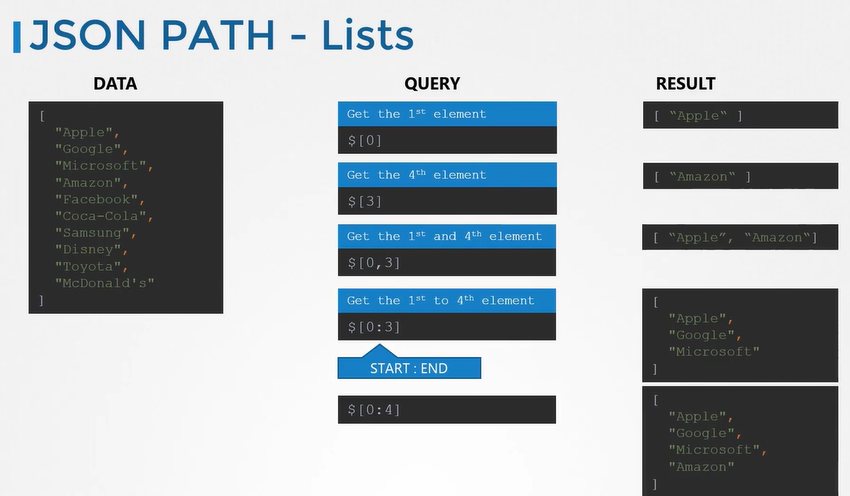

 

If we want to get every other item, use the step option by adding
another colon and specifying the number of hubs to take after each item.
A step value two means increment the counter twice before fetching the
next item.

 

\$\[0:8:2\]

 

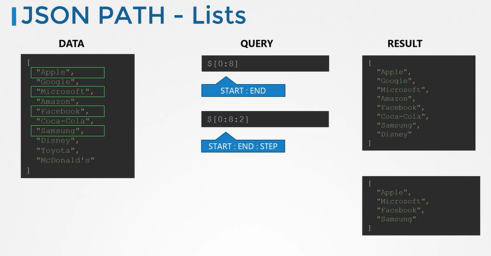

 

If you want query and return the last item in a list when the number of
items in list is larger. Like how you have indexes starting at zero from
first item in a list, you also have indexes start at minus one from the
last item in the list. The last item is always at minus one.

 

\$\[-1\] ; But this does not work in certain implementations

 

\$\[-1:0\] or \$\[-1:\] ; Get the last element

 

\$\[-3:\] ; Get the last 3 elements

 

 

 

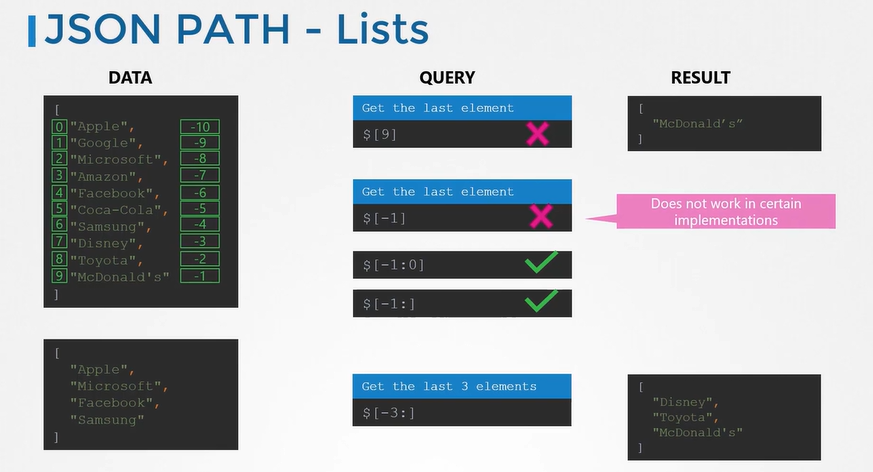

 

 

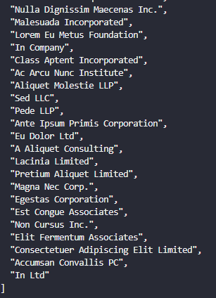

 

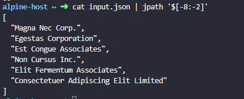

 

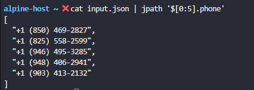

 

 

**JSON PATH Use case - Kubernetes**

 

***Why JSON PATH?***

 

We focus how to use JSON path queries with the kubectl utility.

 

When you are working with production environment for Kubernetes, you
will need to view information about hundreds of nodes and thousands of
pods, deployments, replicasets, services and secrets. You use kubectl
utility to view information about these objects.

 

You will often have requirements to print summary of different states
about different resource, view specific fields of all resources, query
data about resources based on different criteria. Viewing such
information going through thousands of resources is overwhelming task.
This is why kubectl supports JSON PATH option to make filtering data
across large data set using complex criteria.

 

***KubeCtl***

 

Kubectl utility is Kubernetes CLI that use for reading and writing
Kubernetes objects. When you run kubectl command, it interacts with
Kubernetes API through Kube-apiserver.

 

The Kube-apiserver speaks JSON language, so it returns the requested
information in JSON format. The kubectl utility on receiving the
information in JSON fomat converts it into a human-readable format and
prints it out to our screen. During that process, a lot information came
in JSON format is hidden to make the output readable by showing only the
necessary details.

 

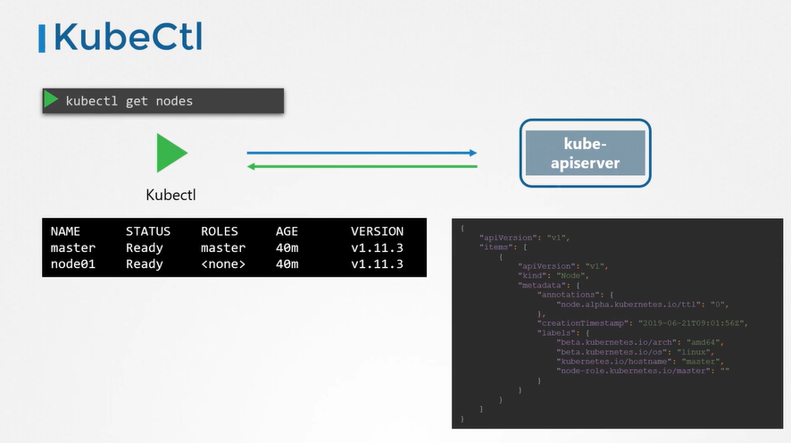

 

If you need additional details, use **-o wide** option with kubectl get
command. But this is still not complete output. For example, the
resource capacity available on nodes, taint set on nodes, conditions on
node, the hardware architecture, container image available on nodes are
lot more details that are not part of this output. But these data can
see by running **kubectl describe** command.

 

***KubeCtl - JSON PATH***

 

What if you want to see the data in a tableau format like a report for
node's CPU count, list of nodes, taint set on nodes, the architecture on
node, list of pods and images they use. None of the built-in commands
can give these in this format. That's where JSON PATH queries can help
to filter and format the output of a command as you like.

 

 

 

 

***How to JSON PATH in KubeCtl?***

 

1.  Identify the kubectl command - What commands give you the required
    information in the raw format such as kubectl get nodes, kubectl get
    pods

2.  Familiarize with JSON output - Inspect its output in JSON format.
    Add the option -o json to the command to print output in a JSON
    format

3.  Form the JSON PATH query - Look output of JSON document and form the
    JSON PATH query that will retrieve the required information. The
    root element '\$' is not mandatory. Kubectl adds it.

 

.items\[0\].spec.containers\[0\].image

 

4.  Use the JSON PATH query with kubectl command - To do that , use the
    **-o=jsonpath=** option and pass the same JSON PATH query. You must
    encapsulate the JSON PATH query within pair of single quotes and
    curly braces.

**kubectl get pods -o=jsonpath=
'{.items\[0\].spec.containers\[0\].image}'**

 

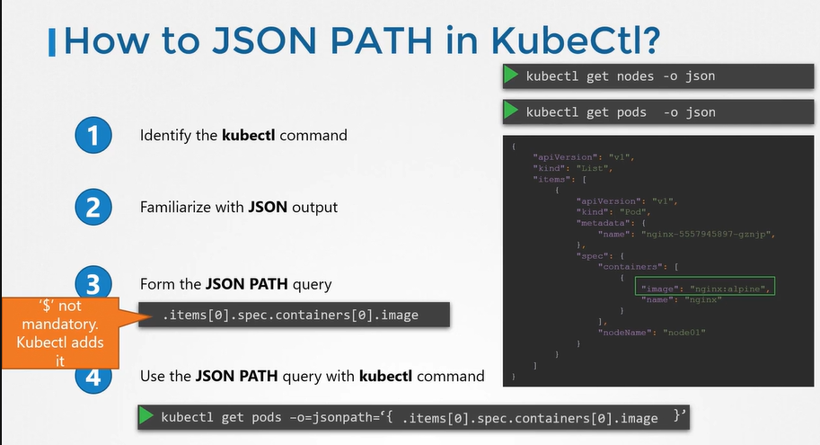

 

 

You may use JSON PATH query evaluator like jsonpath.com to play around
with it until you come up with right JSON path query.

 

When you merge multiple JSON PATH query, use {"\n"} for New line, {"\t"}
for Tab to arrange the output.

 

kubectl get nodes -o=jsonpath='{.items\[\*\].metadata.name} {"\n"}
{.items\[\*\].status.capacity.cpu}'

 

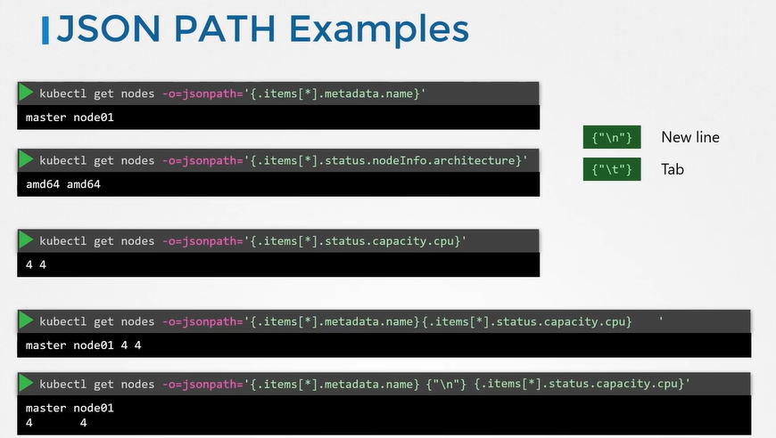

 

 

***Loops -Range***

 

To get node name in one column and CPU counts in other column. This is
where we use loops to iterate through items in a list and print
properties of each item.

 

To specify the for each statement, use the **range** keyword.

 

For each item or a node, print the node name, then insert a tab as a
separator, then print the CPU count, followed by a new line character.
Finally **end** the loop using the end keyword.

 

**kubectl get nodes -o=jsonpath='{range .items\[\*\]} {.metadata.name}
{"\t"} {.status.capacity.cpu} {"\n"} {end}'**

 

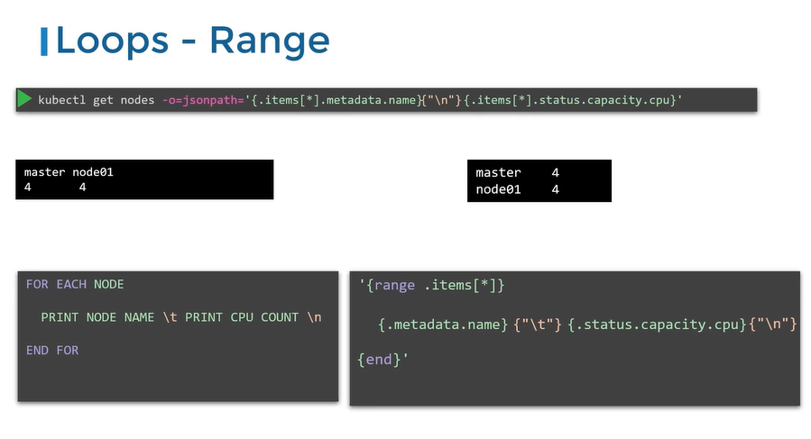

Merge it all in into a single line and pass it as a parameter.

 

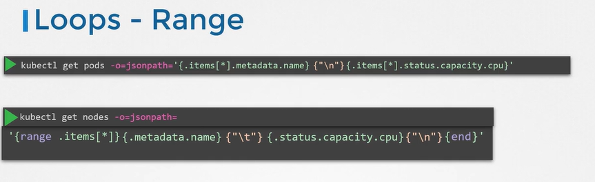

 

 

***JSON PATH for Custom Columns***

 

This is an easier approach when compare to using the loop method. We use
JSON PATH option to print node name and CPU capacities as separate
columns.

 

**kubectl get nodes -o=custom-columns=\<COLUMN NAME\>:\<JSON PATH\>**

 

**kubectl get nodes -o=custom-columns=NODE:.metadata.name
,CPU:.status.capacity.cpu**

 

Note that you must exclude the item section of the query as the
custom-columns assumes the query is for each item in the list. Similarly
you can add additional column and JSON PATH pairs separated by a comma.
custom-columns option doesn't need '{}'

 

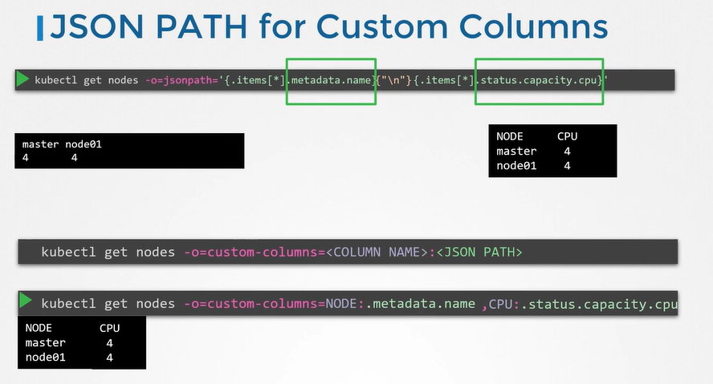

 

 

***JSON PATH for Sort***

 

JSON PATH can use while sorting objects by specifying the sort by option
where sort the output based on value of a property from the JSON
formatted properties of each item. Sort-by option doesn't need '{}'

 

**kubectl get nodes --sort-by= .metadata.name**

 

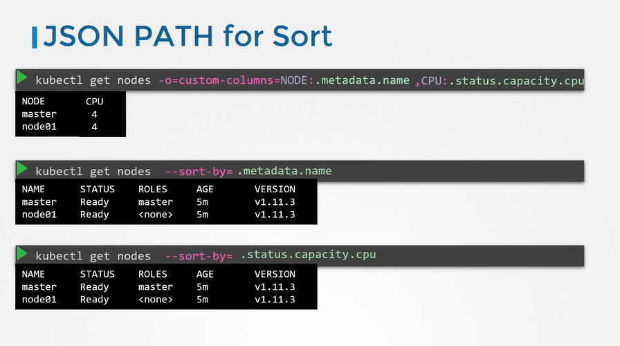

 

 

 

controlplane ~ ➜ kubectl get nodes
-o=jsonpath='{.items\[\*\].status.nodeInfo.osImage}'

Ubuntu 22.04.5 LTS Ubuntu 22.04.5 LTS

 

kubectl config view --kubeconfig=/root/my-kube-config ; To query
kubeconfig file with -o=jsonpath even though the output is not json

 

 

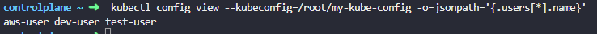

 

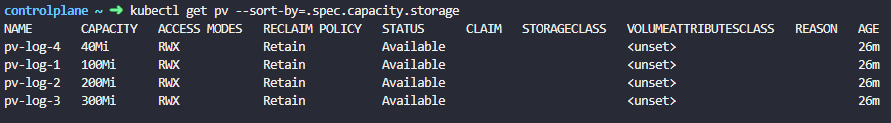

 

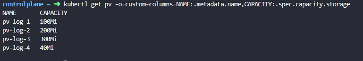

 

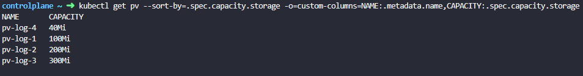

 

 

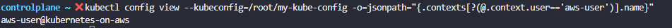
