# Kustomize Basics

 

**Kustomize Problem Statement & ideology**

 

***Why Kustomize***

 

**-**In this case, we have nginx deployment .yml file where we're going
to deploy one single nginx pod to multiple environments for development,
staging and production. Assume that we want to customize the deployments
so that it behaves a little bit differently in each one of environments
such as modifying number of replicas on per environment basis.

-One of the simplest solutions to this problem is to create three
separate directories for each environment within the respective folder.

-Duplicate the configs across all of the three different environments by
modifying attributes on per environment basis

 

 

-Then store these configs specifying the specific environment directory

 

\$ kubectl apply -f dev/

\$ kubectl apply -f stg/

 

-Whenever we want to add .yml file for number of resources to each
directories and maintain those file, that is too tedious task and harder
to maintain. This is one of reasons why kustomize was created so that we
can modify Kubernetes configs on per environments basis without copying
them into different directories of environment.

 

***Base***

 

-Base config represents config that's going to be identical across all
of environments.

-Base config represents default value across all environments and can
override later

 

***Overlays***

 

-Overlays allow us to customize the behaviour on a per environment basis

-Can create overlays for each environments

-Specify all of the parameters or properties that we want to override or
change from the base config

 

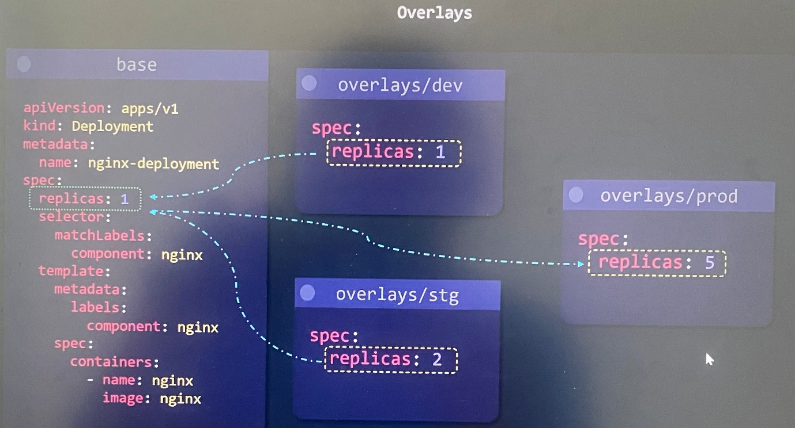

 

***Folder Structure***

 

base/

 

\- base directory contains all of your base configurations to share
across all environments such as deployments, services

 

overlays/

 

-It has a different folder for each environment

-Each folder has the values that you want to override and change from
the base config

-It has any new resources that should only be added exclusively for that
specific environment.

 

***Kustomize***

 

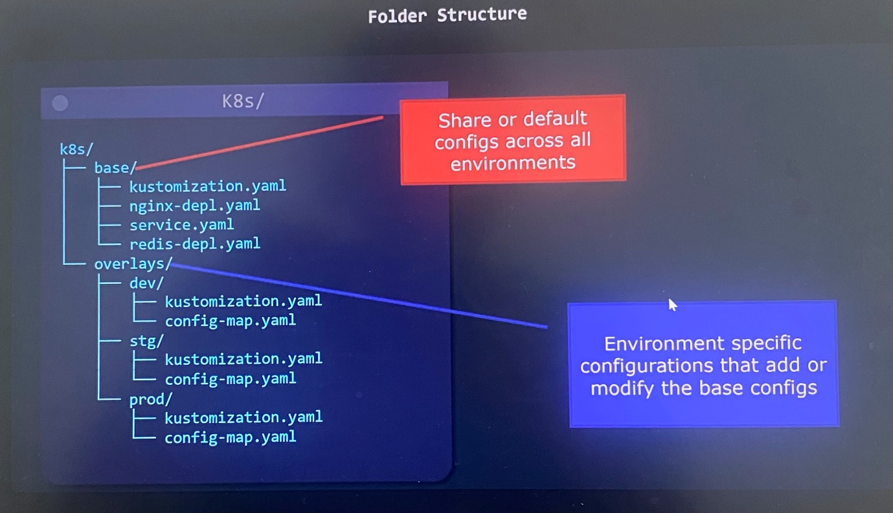

 

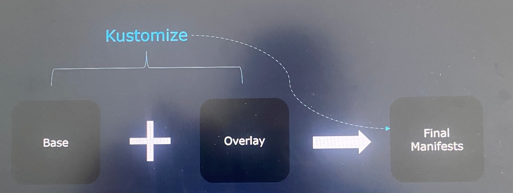

 

-You have base config and overlays, then Kustomize refers both of them
and create the final Kubernetes manifests.

-Kustomize comes built-in with kubectl so no other packages need to be
installed

-You may still want to install the kustomize CLI to get the latest
version because Kubectl doesn't always come with the latest version

-With Kustomize, it does not require learning how to use any templating
systems like Helm. Instead use to define base configs and then specify
overlays for different environments.

-It uses standard YAML file which is readable whereas some of complex
helm charts is difficult to read because of the templating systems

-Every artifact that Kustomize uses is plain YAML and can be validated
and processed as it doesn't have special syntax and templating language.
It is so simple.

 

 

**Kustomize vs Helm**

 

-Helm makes use of go templating to allow assigning variables to
properties

-It specifies with two curly braces {{ .Values.replicaCount}}

 

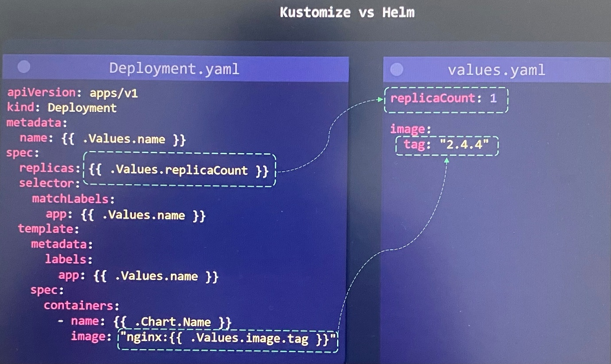

 

In traditional Helm project structure, it contains following.

 

\- It maintains sperate values.yaml file on a per environment basis
under the environments directory

\- all of Kubernetes manifests under templates directory where we have
to insert variables required for each environment using go templating
syntax

 

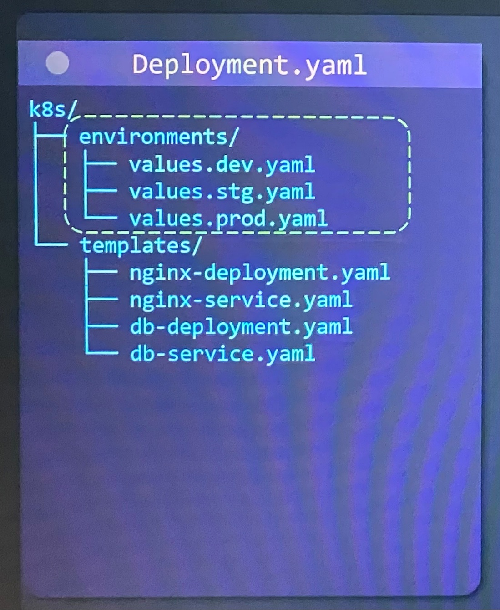

 

 

-Helm is more than just a tool to customize configurations on a per
environment basis. Helm is also a package manager for app. It is like
either YUM and APT for a Linux system

-Helm provides extra features that Kustomize doesn't have like
conditionals, loops, functions and hooks

-Helm templates are not valid YAML as they use go templating syntax

-Complex templates become hard to read

 

One of the perks about Kustomize is that Kustomize is very simple. It's
very easy to read, it's just regular YAML. The regular base
configurations is just regular Kubernetes configs, and then the
overlays, where we go to modify it on a per environment basis, that's
all valid YAML as well whereas Helm is bit more complex but it has more
features. There are trade-offs that each one bring to the table.

 

 

**Installation/Setup**

 

Before installing Kustomize,

 

-It must have Kubernetes cluster up and running

-Installed kubectl on the local machine and configured to connect
Kubernetes cluster

 

-can be installed on a Linux, Windows or a Mac machine

-Kustomize team make it easy to install Kustomize by providing a nice
script that will automatically detect your operating system and install
the appropriate version of Kustomize.

 

\$ curl -s
"<https://raw.githubusercontent.com/kubernetes-sigs/kustomize/master/hack/install_kustomize.sh>"
\| bash ;download and run the script to install Kustomize on the local
machine

 

\$ kustomize version --short ; verify that Kustomize installed correctly

 

 

-If you don't see an output similar to this that means most likely there
was an issue with an installation or maybe the environment variables
weren't updated in the current terminal session. In that case, it is
recommended to close the current terminal and open new terminal, then
rerun the installation script again.

 

 

**kustomization.yaml File**

 

-Create a directory - **k8s** that contain Kubernetes config YAML files
so that we are going to point Kustomize to this folder

-But Kustomize won't look these files. Instead Kustomize looks for
specific file kustomization.yaml file

-kustomization.yaml file contain a list of all Kubernetes **resources**
that should be managed by Kustomize and all of the customization that we
want to apply for change e.g. **commonLabels**

 

 

-------------kustomization.yaml----------------------

 

\#kubernetes resources to be managed by kustomize

resources:

\- nginx-deployement.yaml

\- nginx-service.yaml

\#Customizations that need to be made

commonLabels:

company: KodeKloud

 

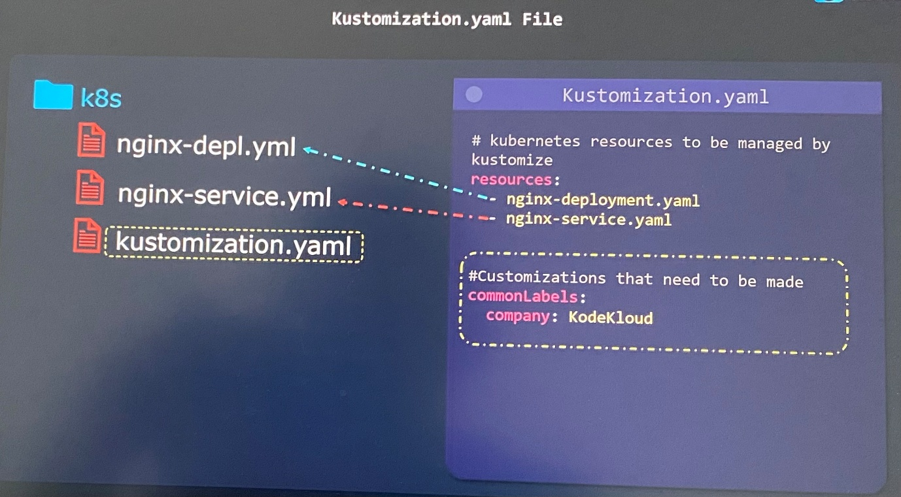

 

 

 

\$ kustomize build k8s/ ;point kustomize build command to the K8s
directory to where Kustomize looks the kustomization.yaml file

 

-Kustomize looks for kustomization.yaml file and is going to point two
resources we defined. Then import them to apply all of the
transformations we have defined

-Then Kustomize build command output throws how final configs would look
like in dry-run mode after customizing the commonLabels

 

 

 

Kustomize looks for a kustomization file which contains

- List of all the Kubernetes manifests kustomize should manage

- All of the customizations that should be applied

 

The *kustomize build* command combines all the manifests and applies the
defined transformations

 

The *kustomize build* command does not apply/deploy the Kubernetes
resources to the cluster

- The output needs to be redirected to the ***kubectl apply*** command

 

 

**Kustomize Output**

 

***Apply Kustomize Configs***

 

After running *kustomize build* command, then we need to deploy it to
the Kubernetes cluster.

 

\$ kustomize build k8s/ \| kubectl apply -f - ; build all the configs
and apply them to the cluster using Linux pipe utility

 

It redirects the output of first command into the input of the second
command, which is the command to the right of the Linux pipe utility.

 

\$ kubectl apply -k k8s/ ; apply the configs natively with the kubectl
tool

 

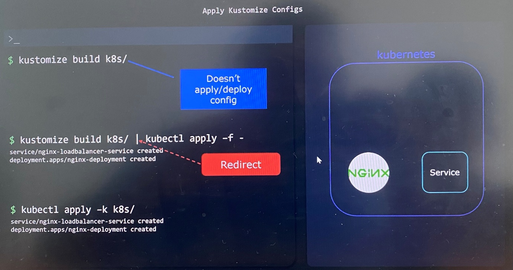

 

***Delete with Kustomize***

 

\$ kustomize build k8s/ \| kubectl delete -f - ; build all the configs
and delete them from the cluster using Linux pipe utility

 

\$ kubectl delete -k k8s/ ; delete the configs natively with the kubectl
tool

 

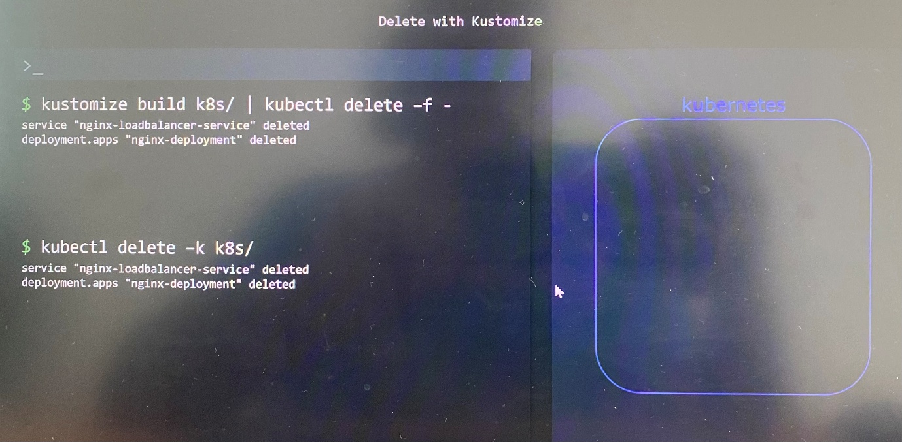

 

 

**Kustomize Api Version & Kind**

 

-Can set the API version and kind properties in a Kustomization.yaml
file

-They are technically optional as Kustomize pick up default values. But
it is recommended that you hard code these values in case there is any
kind of breaking changes in the future

 

-------------kustomization.yaml----------------------

 

apiVersion: kustomize.config.k8s.io/v1beta1

kind: Kustomization

 

\#kubernetes resources to be managed by kustomize

resources:

nginx-deployement.yaml

nginx-service.yaml

\#Customizations that need to be made

commonLabels:

company: KodeKloud

 

**Managing Directories**

 

***Multiple Directories***

 

-Kustomize allows managing Kubernetes manifests that spread across
multiple directories

-As long as all of Kubernetes manifest files may contain in a single
directory, we only just do kubectl apply command

-When the number of YAML files grow, we can organize YAML files by
moving them into sub directories based on application or environment,
then go onto the directories and do the kubectl apply.

-It is bit of a pain to go each one of sub directories and run kubectl
apply whenever every time we make changes on config files. We also have
to configure CI/CD pipeline to do the same. This is where Kustomize come
into play.

 

\$ kubectl apply -f k8s/api

 

\$ kubectl apply -f k8s/db

 

\$ kubectl apply -f k8s/api -f k8s/db ; Create resources in multiple
directories from single command

 

\$ kubectl delete -f k8s/api -f k8s/db ; Delete resources in multiple
directories from single command

 

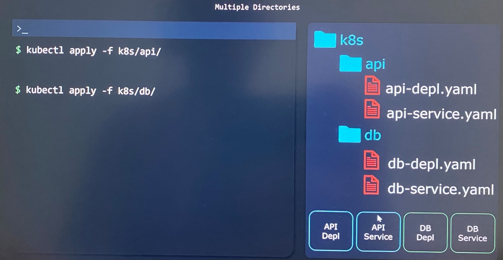

 

 

 

-can create a kustomization.yaml file in the root directory of our k8s

-list out all of the resources with relative path to import inside
kustomization.yaml file

 

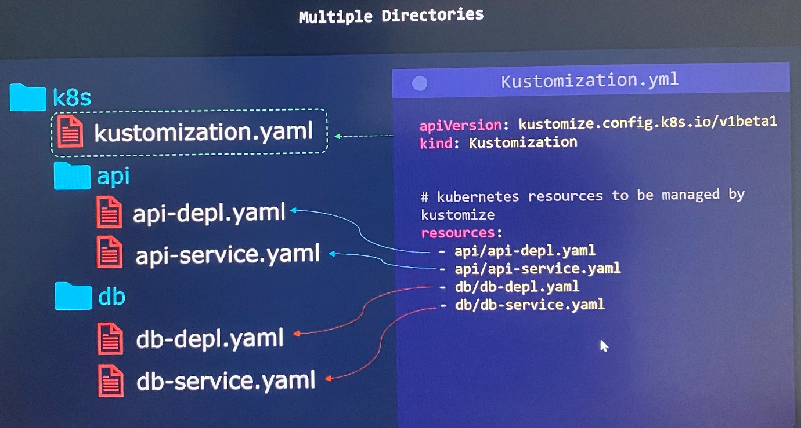

 

-We can deploy all resources from just one command without going onto
each one of sub directories

 

\$ kustomize build k8s/ \| kubectl apply -f - Or

 

\$ kubectl apply -k k8s/

 

-Whenever the number of sub directories that use for each one of
application grow, the number of resources we define in
kustomization.yaml seems messy.

 

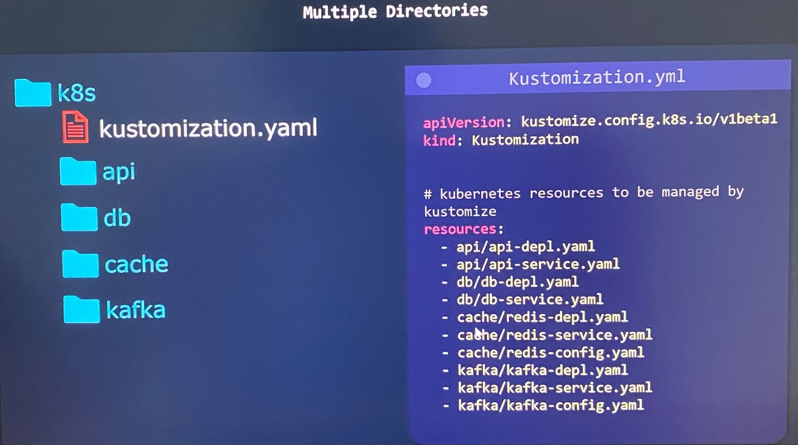

 

-We list all of the manifest files within that directory and import
those files inside that specific kustomization.yaml file that reside in
the sub directory.

-The better way of handling this using Kustomize is we can add in a
separate kustomization.yaml file within each one of the sub directories
where it is going to import the manifest files in the sub directories to
kustomization.yaml file in root directory

-In the root Kustomization.yaml file, we'll provide a path to all of the
sub directories to import manifests files through Kustomization.yaml
file in sub directories.

 

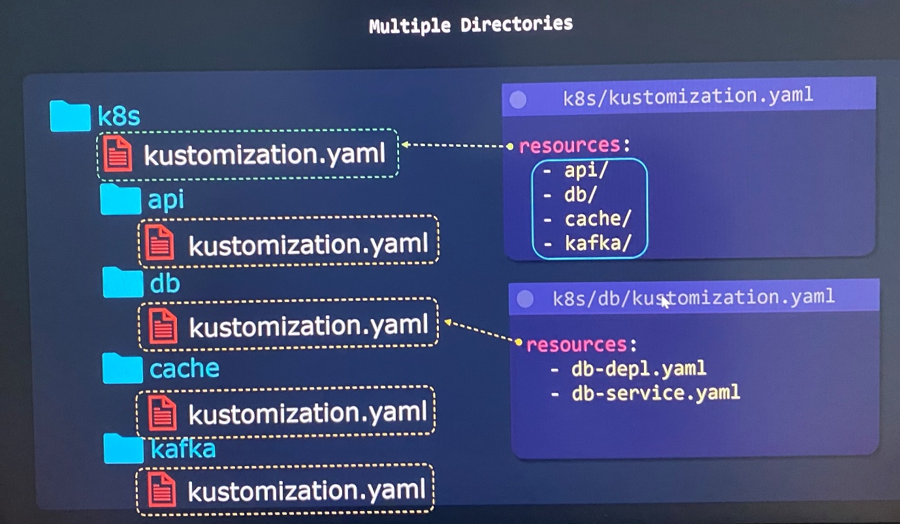

 

***Apply Kustomize Configs***

 

-We can deploy all resources from just a one command without going onto
each one of sub directories

 

\$ kustomize build k8s/ \| kubectl apply -f - Or

 

\$ kubectl apply -k k8s/

 

 

**Common Transformers**

 

-This is to modify or transform Kubernetes configs for all Kubernetes
resources

-Kustomize has several built in transformers such as common transformer

-can even create custom transformers

 

Assume that we want to specifically add a label or specific prefix or
suffix to the name in Kubernetes manifest file. In production
environment, you're going to have significantly more than just two YAML
files. Doing this by hand is not a scalable solution, it's
time-consuming and it's going to lead to a lot of errors.

 

commonLabels- adds a label to all Kubernetes resources

 

namePrefix/Suffix -add a common prefix-suffix to all resource names

 

Namespace - adds a common namespace to all resources

 

commonAnnotations - adds an annotation to all resources

 

***CommonLabel Transformer***

 

-add label to all of Kubernetes resources that are imported by
kustomization.yaml file

 

------- kustomization.yaml file -------------

 

commonLabels:

org: KodeKloud

 

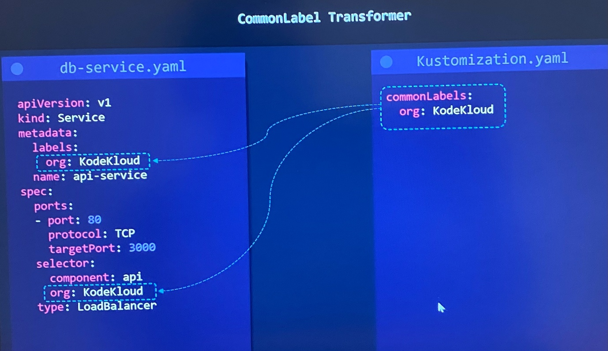

 

***Namespace Transformer***

 

***-***apply common namespace to all Kubernetes resources

 

------- kustomization.yaml file -------------

 

namespace: lab

 

 

***Name Prefix/suffix Transformer***

 

***-***apply common name prefix and name suffix to all Kubernetes
resources

 

------- kustomization.yaml file -------------

 

namePrefix: KodeKloud-

 

nameSuffix: -dev

 

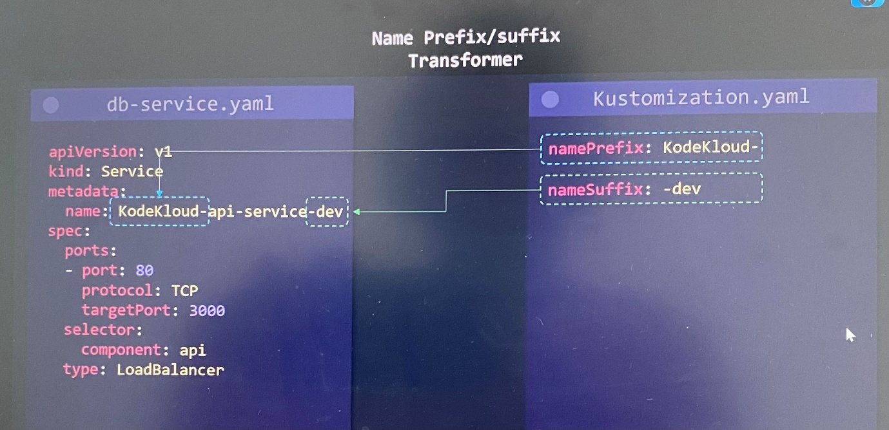

 

 

***CommonAnnotations Transformer***

 

***-***apply common annotation to all Kubernetes resources

 

------- kustomization.yaml file -------------

 

commonAnnotations:

branch: master

 

\* When you apply any transformers to a kustomization.yaml file within a
subdirectory, it's going to only apply transformers to the resources
that import from kustomization.yaml file in the sub directory

\* When you apply any transformers to a kustomization.yaml file within
root directory, , it's going to apply transformers to the resources that
import from kustomization.yaml file in the root directory

 

 

**Image Transformer**

 

-This is to modify an image that a specific deployment or container is
going to use through Kustomize

 

------- kustomization.yaml file -------------

 

images:

\- name: nginx

newName: haproxy

 

name - the name of the specific image that we want to replace in all
Kubernetes configs

newName - the new name of the specific image we replace in all
Kubernetes configs

 

------- kustomization.yaml file -------------

 

 

images:

\- name: nginx

newTag: 2.4

 

newTag - the new tag of the specific image we replace in all Kubernetes
configs

 

Image tag may want to apply as a string with "". As example "2.4"

 

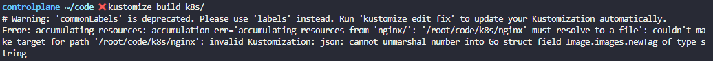

 

 

We can combine image name and tag as follows.

 

------- kustomization.yaml file -------------

 

images:

\- name: nginx

newName: haproxy

newTag: 2.4

 

 

 

 

**Patches Intro**

 

-Kustomize patches provide another method to modify Kubernetes configs

-Unlike common transformers, patches provide a more "surgical" approach
to targeting one or more specific sections in a Kubernetes resource

-However, kustomize patch is to match a specific object and change the
value on one specific object or a couple of objects

-To create a patch, 3 parameters must be provided:

 

- Operation type: add/remove/replace Ex: Add another container to list
  of containers in a deployment, change a replica count in a deployment
  using replace

- Target: What resource should this patch be applied on. We can mix and
  match on a couple of different properties from below.

 

Kind

Version/Group

Name

Namespace

labelSelector

AnnotationSelector

 

- Value: What is the value that will either be replaced or added
  with(only needed for add/replace operations)

 

------- kustomization.yaml file -------------

 

patches:

\- target:

kind: Deployment

name: api-deployment

 

patch: \|-

\- op: replace

path: /metadata/name

value: web-deployment

\|- this is for what is referred to as an ***inline patch.***

 

Path property to tell Kustomize what is the specific property we want to
replace or update, and how do we get to it in the YAML tree.

 

 

 

 

***JSON 6902 vs Strategic Merge Patch***

 

In kustomize, there's actually two different ways to define a patch.

 

***JSON 6902 Patch*** has two things that you have to provide.

target - The Kubernetes object that we want to patch

patch - What operation, what property we want to update and what is the
new value

<https://datatracker.ietf.org/doc/html/rfc6902> shows step by step
through all the different features and functionalities it has.

 

------- kustomization.yaml file -------------

 

patches:

\- target:

kind: Deployment

name: api-deployment

 

patch: \|-

\- op: replace

path: /spec/replicas

value: 5

 

 

***Strategic Merge Patch*** has standard Kubernetes config where we copy
the original deployment file and just paste it, then delete all the
config properties that don't want to change.

 

One of the perks of using a strategic merge patch is that it's using
regular Kubernetes configs. Then it's going to take this new config and
merge it with the old config, it's going to figure out exactly what's
changed and it's going to update those properties.

 

*Strategic Merge Patch* has two things that you have to provide.

 

1.  What Kubernetes object that you want to update i.e name of the
    deployment

2.  The specific properties that you want to change

 

 

------- kustomization.yaml file -------------

 

patches:

\- patch: \|-

apiVersion: apps/v1

kind: Deployment

metadata:

name: api-deployment

spec:

replicas: 5

 

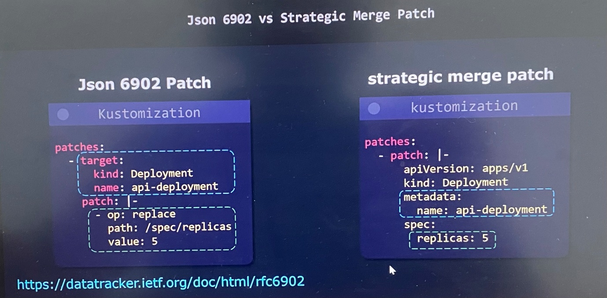

 

 

**Different types of patches**

 

There is two different ways you can define a patch.

 

1.  Inline - define the patch within the kustomization.yaml file itself

 

2.  Sperate file - define the patch by using separate file where we
    provide target and a path to a YAML file that contain all patches

 

If you have a lot of patches, it may start to clutter kustomization.yaml
file up, and then you can move it to a separate file and then use the
separate file method.

 

 

***JSON 6902 patch inline vs Separate File***

 

------- kustomization.yaml file -------------

 

patches:

\- path: replica-patch.yaml

target:

kind: Deployment

name: api-deployment

 

----------replica-patch.yaml-------------

 

\- op: replace

path: /spec/replicas

value: 5

 

 

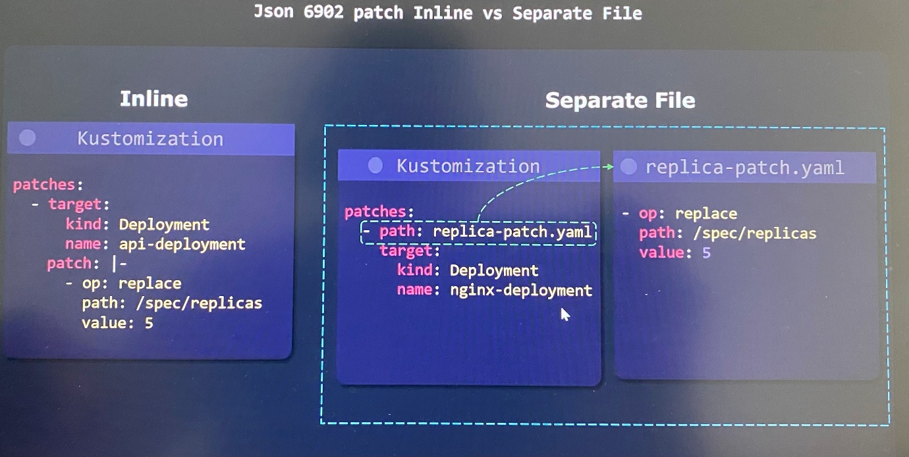

 

 

***Strategic merge patch inline vs Separate File***

 

------- kustomization.yaml file -------------

 

patches:

\- replica-patch.yaml

 

 

----------replica-patch.yaml-------------

 

apiVersion: apps/v1

kind: Deployment

metadata:

name: api-deployment

spec:

replicas: 5

 

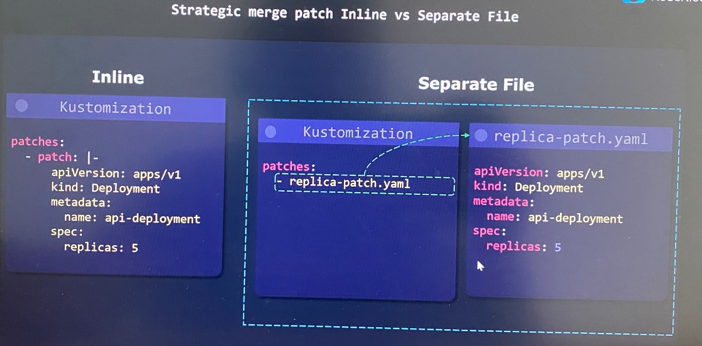

 

 

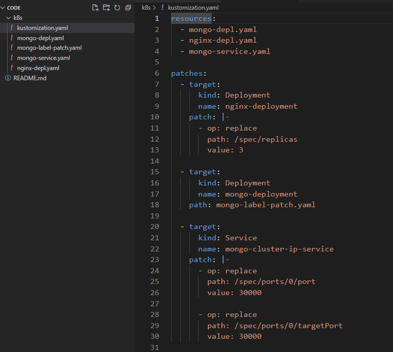

 

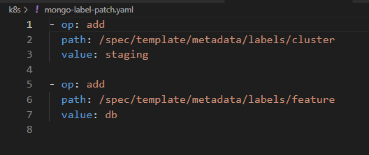

 

**Patches Dictionary**

 

***Replace Dictionary JSON 6902***

 

Changing a value of key in dictionary where specify the key in path
section using JSON 6902.

 

------- kustomization.yaml file -------------

 

patches:

\- target:

kind: Deployment

name: api-deployment

 

patch: \|-

\- op: replace

path: /spec/template/metadata/labels/**component \<--- key**

value: web

 

 

 

***Replace Dictionary Strategic merge patch***

 

Copy and paste the deployment configuration, delete all the properties
that will not be changing. Only add the property that you want to change
in to sperate YAML file. Then Kustomize takes this config and merge it
with original deployment config.

 

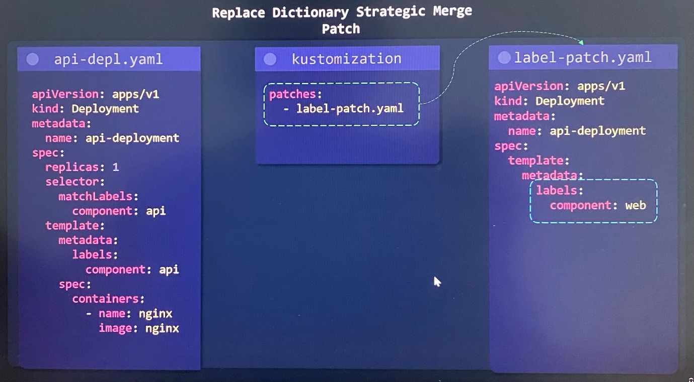

 

 

***Add Dictionary JSON 6902***

 

Adding a key in dictionary using JSON 6902.

 

------- kustomization.yaml file -------------

 

patches:

\- target:

kind: Deployment

name: api-deployment

 

patch: \|-

\- op: add

path: /spec/template/metadata/labels/**org \<--- key**

value: KodeKloud

 

 

 

 

***Add Dictionary Strategic merge patch***

 

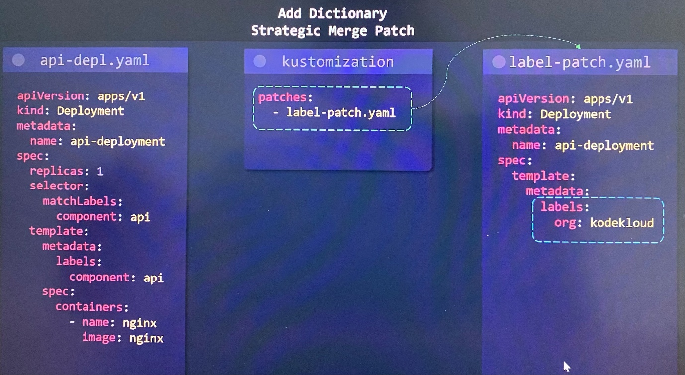

 

 

***Remove Dictionary JSON 6902***

 

Only specify the key that you need to remove from the path in
kustomization.yaml file where no value specify as the value is removed.

 

------- kustomization.yaml file -------------

 

patches:

\- target:

kind: Deployment

name: api-deployment

 

patch: \|-

\- op: remove

path: /spec/template/metadata/labels/**org \<--- key**

 

 

 

***Remove Dictionary Strategic merge patch***

 

Specify the value of key is null to delete the key in sperate YAML file.

 

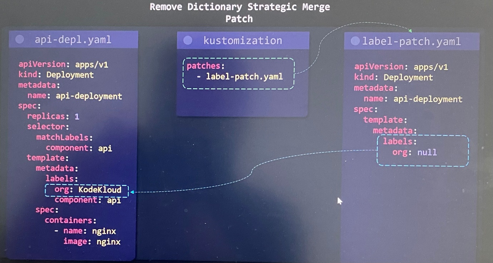

 

 

**Patches list**

 

Let's take a look at how we can perform remove, replace, and add keys
operations on a list.

 

***Replace List JSON 6902***

 

In the path section in kustomization file, we specify the index is going
to represent which item in that list you want to update. As example, we
take containers section in spec to update.

 

0 index number is 1st item in the list.

 

------- kustomization.yaml file -------------

 

patches:

\- target:

kind: Deployment

name: api-deployment

 

patch: \|-

\- op: replace

path: /spec/template/spec/containers/**0 \<--- Index number**

value:

name: haproxy

image: haproxy

 

OR

 

patches:

  - target:

      kind: Deployment

      name: api-deployment

    patch: \|-

      - op: replace

        path: /spec/template/spec/containers/0/image

        value: caddy

 

 

 

 

 

***Replace List Strategic merge patch***

 

Only add the property that you want to change in to sperate YAML file.
Then Kustomize takes this config and merge it with original deployment
config.

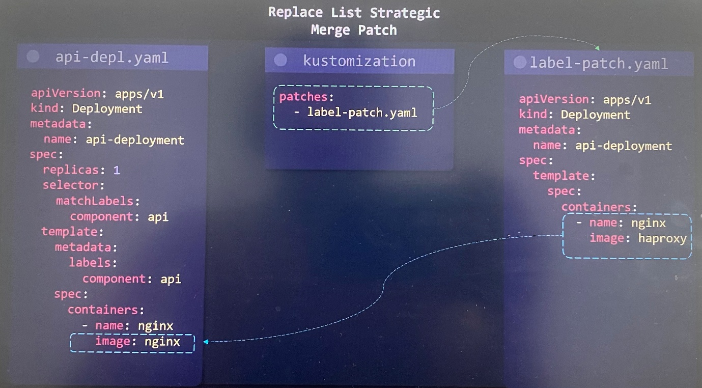

 

 

***Add List JSON 6902***

 

In the path section in kustomization file, we specify - mark to append
to end of list or index which item in that list you want to update.

 

------- kustomization.yaml file -------------

 

patches:

\- target:

kind: Deployment

name: api-deployment

 

patch: \|-

\- op: replace

path: /spec/template/spec/containers/**- \<--- Append end of list**

value:

name: haproxy

image: haproxy

 

 

 

 

***Add List Strategic Merge Patch***

 

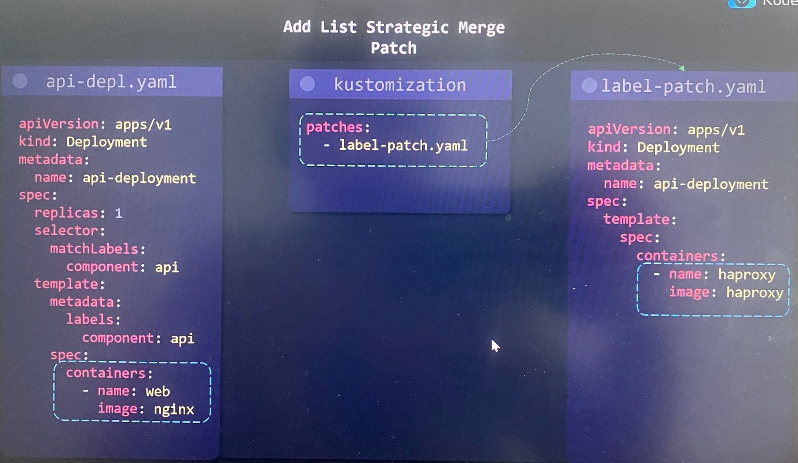

 

 

***Delete List JSON 6902***

 

In the path section in kustomization file, we specify index number which
item in that list you want to delete where we don't need to provide
value as this is remove operation.

 

patches:

\- target:

kind: Deployment

name: api-deployment

 

patch: \|-

\- op: remove

path: /spec/template/spec/containers/**1 \<--- Index of container to
delete**

 

 

 

***Delete List Strategic Merge Patch***

 

Specify \$ symbol patch, and then delete to delete the item in the list
in sperate YAML file where we use the delete directive. We're listing
out all of the Kubernetes configs that we want to change.

 

----------replica-patch.yaml-------------

 

apiVersion: apps/v1

kind: Deployment

metadata:

name: api-deployment

spec:

template:

spec:

containers:

\- \$patch: delete

name: database

 

 

 

 

**Overlays**

 

Kustomize was created to allow us to import base Kubernetes config and
customize it on a per-environment basis. We may want to tweak certain
properties in development, staging and production environments. To
accomplish this, we use Kustomize with overlays.

 

A Kustomized project can break into following folder structure.

 

base - This contains all of default or share Kubernetes configuration
across all environments

 

overlays - Specify all of the environment specific configs so that we
can import the base config and modify for the specific environment as
desired

 

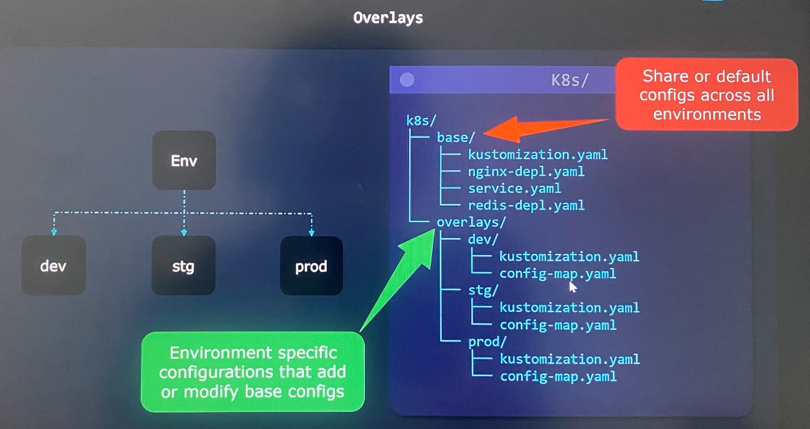

 

In same way, you can accomplish by providing patches for each
environments.

 

Example:

 

We get same folder structure where default Kubernetes config files are
imported to Kustimization.yaml file in base folder.

 

In overlays directory, you can see ***bases*** property in
Kustomization.yaml file in each environment folder. We provide relative
path to go up to base directory and import from Kustimization.yaml file
in each environment folder.

 

Once this is defined, Kustomize will look for the kustomization.yaml
file in the base directory to know all the resources it should be
importing, then provide a patch.

 

------------dev/kustomization---------------------

 

bases:

\- ../../base

 

patch: \|-

\- op: replace

path: /spec/replicas

value: 2

 

 

 

In one of environment folder in overlay directory, you can reside new
configs that doesn't exist in the base directory.

 

In kustomization.yaml file is, under the resources section, we import it
like a regular file. Thus you can add new resources inside your overlay
folder.

 

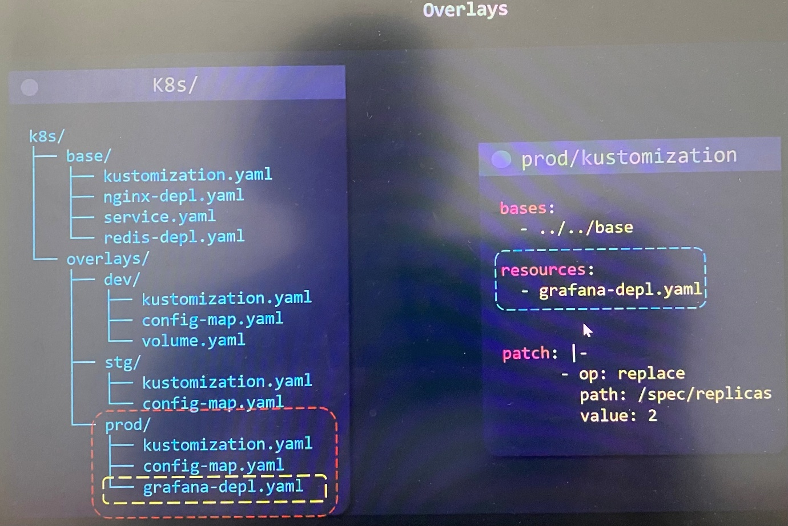

 

The base folder can be broken out into extra sub directories based on
features.

 

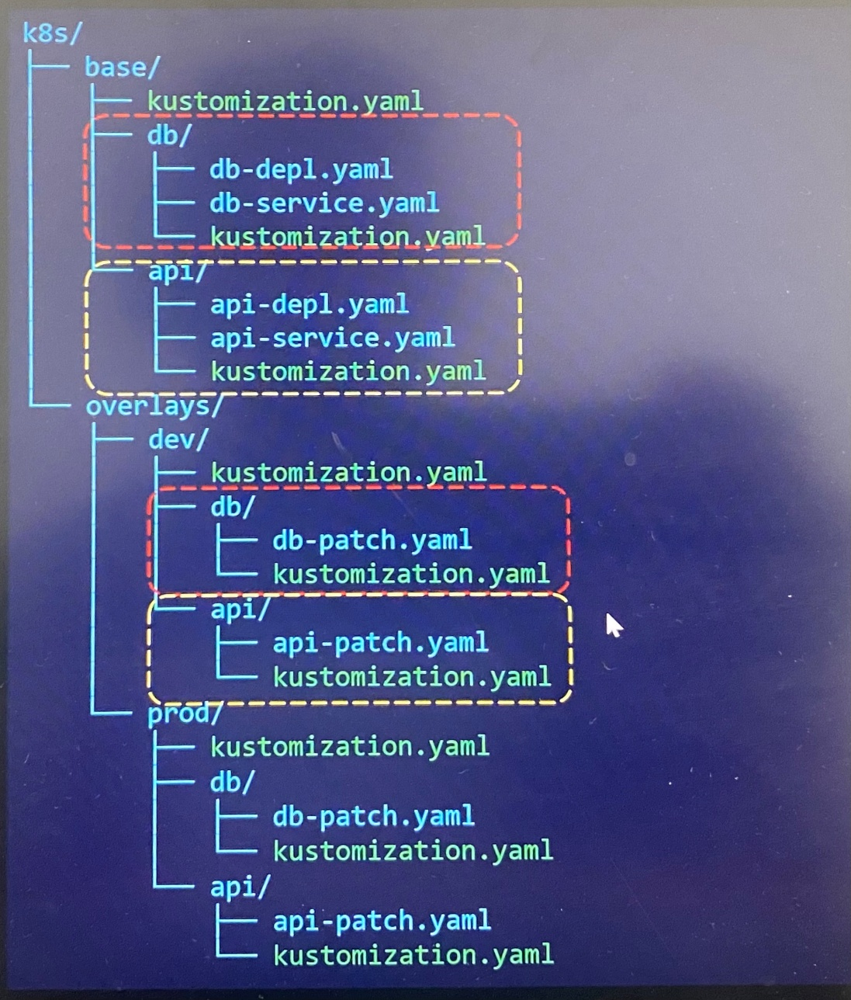

 

 

**Components**

 

Components provides the ability to define a reusable piece of
configuration logic(resource + patches) that can be imported to sub set
of overlays.

 

Components are useful in situations where applications support multiple
optional features that need to be enabled only in a subset of overlays
not for all overlays. We could do that pretty easily by defining them in
each one of the overlays. But then, now we must be copying and pasting
all of the configs in required subset of overlays. If you make changes
in one of the folders, you'd have to remember to make changes in the
other one. And let's say we over time decide to add a few more
variations, you would have to remember to copy it into all of those
overlays. However, that's not a scalable solution.

 

It's all of the resources for a specific feature, all of the patches,
all of the config maps, secrets, and any other Kubernetes related
configs associated with the feature.

 

Let's take scenario that we need caching feature(enable Redis database)
enabled in Premium and Self-hosted overlays except dev, further need
external DB service enabled(Postgres database) on only in dev and
Premium overlays.

 

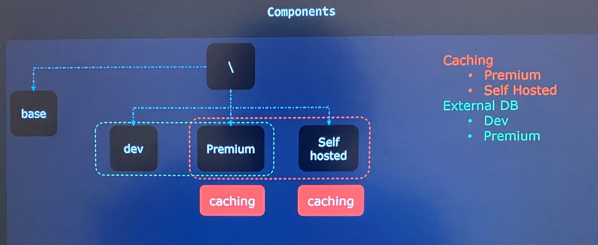

 

We create extra folder called **Components** and store all of components
in that folder. We have all of Kubernetes configs that associated with
caching and external database in each subfolder in components directory
like caching and DB. That way we can import them into subset of overlays
as we want.

 

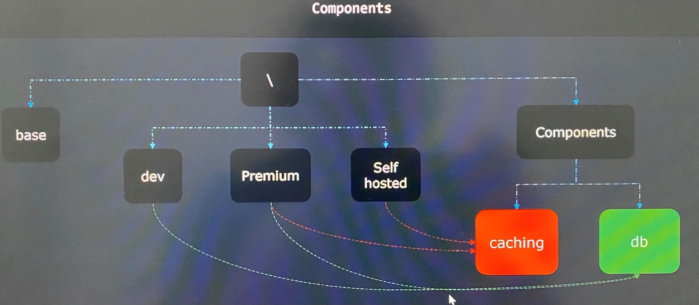

 

 

1.  Create kustomization.yaml for required feature in Components
    directory

 

----------Components/db/kustomization.yaml-----------------

 

apiVersion: kustomize.config.k8s.io/v1alpha1 \<\< apiVersion for
Component

kind: Compenent

 

resources: \<\< import Kubernetes config

\- postgres-depl.yaml

 

secretGenerator:

\- name: postgres-credential

literals:

\- password=postgres123

patches:

\- deployemnt-patch.yaml

 

 

 

2.  Create kustomization.yaml for required environment in overlays
    directory to import Kubernetes config

 

----------Overlay/premium/kustomization.yaml-----------------

 

bases:

\- ../../base

components:

\- ../../components/db

 

 

apiVersion: kustomize.config.k8s.io/v1alpha1

kind: Component

resources:

  - keycloak-depl.yaml

  - keycloak-service.yaml

patches:

  - path: api-patch.yaml

 

 

 

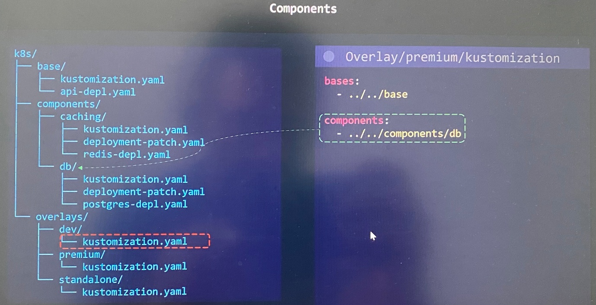

 

 

🚀 End-to-End DevSecOps Pipeline with Trivy, DefectDojo, GitLab CI/CD,
Helm & Argo CD

🔐 Security isn’t just a phase — it’s a culture.

I recently implemented a DevSecOps pipeline that:

Scans with Trivy

Tracks findings in DefectDojo

Deploys via GitLab CI/CD, Helm, and Argo CD

Here’s how you can build it too 👇

⚡ Why This Setup Works

Trivy → Fast, accurate vulnerability scanner for containers,
filesystems, and code.

DefectDojo → Centralized vulnerability management & reporting.

GitLab CI/CD → Automates scanning, validation, and release steps.

Helm → Simplifies Kubernetes deployments.

Argo CD → GitOps-based continuous delivery for Kubernetes.

Benefits:

✅ Security gates before deployment

✅ Centralized vulnerability tracking

✅ Automated GitOps deployments to Kubernetes

 

🔍 The Flow

1️⃣ Developer commits code → triggers GitLab CI/CD.

2️⃣ Trivy scans the container image for vulnerabilities.

3️⃣ Results are sent to DefectDojo via API for tracking.

4️⃣ If scan passes policy, Helm charts are updated in the GitOps repo.

5️⃣ Argo CD detects changes and syncs the application in Kubernetes.

 

🔗 Key Integration Points

🛡 Trivy + GitLab CI/CD

.gitlab-ci.yml

 

trivy-scan:

image: aquasec/trivy:latest

script:

\- trivy image --exit-code 0 --format json -o trivy-report.json
\$CI_REGISTRY_IMAGE

\- curl -X POST "\$DOJO_URL/api/v2/import-scan/" \\

-H "Authorization: Token \$DOJO_API_KEY" \\

-F "scan_type=Trivy Scan" \\

-F "file=@trivy-report.json" \\

-F "product_id=\$DOJO_PRODUCT_ID" \\

-F "engagement_id=\$DOJO_ENGAGEMENT_ID" \\

-F "active=true" \\

-F "verified=true"

Notes:

DOJO_PRODUCT_ID & DOJO_ENGAGEMENT_ID come from DefectDojo.

Trivy JSON output matches DefectDojo’s Trivy Scan type.

Store secrets in GitLab’s CI/CD variables.

⚓ Helm + Argo CD

Helm chart defines your app.

Argo CD automatically syncs from the GitOps repo to Kubernetes.

 

🏆 Benefits in Production

✅ No manual security checks — scans run on every commit.

✅ Vulnerabilities tracked in DefectDojo for audit and follow-up.

✅ GitOps guarantees what’s in Git is what’s running in Kubernetes.

 

💡 Takeaway: Security should be baked into your delivery process, not
bolted on at the end.

With Trivy + DefectDojo + GitLab + Helm + Argo CD, you can:

Shift security left

Keep a single source of truth for deployments

Ship faster, safer

 

💬 Have you integrated vulnerability scanning into your GitOps pipeline?
I’d love to hear your approach!

\#DevSecOps \#Trivy \#DefectDojo \#GitLabCI \#Helm \#ArgoCD \#Kubernetes
\#CloudSecurity \#CICD \#ContainerSecurity \#OpenSourceSecurity

 

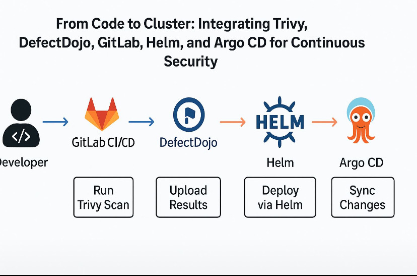
