# Networking

**Linux networking**

ip link ; to list and modify interface for the host

ip address add 192.168.1.10/24 dev eth0 ; set ip address to an interface

ip address show eth0 ; show ip address details for a specific interface

ip address show type bridge ; show ip address details of any interface
that has the type is bridge

ip route OR route ; display Kernal IP routing table

ip route add 192.168.2.0/24 via 192.168.1.1 ; add a route through
gateway. These changes are valid until reboot the host. Hence, edit
***/etc/network/interface*** file to persist the change

ip route add default via 192.168.1.1 ; add default gateway

ip route add 0.0.0.0 via 192.168.1.1 ; another way to add default
gateway

\*A 0.0.0.0 entry in the gateway in routing table field indicates that
you don't need a gateway.

 

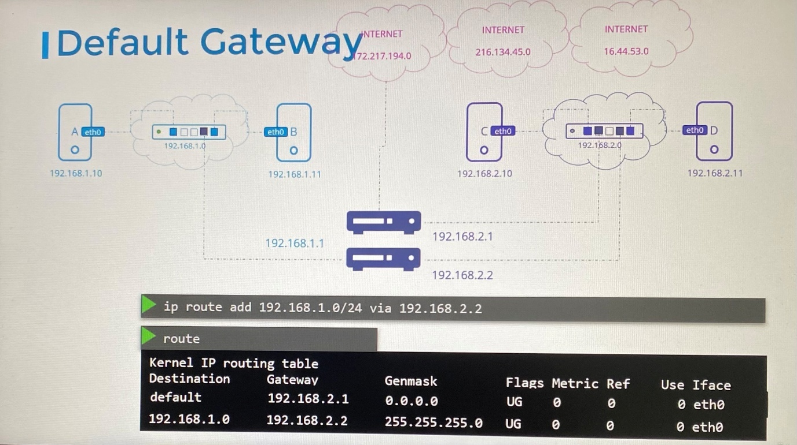

***Set up Linux host as router***

\*If we choose to set up Linux host as router even after routes are set
up, by default in Linux, packets are not forwarded from one interface to
the next interface. This is for security reason. Let assume the host
have an interface from private network and an interface from public
network. Public network now cannot send message to private network
unless you explicitly allow that.

The host can forward packets between interfaces is governed by a setting
in this system at file ***/proc/sys/net/ipv4/ip_forward***

cat /proc/sys/net/ipv4/ip_forward ; by default the value here is 0

echo 1 \> /proc/sys/net/ipv4/ip_forward ; set the value to 1 to forward
the traffic

Simply setting this value does not persist the changes across reboots so
that you must modify the same value in the ***etc/sysctl.conf***
configuration file for setting system variables.

/etc/sysctl.conf ; edit the net.ipv4.ip_forward value to 1

 

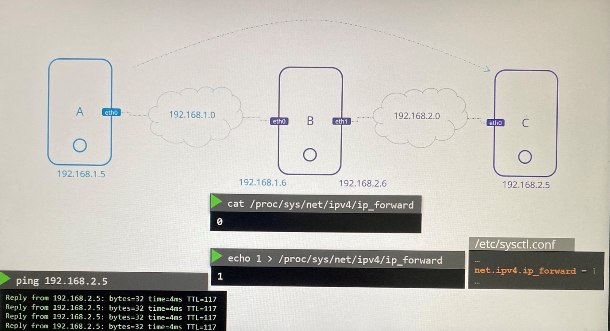

 

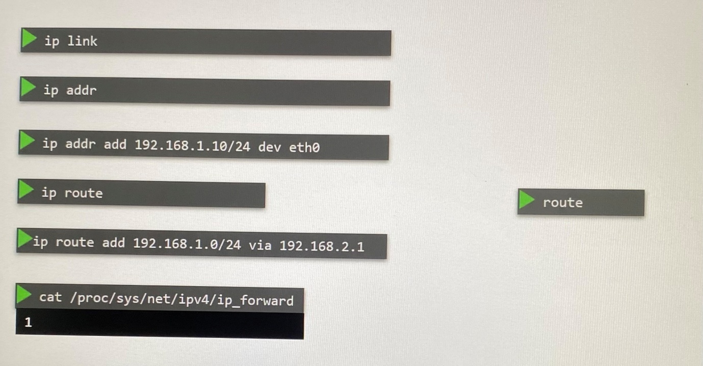

**DNS in Linux**

For DNS resolution, Add dns entry to the host file.

cat \>\> /etc/hosts ; show the DNS entry and edit this with the DNS
entry

192.168.1.10 db

\*Whatever specify in the host file(/etc/hosts ) will override the
actual hostname of any host.

You can check the DNS entry by following ways.

ping db

ssh db

curl <http://www.google.com>

When the number of hosts increase in the network, hostname of each host
should be updated with new DNS entries in host file in all devices where
it is not scalable and also not manageable. This is where the need of
DNS server comes with to manage all DNS entries centrally.

cat /etc/resolv.conf ; edit the DNS resolution configuration file in the
host to point DNS server for lookup

nameserver 192.168.1.100

Thereafter, the host always lookup the DNS server to resolve the DNS
unless host file has specific DNS entries.

Normally host first lookup the ***/etc/hosts*** file and later
***/etc/resolv.conf*** file. This order defines in
***/etc/nsswitch.conf*** file where you can modify the order if you
need.

cat /etc/nsswitch.conf

….

hosts: files dns

……

files - /etc/hosts

dns - DNS server

If you need to resolve external DNS entry, you should add the public DNS
server as nameserver into /etc/resolv.conf.

cat /etc/resolv.conf

nameserver 192.168.1.100

nameserver 8.8.8.8

However, you have to add public DNS server to all hosts in the network.
Instead you can add following entry to DNS server itself to forward DNS
queries that DNS server iteself cannot resolve.

Forward All to 8.8.8.8

 

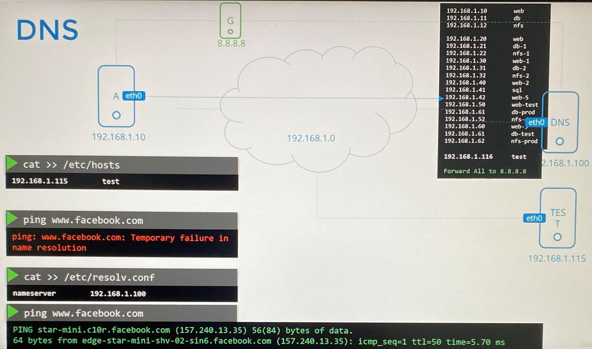

Public DNS server are resolved through by forwarding DNS request through
following.

root(.) \> top level domain(.com) \> second level(google)
\>subdomain\>\>\>\>

In order to speed up all DNS resolution, internal DNS server choose to
cache resolved IP for TTL in which it doesn't go through whole process
recurringly.

When you want to append the top level domain when you ping from the
hostname, add search entry with top level domain name into
/etc/resolv.conf

cat /etc/resolv.conf

nameserver 192.168.1.100

nameserver 8.8.8.8

search mycompany.com prod.mycompany.com

*Tools for DNS resolution*

nslookup [www.google.com](http://www.google.com) ; query hostname only
from DNS server. nslookup doesn’t find the entries in the local host
file but it only queries from DNS server

dig [www.google.com](http://www.google.com) ; to query DNS with more
details

*Record type*

A - to store IPV4 to hostname

AAAA - to store IPV6 to hostname

CNAME - to map one name to another name

**CoreDNS - Installation**

CoreDNS binaries can be downloaded from their Github releases page or as
a docker image. Extract the file.

 

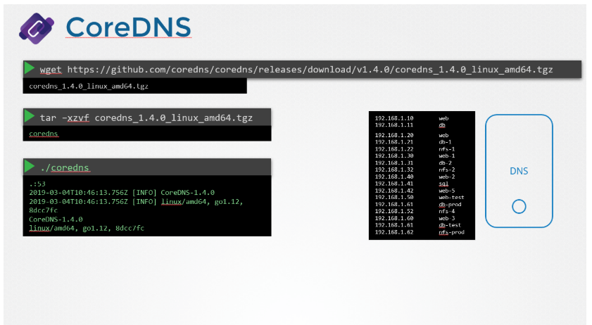

Run the executable to start a DNS server. It by default listens on port
53, which is the default port for a DNS server.

Put all of the entries into the DNS servers /etc/hosts file

Configure CoreDNS to use that file. CoreDNS loads it’s configuration
from a file named Corefile.

 

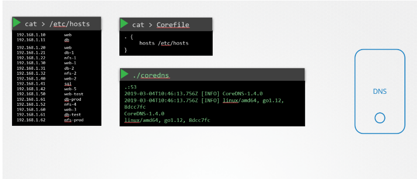

\`

CoreDNS also supports other ways of configuring DNS entries through
plugins.

<https://github.com/kubernetes/dns/blob/master/docs/specification.md>

<https://coredns.io/plugins/kubernetes/>

**Process namespace**

-The processes running inside container are isolated with namespace in
the host. The container doesn't see any other processes running on the
host, or any other containers.

-The underlying host, however, has visibility into all of the processes,
including those running inside the containers.

-You can list the processes within container. When you list same
processes as a root from underlying host, you can see all the processes
along with processes running inside the container where same process
running with different process ID inside and outside the container.

 

**Network Namespaces in Linux**

-The host has its own interfaces, routing table and ARP table.

-When the container is created, we create a network namespace for it,
that way it has no visibility to any network-related information on the
host. Within its namespace, the container can have its own virtual
interfaces, routing, and ARP tables.

-Thus network namespaces is used by docker to implement network
isolation.

 

*Create network ns*

ip netns add red ; create a new network namespace with name red on a
Linux host

ip netns ; list the network namespaces created on the host

*Exec in network ns*

ip link ; list the network interfaces on the host. This shows loopback
and eth0 interfaces

ip netns exec red ip link ; list the network interface in the red
network namespace

ip -n red link ; list the network interface in the red network namespace
similarly

 

arp ; list entries in the arp table on the host

ip netns exec red arp ; list arp table in the network namespace which
has no entries

route ; list the routes on the host

ip netns exec red route ; list routes in the network namespace

-With namespaces, we prevent the container from seeing the network
interface, route and arp table on the host.

The network namespaces have network connectivity and they cannot see
underlying network on the host. But we can connect two network
namespaces using ***virtual ethernet pair*** or a ***virtual
cable*(**veth). It is often referred as a ***pipe***.

1\. Create a virtual interface pair or virtual cable

ip link add *veth-red* type veth peer name *veth-blue* ; create a
virtual cable specifying with two interfaces veth-red and veth-blue

2\. Attach the virtual interfaces to each network namespace

ip link set veth-red netns red ; attach veth-red to red network
namespace

ip link set veth-blue netns blue ; attach veth-blue to blue network
namespace

3\. Assign ip address to virtual interfaces

ip -n red addr add 192.168.15.1 dev veth-red ; assign ip address to
veth-red interface

ip -n blue addr add 192.168.15.2 dev veth-blue ; assign ip address to
veth-blue interface

4\. Bring the virtual interface up

ip -n red link set veth-red up ; bring the veth-red up

ip -n blue link set veth-blue up ; bring the veth-blue up

ip netns exec red ping 192.168.15.2 ; ping the other veth-blue interface
from veth-red

ip netns exec red arp ; Each namespace identify the neighbors through
ARP table

 

However, when we see the arp table on the host, the host has no
visibility on the arp table entries on the network namespaces neither
interfaces in namespaces.

 

When increase number of network namespaces on the host, we create
***virtual switch*** to communicate network namespaces each other so
that there are multiple native solution such as **Linux bridge** and
**Open vSwitch.**

***Linux Bridge***

To create an internal bridge network, we add a new interface to the
host. This is an interface for the host and a virtual switch to network
namespaces.

ip link add v-net-0 type bridge ; create an interface for virtual switch
the type set as bridge. This interface appears in ip link command on the
host

ip link set dev v-net-0 up ; bring up the interface as it is by default
down

Since we are going to make connectivity between network namespaces
through bridge interface, no point of having the virtual cable to
connect two network namespaces we created earlier. So, it needs to
delete the virtual cable.

ip -n red link del veth-red ; delete the veth-red interface which
automatically delete veth-blue as they are a pair.

ip link add veth-red type veth peer name veth-red-br ; create new
virtual cable to connect red namespace with bridge network

ip link add veth-blue type veth peer name veth-blue-br ; create new
virtual cable to connect blue namespace with bridge network

ip link set veth-red netns red ; attach veth-red to red network
namespace

ip link set veth-red-br master v-net-0 ; attach veth-red-br to bridge
network on the nost

ip link set veth-blue netns blue ; attach veth-blue to blue network
namespace

ip link set veth-blue-br master v-net-0 ; attach veth-blue-br to virtual
switch on the nost

ip -n red addr add 192.168.15.1/24 dev veth-red ; assign ip address to
veth veth-red

ip -n blue addr add 192.168.15.2/24 dev veth-blue ; assign ip address to
veth veth-blue

ip -n red link set veth-red up ; bring the veth-red up

ip -n blue link set veth-blue up ; bring the veth-blue up

 

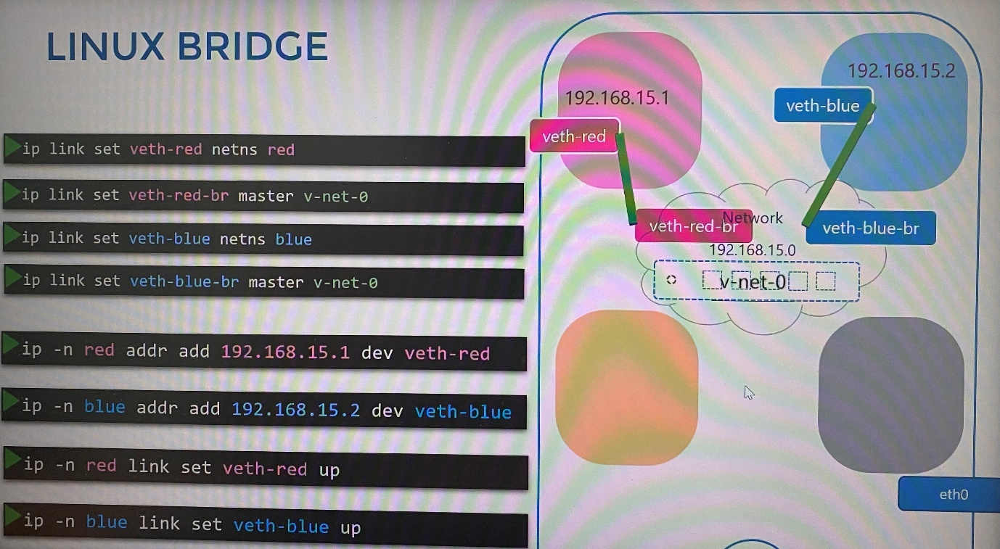

To have connectivity to all network namespaces through the bridge
network to the host network, we should assign IP address from internal
bridge network to bridge switch interface on the host.

ip addr add 192.168.15.5/24 dev v-net-0

From within the namespaces, you can't reach to outside network nor from
outside network.

 

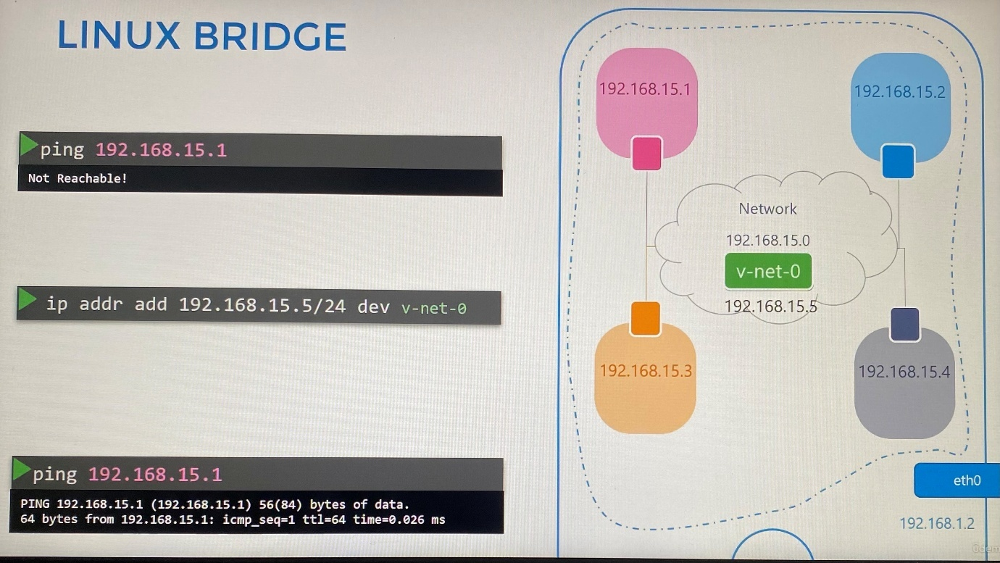

\*\*Make sure you set the NETMASK while setting IP Address.
ie: 192.168.1.10/24 to make connectivity between network namespaces.

Thus, the host has 2 ip addresses from different networks

1\. Ip address assigned to bridge switch

2\. Ip address assigned to the host itself - LAN

If a container in a network namespace need to connect another host in
LAN network, we add a route to the namespace setting up gateway through
bridge switch.

ip netns exec blue ip route add 192.168.1.0/24 via 192.168.15.5

Another thing to check is FirewallD/IP Table rules. Either add rules to
IP Tables to allow traffic from one namespace to another. Or disable
IP Tables all together.

 

However, our internal network doesn't know how to reach destination
network unless enable NAT functionality on the host acting as a gateway.

You should do that using IP tables. Add a new entry into NAT table in
the IP tables in the post routing chain to masquerade or replace the
from address on all packets coming from the source network to external
IP address on the host.

iptables -t nat -A POSTROUTING -s 192.168.15.0/24 -j MASQUERADE

 

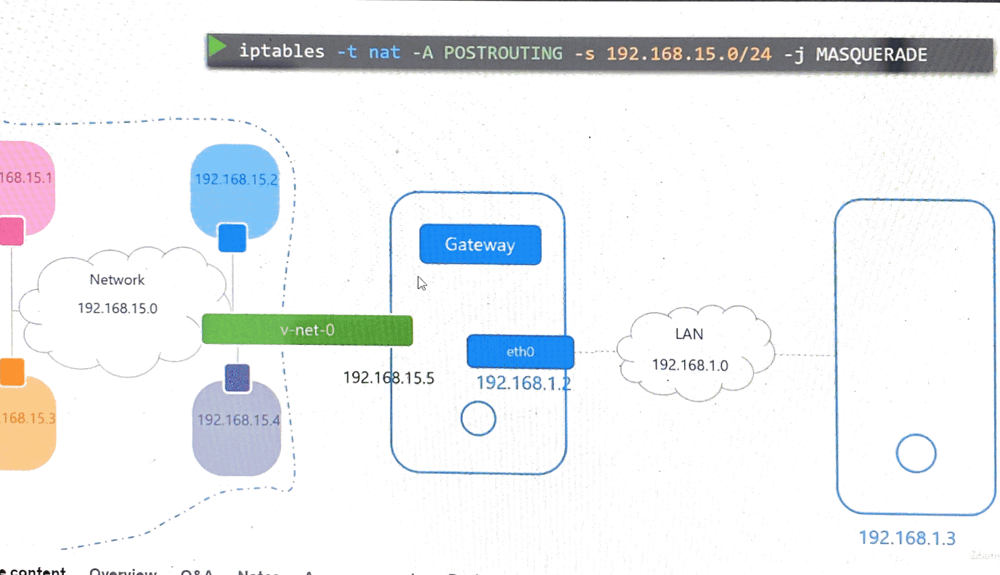

If a container in network namespace need to connect to the internet , we
add a route to the namespace setting up gateway through bridge switch

ip netns exec blue ip route add default via 192.168.15.5

 

If any outside network need to reach application hosted in the container
inside a network namespace on the inside host, we should add an ip route
entry onto outside host to reach the inside host or the second option is
to add port forwarding rule using iptable in the host.

iptables -t nat -A PREROUTING - -dport 80 - -to-destination
192.168.15.2:80 -j DNAT ; any traffic coming to Port 80 on the local
host is to be forwarded to port 80 on the IP assigned to the blue
namespace

 

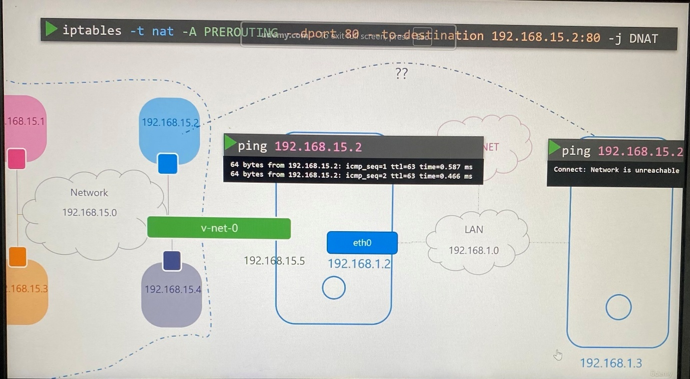

**Docker networking**

***None network***

Containers that don’t attach to any network. If you are on multiple
containers on the host, they cannot communicate each other or outside
network.

docker run - -network none nginx

***Host network***

Containers are attached to host network. There is no network isolation
between the host and the container. The container can be accessed
through host IP address.

docker run - -network host nginx

If you run multiple instance of the same container that listens on the
same port, it won't work as they share the host networking, because two
processes cannot listen on the same port at the same time.

***Bridge network***

When docker installs on the host, it creates internal private network
called ***bridge*** by default where the docker host and containers
attach to.

docker network ls ; list the networks with network ID, name, driver,
scope

But on the host, that network is created by the name ***docker0***.

ip link ; This command shows the docker0 network which is down

 

The bridge network is an interface to the host and also it is like a
switch to the namespaces or containers within the host.

ip addr ; shows the ip address assign to bridge network docker0

Whenever a container is created, docker creates network namespace for
it, create pair of interfaces, attach to one end network namespace and
bridge network, assign ip address to veth interfaces, brings up the veth
interfaces.

ip link add docker0 type bridge

ip netns ; list network namespace on the host

The namespace has the name starts with b3165, you can see namespace
associated with container with **docker inspect \<container ID\>**
command

 

Docker container refers to network namespace. A container and local
bridge docker0 connect each other through virtual ethernet pair.

ip link ; shows veth attached to docker0 bridge

ip -n \<namespace ID\> link ; shows other end of virtual interface on
network namespace

ip -n \<namespace ID\> addr ; show up address assign to network
namespace

Every time a new container is created. Docker creates a namespace,
creates a pair of interfaces, attaches one end to the container and
other end to the bridge network.

The interface pairs can be identified using their numbers, odd and even
form a pair.

 

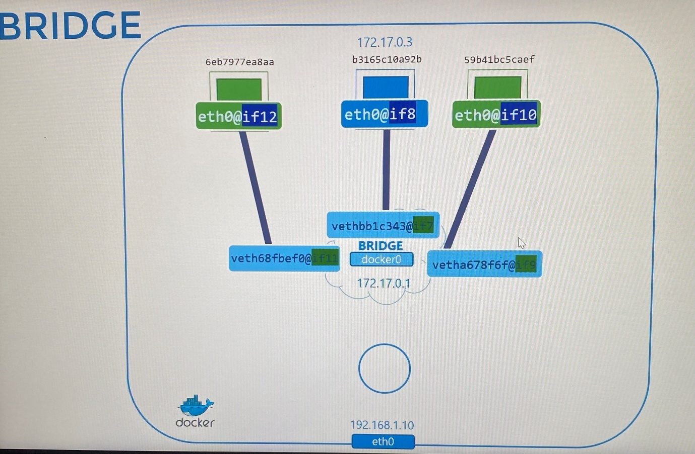

***Port mapping***

Only the containers inside the docker host can access another container
through a port.

docker run -p 8080:80 nginx ; configure port mapping from docker host
port 8080 to container port 80 to forward the traffic .

Using iptables, we create entry into NAT table to append the rules to
the prerouting chain to change the destination port from 8080 to 80.

iptables \\

-t nat \\

-A PREROUTING \\

-j DNAT \\

\- - dport 8080 \\

\- - to-destination 80

Similarly, docker create underlying NAT rule in iptables in the host as
follows.

iptables \\

-t nat \\

-A DOCKER \\

-j DNAT \\

\- - dport 8080 \\

\- - to-destination 172.17.0.3:80

iptables -nvL -t nat ; list the rules that Docker creates in iptables

 

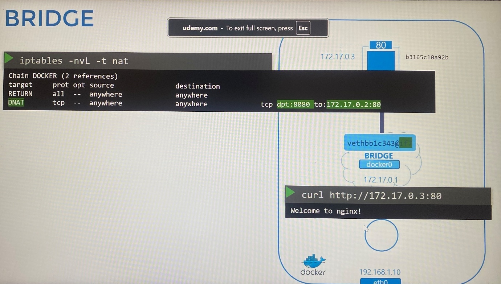

**Container Networking Interface(CNI)**

Connect network namespace to bridge network follows these steps. In the
same way, Docker does bridge networking option except it uses different
naming pattern.

1\. Create network namespace

2\. Create Bridge network/interface

3\. Create VETH Pairs(Pipe, Virtual Cable)

4\. Attach vEth to Namespace

5\. Attach Other vEth to Bridge

6\. Assign IP addresses

7\. Bring the interfaces up

8\. Add routes on network namespace for external network

9.Enable NAT - IP Masquerade for external communication

Container runtimes such as Docker, rocket, Mesos follow the same way for
bridge networking to configure network between containers with minor
changes as similar as network namespace even Kubernetes.

 

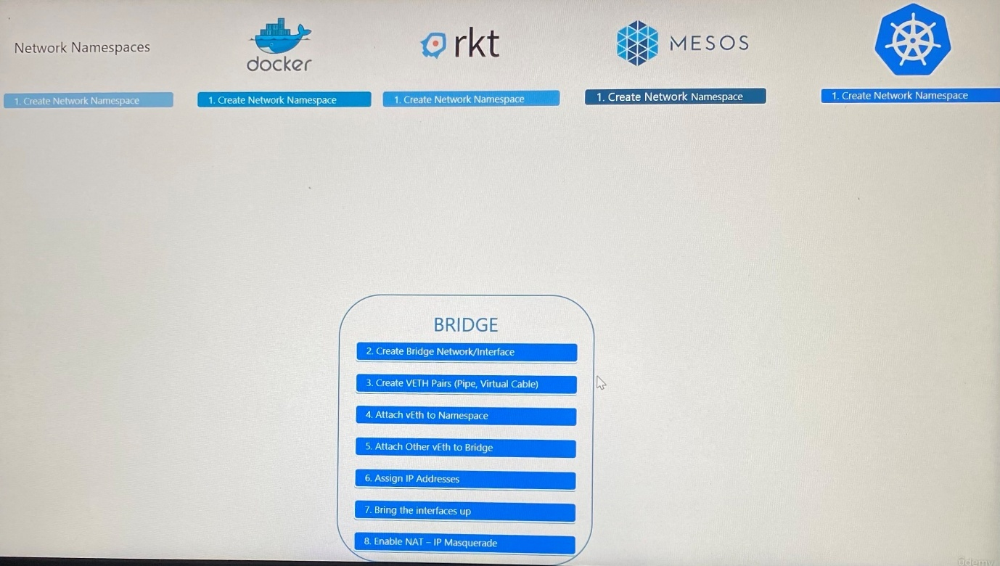

To create a single standard approach for all container solutions, we
move all the networking portions of it into single program code/script
that performs all required tasks to attach containers to bridge network.

Run this program using its name, bridge and specify that you want to add
new container to a particular network namespace.

\>bridge add 2e34dcf34 /var/run/netns/2e34dcf34

Similarly, rocket and Kubernetes call the bridge program and pass the
container ID and namespace to get networking configured for that
container.

bridge add \<container id\> \<path to namespace\>

Container Runtime Interface(CNI) is set of standards that define how
program(plugin) should be developed to solve networking challenges in a
container runtime environment. The program is referred to as plugin. In
this case, Bridge program that we referred to is a plugin for CNI.

CNI defines how plugin should be developed and how container runtime
should invoke them. CNI defines set of responsibilities for container
runtimes and plugin as follows.

@Container Runtime

\- Container Runtime must create network namespace for each container

\- Identity network the container must attach to

\- Container Runtime must invoke Network Plugin(bridge) when container
is created using ADD command

\- Container Runtime must invoke Network Plugin(bridge) when container
is deleted using DEL command

\- Specify how configure a network plugin on container runtime using a
JSON file

@Plugin side

\- Must support command line arguments ADD/DEL/CHECK

\- Must support parameters container id, networks ns etc…

\- Must manage IP Address assignment to PODs and any associated routes
required for containers to reach other containers

\- Must Return results in a specific format

CNI comes with set of supported plugins such as BRIDGE, VLAN, IPVLAN,
MACVLAN, WINDOWS as well as IPAM plugin such as DHCP, host-local

There are other third party plugins available in these soltions such as
weaveworks, flannel, cilium, VMware NSX, calico, infoblox

All container runtimes(rocket, Mesos, Kubernetes) except Docker supports
these plugins as Docker does not implement CNI. Only docker maintains
Container Network Model(CNM) which is another standard that solve
container networking challenges with some differences beyond CNI.

These plugins don't natively integrate with Docker. But that doesn't
mean you can't use Docker with CNI. To use Docker with CNI, create a
Docker container without any network configuration and then manually
invoke the bridge plugin and other CNI plugin. Kubernetes does same way
when creates a container.

docker run --network-none nginx

bridge add 2e34dcf34 /var/run/netns/2e34dcf34

**Important Note about CNI and CKA Exam**

**An important tip about deploying Network Addons in a Kubernetes
cluster.**

In the upcoming labs, we will work with Network Addons. This includes
installing a network plugin in the cluster. While we have used weave-net
as an example, please bear in mind that you can use any of the plugins
which are described here:

[**https://kubernetes.io/docs/concepts/cluster-administration/addons/**](https://kubernetes.io/docs/concepts/cluster-administration/addons/)

[**https://kubernetes.io/docs/concepts/cluster-administration/networking/#how-to-implement-the-kubernetes-networking-model**](https://kubernetes.io/docs/concepts/cluster-administration/networking/#how-to-implement-the-kubernetes-networking-model)

In the CKA exam, for a question that requires you to deploy a network
addon, unless specifically directed, you may use any of the solutions
described in the link above.

***However, ***the documentation currently does not contain a direct
reference to the exact command to be used to deploy a third-party
network addon.

The links above redirect to third-party/vendor sites or GitHub
repositories, which cannot be used in the exam. This has been
intentionally done to keep the content in the Kubernetes documentation
vendor-neutral.

**NOTE:** In the official exam, all essential CNI deployment details
will be provided.

To clean up the Flannel CNI from the cluster, delete the Flannel
DaemonSet, configuration file, as well as the ConfigMap hosting the
Flannel configuration:

kubectl delete daemonset -n kube-flannel kube-flannel-ds

kubectl delete cm kube-flannel-cfg -n kube-flannel

rm /etc/cni/net.d/10-flannel.conflist

[Calico quickstart guide \| Calico
Documentation](https://docs.tigera.io/calico/latest/getting-started/kubernetes/quickstart)

Download and apply the Calico manifest:

kubectl create -f
<https://raw.githubusercontent.com/projectcalico/calico/v3.29.3/manifests/tigera-operator.yaml>

Download the custom resource definition yaml:

wget
<https://raw.githubusercontent.com/projectcalico/calico/v3.29.3/manifests/custom-resources.yaml>
-O

Edit the file to update the CIDR network:

\# vi custom-resources.yaml

...

apiVersion: operator.tigera.io/v1

kind: Installation

metadata:

name: default

spec:

\# Configures Calico networking.

calicoNetwork:

ipPools:

\- name: default-ipv4-ippool

blockSize: 26

cidr: 172.17.0.0/16 \# Update this field

encapsulation: VXLANCrossSubnet

natOutgoing: Enabled

nodeSelector: all()

…

 

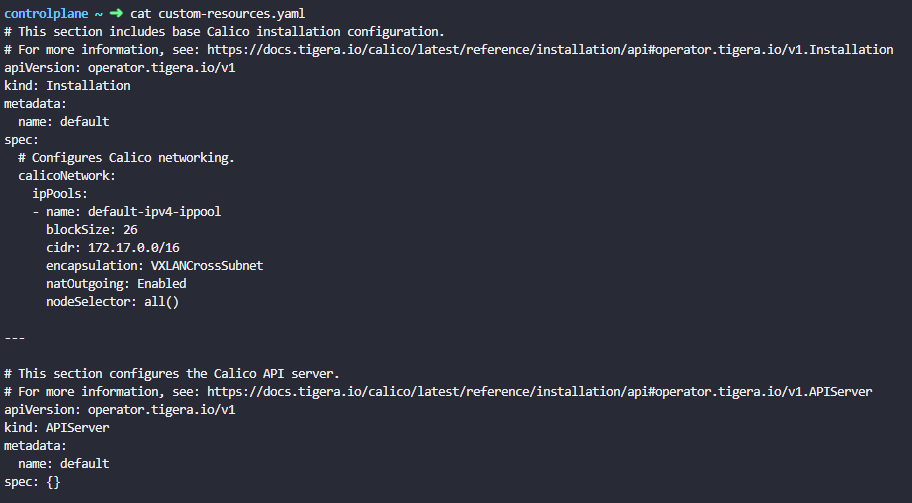

Apply the manifest file:

kubectl apply -f custom-resources.yaml

 

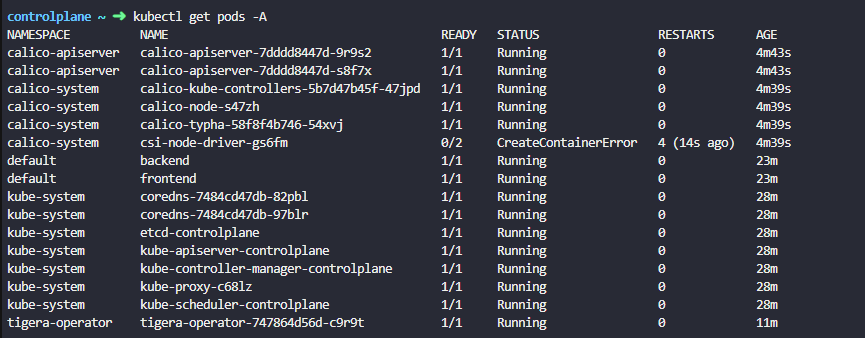

Now, wait until the calico pods are running:

watch kubectl get pods -A

You may ignore errors on the csi-node-driver pod deployed in the
calico-system namespace.

 

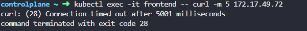

**Cluster networking**

Master and worker nodes should have interfaces assigned with IP address
in a network, host must have unique hostname and MAC address.

***Ports***

These ports should be opened for the components in master and worker
nodes. The connections on that ports only accepts.

**Kube-API** server : 6443

**Kubelet** on master and worker nodes : 10250

**Kube-scheduler** : 10259

**Kube-controller-manager** : 10257

Worker nodes expose **Services** for external access : 30000-32767

**ETCD** server : 2379

**ETCD** peers: 2380

netstat -nplt command shows all active Internet connections (only
servers) with state, local address with port, PID/program name

If you have multiple master node, these ports should be opened on those
master nodes as well.

 

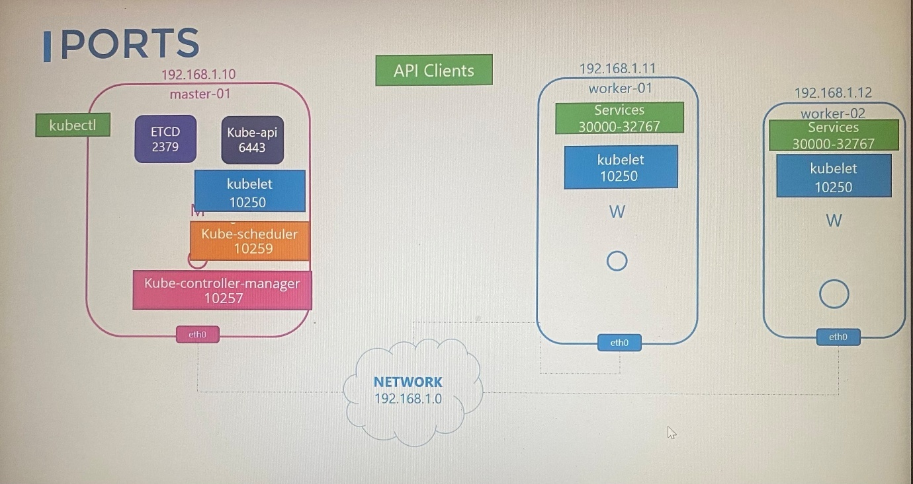

If there are multiple master nodes in the cluster, port 2380 should be
opened to communicate ETCD clients each other.

 

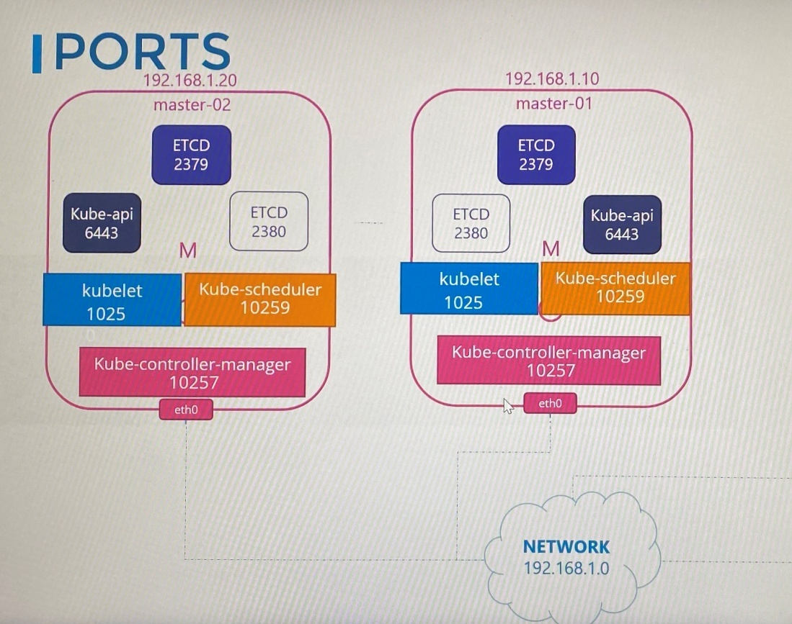

Consider these ports to be opened when you set up networking for nodes
in firewalls or IP table rules or network security group in a cloud
environment such as Azure, AWS, GCP

 

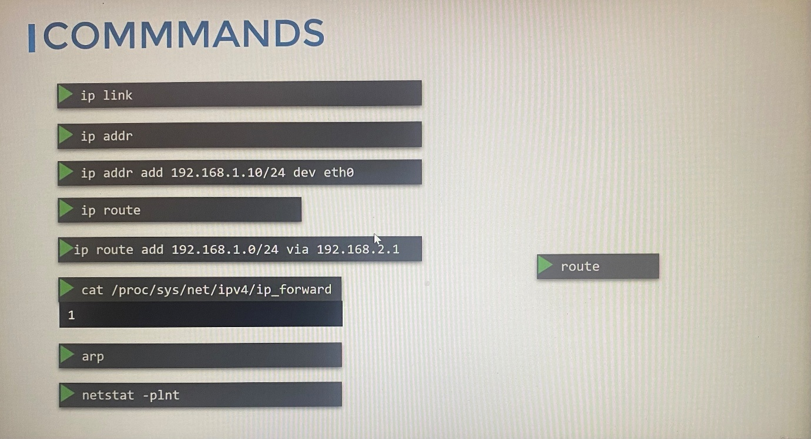

netstat - -help ; check all commands available on netstat

netstat -l ; display listening server sockets

netstat -aon ; display active connection on windows

netstat -npl \| grep -i scheduler ; listening connection of scheduler,
-i is for case insensitive

netstat -npa \| grep -i etcd ; to search client connections established
to etcd server

 

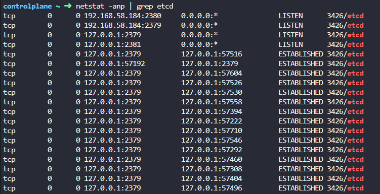

netstat -npa \| grep -i etcd \| grep -i 2379 \| wc -l ; count the
established connection from etcd server and from the particular port

netstat -nplt ; Active Internet connections (only servers) with state,
local address with port, PID/program name

 

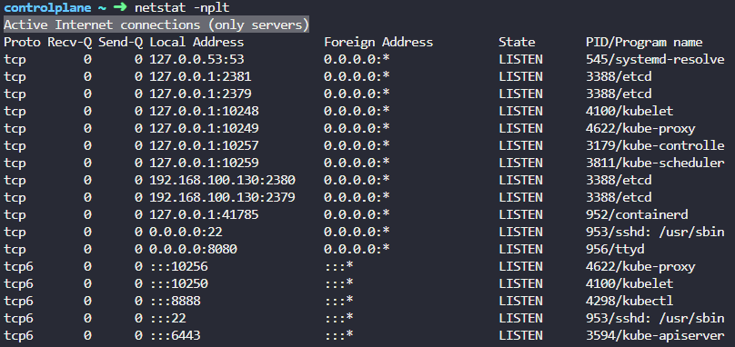

2379 is the port of ETCD to which all control plane components connect
to. 2380 is only for etcd peer-to-peer connectivity when you have
multiple controlplane nodes

**Pod networking**

Make sure firewall and NSGs are correctly configured for controlplane
components to connect each other.

Networking at pod layer should solve following challenges, hence it
comes with this networking model.

***Networking model***

A networking model that needs to develop that uses for pod networking is
able to make the following requirements.

\- Every pod should have an IP address

\- Every pod should be able to communicate with every other pod in same
node

\- Every pod should be able to communicate with every other pod on other
nodes using the same IP address without NAT

Network solution : weaveworks, flannel, cilium, VMware NSX, calico

If there are multiple nodes in the cluster, to make communication
between pods, Kubernetes creates network namespaces for the containers
and attach them to the bridge network.

1\. Create bridge network for each node - ***ip link add v-net-0 type
bridge***

2\. Bring the bridge network up - ***ip link set dev v-net-0 up***

3\. Choose unique network for each bridge network in nodes

4\. Set an ip address from each subnet to bridge interface in each
node - ***ip address add 10.244.1.1/24 dev v-net-0***

When we create a container every time, setting the ip address from the
subnet chose to container will be made by using the script
**net-script.sh**, this script includes the steps following.

1\. Create veth pair

2\. Attach veth pair ends to the network namespace and to the bridge

3\. Assign ip address to veth interfaces at network namespace

4\. Add route at network namespace point to the default gateway(bridge
interface on the host)

5\. Bring the veth interfaces up on network namespace

The script get IP address assigns for container with some IPAM solution.

\*Default gateway IP we add either manage by ourselves or store those
information some database.

This script should run each nodes whenever a container creates so that
we copy the same script to other nodes and run the script to assign IP
addresses to connect containers to internal network. Now we have
achieved assigning unique IP address to pods and communicating pods each
other within node.

To communicate pods between nodes, we must add routes on each node to
reach IP address in each pod in nodes through IP address on node.

ip route add 10.244.2.2 via 192.168.1.12

Instead of having to configure routes on each node, a better solution is
to do that using a router if you have one in your network and point all
hosts to use that as the default gateway. That way you can easily manage
routes to all networks in the routing table on the router.

 

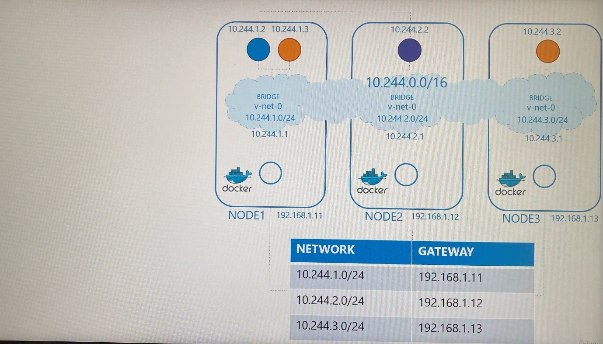

When the cluster grows with pods, executing the script manually and
adding routes for each pod is not scalable. That’s where CNI comes to
tell Kubernetes that this is how you should call a script as soon as
create a container. We need to modify the script to meet CNI standards
such as adding container to the network and deleting container interface
from the network and freeing IP address.

Container runtime in each node is responsible creating containers.
Container runtime looks at CNI configuration and pass as command line
arguments when it is run and identifies the script name. Then look the
script in /opt/cni/bin directory and executes the script with add
command. The script take care the rest.

Container runtime\> /etc/cni/net.d/net-script.conflist \>
/opt/cni/bin/net-script.sh\> ./net-script.sh add \<container name\>
\<namespace ID\>

 

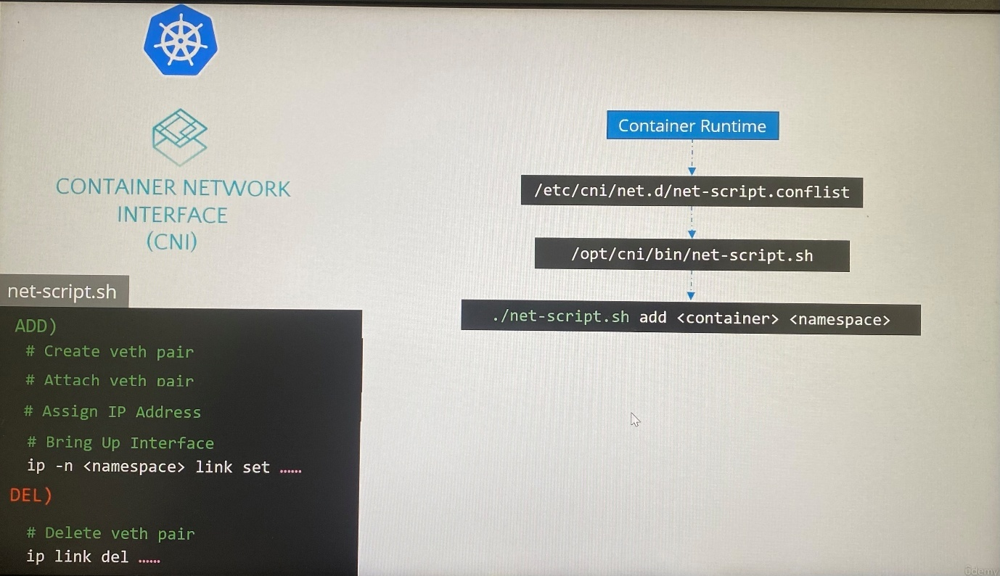

**CNI in Kubernetes**

The CNI plugin must be invoked by the component(container runtime such
as ContainerD, cri-o) within Kubernetes that is responsible for creating
containers because the container runtime must then invoke the
appropriate network plugin after the container is created.

CNI plugin is configured in Kubelet service on each node in the cluster

ps -aux \| grep kubelet ; view kubelet options including container
runtime endpoint value in kubernetes

 

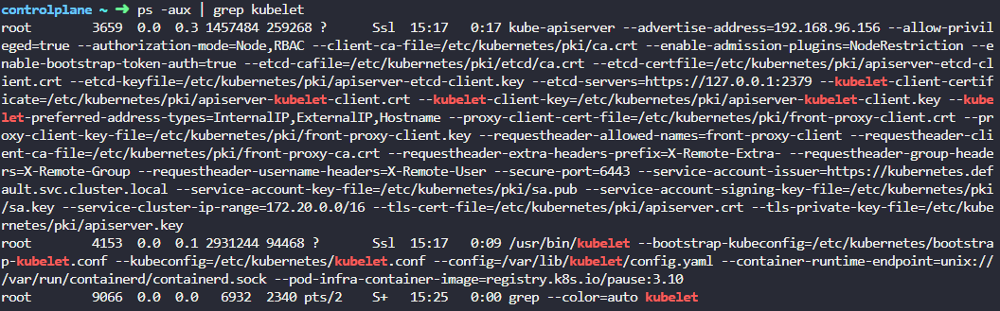

ps -aux \| grep kubelet \| grep network ; view kubelet options related
to network

All network plugins are installed in the directory **/opt/cni/bin**

ls /opt/cni/bin ; directory where container runtime finds the CNI plugin
installed

ls /etc/cni/net.d ; this directory has multiple plugin configuration
files that are responsible for configuring each plugin.

 

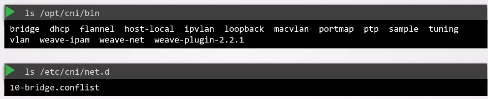

This sis where container runtime find out which plugin to be used. If
there are multiple files, it will choose alphabetical order.

These configuration files specify what binary executable file in
/opt/cni/bin will be run by kubelet after a container and associated
namespace are created

isGateway - define whether the bridge interface should get an IP address
assigned to act as gateway

ipMasq - IP masquerade defines if a NAT rule should be added

ipam - ip address management for bridge interface. It defines subnet,
type - \[host-local/dhcp\], routes

 

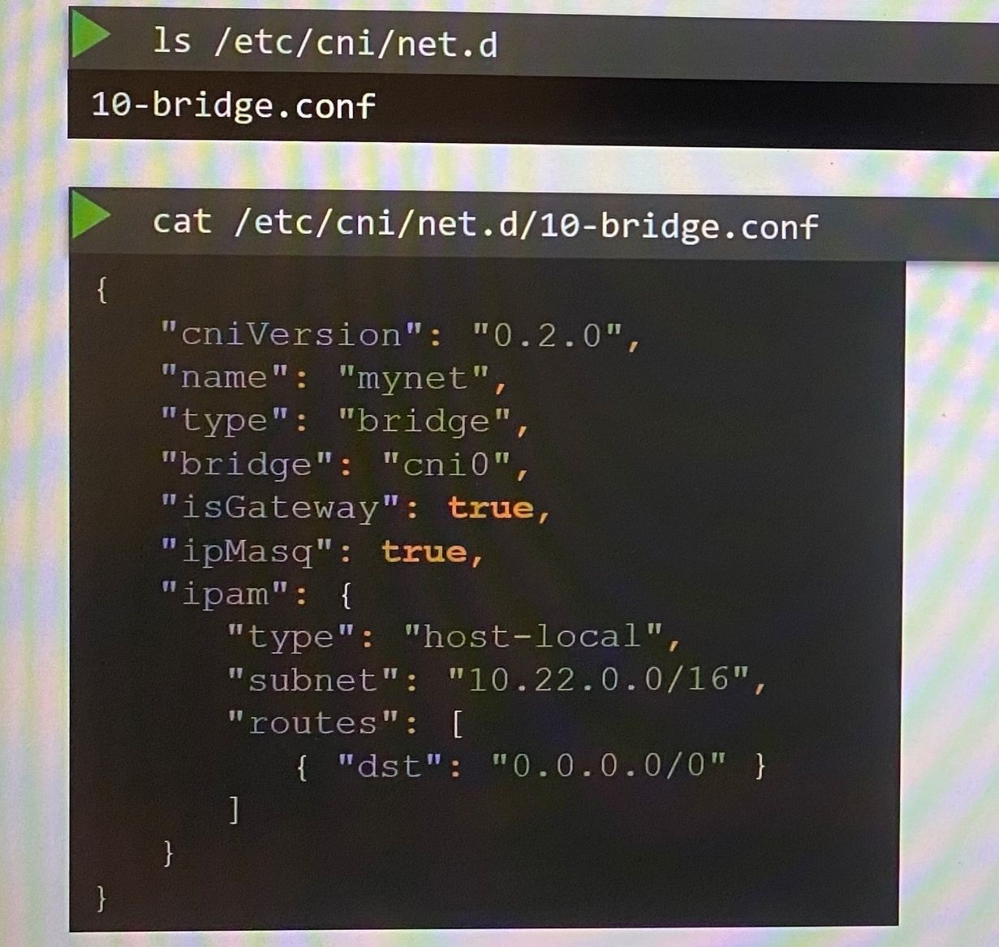

**Weaveworks(CNI)**

As we set up routing table manually where we mapped what networks are on
what hosts. The packets are routed based on the details in routing
table. This method is suitable for small environment. This method is not
practical for larger environment that have hundreds of nodes and pods in
the cluster which is where you need to get creative solution.

When weaveworks CNI plugins deploy on the cluster, it deploys an agent
or service on each node. To communicate each other to exchange
information regarding nodes, networks and pods within agents, each peer
or agent stores topology of entire setup. That way agent knows pods and
their IP addresses on each nodes.

Weave creates its own bridge on the nodes and names it as **WEAVE** and
assign ip address to each network.

Note that single pod can attach to multiple bridge such weave bridge,
docker bridge. What path a packet takes to reach its destination depends
on the route configured on the container. Weave make sure that pods gets
the correct route configured to reach the agent, and the agent then
takes care of other pods.

When a packet is sent from one pod to another on another node, Weave
intercepts the packet and identifies that it's on a separate network, it
then encapsulates this packet into a new one with new source and
destination and sends it across the network. Once on the other side, the
other Weave agent retrieves the packet, decapsulates it, and routes the
packet to the right pod.

 

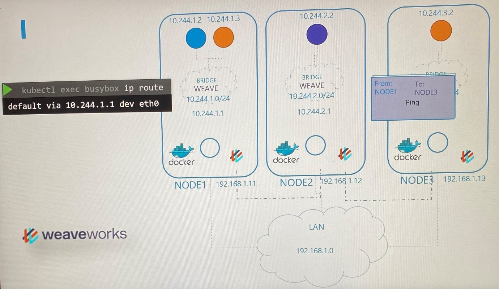

***Deploy weave***

Weave and weave peers can be deployed as services or daemons on each
node in the cluster manually or if Kubernetes is already deployed, weave
peers can be deployed as pods in the namespace kube-system in the
cluster.

Once the base Kubernetes system is ready, with nodes and networking
configured correctly between the nodes, deploy weave as follows.

kubectl apply -f
“<https://cloud.weave.works/K8s/net?k8s-version=$(kubectl> version \|
base64 \| tr -d ‘\n’)” ; deploy all necessary components of weave where
weave peers deploy as daemonsets, it creates for serviceaccount, cluster
role, cluster role binding, role and role binding.

 

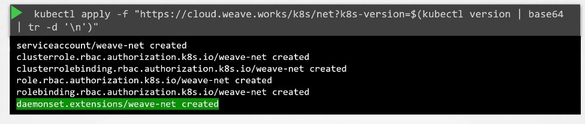

***Weave peers***

If you deploy the cluster with kubeadm tool and weave plugin, you can
see the weave peers as pods deployed on each node.

The weave manifest file is located in /root/weave

kubectl get pods -n kube-system ; show all the weave peers if you deploy
cluster with kubeadm tool

kubectl logs \<weave peer pod name\> -n kube-system ; show logs on the
pods

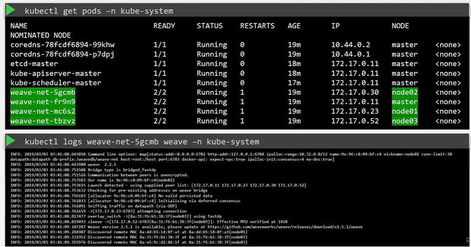

-----------------------weave-daemonset-k8s.yaml
-------------------------------

apiVersion: v1

kind: List

items:

\- apiVersion: v1

kind: ServiceAccount

metadata:

name: weave-net

labels:

name: weave-net

namespace: kube-system

\- apiVersion: rbac.authorization.k8s.io/v1

kind: ClusterRole

metadata:

name: weave-net

labels:

name: weave-net

rules:

\- apiGroups:

\- ''

resources:

\- pods

\- namespaces

\- nodes

verbs:

\- get

\- list

\- watch

\- apiGroups:

\- extensions

resources:

\- networkpolicies

verbs:

\- get

\- list

\- watch

\- apiGroups:

\- 'networking.k8s.io'

resources:

\- networkpolicies

verbs:

\- get

\- list

\- watch

\- apiGroups:

\- ''

resources:

\- nodes/status

verbs:

\- patch

\- update

\- apiVersion: rbac.authorization.k8s.io/v1

kind: ClusterRoleBinding

metadata:

name: weave-net

labels:

name: weave-net

roleRef:

kind: ClusterRole

name: weave-net

apiGroup: rbac.authorization.k8s.io

subjects:

\- kind: ServiceAccount

name: weave-net

namespace: kube-system

\- apiVersion: rbac.authorization.k8s.io/v1

kind: Role

metadata:

name: weave-net

namespace: kube-system

labels:

name: weave-net

rules:

\- apiGroups:

\- ''

resources:

\- configmaps

resourceNames:

\- weave-net

verbs:

\- get

\- update

\- apiGroups:

\- ''

resources:

\- configmaps

verbs:

\- create

\- apiVersion: rbac.authorization.k8s.io/v1

kind: RoleBinding

metadata:

name: weave-net

namespace: kube-system

labels:

name: weave-net

roleRef:

kind: Role

name: weave-net

apiGroup: rbac.authorization.k8s.io

subjects:

\- kind: ServiceAccount

name: weave-net

namespace: kube-system

\- apiVersion: apps/v1

kind: DaemonSet

metadata:

name: weave-net

labels:

name: weave-net

namespace: kube-system

spec:

\# Wait 5 seconds to let pod connect before rolling next pod

selector:

matchLabels:

name: weave-net

minReadySeconds: 5

template:

metadata:

labels:

name: weave-net

spec:

initContainers:

\- name: weave-init

image: 'weaveworks/weave-kube:2.8.1'

command:

\- /home/weave/init.sh

env:

securityContext:

privileged: true

volumeMounts:

\- name: cni-bin

mountPath: /host/opt

\- name: cni-bin2

mountPath: /host/home

\- name: cni-conf

mountPath: /host/etc

\- name: lib-modules

mountPath: /lib/modules

\- name: xtables-lock

mountPath: /run/xtables.lock

readOnly: false

containers:

\- name: weave

command:

\- /home/weave/launch.sh

**env:**

**- name: IPALLOC_RANGE**

**value: 10.32.1.0/24**

\- name: INIT_CONTAINER

value: "true"

\- name: HOSTNAME

valueFrom:

fieldRef:

apiVersion: v1

fieldPath: spec.nodeName

image: 'weaveworks/weave-kube:2.8.1'

readinessProbe:

httpGet:

host: 127.0.0.1

path: /status

port: 6784

resources:

requests:

cpu: 50m

securityContext:

privileged: true

volumeMounts:

\- name: weavedb

mountPath: /weavedb

\- name: dbus

mountPath: /host/var/lib/dbus

readOnly: true

\- mountPath: /host/etc/machine-id

name: cni-machine-id

readOnly: true

\- name: xtables-lock

mountPath: /run/xtables.lock

readOnly: false

\- name: weave-npc

env:

\- name: HOSTNAME

valueFrom:

fieldRef:

apiVersion: v1

fieldPath: spec.nodeName

image: 'weaveworks/weave-npc:2.8.1'

\#npc-args

resources:

requests:

cpu: 50m

securityContext:

privileged: true

volumeMounts:

\- name: xtables-lock

mountPath: /run/xtables.lock

readOnly: false

hostNetwork: true

dnsPolicy: ClusterFirstWithHostNet

hostPID: false

restartPolicy: Always

securityContext:

seLinuxOptions: {}

serviceAccountName: weave-net

tolerations:

\- effect: NoSchedule

operator: Exists

\- effect: NoExecute

operator: Exists

volumes:

\- name: weavedb

hostPath:

path: /var/lib/weave

\- name: cni-bin

hostPath:

path: /opt

\- name: cni-bin2

hostPath:

path: /home

\- name: cni-conf

hostPath:

path: /etc

\- name: cni-machine-id

hostPath:

path: /etc/machine-id

\- name: dbus

hostPath:

path: /var/lib/dbus

\- name: lib-modules

hostPath:

path: /lib/modules

\- name: xtables-lock

hostPath:

path: /run/xtables.lock

type: FileOrCreate

priorityClassName: system-node-critical

updateStrategy:

type: RollingUpdate

controlplane ~ ➜ kubectl apply -f /root/weave/weave-daemonset-k8s.yaml

serviceaccount/weave-net created

clusterrole.rbac.authorization.k8s.io/weave-net created

clusterrolebinding.rbac.authorization.k8s.io/weave-net created

role.rbac.authorization.k8s.io/weave-net created

rolebinding.rbac.authorization.k8s.io/weave-net created

daemonset.apps/weave-net created

**Note CNI Weave**

Important Update: -

Before going to the CNI weave lecture, we have an update for the Weave
Net installation link. They have announced the end of service for Weave
Cloud.

To know more about this, read the blog from the link below: -

<https://www.weave.works/blog/weave-cloud-end-of-service>

As an impact, the old weave net installation link won’t work anymore: -

kubectl apply -f
"[https://cloud.weave.works/k8s/net?k8s-version=\$(kubectl version \|
base64 \| tr -d
'\n')](https://cloud.weave.works/k8s/net?k8s-version=$(kubectl%20version%20|%20base64%20|%20tr%20-d%20'\n'))"

Instead of that, use the below latest link to install the weave net: -

kubectl apply -f
<https://github.com/weaveworks/weave/releases/download/v2.8.1/weave-daemonset-k8s.yaml>

Reference links: -

<https://www.weave.works/docs/net/latest/kubernetes/kube-addon/#-installation>

<https://github.com/weaveworks/weave/releases>

**IP address management(IPAM)- Weave**

This covers how virtual bridge network in the nodes assign IP subnets,
how assign IP address to pods, where these information stored and who is
responsible for ensuring there are no duplicate IP is assigned

CNI plugin that the network solution provider is responsible to manage
the IP subnets on each node for pods without conflicting by storing list
of IPs in a file(ip-list.txt). We have necessary code in the script
where it defines command line arguments to retrieve free IP from that
file place on each host and manage the IPs parts of node.

\# Retrieve Free IP from file

ip = get_free_ip_from_file()

CNI comes with two built-in plugin(***DHCP*** and ***host-local)*** by
outsourcing the coding on the script.

Host-local - managing the IP address locally on each host. We should
invoke this plugin through the script or can our script dynamic to
support different kind of plugin.

\# Invoke IPAM host-local plugin

ip = get_free_ip_from_host_local()

 

The CNI plugin configuration file- /etc/cni/net.d/net-script.conf has
section to specify the type of plugin, subnet and routes to be used.
These details can be read from script to invoke the appropriate plugin
instead hard coding it to use host local every time.

 

Different network solution providers do the IPAM function differently.

Weaveworks by default allocates IP address from the range
10.32.0.0/12(10.32.0.1 \> 10.47.255.254). From this range, one portion
equally assign to each node.(10.32.0.0/16, 10.38.0.0/16, 10.44.0.0/16)

Check logs on the container in order to check the ip address assigned.

kubectl logs -n kube-system \<pod name\> ; ipalloc-range shows ip range
assign for pods

kubectl exec \<pod name\> - - route -n

kubectl exec \<pod name\> - - ip route ; check the default gateway for
the pod

kubectl exec it \<pod name\> - - curl -m 5 \<pod ip address\>

**Service Networking**

\- Service networking uses when a pod need access to another pod on
different nodes in the cluster because we rarely configure pods to
communicate directly with other pods

\- While pod is hosted on a node, a service for the pod is hosted across
the cluster and it is not bound to a node. That service is only
accessible within the cluster. This type of service is called
***ClusterIP*** which has ip address

\- If a pod need to access from outside the cluster, the service we
create is called ***NodePort*** which is act same as ClusterIP.
Additionally, NodePort service expose pod application for request come
from outside the cluster on a port from all node in the cluster

 

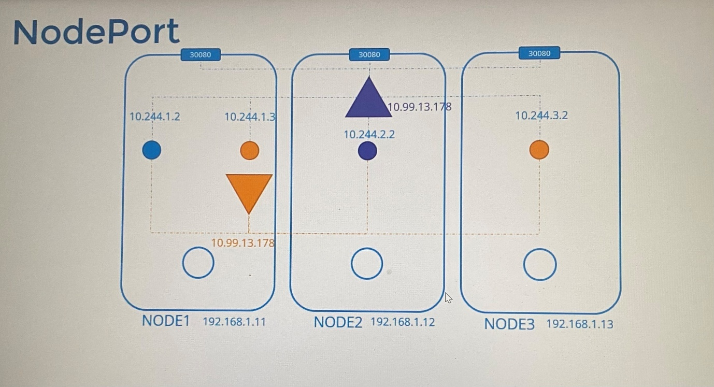

-Kubernetes node runs a kubelet process which is responsible for
creating pods based on the changes communicates by kube-api server. Then
Kubelet invoke CNI plugin to configure networking for that pod.

-Similarly kube-proxy watches the changes in the cluster through Kube
API server, Kube proxy get action when every time a new service is to be
created.

-There is no server or service really listening on the IP of the
service. Thus, service is a virtual object that run across the cluster.
Services are not created or assigned on nodes. Unlike pods, services
have no processes, namespaces or interfaces. So how service get IP
address??

\- When service object is created, it is assigned ip address from
predefined range with the combination of port through Kube-proxy. Then
kube-proxy running on each node get those ip address and creates
forwarding rule on each node by calling that any traffic coming to ip
address of the service should forward to ip address of the pod. Note
that the service has combination of IP address and port. Whenever
service created or deleted , the kube-proxy creates or deletes these
rules.

-Thus, when a pod tries to reach the IP of the service, it is forwarded
to the pod's IP address

 

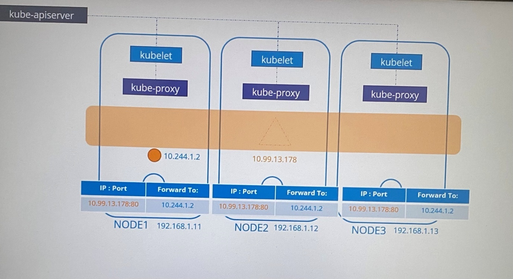

\- To create these rules, Kube-proxy supports different ways such as
***userspace*** where kube proxy listen on ports for each service and
proxies connect to the pods by creating ***ipvs*** rules or
***iptables*** which is default option

\- Set the proxy-mode when configure kube-proxy service. If this is not
set, by default it gets iptables

kube-proxy - -proxy-mode \[userspace \| iptables \| ipvs \] …

\- IP range assign for services is specified in kube-apiserver server
with the option called ***service-cluster-ip-range***

kube-api-server - -service-cluster-ip-range ipNet (Default: 10.0.0.0/24)

ps -aux \| grep kube-api-server ; check the option
***service-cluster-ip-range*** in kube-api-server where it shows the
service cluster ip range

\*The ip ranges of pods and services shouldn’t be overlapped with same
ip range

iptables -L -t nat \| grep db-service ; check all rules for services are
created by kube-proxy in iptables as dnat rule

 

cat /var/log/kube-proxy.log ; create logs by kube-proxy it shows what
proxy mode they use

To check range of IP addresses configured for PODs on this cluster

Controlplane ~ ➜ kubectl logs weave-net-wmgpt weave -n kube-system

INFO: 2025/01/17 05:25:26.353097 Command line options:
map\[conn-limit:200 datapath:datapath db-prefix:/weavedb/weave-net
docker-api: expect-npc:true http-addr:127.0.0.1:6784
ipalloc-init:consensus=1 **ipalloc-range:10.244.0.0/16**
metrics-addr:0.0.0.0:6782 name:32:84:f5:06:55:2b nickname:node01
no-dns:true no-masq-local:true port:6783\]

To check range of IP addresses configured for services in this cluster

controlplane ~ ➜ cat /etc/kubernetes/manifests/kube-apiserver.yaml \|
grep service-cluster-ip-range

\- --service-cluster-ip-range=10.96.0.0/12

 

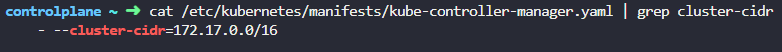

 

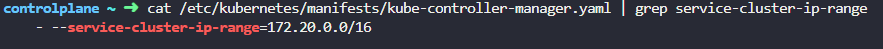

 

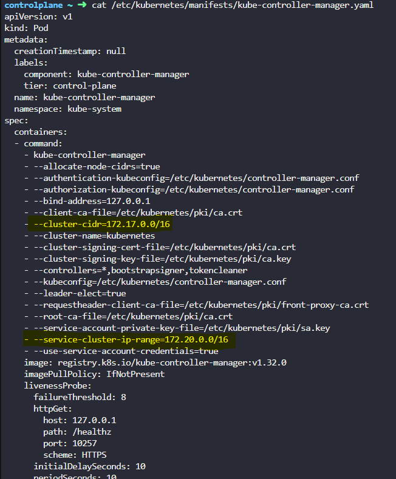

To check type of proxy is the kube-proxy configured to use

controlplane ~ ➜ kubectl logs kube-proxy-6744l kube-proxy -n kube-system

I0117 05:24:58.954679 1 server_linux.go:66\] "Using iptables proxy"

 

**DNS in Kubernetes**

-Kubernetes deploys a bult-in DNS server by default when setup the
cluster. If you setup Kubernetes manually, then you do it by yourself.

Kubernetes uses DNS server ***CoreDNS*** for DNS resolution.

When a service is created, the Kubernetes DNS service(***CoreDNS*** )
creates a DNS record for the service that maps service name to the IP
address.

If a pod needs to access another pod using DNS, the DNS record created
for the service will be used to reach by the pod so that all service and
pods should be in same namespace. If destination pod is in another
namespace, you should use FQDN such as (hostname.namespace.type.root)

curl <http://web-service>( hostname of the service) ; any pod within
same namespace in the cluster can reach a service using o service name

If destination pod is in another namespace, DNS server creates subdomain
for the namespace.

All pods and services for a namespace are thus grouped together into a
Subdomain in the name of eachnamespace.“DB-service.dev”

curl <http://web-service.apps> (hostname of the service, name of the
namespace)

All the services for a namespace are further grouped together into a
Subdomain in the name of the namespace and and type SVC.
“DB-service.dev.svc.cluster.local”

curl <http://web-service.apps.svc> (hostname of the service, name of the
namespace, type SVC)

*FQDN for service*

hostname.namespace.type.root \> ip address

web-service.apps.svc.cluster.local \> ip address

\- DNS records for the name of pods are not by default created by DNS
service. But we can enable it explicitly but it doesn’t create pod name
instead create a name record similar to IP address replacing . with -

10.244.2.5 \> 10-243-2-5

*FQDN for pod*

hostname.namespace.type.root \> ip address

10-243-2-5.apps.pod.cluster.local \> ip address

 

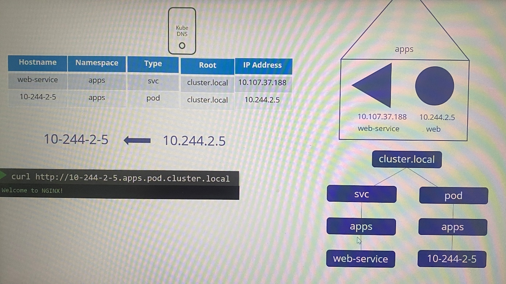

**CoreDNS in Kubernetes**

Prior to Kubernestes 1.12, the DNS server implemented by Kubernetes was
known as kube-dns.

In Kubernetes version 1.12 or later, recommended DNS server for
Kubernetes is CoreDNS.

CoreDNS is implemented as pod in kube-system namespace which deployed as
two pods for redundancy as part of ReplicaSet within deployment. In the
pod runs ./CoreDNS executable

CoreDNS needs configuration file that is located /etc/coredns. The
number of plugins configured in Corefile.

cat /etc/coredns/Corefile

 

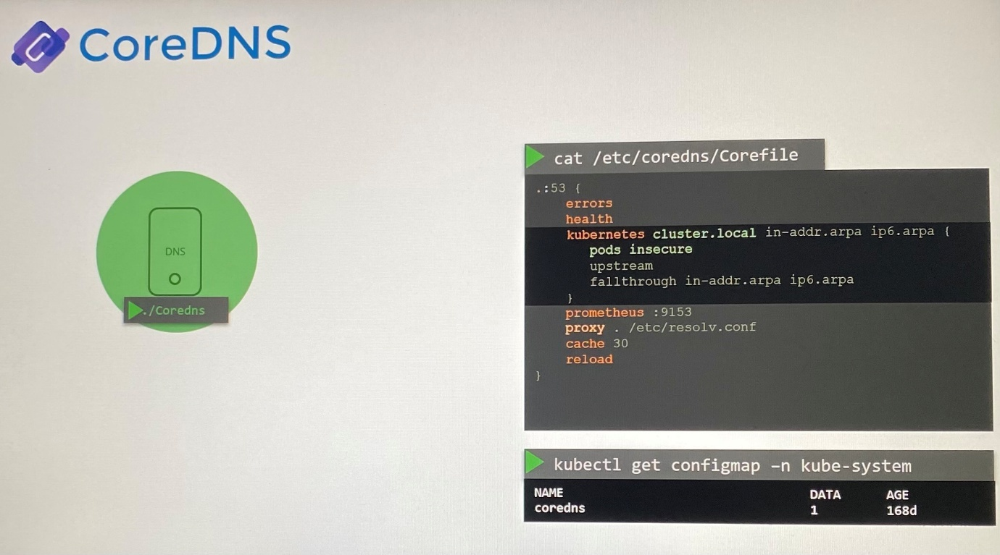

This file includes,

-The plugins are configured for handling errors, reporting health,
monitoring metrics, cache and proxy.

-Top level domain of the cluster is set in Kubernetes plugin. All the
records in CoreDNS servers are felt under root domain **cluster.local**

In Kubernetes plugin, there are multiple options .The pods option is for
creating a record for pods by converting the IPs into the dashed
format(10-20-5-11). This is disabled by default but it can be enabled
with this entry.

-Any record that the DNS server can't resolve is forwarded to the
nameserver specified in /etc/resolv.conf in the CoreDNS pod using proxy
plugin in Corefile

proxy ./etc/resolv.conf

This Corefile is passed into the CoreDNS pod by using configmap
object(coredns). You can modify these configuration by editing config
map object.

Every time a pod or service is created in the cluster, it adds a record
into the CoreDNS database.

When we deploy CoreDNS solution, it creates a service to make it other
components can connect to which is called kube-dns. The IP address of
this service is configured as the name server on pods in the cluster.

Name server configuration on pods(/etc/resolv.conf) is set up once pods
are created by kubelet automatically. If you check config file of the
kubelet(/var/lib/kubelet/config.yaml), ip address of coreDNS can be
shown.

cat /var/lib/kubelet/config.yaml ; check kubelet configuration file
which includes clusterDNS and clusterDomain

 

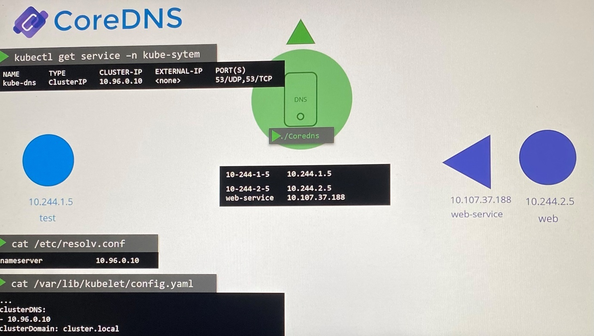

You can resolve service pods or service with following DNS entries

curl <http://web-service>

curl <http://web-service.default>

curl <http://web-service.default.svc>

curl <http://web-service.default.svc.cluster.local>

host web-service ; check search entry for service similar to nslookup
using curl or host, it returns FQDN of web service

/etc/resolv.conf on pod has search entry as follows which allows to
resolve with any DNS where it appends search entries.

cat /etc/resolv.conf

nameserver 10.96.0.10

search default.svc.cluster.local svc.cluster.local cluster.local

 

However, it only have search entries for service. You can't reach a pod
the same way. Instead, you need to specify full FQDN of the pod to
resolve DNS for the pod.

host 10-244-2-5.default.pod.cluster.local

kubectl exec \<pod name\> - -nslookup \<podname.namespace\> ; if you
need to resolve DNS of a pod from another pod

Inspect the Args field of the coredns deployment or pods, and check the
path used in CoreDNS configuration file where it should have volumeMount
/etc/coredns from config volume

controlplane ~ ✖ kubectl describe configmaps coredns -n kube-system

Name: coredns

Namespace: kube-system

Labels: \<none\>

Annotations: \<none\>

Data

====

Corefile:

----

.:53 {

errors

health {

lameduck 5s

}

ready

kubernetes cluster.local in-addr.arpa ip6.arpa {

pods insecure

fallthrough in-addr.arpa ip6.arpa

ttl 30

}

prometheus :9153

forward . /etc/resolv.conf {

max_concurrent 1000

}

cache 30

loop

reload

loadbalance

}

BinaryData

====

Events: \<none\>

controlplane ~ ➜ kubectl exec test -- curl web-service

% Total % Received % Xferd Average Speed Time Time Time Current

Dload Upload Total Spent Left Speed

0 0 0 0 0 0 0 0 --:--:-- --:--:-- --:--:-- 0 This is the HR server!

100 24 0 24 0 0 24000 0 --:--:-- --:--:-- --:--:-- 24000

If one pod or deployment need to access another pod in different
namespace, specify the hostname of service attached to the pod with
namespace in environment variable.

spec:

containers:

\- env:

\- name: DB_Host

value: ***mysql.payroll***

\- name: DB_User

value: root

\- name: DB_Password

value: paswrd

--------------------------------------------------------------------------------------------------------

Examtips:

Inspect the Args field of the coredns deployment and check the file
***Corefile*** used.

 

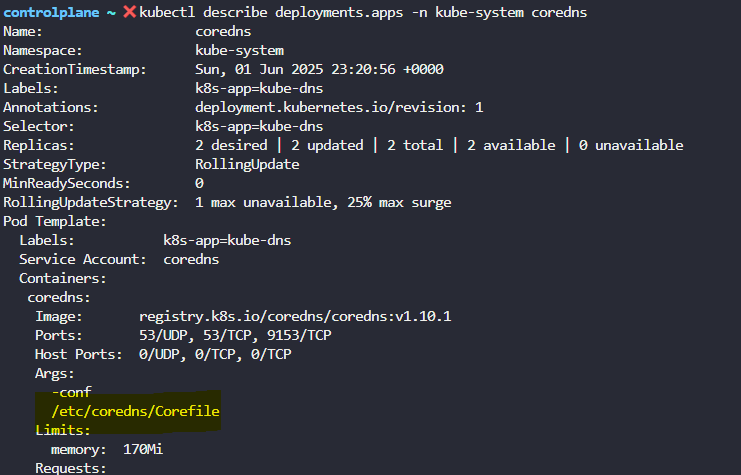

kubectl exec -it frontend -- curl -m 5 \<BACKEND-POD-IP\>

 

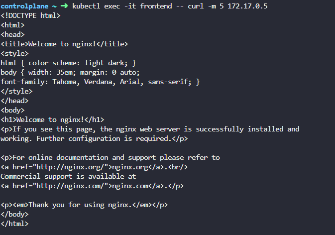

**Ingress**

If we deploy an application as deployment, we make the application
accessible from outside the cluster by using NodePort service with the
combination of any IP of nodes in the cluster and high numbered port of
the node specified in the service
([http://IP_address_of_node:port](http://IP_address_of_node:port)).
However, NodePort service can only allocate high numbered port range in
30,000-32,767

Instead of using IP address to access the application, we point DNS name
to IP address of the node.

<http://my-online-store.com:38080>

To avoid users to remember port number along with DNS, we bring
additional layer that is reverse proxy server between DNS server and the
cluster to redirect web traffic to NodePort service without specifying
the port in the URL.

Proxy server revises web traffic from DNS server to NodePort service
with the custom port.

For on-premise K8s cluster,

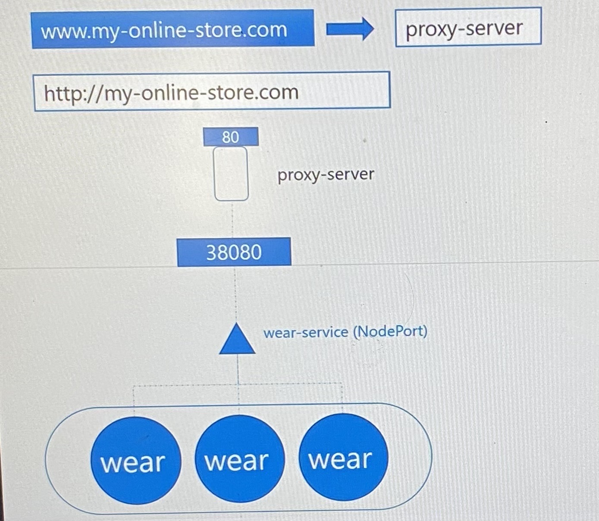

For cloud based K8 cluster,

When Kubernetes creates a service that is the type LoadBalancer that
provision high numbered port on node for service and send request to
cloud platform to provision a network load balancer as reverse proxy
server to direct traffic to the LoadBalancer service. The cloud platform
then automatically deploy a load balancer configured to route traffic to
the service ports on all the nodes and return its information to
Kubernetes.

The load balancer has external IP, then we set the DNS to point to that
IP so that users can access the application through URL.

 

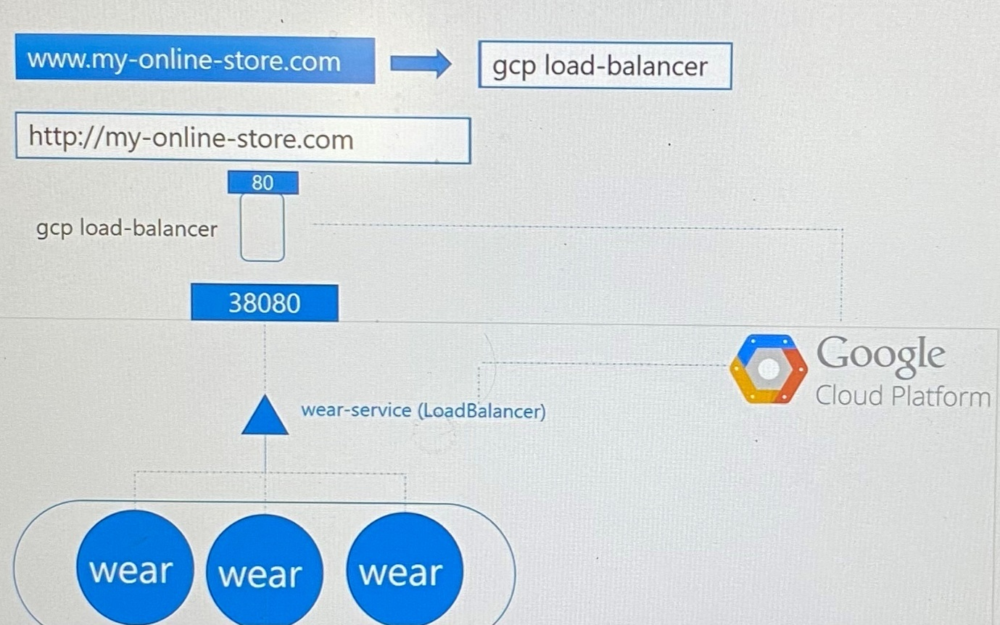

Let consider you deploy another application in the same cluster by
sharing the same cluster resources that needs to be accessed externally
with https:my-online-store.com/video. Thus LoadBalancer service will
implement another network load balancer in cloud platform to route
traffic to backend pods. Further, you need to deploy another load
balancer that can redirect traffic to load balancers based on URL path.
So you would have extra burden as well your cloud bill will inversely
affected when number of load balancers increase. Every time you
introduce new service, you have to reconfigure the Load Balancer to
route traffic based on path to new service.

Finally you also need to enable SSL for the application which can be
configured at different levels either application level or load balancer
level or proxy server level. You don't need developers to develop to
handle SSL with additional code.

 

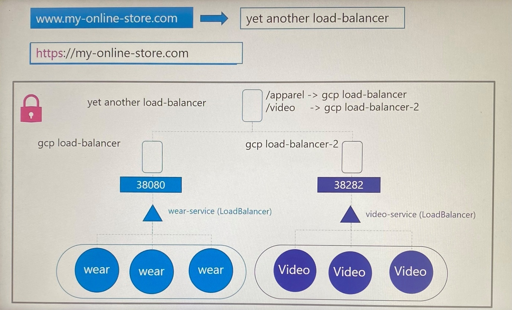

Configuring your firewall rules for each new service and provisioning
cloud native load balancer need different individuals in different
teams. How if you want it to be configured from one place with minimal
maintenance as long as the application scales.

How if all these load balancing configurations could handle within the
cluster using another Kubernetes definition file that live along with
other application deployment files, that’s where ingress comes in which
helps to configure ***to route traffic to different services within the
cluster based on the URL path and implement SSL security*** as well.

Ingress is a layer 7 load balancer built in to the Kubernetes cluster
that can be configured using native Kubernetes primitives, like other
objects in Kubernetes. Even with ingress, you still need to expose it to
make it accessible outside the cluster by publishing Ingress as a
NodePort service or cloud native LoadBalancer service. But this is
one-time configuration. Going forward, you are going to perform all load
balancing of SSL and URL based routing configurations on the ingress
controller.

 

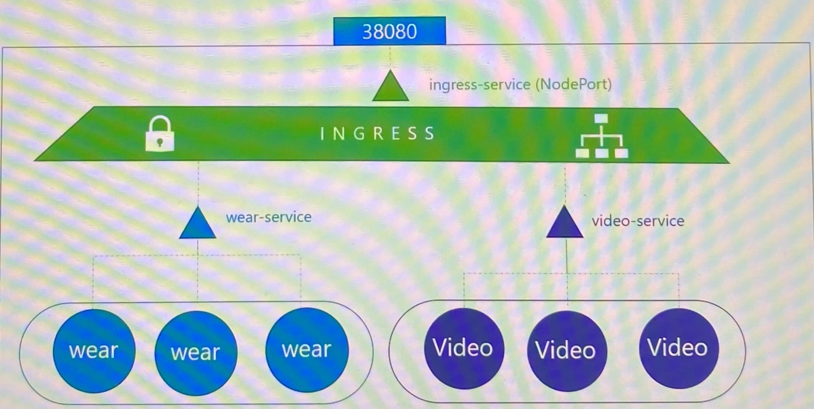

Deploy

The solution you deploy is called is ***Ingress controller*** that act
as layer 7 load balancer where configuration involves configuring SSL
certificates, defining URL based routes etc.

Kubernetes doesn't come with an Ingress controller by default. We use
these solutions to implement ingress controller such as GCP HTTP(S) Load
Balancer(GCE), NGINX, Contour, HAPROXY, traefik and Istio. **GCE** and
**NGINX** are currently being supported and maintained by Kubernetes
project.

Configure

The set of rules configure are called as ***Ingress resources.***
Ingress resources are created using definition files such as pod,
deployment and services.

***Ingress controller***

-Kubernetes cluster does not come with an ingress controller by default

-Ingress controller have additional intelligence built in to monitor
Kubernetes cluster for new definitions or ingress resources and
configure the underlying NGINX server when something has changed

Here we consider deploying ingress controller from nginx solution.

We deploy a deployment with the specific image(NGINX), one replica and
pod definition template for ingress controller. Pod template has
following specifications in spec section.

***In args***

-Within the image, the nginx program is stored at location /nginx
ingress controller which the path specify in **args**, you must pass
that as command to start the nginx controller service.

-NGINX has set of configuration options such as path to store the logs,
keepalive threshold, SSL settings, session timeout. In order to decouple
these configuration from the nginx controller image, you must create
ConfigMap object and pass that in using **args** even though configmaps
does not have entries at some point. With creating blank configmaps
object and passing it make easy to modify configuration in the future.

 

***In env***

-You must pass the environment variables that carries the pod name and
pod namespace that is deployed to. The nginx service requires these to
read the configuration data from within the pod.

***In ports***

-Specify the ports use by ingress controller which happens to be port 80
and 443.

 

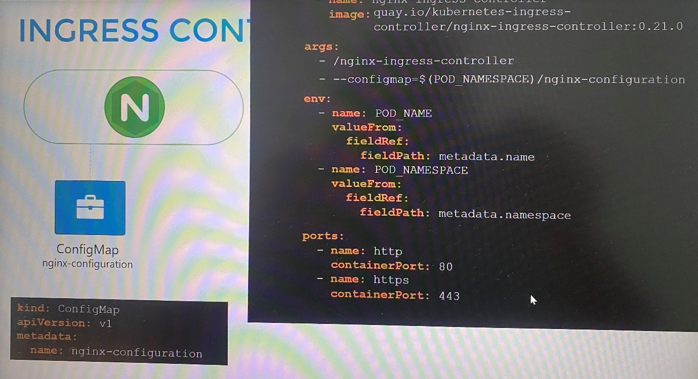

Then we need a service to expose ingress controller to external world
where we creates NodePort service and link it to the deployment using
selector.

 

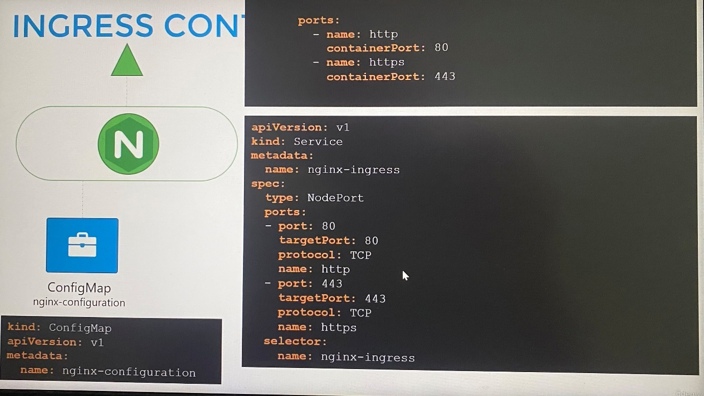

These ingress controllers have additional intelligence built in to them
to monitor the Kubernetes cluster for new definition or ingress
resources and configure the underlying nginx server accordingly so that
Ingress controller needs a service account with right set of permissions
where a service account with the correct Roles, ClusterRoles and
RoleBindings.

Summary:

-A deployment with nginx ingress controller image

-A service to expose the pods in deployment

-A ConfigMap to feed nginx configuration data

-A service account with the correct permissions to access all of these
objects

 

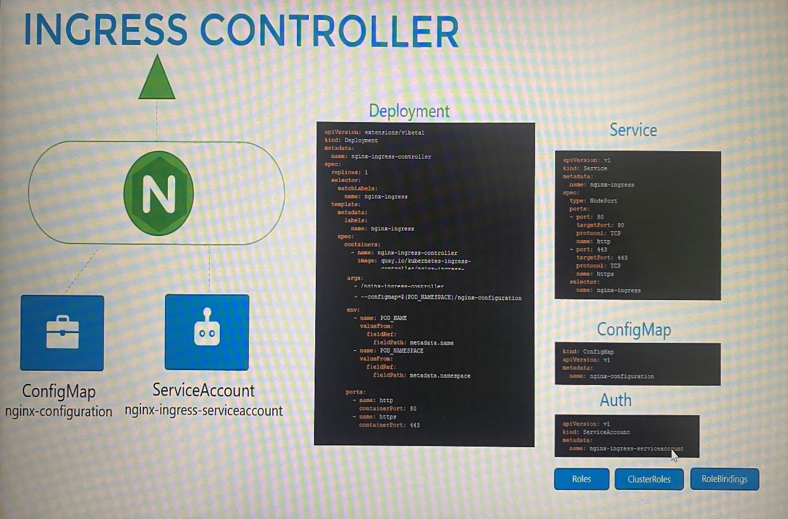

 

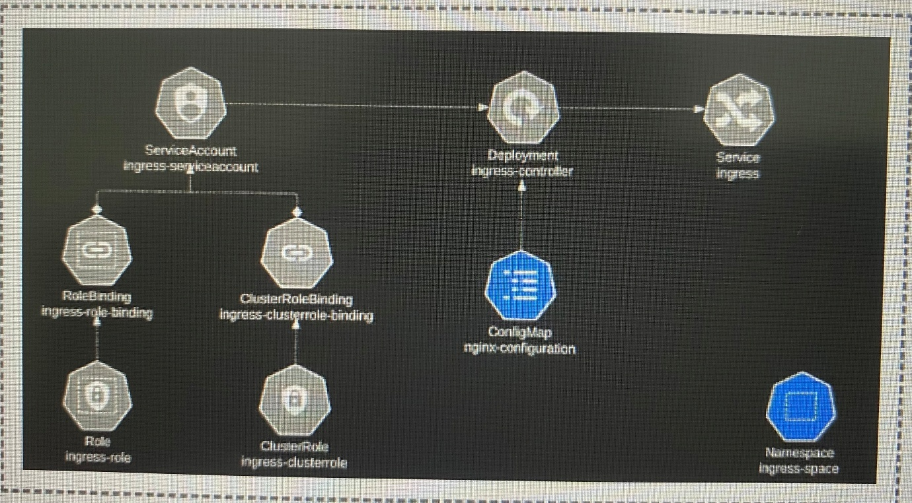

***Ingress resources***

An ingress resource is a set of rules and configurations applied on the
ingress controller. These are the use cases to configure rules.

Forward all incoming traffic to a single application

Route traffic to different application based on the URL(
[www.my-online-store.com/wear](http://www.my-online-store.com/wear) or
[www.my-online-store.com/watch](http://www.my-online-store.com/watch))

Route traffic based on the domain name( wear.my-online-store.com or
watch.my-online-store.com)

 

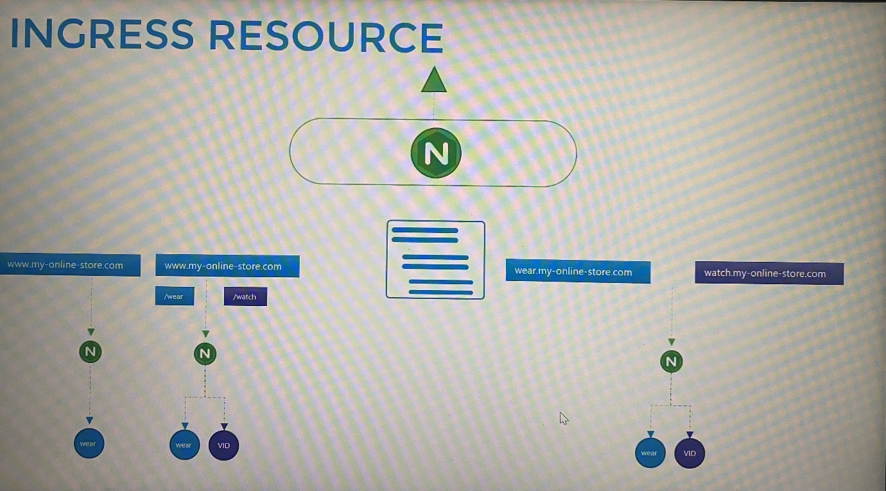

-Ingress resource is created with Kubernetes definition file

***Use Case 1 - Route traffic to a single application***

------Ingress-wear.yaml--------------------

apiVersion: networking.k8s.io/v1

kind: Ingress

metadata:

name: ingress-wear

spec:

backend:

serviceName: wear-service

servicePort: 80

kubectl create -f Ingress-wear.yaml

kubectl get ingress ; list the ingress created

-If it is single backend, you can only specify the service name and
port. Then you don't really have any rules

 

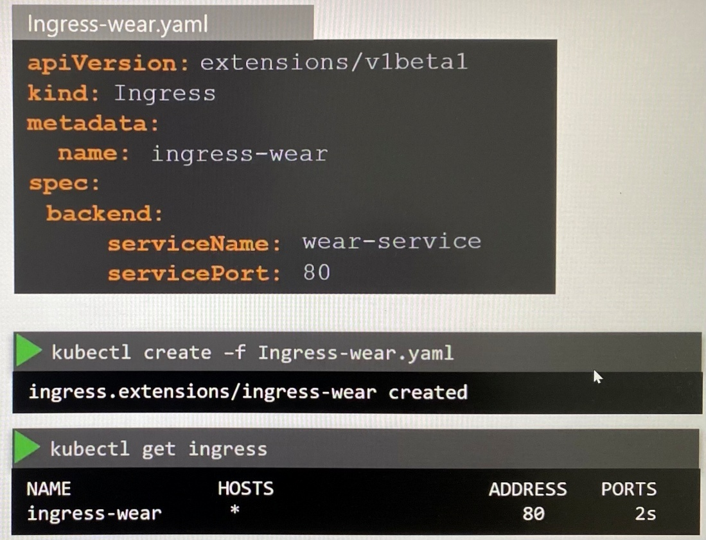

*Ingress resource -Rules*

We use rules when you want route traffic based on different conditions.
Examples;

-Create one rule for traffic originating for each domain or hostname,
within each rule you have different paths to route traffic based on the
URL

***Use Case 2- Route traffic based on URL path***

 

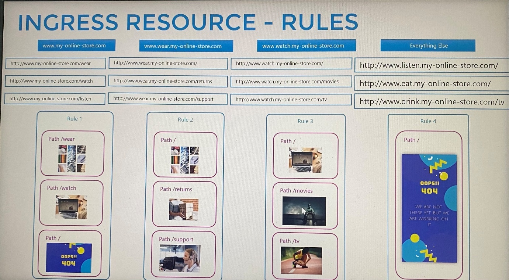

-Our requirement here is to handle all traffic coming to
my-online-store.com and route them based on the URL path. You have rules
at the top of each host or domain name, under rules we have one item for
the domain which is an HTTP rule in which we specify different paths.
Paths is an array of multiple items, one path for each URL.

 

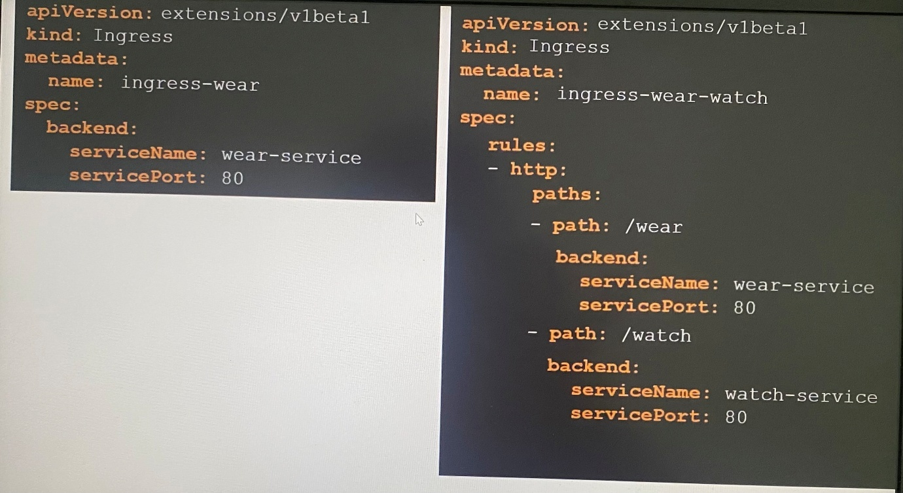

 

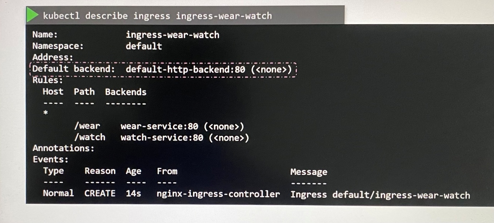

If an user tries to access a URL that does not match any of these rules,
then the user is directed the service specified as the default
backend.(default-http-backend). You must deploy a such a service to
display this 404 not found error message.

***Use Case 3 - Route traffic based on domain name/host name***

- We have two domain names, we create two rules, one for each domain

-To split traffic by domain name, we use the host field as array. The
host field in each rule matches the specified value, with the domain
name used in the request URL.

 

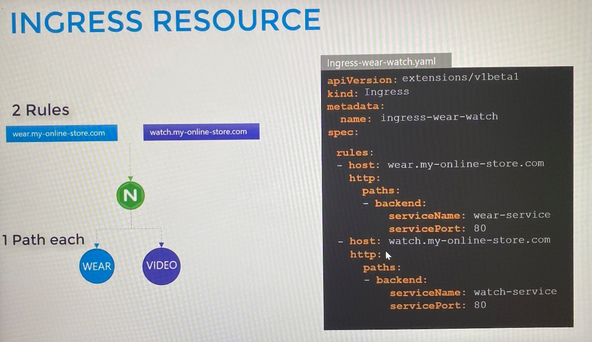

-All traffic from these domain names will be routed to the appropriate
backend, irrespective of the URL path. You can still have multiple paths
specifications in each of these host to handle different URL paths.

\* means any hosts are applicable for ingress resource

Default backend shows the user traffic directs to which backend if any
path doesn't match

As best practice, we create ingress resource in same namespace that has
backend services and deployments

 

**Imperative method to create ingress:**

kubectl create ingress NAME
--rule=host/path=service:port\[,tls\[=secret\]\] \[options\]

controlplane ~ ✖ kubectl create ingress ingress-pay -n critical-space
--rule="/pay=pay-service:8282"

ingress.networking.k8s.io/ingree-pay created

If no specific host for ingress resource, leave host section rule
option.

\*\*If no response to path specified, check the logs on pod in the
deployment that application is hosted.

Also check the logs on ingress controller pod, if the HTTP error is
**308 Permanent redirects** which rewrite target, check the error on the
browser is ERR_TOO_MANY_REDIRECTS which SSL redirects(redirects HTTP to
HTTPS, it is related to configure ***rewrite target*** and ***SSL
redirects***

**annotations:**

**nginx.ingress.kubernetes.io/rewrite-target: /**

**nginx.ingress.kubernetes.io/ssl-redirects: "false"**

controlplane ~ ➜ kubectl logs webapp-pay-6888bbb889-454fh -n
critical-space

\* Serving Flask app 'app' (lazy loading)

\* Environment: production

WARNING: This is a development server. Do not use it in a production
deployment.

Use a production WSGI server instead.

\* Debug mode: off

\* Running on all addresses.

WARNING: This is a development server. Do not use it in a production
deployment.

\* Running on <http://172.17.0.11:8080/> (Press CTRL+C to quit)

172.17.0.9 - - \[24/Jan/2025 04:39:47\] "GET /pay HTTP/1.1" 404 -

 

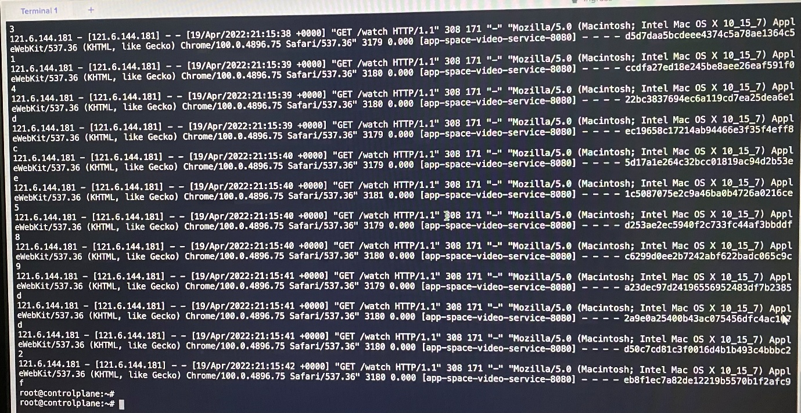

 

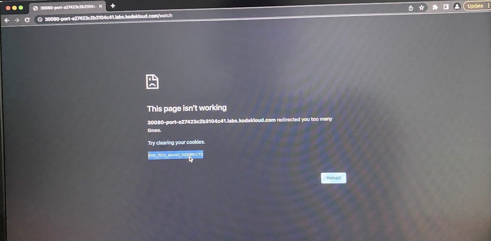

Without the rewrite-target option, this is what would happen:

--\>

--\>

Notice watch and wear at the end of the target URLs. The target
applications are not configured with /watch or /wear paths. They are
different applications built specifically for their purpose, so they
don't expect /watch or /wear in the URLs. And as such the requests would
fail and throw a 404 not found error.

To fix that we want to "ReWrite" the URL when the request is passed on
to the watch or wear applications. We don't want to pass in the same
path that user typed in. So we specify the rewrite-target option. This
rewrites the URL by replacing whatever is under
rules-\>http-\>paths-\>path which happens to be /pay in this case with
the value in rewrite-target. This works just like a search and replace
function.

For example: replace(path, rewrite-target)

In our case: replace("/path","/")

apiVersion: networking.k8s.io/v1

kind: Ingress

metadata:

creationTimestamp: "2025-01-24T04:39:01Z"

generation: 1

name: ingree-pay

namespace: critical-space

resourceVersion: "3861"

uid: e834c375-7a4a-46af-8d5a-63c4eb574cd5

**annotations:**

**nginx.ingress.kubernetes.io/rewrite-target: /**

spec:

rules:

\- http:

paths:

\- backend:

service:

name: pay-service

port:

number: 8282

path: /pay

pathType: Exact

status:

loadBalancer:

ingress:

\- ip: 172.20.31.162

--------------------------------------------------------------

apiVersion: networking.k8s.io/v1

kind: Ingress

metadata:

annotations:

nginx.ingress.kubernetes.io/rewrite-target: /

nginx.ingress.kubernetes.io/ssl-redirect: "false"

creationTimestamp: "2025-01-24T00:43:58Z"

generation: 1

name: ingress-wear-watch

namespace: app-space

resourceVersion: "1113"

uid: d02f2db4-6700-4115-9c82-af7afc4eb1f2

spec:

rules:

\- http:

paths:

\- backend:

service:

name: wear-service

port:

number: 8080

path: /wear

pathType: Prefix

\- backend:

service:

name: video-service

port:

number: 8080

path: /watch

pathType: Prefix

status:

loadBalancer:

ingress:

\- ip: 172.20.228.167

controlplane ~ ➜ kubectl describe ingress ingress-wear-watch -n
app-space

Name: ingress-wear-watch

Labels: \<none\>

Namespace: app-space

Address: 172.20.228.167

Ingress Class: \<none\>

Default backend: \<default\>

Rules:

Host Path Backends

---- ---- --------

\*

/wear wear-service:8080 (172.17.0.4:8080)

/watch video-service:8080 (172.17.0.5:8080)

Annotations: nginx.ingress.kubernetes.io/rewrite-target: /

nginx.ingress.kubernetes.io/ssl-redirect: false

Events:

Type Reason Age From Message

---- ------ ---- ---- -------

Normal Sync 87s (x2 over 87s) nginx-ingress-controller Scheduled for
sync

**Article: Ingress**

In this article, we will see what changes have been made in previous and
current versions in Ingress.

Like in apiVersion, serviceName and servicePort etc.

 

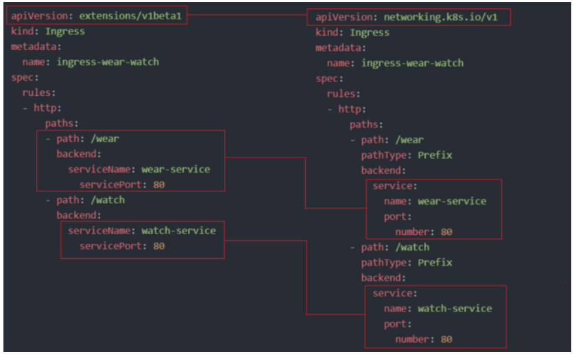

Now, in k8s version 1.20+ we can create an Ingress resource from the
imperative way like this:-

**Format : kubectl create ingress \<ingress-name\>
--rule="host/path=service:port"**

**Example : kubectl create ingress ingress-test
--rule="wear.my-online-store.com/wear\*=wear-service:80"**

Find more information and examples in the below reference link:-

<https://kubernetes.io/docs/reference/generated/kubectl/kubectl-commands#-em-ingress-em>-

References:-

<https://kubernetes.io/docs/concepts/services-networking/ingress>

<https://kubernetes.io/docs/concepts/services-networking/ingress/#path-types>

**Ingress - Annotations and rewrite-target**

Different ingress controllers have different options that can be used to
customise the way it works. NGINX Ingress controller has many options
that can be seen here [Introduction - Ingress-Nginx
Controller](https://kubernetes.github.io/ingress-nginx/examples/). I
would like to explain one such option that we will use in our labs. The
Rewrite target option. [Rewrite - Ingress-Nginx
Controller](https://kubernetes.github.io/ingress-nginx/examples/rewrite/)

Our *watch* app displays the video streaming webpage at

Our *wear* app displays the apparel webpage at

We must configure Ingress to achieve the below. When user visits the URL
on the left, his request should be forwarded internally to the URL on
the right. Note that the /watch and /wear URL path are what we configure
on the ingress controller so we can forwarded users to the appropriate
application in the backend. The applications don't have this URL/Path
configured on them:

--\>

--\>

Without the rewrite-target option, this is what would happen:

--\>

--\>

Notice watch and wear at the end of the target URLs. The target
applications are not configured with /watch or /wear paths. They are
different applications built specifically for their purpose, so they
don't expect /watch or /wear in the URLs. And as such the requests would
fail and throw a 404 not found error.

To fix that we want to "ReWrite" the URL when the request is passed on
to the watch or wear applications. We don't want to pass in the same
path that user typed in. So we specify the rewrite-target option. This
rewrites the URL by replacing whatever is under
rules-\>http-\>paths-\>path which happens to be /pay in this case with
the value in rewrite-target. This works just like a search and replace
function.

For example: replace(path, rewrite-target)

In our case: replace("/path","/")

apiVersion: extensions/v1beta1

kind: Ingress

metadata:

name: test-ingress

namespace: critical-space

annotations:

nginx.ingress.kubernetes.io/rewrite-target: /

spec:

rules:

\- http:

paths:

\- path: /pay

backend:

serviceName: pay-service

servicePort: 8282

In another example given here, this could also be:

replace("/something(/\|\$)(.\*)", "/\$2")

apiVersion: extensions/v1beta1

kind: Ingress

metadata:

annotations:

nginx.ingress.kubernetes.io/rewrite-target: /\$2

name: rewrite

namespace: default

spec:

rules:

\- host: rewrite.bar.com

http:

paths:

\- backend:

serviceName: http-svc

servicePort: 80

path: /something(/\|\$)(.\*)

 

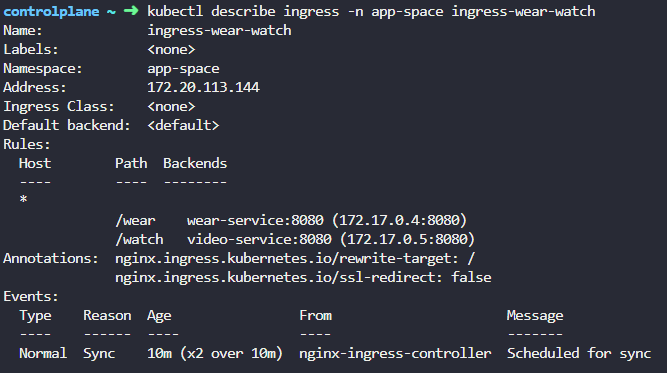

-------------------------------------------------------------------------------------------------------------

apiVersion: apps/v1

kind: Deployment

metadata:

labels:

app.kubernetes.io/component: controller

app.kubernetes.io/instance: ingress-nginx

app.kubernetes.io/managed-by: Helm

app.kubernetes.io/name: ingress-nginx

app.kubernetes.io/part-of: ingress-nginx

app.kubernetes.io/version: 1.1.2

helm.sh/chart: ingress-nginx-4.0.18

name: ingress-nginx-controller

namespace: ingress-

spec:

minReadySeconds: 0

revisionHistoryLimit: 10

selector:

matchLabels:

app.kubernetes.io/component: controller

app.kubernetes.io/instance: ingress-nginx

app.kubernetes.io/name: ingress-nginx

template:

metadata:

labels:

app.kubernetes.io/component: controller

app.kubernetes.io/instance: ingress-nginx

app.kubernetes.io/name: ingress-nginx

spec:

containers:

\- args:

\- /nginx-ingress-controller

\- --publish-service=\$(POD_NAMESPACE)/ingress-nginx-controller

\- --election-id=ingress-controller-leader

\- --watch-ingress-without-class=true

\- --default-backend-service=app-space/default-http-backend

\- --controller-class=k8s.io/ingress-nginx

\- --ingress-class=nginx

\- --configmap=\$(POD_NAMESPACE)/ingress-nginx-controller

\- --validating-webhook=:8443

\- --validating-webhook-certificate=/usr/local/certificates/cert

\- --validating-webhook-key=/usr/local/certificates/key

env:

\- name: POD_NAME

valueFrom:

fieldRef:

fieldPath: metadata.name

\- name: POD_NAMESPACE

valueFrom:

fieldRef:

fieldPath: metadata.namespace

\- name: LD_PRELOAD

value: /usr/local/lib/libmimalloc.so

image:
registry.k8s.io/ingress-nginx/controller:v1.1.2@sha256:28b11ce69e57843de44e3db6413e98d09de0f6688e33d4bd384002a44f78405c

imagePullPolicy: IfNotPresent

lifecycle:

preStop:

exec:

command:

\- /wait-shutdown

livenessProbe:

failureThreshold: 5

httpGet:

path: /healthz

port: 10254

scheme: HTTP

initialDelaySeconds: 10

periodSeconds: 10

successThreshold: 1

timeoutSeconds: 1

name: controller

ports:

\- name: http

containerPort: 80

protocol: TCP

\- containerPort: 443

name: https

protocol: TCP

\- containerPort: 8443

name: webhook

protocol: TCP

readinessProbe:

failureThreshold: 3

httpGet:

path: /healthz

port: 10254

scheme: HTTP

initialDelaySeconds: 10

periodSeconds: 10

successThreshold: 1

timeoutSeconds: 1

resources:

requests:

cpu: 100m

memory: 90Mi

securityContext:

allowPrivilegeEscalation: true

capabilities:

add:

\- NET_BIND_SERVICE

drop:

\- ALL

runAsUser: 101

volumeMounts:

\- mountPath: /usr/local/certificates/

name: webhook-cert

readOnly: true

dnsPolicy: ClusterFirst

nodeSelector:

kubernetes.io/os: linux

serviceAccountName: ingress-nginx

terminationGracePeriodSeconds: 300

volumes:

\- name: webhook-cert

secret:

secretName: ingress-nginx-admission

---

apiVersion: v1

kind: Service

metadata:

creationTimestamp: null

labels:

app.kubernetes.io/component: controller

app.kubernetes.io/instance: ingress-nginx

app.kubernetes.io/managed-by: Helm

app.kubernetes.io/name: ingress-nginx

app.kubernetes.io/part-of: ingress-nginx

app.kubernetes.io/version: 1.1.2

helm.sh/chart: ingress-nginx-4.0.18

name: ingress-controller

namespace: ingress-nginx

spec:

ports:

\- port: 80

protocol: TCP

targetPort: 80

nodeport: 30080

selector:

app.kubernetes.io/component: controller

app.kubernetes.io/instance: ingress-nginx

app.kubernetes.io/name: ingress-nginx

type: NodePort

---------------------------------------------------------------------------------------------------------

**Gateway API**

With Ingress, two services share the same ingress resource. What if each
service was managed by different team or organization. In such case, the
underlying Ingress resource is still a single resource, which can only
be managed by one team at a time. Ingress can pose following challenges
and limitations.

-No multi-tenancy

-No namespace isolation

-No RBAC for features

-No Resource isolation

-Only supports HTTP based rules such as host matching or path matching

Ingress has no native support for followings instead they all must be
configured by ingress controllers itself.

-TCP/UDP routing

-Traffic splitting/weighting

-Header manipulation

-Authentication

-Rate limiting

-Redirects

-Rewriting

-Middleware

-Websocket support

-Custom error pages

-Session affinity

-Cross-origin resource sharing (CORS)

 

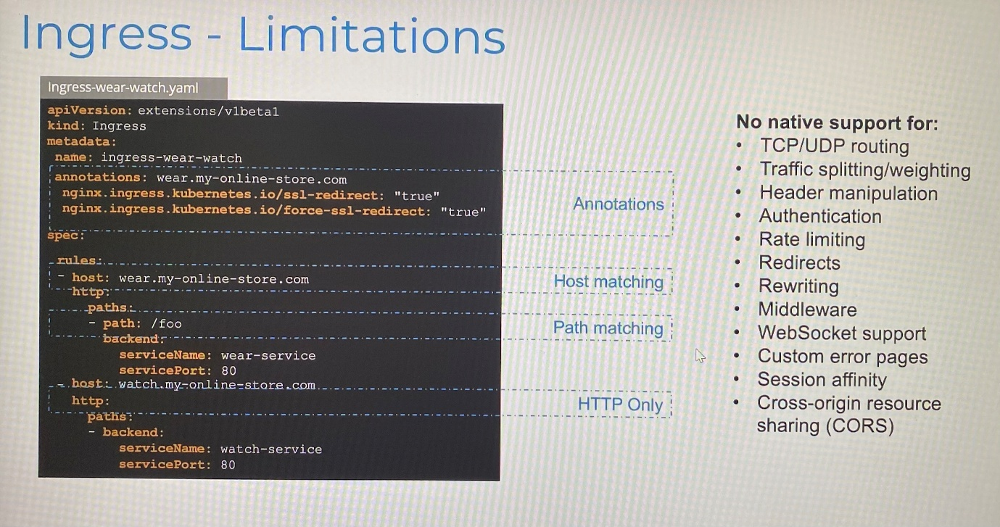

These configurations such as SSL redirect, CORS are passed to
controllers using complex annotations specified in Ingress. The
challenge is that these configurations are very specific to the
underlying controllers we use such as NGINX or traefik for the same use
case. Further Kubernetes itself is not aware of these settings and it
can't validate whether the settings are correct or wrong

 

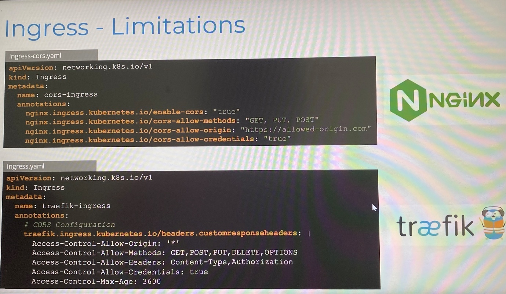

That's where Gateway APIs come in. Gateway API is an official Kubernetes
project focused on L4 and l7 routing. This projects represents next
generation of Kubernetes Ingress, Load Balancing, Service Mesh APIs.

Gateway APIs introduces three separate objects that are managed by
sperate team by providing different teams to access same infrastructure
while maintaining control by the owners of the infrastructure.

 

**Team name**

**Object name**

**Functions**

Infrastructure Providers

GatewayClass

Define underlying network infrastructure such as NGINX, Traefik or other
load balancers

Cluster Operators

Gateway

Configure gateway which are instances of the GatewayClass

Application Developers

HTTPRoute, TCPRoute, GRPCRoute

Create HTTPRoute or other objects

The Gateway resource is used to define an instance of a Gateway API
implementation. It acts as an entry point for traffic into the cluster.
GatewayClass defines a type of Gateway(i.e., the controller and its
capabilities), but does not create an actual Gateway instance. To
actually deploy a Gateway that routes traffic, you must create a Gateway
resource.

Deploy controller for gateway

-------gateway-class.yaml------------------------

apiVersion: gateway.networking.k8s.io/v1

kind: GatewayClass

metadata:

name: example-class

spec:

controllerName: example.com/gateway-controller

Deploy gateway object

---------gateway.yaml-------------------------

apiVersion: gateway.networking.k8s.io/v1

kind: Gateway

metadata:

name: example-gateway

spec:

gatewayClassName: example-class ; specify the gateway class created

listeners:

\- name: http

protocol: HTTP

port: 80

Deploy HTTPRoute rule

---------http-route.yaml-------------------------

apiVersion: gateway.networking.k8s.io/v1

kind: HTTPRoute

metadata:

name: example-httproute

spec:

parentRefs:

\- name: example-gateway ; specify the gateway instance we defined

hostnames:

\- "[www.example.com](http://www.example.com)"

rules:

\- matches:

\- path:

type: PathPrefix

value: /login

backendRefs:

\- name: example-svc

port: 8080

In this example, the HTTP traffic from gateway example-gateway with the
host header set [www.example.com](http://www.example.com) and the
request path specified as login will be routed to service example-svc on
port 8080.

The **allowedRoutes** field in a Gateway listener determines which
namespaces and types of Routes (like HTTPRoute, TCPRoute, etc.) are
allowed to attach to that Gateway.

By default, only Routes in the same namespace as the Gateway can attach.

Setting namespaces.from: All allows Routes from all namespaces to
attach.

You can also restrict which kinds of Routes can attach using the kinds
field.

This enables fine-grained access control and safe multi-tenant routing.

spec:

listeners:

\- name: http

port: 80

protocol: HTTP

allowedRoutes:

namespaces:

from: All \# Allows Routes from all namespaces to attach

kinds:

\- group: gateway.networking.k8s.io

kind: HTTPRoute

 

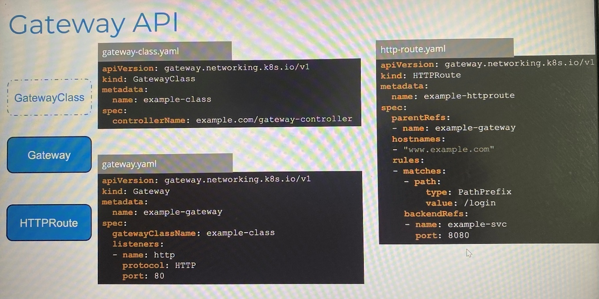

Some of additional route options available are TCPRoute, UDPRoute,
TLSRoute and GRPCRoute.

 

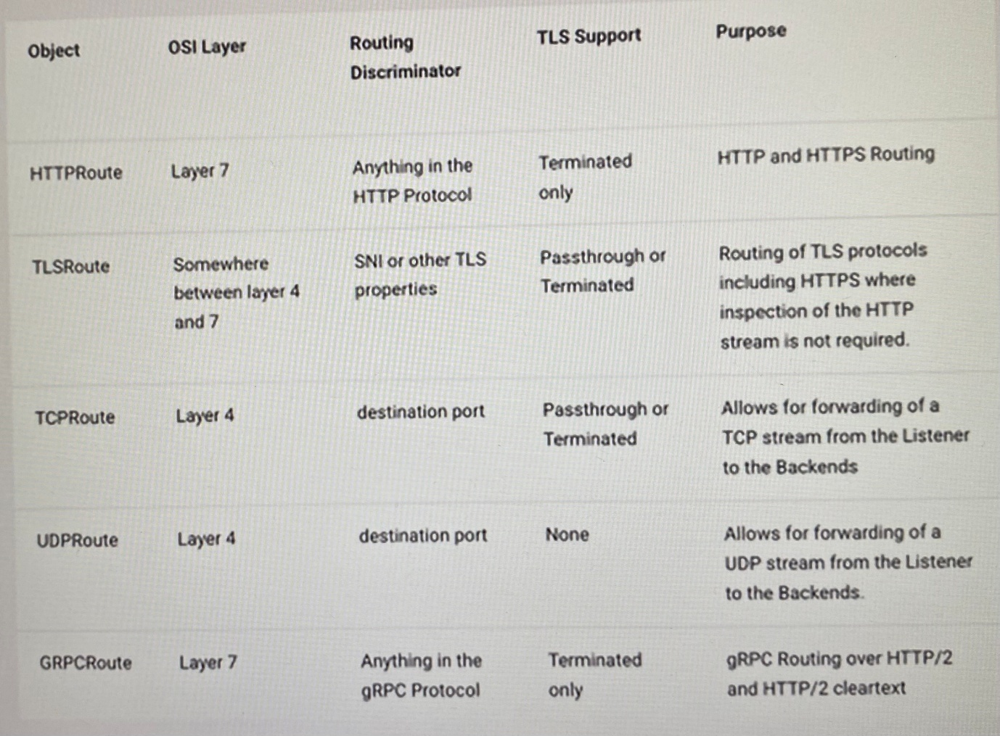

***Ingress vs Gateway API***

\*With ingress, the basic TLS configuration specifies in
spec.tls\[\].secretName section and ensure all traffic uses HTTPS by
redirecting HTTP to HTTPS using NGINX specific annotation. But it won't
work for other Ingress controllers.

\*With Gateway API, it is more declarative and structured approach, no
annotations needed. The **listeners** section shows setting HTTPS
endpoint on port 443, **tls** configuration is explicit with the
**mode** Terminate showing terminating TLS at the gateway,
**certificateRefs** refers tls-secret, **allowRoutes** specifies the
kind of routes can attach to listener such as HTTPRoute

 

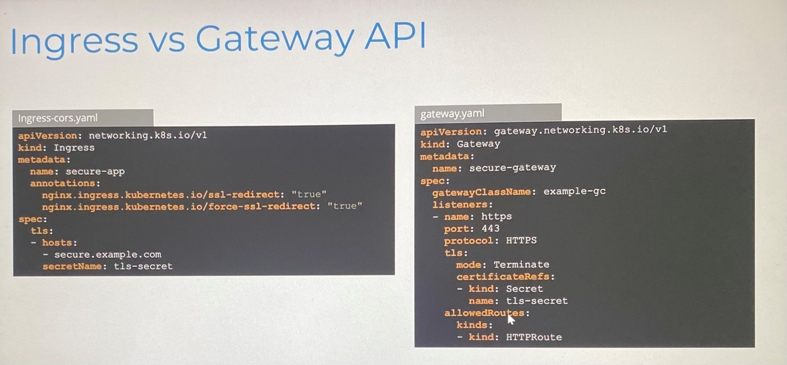

\*With Ingress, we configure canary deployment to route 20% traffic to
secondary Ingress and remaining 80% traffic automatically routes to the
primary ingress by using NGINX annotations. But other controllers might
not understand these annotations.

\*With Gateway API, all configuration is visible in one place, no hidden
primary configuration needed. In the **backendRefs** section, traffic
split is explicitly defined between services with percentage. No
annotations needed and these configuration work with any controller.

 

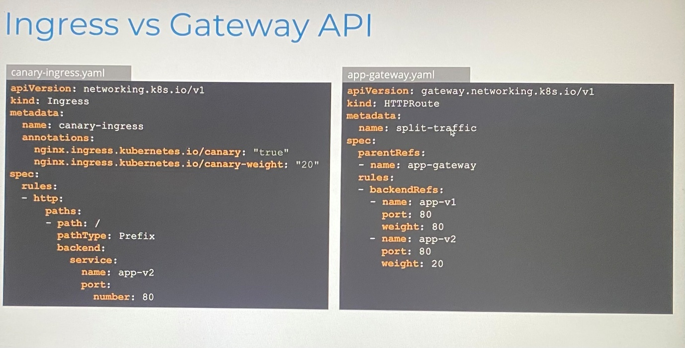

\*Complex controller-specific annotations needed for CORS settings
whereas no annotations needed with Gateway API. CORS headers are
explicitly defined using **responseHeaderModifier** filter. The
configuration is more readable and self documenting

 

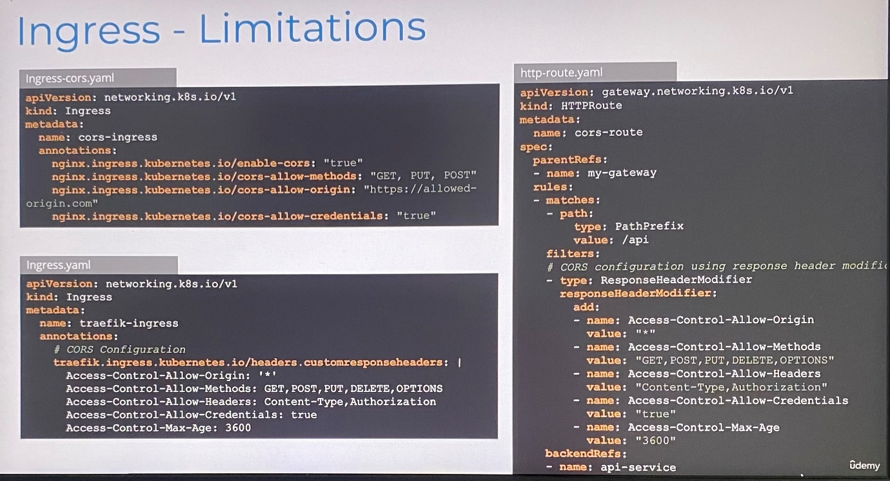

\*Most controllers have implemented Gateway API and on the way to
implement it. Amazon EKS, Azure Application Gateway for Containers,
Contour, Easegress, Envoy Gateway, Google Kubernetes Engine, HAProxy
Kubernetes Ingress Controller, Istio, Kong, Kuma, NGINX Gateway Fabric,
Traefik Proxy

**Kubernetes Gateway API: A Practical Guide Using NGINX**

This guide introduces the Kubernetes **Gateway API**, a modern and
extensible approach to managing ingress and traffic routing in
Kubernetes. While we'll be using the **NGINX Gateway Controller** for
demonstration, the concepts and APIs are **implementation-agnostic** and
apply across different **Gateway API**-compatible controllers.

📚 Official
Docs: [**gateway-api.sigs.k8s.io**](https://gateway-api.sigs.k8s.io/)

1\. Installing **Gateway API** with NGINX

The **Gateway API** defines custom resources, but a controller is needed
to implement them. For this demo, we’ll use the **NGINX Gateway
Controller**, which supports all standard **Gateway API** resources.

To install the **NGINX Gateway Controller**, run the following commands:

kubectl kustomize
"<https://github.com/nginx/nginx-gateway-fabric/config/crd/gateway-api/standard?ref=v1.6.2>"
\| kubectl apply -f -

kubectl kustomize
"<https://github.com/nginx/nginx-gateway-fabric/config/crd/gateway-api/experimental?ref=v1.6.2>"
\| kubectl apply -f -

helm install ngf oci://ghcr.io/nginx/charts/nginx-gateway-fabric
--create-namespace -n nginx-gateway

What this does:

Installs the **NGINX Gateway Controller**, along with the **Gateway API
Custom Resource Definitions** (CRDs) and related resources.

🔗 [**NGINX Gateway Fabric
Reference**](https://docs.nginx.com/nginx-gateway-fabric/installation/installing-ngf/helm/)

2. **GatewayClass** Definition

A **GatewayClass** defines a set of Gateways that are implemented by a
specific controller. Think of it as a blueprint that tells Kubernetes
which controller will manage the Gateways.

Purpose

Decouples Gateway configuration from the actual implementation: This
allows you to define Gateways without worrying about the underlying
controller.

Supports multiple gateway implementations in a single cluster: For
example, you can have both NGINX and Istio Gateways in the same
Kubernetes cluster.

Here’s an example of a **GatewayClass**:

apiVersion: gateway.networking.k8s.io/v1

kind: GatewayClass

metadata:

name: nginx

spec:

controllerName: nginx.org/gateway-controller

Explanation:

**controllerName**: This must match the **name** expected by your
controller (e.g., **nginx.org/gateway-controller** for NGINX). It tells
Kubernetes which controller will manage Gateways of this class.

🔗 [**GatewayClass
Reference**](https://gateway-api.sigs.k8s.io/api-types/gatewayclass/)

3\. Configuring **HTTP** Gateway and Listener

A Gateway is a Kubernetes resource that defines how traffic enters your
cluster. It specifies the protocols, ports, and routing **rules** for
incoming traffic.

Here’s an example of a Gateway that listens for **HTTP** traffic:

apiVersion: gateway.networking.k8s.io/v1

kind: Gateway

metadata:

name: nginx-gateway

namespace: default

spec:

gatewayClassName: nginx

listeners:

\- name: http

protocol: HTTP

port: 80

allowedRoutes:

namespaces:

from: All

Explanation:

**gatewayClassName**: Refers to the **GatewayClass** (e.g., nginx) that
will manage this Gateway.

**listeners**: Defines how the Gateway listens for traffic.

**name**: A unique **name** for this listener.

**protocol**: Specifies that this listener will handle **HTTP** traffic.

**port**: The **port** number on which the Gateway will listen
for **HTTP** traffic.

**allowedRoutes**: Specifies which namespaces can define routes for this
Gateway. Here, **from: All** allows routes from all namespaces.

This configuration sets up a Gateway to handle **HTTP** traffic
on **port** 80 and forward it to the appropriate backend services.

4. **HTTP** Routing

An **HTTPRoute** defines how **HTTP** traffic is forwarded to Kubernetes
services. It works in conjunction with a Gateway to route requests based
on specific **rules**, such as matching paths or headers.

Here’s an example of an **HTTPRoute**:

apiVersion: gateway.networking.k8s.io/v1

kind: HTTPRoute

metadata:

name: basic-route

namespace: default

spec:

parentRefs:

\- name: nginx-gateway

rules:

\- matches:

\- path:

type: PathPrefix

value: /app

backendRefs:

\- name: my-app

port: 80

Explanation:

**parentRefs**: Links this route to a specific Gateway
(e.g., **nginx-gateway**).

**rules**: Defines how traffic is routed.

**matches**: Specifies the conditions for matching traffic.

**path**: Matches requests with a specific path prefix (e.g., **/app**).

**backendRefs**: Specifies the backend **service** (e.g., **my-app**)
and **port** (e.g., **80**) to which the traffic should be forwarded.

This configuration routes all requests with the path
prefix **/app** to **my-app** **service** on **port** **80**.

 [**HTTP Routing
Guide**](https://gateway-api.sigs.k8s.io/guides/http-routing/)

5. **HTTP** Redirects and Rewrites

Redirects and rewrites are powerful tools for modifying incoming
requests before they reach the backend **service**.

Example: **HTTP** to **HTTPS** Redirect Redirects are used to force
traffic to a different scheme (e.g., **HTTP** to **HTTPS**). Here’s an
example:

Example: **HTTP** to **HTTPS** Redirect

apiVersion: gateway.networking.k8s.io/v1

kind: HTTPRoute

metadata:

name: https-redirect

namespace: default

spec:

parentRefs:

\- name: nginx-gateway

rules:

\- filters:

\- type: RequestRedirect

requestRedirect:

scheme: https

Explanation:

**filters**: Defines additional processing for requests.

**type: RequestRedirect**: Specifies that this filter will redirect
requests.

**requestRedirect.scheme**: Redirects all **HTTP** requests
to **HTTPS**.

This configuration ensures that all incoming **HTTP** traffic is
redirected to **HTTPS**, improving security.

🔗 [**HTTP Redirects
Guide**](https://gateway-api.sigs.k8s.io/guides/http-redirect-rewrite/)

Example: Path Rewrite

Rewrites modify the request path before forwarding it to the backend.
Here’s an example:

apiVersion: gateway.networking.k8s.io/v1

kind: HTTPRoute

metadata:

name: rewrite-path

namespace: default

spec:

parentRefs:

\- name: nginx-gateway

rules:

\- matches:

\- path:

type: PathPrefix

value: /old

filters:

\- type: URLRewrite

urlRewrite:

path:

replacePrefixMatch: /new

backendRefs:

\- name: my-app

port: 80

Explanation:

**matches.path**: Matches requests with the path prefix **/old**.

**filters.type: URLRewrite**: Specifies that this filter will rewrite
the URL.

**replacePrefixMatch: /new**: Replaces the **/old** prefix
with **/new**.

**backendRefs**: Forwards the modified request
to **my-app** **service** on **port** **80**.

This configuration rewrites requests from **/old** to **/new** before
sending them to the backend.

🔗 [**HTTP Rewrite
Guide**](https://gateway-api.sigs.k8s.io/guides/http-redirect-rewrite/)

6. **HTTP** Header Modification

You can modify **HTTP** headers in requests or responses to add, set, or
remove specific headers.

Here’s an example:

apiVersion: gateway.networking.k8s.io/v1

kind: HTTPRoute

metadata:

name: header-mod

namespace: default

spec:

parentRefs:

\- name: nginx-gateway

rules:

\- filters:

\- type: RequestHeaderModifier

requestHeaderModifier:

add:

x-env: staging

backendRefs:

\- name: my-app

port: 80

Explanation:

**filters.type: RequestHeaderModifier**: Specifies that this filter will
modify request headers.

**add.x-env**: Adds a custom header (x-env) with the value staging.

**backendRefs**: Forwards the modified request to the
my-app **service** on **port** 80.

This configuration is useful for adding **metadata** to requests, such
as environment-specific headers.

🔗 [**HTTP Header
Guide**](https://gateway-api.sigs.k8s.io/guides/http-header-modifier/)

7. **HTTP** Traffic Splitting

Traffic splitting allows you to distribute traffic between multiple
backend services. This is often used for canary deployments or A/B
testing.

Here’s an example:

apiVersion: gateway.networking.k8s.io/v1

kind: HTTPRoute

metadata:

name: traffic-split

namespace: default

spec:

parentRefs:

\- name: nginx-gateway

rules:

\- backendRefs:

\- name: v1-service

port: 80

weight: 80

\- name: v2-service

port: 80

weight: 20

Explanation:

**backendRefs**: Specifies the backend services and their weights.

**weight: 80**: Sends 80% of traffic to v1-**service**.

**weight: 20**: Sends 20% of traffic to v2-**service**.

This configuration splits traffic between two services, with most
traffic going to v1-**service**.

🔗 [**HTTP Traffic Splitting
Guide**](https://gateway-api.sigs.k8s.io/guides/traffic-splitting/)

8. **HTTP** Request Mirroring

Request mirroring allows you to send a copy of incoming requests to a
secondary **service** for testing or analysis, without affecting the
primary **service**.

Here’s an example:

apiVersion: gateway.networking.k8s.io/v1

kind: HTTPRoute

metadata:

name: request-mirror

namespace: default

spec:

parentRefs:

\- name: nginx-gateway

rules:

\- filters:

\- type: RequestMirror

requestMirror:

backendRef:

name: mirror-service

port: 80

backendRefs:

\- name: my-app

port: 80

Explanation:

**filters.type: RequestMirror**: Specifies that this filter will mirror
requests.

**requestMirror.backendRef**: Points to the
secondary **service** **mirror-service** that will receive the mirrored
requests.

**backendRefs**: Forwards the original request to the
primary **service** **my-app**.

This configuration is useful for testing new services or analyzing
traffic patterns without impacting production.

🔗 [**HTTP Traffic Request
Guide**](https://gateway-api.sigs.k8s.io/guides/http-request-mirroring/)

9. **TLS** Configuration

**TLS** (Transport Layer Security) is used to encrypt traffic between
clients and servers, ensuring secure communication. In Kubernetes, you
can terminate **TLS** traffic at the Gateway level by using a
certificate stored in a Kubernetes **Secret**. This means the Gateway
will handle decrypting the traffic before forwarding it to backend
services.

**Example: TLS Termination**

The following example demonstrates how to configure a Gateway to
terminate **TLS** traffic:

apiVersion: gateway.networking.k8s.io/v1

kind: Gateway

metadata:

name: nginx-gateway-tls

namespace: default

spec:

gatewayClassName: nginx

listeners:

\- name: https

protocol: HTTPS

port: 443

tls:

mode: Terminate

certificateRefs:

\- kind: Secret

name: tls-secret

allowedRoutes:

namespaces:

from: All

Explanation:

**protocol**: Specifies that this listener will
handle **HTTPS** traffic.

**tls.mode**: Indicates that the Gateway will terminate
the **TLS** connection (decrypt the traffic).

**certificateRefs**: Points to a
Kubernetes **Secret** (e.g., **tls-secret**) that contains
the **TLS** certificate and private key.

**allowedRoutes**: Configures which namespaces can define routes for
this Gateway. Here, from: All allows routes from all namespaces.

This setup is commonly used for secure communication between clients and
the Gateway, while backend services receive unencrypted traffic.

🔗 [**TLS Configuration
Guide**](https://gateway-api.sigs.k8s.io/guides/tls/)

10. **TCP**, **UDP**, and Other Protocols

The **Gateway API** supports more than just **HTTP** traffic. You can
configure Gateways to handle protocols like **TCP**, **UDP**, and
even **gRPC**. This flexibility makes it suitable for a wide range of
applications, such as databases, DNS servers, and microservices.

**TCP** Example

**TCP** is a connection-oriented **protocol** often used for
applications like databases. The following example shows how to
configure a Gateway for **TCP** traffic:

apiVersion: gateway.networking.k8s.io/v1

kind: Gateway

metadata:

name: tcp-gateway

namespace: default

spec:

gatewayClassName: nginx

listeners:

\- name: tcp

protocol: TCP

port: 3306

allowedRoutes:

namespaces:

from: All

Explanation:

**protocol**: Specifies that this listener will handle **TCP** traffic.

**port**: The **port** number for the listener, commonly used for MySQL
databases.

**allowedRoutes**: Allows routes from all namespaces to use this
Gateway.

This configuration is ideal for exposing database services to external
clients.

**UDP** Example

**UDP** is a connectionless **protocol** often used for DNS or streaming
applications. Here’s an example of a Gateway configured
for **UDP** traffic:

apiVersion: gateway.networking.k8s.io/v1

kind: Gateway

metadata:

name: udp-gateway

namespace: default

spec:

gatewayClassName: nginx

listeners:

\- name: udp

protocol: UDP

port: 53

allowedRoutes:

namespaces:

from: All

Explanation:

**protocol**: Specifies that this listener will handle **UDP** traffic.

**port**: The **port** number for the listener, commonly used for DNS
services.

**allowedRoutes**: Allows routes from all namespaces to use this
Gateway.

This setup is useful for exposing DNS services or other **UDP**-based
applications.

**gRPC** Example

**gRPC** is a high-performance RPC (Remote Procedure Call) framework
often used in microservices. The **Gateway API** supports **gRPC** by
using **HTTPRoute** resources. Here’s an example:

apiVersion: gateway.networking.k8s.io/v1

kind: HTTPRoute

metadata:

name: grpc-route

namespace: default

spec:

parentRefs:

\- name: nginx-gateway

rules:

\- matches:

\- method:

service: my.grpc.Service

method: GetData

backendRefs:

\- name: grpc-service

port: 50051

Explanation:

**method.service**: Specifies
the **gRPC** **service** **name** (e.g., **my.grpc.Service**).

**method.method**: Specifies the **gRPC** **method** to match
(e.g., **GetData**).

**backendRefs**: Points to the backend **service** (**grpc-service**)
and its **port** **50051**.

This configuration routes **gRPC** requests to the appropriate
backend **service**, enabling seamless communication between
microservices.

Conclusion

The **Gateway API** enables expressive, structured routing with features
like header rewrites, traffic splits, and **protocol** flexibility.
Starting with **HTTP** basics lays a strong foundation before
incorporating advanced protocols like **TLS** and **TCP**. This ensures
a smooth, secure, and scalable ingress strategy in your Kubernetes
clusters.

**Important Note about CNI and CKA Exam**

An important tip about deploying Network Addons in a Kubernetes cluster.

 In the upcoming labs, we will work with Network Addons. This includes
installing a network plugin in the cluster. While we have used weave-net
as an example, please bear in mind that you can use any of the plugins
which are described here:

 

<https://kubernetes.io/docs/concepts/cluster-administration/addons/>

 

<https://kubernetes.io/docs/concepts/cluster-administration/networking/#how-to-implement-the-kubernetes-networking-model>

 

 

 

In the CKA exam, for a question that requires you to deploy a network
addon, unless specifically directed, you may use any of the solutions
described in the link above.

 

 

 

However, the documentation currently does not contain a direct reference
to the exact command to be used to deploy a third-party network addon.

 

The links above redirect to third-party/vendor sites or GitHub
repositories, which cannot be used in the exam. This has been
intentionally done to keep the content in the Kubernetes documentation
vendor-neutral.

 

 

 

NOTE: In the official exam, all essential CNI deployment details will be
provided.

 

 

----------------------------------------------------------------------------------------------------

 

To use the Gateway API, a controller is required. In this lab, we will
install NGINX Gateway Fabric as the controller. Follow these steps to
complete the installation:

 

Install the Gateway API resources

kubectl kustomize
"<https://github.com/nginx/nginx-gateway-fabric/config/crd/gateway-api/standard?ref=v1.5.1>"
\| kubectl apply -f -

 

Deploy the NGINX Gateway Fabric CRDs

kubectl apply -f
<https://raw.githubusercontent.com/nginx/nginx-gateway-fabric/v1.6.1/deploy/crds.yaml>

 

Deploy NGINX Gateway Fabric

kubectl apply -f
<https://raw.githubusercontent.com/nginx/nginx-gateway-fabric/v1.6.1/deploy/nodeport/deploy.yaml>

 

Verify the Deployment

kubectl get pods -n nginx-gateway

 

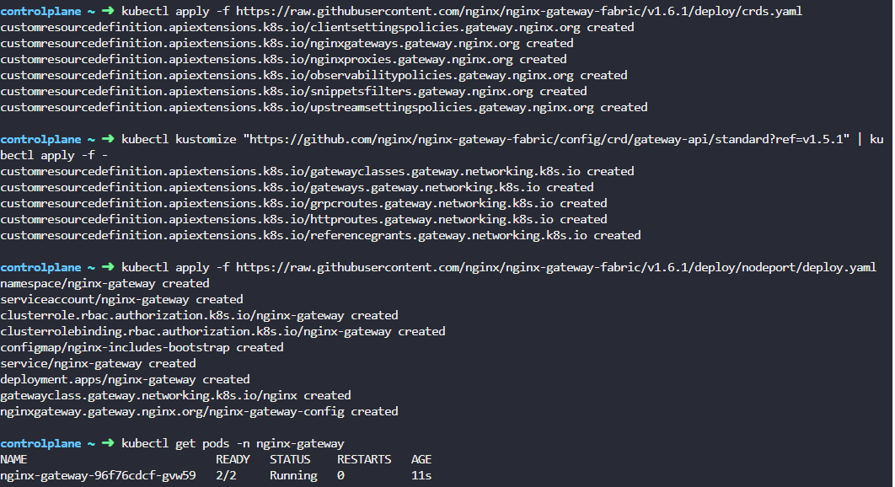

 

View the nginx-gateway service

kubectl get svc -n nginx-gateway nginx-gateway -o yaml

 

Update the nginx-gateway service to expose ports 30080 for HTTP and
30081 for HTTPS

kubectl patch svc nginx-gateway -n nginx-gateway --type='json' -p='\[

{"op": "replace", "path": "/spec/ports/0/nodePort", "value": 30080},

{"op": "replace", "path": "/spec/ports/1/nodePort", "value": 30081}

\]'

 

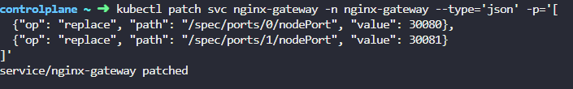

 

Create Gateway instance

 

apiVersion: gateway.networking.k8s.io/v1

kind: Gateway

metadata:

name: nginx-gateway

namespace: nginx-gateway

spec:

gatewayClassName: nginx

listeners:

\- name: http

protocol: HTTP

port: 80

allowedRoutes:

namespaces:

from: All

 

A new pod named frontend-app and a service called frontend-svc have been
deployed in the default namespace. Expose the service on the / path by
utilizing an HTTPRoute named frontend-route

 

 

 

apiVersion: gateway.networking.k8s.io/v1

kind: HTTPRoute

metadata:

name: frontend-route

namespace: default

spec:

parentRefs:

\- name: nginx-gateway

namespace: nginx-gateway

sectionName: http

rules:

\- matches:

\- path:

type: PathPrefix

value: /

backendRefs:

\- name: frontend-svc

port: 80

 

 

 

 

 

 

 

 

 

 

 
