**Kubernetes- Scheduling and Logging & Monitoring**

**Manual Scheduling**

 

**How scheduling works**

 

\- Every pods has nodeName field which has no value set by default.
Kubernetes add ***nodeName*** property automatically if you don’t
specify nodeName for the pods you created.

-Scheduler go through all pods and find the pod that doesn't have
***nodeName*** property set. If there is a candidate, identify the right
node by running the scheduling algorithm and schedule pod on a node by
setting nodeName property with name of the node by creating binding
object

\- If there is no scheduler to place a pod, pod status appears as
**Pending**. At this state, you have to manually specify the
***nodeName*** in specification section in resource definition file

-You can only specify nodeName at creation time. Kubernetes won't allow
to modify nodeName property after creating pod. In that case, we need to
create binding object and send a POST request to the pod’s binding API
with data set through the binding object in a JSON format.

\- There is no way to move running pod to one node to another because
container is a running process in systems. Deleting existing pod and
recreate a new pod in required node is the option.

\- The scheduler runs as a pod include in kube-system namespace

 

apiVersion: v1

kind: Binding

metadata:

name: nginx

target:

apiVersion: v1

kind: Node

name: node02

 

\- kubectl get nodes ; available nodes in cluster

\- kubectl get pods -n kube-system ; find the pods that run with
kube-system namespace

 

spec:

nodeName: \<node name\>

containers:

 

 

**Labels and selectors**

 

-Labels are properties attached to each object, selectors helps you to
filter these items

\- The way of grouping the objects created in the cluster based on the
need such type of object, application, tier, functionalities

\- Use to link different object together such as pod with ReplicaSet,
deployment, service

 

kubectl get pods - -selector app=App1 ; get the pods has app=App1 label

 

kubectl get pods - -selector app=App1 - -no-headers \| wc -l ; get the
count of pods using word count option without headers

 

Kubectl get all - -selector app=App1; get all objects that has app=App1
label

 

kubectl get pods - -selector=“env=prod,bu=finance,tier=frontend” ; pods
that has specified labels

 

***Annotations***

 

\- Annotations are used to record other details for informatory purpose.
That may be used for kind of integration purpose. For example; name,
version, build information, contact details, phone number, email ID

 

apiVersion: apps/v1

kind: ReplicaSet

metadata:

name: simple-webapp

labels:

app: App1

function: Front-end

annotations:

buildversion: 1.34

 

spec:

replicas: 3

 

**Taints and Toleration**

 

\- Taint and tolerance is a concept to restrict nodes from accepting
certain pods

\- To restrict a pod to certain nodes, it can be achieved by another
concept which is called node affinity

\- If a node is specified with taint and any pod is tolerant with the
taint specified can be placed into node. If pod is not tolerant and
there is no node for pod to be placed, pod will be in pending state

-By default pod has no toleration. Unless specify, none of the pods can
tolerate any taint.

-Taint are set on nodes and toleration are set on pods

\- Taint and toleration doesn’t tell pod to schedule on a particular
node. Instead, it tells to only accept the pods with certain toleration

\- Pod scheduling happens on worker nodes only because Kubernetes set
taints on master node automatically to prevent any pod schedule on
master nodes. However the taint set up on master node is not modified as
best practice

 

kubectl describe node kubemaster l grep taint

 

***Taints- Node***

 

kubectl taint node \<node_name\> key=value:taint-effect ; to taint a
node with key value pair and taint effect

 

kubectl taint node node1 app=blue:NoSchedule

 

kubectl taint node \<node_name\> key=value:taint-effect- ; to untaint a
node

 

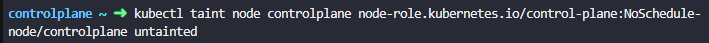

 

***Taint effect***

 

-Taint effect determine what happens to PODs that do not tolerate the
taint.

 

1.  ***NoSchdule*** - pod will not be scheduled on the node unless they
    are matching toleration. The currently running pod on the node are
    not evicted

 

kubectl taint nodes node1 app=blue:NoSchedule

 

2.  ***PreferNoSchdule***- system will try to avoid placing a pod on the
    node but that is not guaranteed

 

3.  ***NoExecute*** - The new pods will not be scheduled on the node if
    pod is not tolerant with taint applied to node. Any existing pod
    will be evicted from the node if they do not tolerate the taint
    applied. These pods may have been scheduled on the node before the
    taint was applied to the node. This effect for app that needs pods
    to be scheduled on particular node by evicting other pods that are
    note tolerated with the taint

 

***Tolerations - PODs***

 

\- Toleration is added to specifications section in pod-definition file
as list of dictionaries.

\- All the values should encoded with double codes, it works without
double codes as well

\- If pod manifest file is modified with a toleration for the pod is
already scheduled on a node, the pod will be evicted if the pod is not
tolerated with existing node.

-Operators of tolerations are Equal and Exists

 

spec:

containers:

\- name: nginx-container

image: nginx

tolerations:

\- key: “app”

operator: “Equal”

value: “blue”

effect: “NoSchedule”

 

 

**Node Selectors**

 

\- By default, any pod can schedule on any node in the cluster. If there
are nodes with higher resources in the cluster, the workload that needs
high demand of processing can be assigned to the node that has higher
resource.

\- Node selector helps to assign pods that needs large resource demand
into large node in the cluster

\- To use node selector like this, it must have label assign to node
prior to create pod with node selector

\- To restrict pods from scheduling on appropriate node.

 

***Label Nodes***

 

kubectl label nodes \<node-name\> \<label-key\>=\<label-value\>

 

kubectl label nodes node-1 size=Large

 

\- Specify nodeSelector label with key value pair onto pod in spec
section ***spec.nodeSelector***

 

spec:

containers:

\- name: data-processor

image: data-processor

 

nodeSelector:

size: Large

 

 

**Node Affinity**

 

-Node Selector is not ideal for complex requirement such as placing pod
on large ***OR*** medium node, place a pod on any node that is ***NOT***
small so that the solution comes Node Affinity

\- To ensure that pods are hosted on particular nodes with advanced
capabilities such as OR, NOT

\- nodeSelectorTerms is an array

\- Create match expressions that label value has any value in the list
of values specified

\- For Exists operator, it doesn’t need to specify any value

\- For deployment and replica set, affinity rules needs to be created in
spec section in the pod template ***spec.affinity***

 

spec:

containers:

\- name: data-processor

image: data-processor

affinity:

nodeAffinity:

requiredDuringSchdulingIgnoredDuringExecution:

nodeSelectorTerms:

\- matchExpressions:

\- key: size

operator: In\| NotIn \| Exists

values:

\- Small

\- Large

 

Operator- Exists use when there is no value field to be specified. That
operator match any value exists

 

***Node Affinity types***

 

The types of node affinity uses when nodes with matching labels are not
available.

 

Available: currently available

 

***requiredDuringSchdulingIgnoredDuringExecution*** - the scheduler will
mandate that the pod to be placed in a node that match with affinity
rules. If it cannot find one, the pod will not be scheduled. This is
used when scheduling pod on specific node is crucial.

 

***preferredDuringSchedulingIgnoredDuringExecution*** - The scheduler
tries to find a node that meets the rule. If a matching node is not
available, the scheduler still schedules the Pod any node in the
cluster. This is used when scheduling pod on specific node is less
priority.

 

IgonredDuringExecution means pod continues to schedule on the node
except any changes made on affinity rules on pod or labels attached on
node which will not be impacted even after they are scheduled.

 

Planned: introduce in the future

 

***requiredDuringSchedulingRequiredDuringExecution*** - This will evict
or terminate any pods that are running on nodes if they do not meet
affinity rules. If label on the node is removed, pods that have
nodeSelector or affinity matching with the labels will be terminated.

 

When you make indentation on node affinity configs into pod definition
file,

\- move out from insert mode

\- Press shift + v to get into visual line mode

\- Press down arrow down to select lines

\- Press shift + \> to move for all selected line

 

 

**Taint/Toleration and Node affinity**

 

Combination of Taint/Toleration and Node affinity can be used to
schedule pods to particular node.

 

Taint and tolerations doesn’t guarantee pods have toleration are placed
on a node that match with taint if there are more nodes with no taints.
There is a chance that pods with no node affinity rules may be placed on
the node that have label. So it will solve using combination of
Taint/Toleration and Node affinity rules.

 

 

**Resource requirement and Limits**

 

Kube-scheduler places pods on the node that has maximum resources
available in the cluster.

 

If there is no nodes having sufficient CPU, memory and disks for pods to
be scheduled, the scheduler avoids placing the pods on and pods will be
pending state which showing insufficient resources in kubectl describe
command

 

***Resource requests***

 

If a pod or container needs more resources than by default they offer,
we can use pod definition file to specify the numbers of resources
requires. (***spec.containers\[\].resources.requests***)

 

spec:

containers:

\- name: simple-webapp-color

image: simple-webapp-color

ports:

\- containerPort: 8080

resources:

requests:

memory: “4Gi”

cpu: 2

 

***Resource - CPU***

 

\- 1 AWS vCPU

\- 1 GCP core

\- 1 Azure core

\- 1 Hyperthread

 

Range : 100m \> CPU \> 1m

 

***Resource - Memory***

 

1 G (Gigabyte) - 1,000,000,000 bytes

1 M (Megabyte) - 1,000,000 bytes

1 K (Kilobyte) - 1000 bytes

 

1 Gi(Gibibyte) - 1,073,741,824 bytes

1 Mi(Mebibyte) - 1,048,576 bytes

1 Ki(Kibibyte) - 1024 bytes

 

***Resource Limits***

 

Docker container has no limits to consume resources at node and that may
suffocate all other containers and native processes in nodes.
(***spec.containers\[\].resources.limits***)

 

By default, Kubernetes set 1 vCPU and 512 Mi for containers once request
is set

 

spec:

containers:

\- name: simple-webapp-color

image: simple-webapp-color

ports:

\- containerPort: 8080

resources:

requests:

memory: “1Gi”

cpu: 1

limits:

memory: “2Gi”

cpu: 2

 

Resource limit and request are set to each container in the pods. If
there are multiple containers on pod, resource request and limit should
define for each container in list/array.

 

Container cannot consume CPU beyond the limit as system throttle the
CPU. However, it is not for memory. If no limit set, the container can
use excessive memory when available, then pod will be terminated with
***OOMKilled (Out Of Memory Killed)*** error that shows in output of
kubectl describe command.

 

 

Understanding how Kubernetes deals with system resources, particularly
memory, is vital to managing and preventing OOMKilled events. Kubernetes
uses cgroups (control groups), a Linux kernel feature, to limit the
resource usage of processes. When a container in Kubernetes is created,
it is assigned to a specific cgroup. The cgroup has a defined amount of
memory that the container can use. If a container tries to consume more
memory than its cgroup allows, the Linux kernel triggers an OOM
condition, leading to the OOMKilled event.

 

 

Kubectl describe command will show reason OOMKilled for terminated state
as follows.

 

State: Waiting

Reason: CrashLoopBackOff

Last State: Terminated

Reason: OOMKilled

Exit Code: 1

 

 

If you want to check pods cpu/memory usage without installing any third
party tool then you can get memory and cpu usage of pod from cgroup.

 

Go to pod's exec mode kubectl exec -it pod_name -n namespace --
/bin/bash

Run cat /sys/fs/cgroup/cpu/cpuacct.usage for cpu usage

Run cat /sys/fs/cgroup/memory/memory.usage_in_bytes for memory usage

 

Make Sure you have added the resources section (requests and limits) to
deployment so that it can calculate the usage based on cgroup and
container will respect the limits set on pod level

 

 

***Default behavior***

 

By default, Kubernetes doesn’t set resource request or limit on
container where container can utilize resources on node as much as they
require.

 

***Behavior - CPU and Memory***

 

1\. No request - No limits : Pod usually comes with no request or limit
specified. Hence, pod can consume as much CPU and memory as it needs

2\. No requests - Limits : Kubernetes then automatically set the request
same as limits

3\. Requests - Limits : pod uses the requested resources, not used
beyond the limit

4\. Requests - No limits : ***This is the ideal scenario.*** Each pod
guarantees to have 1 CPU and 1 Gi Memory at least and may increase CPU
as it needs. Defining resource request on pods prevents from consuming
all resources on nodes by any pod unnecessarily.

**LimitRange**

 

Kubernetes has no restriction on CPU and memory usage. With LimitRange
object, it is possible to set default value of CPU and memory on pod but
not in pod definition file. It is applicable at namespace level.

 

Limit-range-cpu.yaml

 

apiVersion: v1

kind: LimitRange

metadata:

name: cpu-limit-range

spec:

limits:

\- default: \# this section defines default limits

cpu: 500m

defaultRequest: \# this section defines default requests

cpu: 500m

max:

cpu: “1”

min:

cpu: 100m

type: Container

 

Limit-range-memory.yaml

 

apiVersion: v1

kind: LimitRange

metadata:

name: mem-limit-range

spec:

limits:

\- default:

memory: 1Gi

defaultRequest:

memory: 1Gi

max:

memory: 1Gi

min:

memory: 500Mi

type: Container

 

 

Limit range will be applied on new pods not to the existing pods.

 

**Resource Quotas**

 

The way to restrict total amount of resources that can be consumed by
application deployed in the Kubernetes cluster. In the sense, all the
pods has a limit of resources can consume in the cluster.

 

Resource quotas are created at namespace level

 

apiVersion: v1

kind: ResourceQuota

metadata:

name: my-resource-quota

spec:

hard:

request.cpu: 4

request.memory: 4Gi

limit.cpu: 10

limit.memory: 10 Gi

 

Attributes of a running pods cannot be edited. It creates manifest file
in temporary directory with the change which we can make a new pod by
replacing the existing pod.

 

 

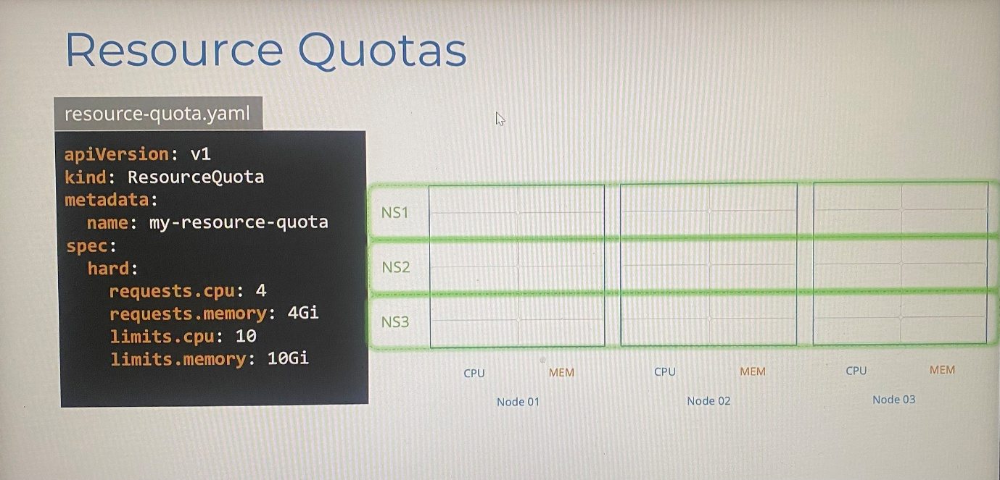

 

**Daemon Sets**

 

\- Daemon set ensures to schedule a copy of pods on every node in the
cluster. It adds replica of pods to node when a new node is added to the
cluster as well as removes replica pod automatically when a node is
removed from the cluster

\- Daemon sets are created by Daemon Set Controller in Kube-controller
manager and it is ignored by kube-scheduler for choosing nodes

\- Use case - when cluster needs monitoring solution or log viewer to be
deployed on each node in the cluster as pod, daemon set is perfect
solution to achieve it

\- Use case - kube-proxy can also be deployed as daemon set as it
requires on each node in the cluster

\- Use case - Networking solution like weave-net needs an agent to be
deployed on each node

\- Creating daemonset is similar as creating replicaset or deployment

 

***How daemonset works***

 

\- Daemonsets uses nodeName attribute to schedule pods on each node when
pods create which is the behavior it used to be till Kubernetes v1.12

\- From Kubernetes v1.12, it uses NodeAffinity rule and default
scheduler

\- Cannot create daemonset in imperative way directly. So use create
deployment in imperative way, edit kind and ***remove the replicas,
strategy and status fields*** on the deployment definition file as
daemonset that gets from dry run output

 

apiVersion: apps/v1

kind: DaemonSet

metadata:

name: monitoring-agent

spec:

selector:

matchLabels:

app: monitoring-agent

template:

metadata:

labels:

app: monitoring-agent

spec:

containers:

\- name: monitoring-agent

image: monitoring-agent

 

\- kubectl get daemonsets

\- kubectl describe daemonsets monitoring-d

\- kubectl get pods \<pod name\> -n \<namespace \> ; get pods in certain
namespace

\- kubectl describe daemonsets monitoring-d -n \<namespace\>

 

\*\*\*\*\*\*\*\*Examtips\*\*\*\*\*\*\*\*\*\*\*\*\*\*\*\*

 

\*\* An easy way to create a DaemonSet is to first generate a YAML file
for a Deployment with the command kubectl create deployment
elasticsearch --image=registry.k8s.io/fluentd-elasticsearch:1.20 -n
kube-system --dry-run=client -o yaml \> fluentd.yaml. Next, ***remove
the replicas, strategy and status fields*** from the YAML file using a
text editor. Also, change the kind from Deployment to DaemonSet. If you
see any unknown field when you create through manifest file, remove them
from manifest file and create Daemonset.

 

Finally, create the Daemonset by running kubectl create -f fluen td.yaml

 

controlplane ~ ➜ kubectl get ds -n kube-system elasticsearch -o yaml

apiVersion: apps/v1

kind: DaemonSet

metadata:

annotations:

deprecated.daemonset.template.generation: "1"

creationTimestamp: "2025-07-13T05:25:49Z"

generation: 1

labels:

app: elasticsearch

name: elasticsearch

namespace: kube-system

resourceVersion: "2245"

uid: 6119ad2b-7cc1-4953-bb63-4c15b79d94a6

spec:

revisionHistoryLimit: 10

selector:

matchLabels:

app: elasticsearch

template:

metadata:

creationTimestamp: null

labels:

app: elasticsearch

spec:

containers:

\- image: registry.k8s.io/fluentd-elasticsearch:1.20

imagePullPolicy: IfNotPresent

name: fluentd-elasticsearch

resources: {}

terminationMessagePath: /dev/termination-log

terminationMessagePolicy: File

dnsPolicy: ClusterFirst

restartPolicy: Always

schedulerName: default-scheduler

securityContext: {}

terminationGracePeriodSeconds: 30

updateStrategy:

rollingUpdate:

maxSurge: 0

maxUnavailable: 1

type: RollingUpdate

status:

currentNumberScheduled: 1

desiredNumberScheduled: 1

numberAvailable: 1

numberMisscheduled: 0

numberReady: 1

observedGeneration: 1

updatedNumberScheduled:

 

 

controlplane ~ ✖ kubectl get pod -n kube-system elasticsearch-mrpc8 -o
yaml

apiVersion: v1

kind: Pod

metadata:

creationTimestamp: "2025-07-13T05:25:49Z"

generateName: elasticsearch-

generation: 1

labels:

app: elasticsearch

controller-revision-hash: 5d887d4f4f

pod-template-generation: "1"

name: elasticsearch-mrpc8

namespace: kube-system

ownerReferences:

\- apiVersion: apps/v1

blockOwnerDeletion: true

controller: true

kind: DaemonSet

name: elasticsearch

uid: 6119ad2b-7cc1-4953-bb63-4c15b79d94a6

resourceVersion: "2244"

uid: 6d7b7409-c3f9-4169-8b2c-50dc9272a4ee

spec:

affinity:

nodeAffinity:

requiredDuringSchedulingIgnoredDuringExecution:

nodeSelectorTerms:

\- matchFields:

\- key: metadata.name

operator: In

values:

\- controlplane

 

 

To edit attribute of existing static pod, modify the pod definition file
in **/etc/kubernetes/manifests** directory. If it doesn't work, recreate
the pod.

 

 

 

**Static pods**

 

\- Kubelet can manage a node independently when master node is not
available in the cluster.

\- Kubelet can create pods without having instruction from kube-api
server

\- Kubelet stores pod definition file in the directory
**/etc/kubernetes/manifests** of worker node. This is called
**staticPodPath** which specify Kubelet configuration file(config.yaml)
in /var/lib/kubelet/ directory. Kubelet periodically check this
directory and read pod definition file to create pods. If any change on
the files, Kubelet will detect changes and recreate the pods on the
host. Once the file is deleted from the directory, pods will be
automatically deleted

-Kubelet also ensures the pods are alive. If application crashes,
kubelet attempt to restart the pod

-Static pods are ignored by Kube-scheduler

-Static pods can be identified by pod's name postfix with node name they
schedule(etcd-controlplane)

-The other way is to make sure the pod is a static pod, check the
value(Node) in kind parameter in **ownerReference\[\].kind** section in
pod definition file. If it is node, pod is static. kubectl get pods -n
kube-system -o yaml. For other pod, the kind is replicaset or else.

 

ownerReferences:

\- apiVersion: v1

controller: true

kind: Node

name: controlplane

uid: 6412bc8a-da08-46d4-9b2a-3e003060b525

 

ownerReferences:

\- apiVersion: apps/v1

blockOwnerDeletion: true

controller: true

kind: ReplicaSet

name: coredns-6678bcd974

uid: 2a7faba4-feef-4157-9450-0ae7dc2f5b7e

 

 

 

In kubelet.service file,

 

\- -pod-manifest-path=/etc/kubernetes/manifests

 

\- Kubelet can read only from pod level, not deployment, ReplicaSet etc

\- Kubelet.service file define the path to store manifest file of static
pods, also we can define the path in the kubelet.service file with
option -- config=kubeconfig.yaml. The cluster set up with kubeadm tool
uses this approach.

 

In kubeconfig.yaml

staticPodPath: /etc/Kubernetes/manifests

 

kubeconfig.yaml file is located in the path /var/lib/kubelet/

 

\*\*\*Run the command ***ps -aux \| grep kubelet*** and identify the
config file ***--config=/var/lib/kubelet/config.yaml***. Then check in
the config file for ***staticPodPath***.

 

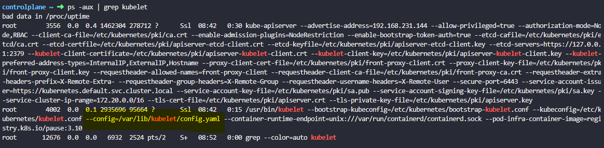

 

\- Once create static pod, can see them running docker ps command,
Kubectl utility doesn’t work as there is no kube-api server.

\- For each container runtime, we can use crictl ps and nerdctl ps

\- This kubelet can create pods in 2 ways at same time through which
from pod definition files stored in the folder
**/etc/kubernetes/manifests** and input from Kube-api server through
HTTP API endpoint

 

\- ***kubectl get pods*** command lists the static pod as well because
if Kubelet is a part of cluster, Kubelet creates a mirror object of
static pod that created in kube-api server which is read-only mirror of
pods that cannot be deleted or modified from kubectl utility like usual
pods. You can only delete them by modifying the file from the node in
manifest folder (**/etc/kubernetes/manifests** directory)

 

\- Name of Static pods are automatically appended by node name at the
end of pod such as static_web-node01

\- As static pods are not dependent on control plane, can use static pod
to deploy control plane components itself such api server, etcd,
controller manager, scheduler can be created storing manifest file of
each in designated manifest folder on nodes. We can list these
components as pods in kube-system namespace ; kubectl get pods -n
kube-system

\- In this way, you don’t need to download binaries and configure
control plane components as services or to worry about those pods
crashing. Instead configure control plane components as pod by storing
pod definition file for pods in staticpodpath. If any pods crash, it
will automatically be restarted by kubelet as they are static pods.
That’s how Kubeadm tool set up cluster components.

 

 

To create static pod in *staticPodPath;*

 

kubectl run --restart=Never --image=busybox static-busybox
--dry-run=client -o yaml --command -- sleep 1000 \>
/etc/kubernetes/manifests/static-busybox.yaml ; any options should be
before the command options

 

cp \<pod definition file\> /etc/kubernetes/manifests/ ; to move manifest
file created to static pod path

 

\- Once you delete static pod with delete command with kubectl utility,
static pod will be created by kubelet on node. So you have to remove pod
definition file from the ***staticPodPath*** location to completely
delete pod from the system.

 

 

**Priority Classes**

 

Kubernetes runs different applications as pods with different
priorities. For example, Kubernetes controlplane components itself need
to always run, priority databases, Critical apps, lower priority
workloads such as background jobs.

 

We need to make sure higher priority workloads always get scheduled
without being interrupted by lower priority workloads. This is where
priority classes come in where it helps to define priorities for
different workloads. So higher priority workloads always get scheduled
over lower priority ones.

 

If a higher priority pod cannot be scheduled, the scheduler will try to
terminate a lower priority workload to make higher priority pod to be
scheduled.

 

The priority classes are non-namespace objects which means they are not
attached to a specific namespace. Once they are created, they are
available to be configured on any pod in any namespace.

 

Priorities are a range of numbers

 

high= 1,000,000,000 and low= - 2,147,487,648 ---\> For application or
workloads

 

high= 2,000,000,000 and low= 1,000,000,000 ----\> For Kubernetes
controlplane components

 

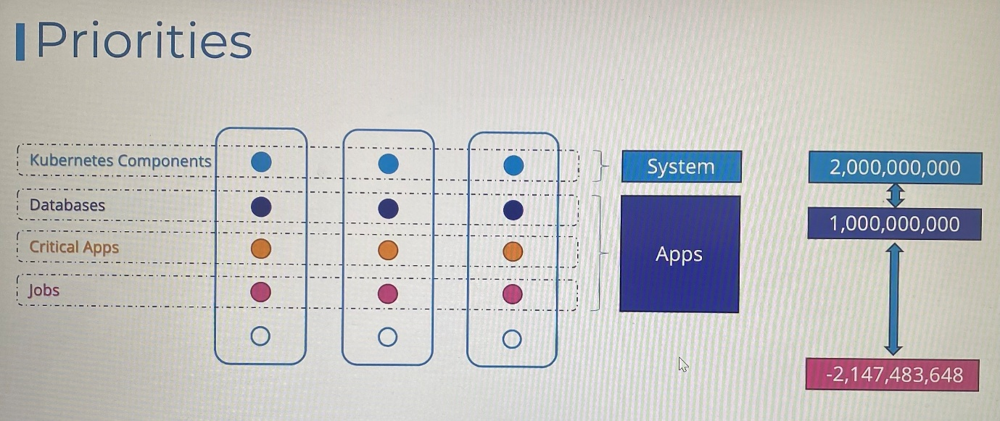

 

kubectl get priorityclass ; list the priority classes

 

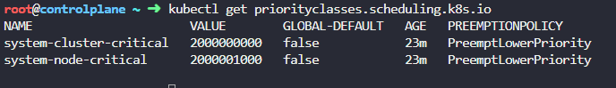

 

Imperative way:

 

kubectl create priorityclass high-priority --value=100000
--preemption-policy="PreemptLowerPriority" --global-default=true

 

 

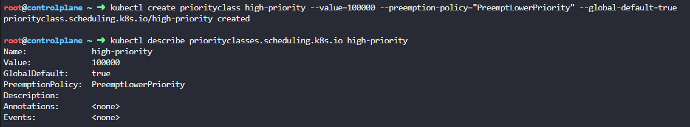

 

apiVersion: scheduling.k8s.io/v1

kind: PriorityClass

metadata:

name: high-priority

value: 1000000000

description: "Priority class for mission critical pods"

 

We associate the priority class to a pod by using the
**priorityClassName** property inside the pod definition
**(spec.priorityClassName)**

 

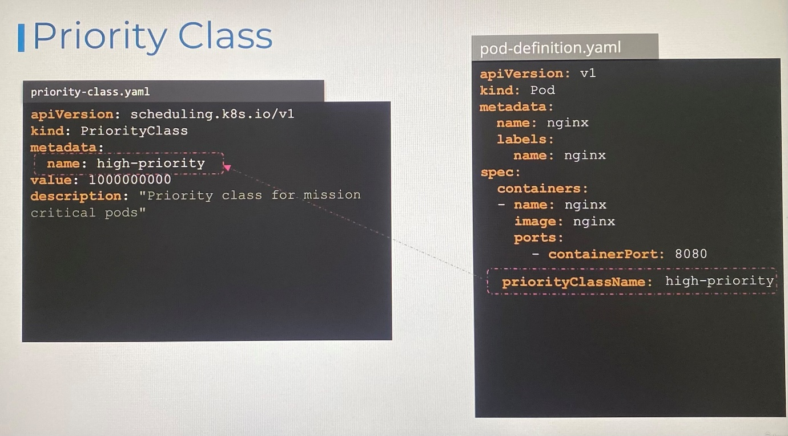

 

If pod has no priorityClassName explicitly defined, it is assumed to
have priority class value is zero(lowest priority). If you need priority
class value for those pods, you must create a new priority class and
assign the **globalDefault** property to true. This is an optional field
and use to define the default priority of all the pods that have no
priority class explicitly assigned . Only one PriorityClass in the
cluster can have globalDefault: true at a time.

 

apiVersion: scheduling.k8s.io/v1

kind: PriorityClass

metadata:

name: high-priority

value: 1000000000

description: "Priority class for mission critical pods"

globalDefault: true

 

Only one PriorityClass in the cluster can have globalDefault: true at a
time. If multiple PriorityClasses are mistakenly set as globalDefault,
the last one created takes effect.

 

***Effect of Pod Priority***

 

Consider that Critical apps pods have higher priority value and Jobs
pods have lower priority value. Hence critical apps pods will be first
scheduled on nodes in the cluster and then Jobs pods will be placed by
consuming all resources on nodes. Let assume that we have higher
priority job comes later and there are no more resources available on
the cluster. What happens? Do we evict existing workload or does it
wait?

 

The behaviour is defined by **preemptionPolicy** defined in the priority
class assigned to the higher priority job.

 

apiVersion: scheduling.k8s.io/v1

kind: PriorityClass

metadata:

name: high-priority

value: 1000000000

description: "Priority class for mission critical pods"

preemptionPolicy: PreemptLowerPriority

 

- If the preemption policy is not set, its default value is set to
  PreemptLowerPriority. This means that it would kill the existing lower
  priority job and take higher priority job place.

- If you do not want it to kill or evict the existing workload and
  instead wait for the cluster resources to free up to schedule them in
  the scheduling queue, then you must set this preemptionPolicy to
  never. However, they will get a higher priority in scheduling over
  other lower priority pods that are also waiting to be scheduled in the
  queue.

 

You can compare the priority classes on both pods using the following
command:

 

root@controlplane ~ ➜ kubectl get pods -o
custom-columns="NAME:.metadata.name,PRIORITY:.spec.priorityClassName"

 

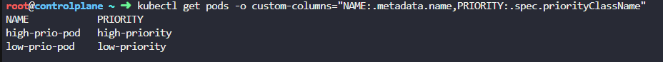

 

root@controlplane ~ ➜ kubectl get priorityclasses.scheduling.k8s.io -o
custom-columns="NAME:.metadata.name,PRIORITYVALUE:.value"

 

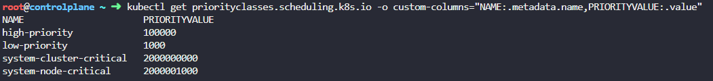

 

The pod critical-app is stuck in Pending state due to the low-app pod
getting scheduled and requesting high resources

 

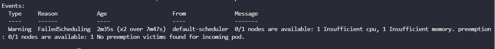

 

 

If there is the following error, remove priority value
**spec.priority**.

 

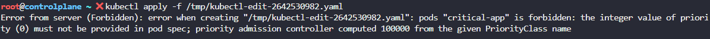

 

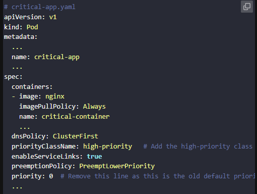

 

 

 

**Multiple Scheduler**

 

\- When you have specific application that require its components to be
placed on particular node after performing additional checks with custom
conditions defined where you decide to have your own scheduling
algorithm so that you can write scheduler program, package and deploy it
as default or additional scheduler.

-Kubernetes cluster can have multiple scheduler at a time

\- Thus we can choose the custom scheduler we created to use with when
we deploy pod, deployment, ReplicaSet etc

\- Default scheduler in cluster is named as ***default-scheduler*** and
the name is configured in kube-scheduler configuration file is
***scheduler-config.yaml*** where we can specify name of scheduler as
property ***schedulerName***

-Thus we can create other schedulers with separate configuration file
and set desired scheduler name.

 

 

scheduler-config.yaml

 

apiVersion: kubescheduler.config.k8s.io/v1

kind: KubeSchedulerConfiguration

profiles:

\- schedulerName: default-scheduler

 

***Deploy additional scheduler as service***

 

We downloaded kube-scheduler binaries and running as service with set of
options.

 

wget
<https://storage.googleapis.com/kubernetes-release/release/v1.12.0/linux/amd64/kube-scheduler>

 

We point the configuration to custom configuration file which have its
own scheduler name. The other options to be passed in such as kubeconfig
file to authenticate into the Kubernetes API through kube-apiserver.

 

kube-scheduler.service

ExecStart=/usr/local/bin/kube-scheduler \\

\- -config=/etc/kubernetes/config/***kube-scheduler.yaml***

 

my-scheduler.service

ExecStart=/usr/local/bin/kube-scheduler \\

\- -config=/etc/kubernetes/config/***my-scheduler-config.yaml***

 

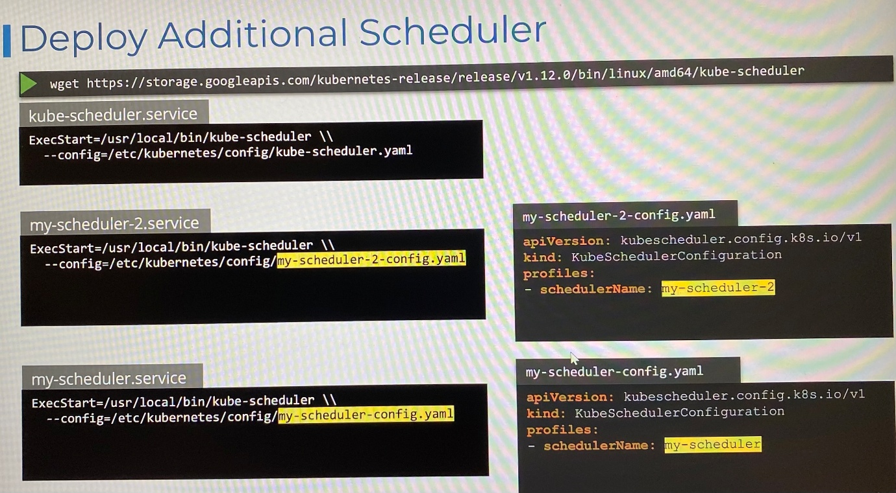

 

***Deploy additional scheduler as a Pod***

 

Create pod definition file specifying path to kube-scheduler
configuration file with config option and specify authentication
information to connect kube-api server with kubeconfig option. Name of
the scheduler pick up by scheduler kube-scheduler configuration file.

 

apiVersion: v1

kind: Pod

metadata:

name: my-custom-scheduler

namespace: kube-system

spec:

containers:

\- command:

\- kube-scheduler

\- - -address=127.0.0.1

\- - -kubeconfig=/etc/kubernetes/scheduler.conf

\- - -config=/etc/kubernetes/***my-scheduler-config.yaml***

 

image: K8s.gcr.io/kube-schduler-amd64:v1.11.3

name: kube-scheduler

 

***my-scheduler-config.yaml***

 

apiVersion: kubescheduler.config.k8s.io/v1

kind: KubeSchedulerConfiguration

profiles:

\- schedulerName: my-scheduler

 

\- You can create kube-scheduler configuration locally and pass it as
volume that mount to pod or deployment for custom scheduler

\- Or mapping ConfigMap file as volume mount

 

***Leader Elect Option***

 

\- Use when you have multiple copies of scheduler running on different
master nodes for HA setup

\- Only one scheduler is active at a time, leader elect option helps to
decide who lead the scheduling activity for the particular pod.

-You can build your own scheduler by cloning github repository, compose
Dockerfile from, build an image from Dockerfile and push it to an image
repository

 

***my-scheduler-config.yaml***

 

apiVersion: kubescheduler.config.k8s.io/v1

kind: KubeSchedulerConfiguration

profiles:

\- scheduleName: my-schedule

leaderElection:

leaderElect: true

resourceNamespace: kube-system

resourceName: lock-object-my-scheduler

Deploy additional scheduler as a Deployment - the configuration for
deployment definition file can be found in kubernetes page. [Configure
Multiple Schedulers \|
Kubernetes](https://kubernetes.io/docs/tasks/extend-kubernetes/configure-multiple-schedulers/)

 

**Use custom Scheduler in pod definition**

 

Specify custom scheduler to be used with spec.schedulerName in pod
definition file.

 

apiVersion: v1

kind: Pod

metadata:

name: nginx

spec:

schedulerName: my-custom-scheduler

containers:

\- image: nginx

name: nginx

 

 

\- If the custom scheduler is not configured correctly, it remains as
Pending state

 

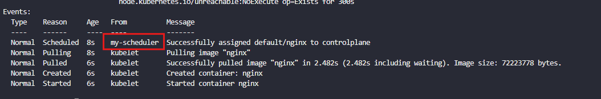

 

 

***my-scheduler-config.yaml***

 

apiVersion: kubescheduler.config.k8s.io/v1

kind: KubeSchedulerConfiguration

profiles:

\- schedulerName: my-scheduler

leaderElection:

leaderElect: false

 

 

 

***my-scheduler-configmap.yaml***

 

apiVersion: v1

data:

my-scheduler-config.yaml: \|

apiVersion: kubescheduler.config.k8s.io/v1

kind: KubeSchedulerConfiguration

profiles:

\- schedulerName: my-scheduler

leaderElection:

leaderElect: false

kind: ConfigMap

metadata:

creationTimestamp: null

name: my-scheduler-config

namespace: kube-system

 

***my-scheduler.yaml***

 

apiVersion: v1

kind: Pod

metadata:

labels:

run: my-scheduler

name: my-scheduler

namespace: kube-system

spec:

serviceAccountName: my-scheduler

containers:

\- command:

\- /usr/local/bin/kube-scheduler

\- --config=/etc/kubernetes/my-scheduler/my-scheduler-config.yaml

image: registry.k8s.io/kube-scheduler:v1.31.0

livenessProbe:

httpGet:

path: /healthz

port: 10259

scheme: HTTPS

initialDelaySeconds: 15

name: kube-second-scheduler

readinessProbe:

httpGet:

path: /healthz

port: 10259

scheme: HTTPS

resources:

requests:

cpu: '0.1'

securityContext:

privileged: false

volumeMounts:

\- name: config-volume

mountPath: /etc/kubernetes/my-scheduler

hostNetwork: false

hostPID: false

volumes:

\- name: config-volume

configMap:

name: my-scheduler-config

 

 

kubectl create configmap my-scheduler-config
--from-file=/root/my-scheduler-config.yaml -n kube-system ; create a
configmap object using definition file other than kubectl create command

 

***Summary of creating custom scheduler***

 

***-***Create kube scheduler configuration file:
my-scheduler-config.yaml

-Create ConfigMap from the kube scheduler configuration file

-Create pod or deployment with image of custom scheduler, specify
ConfigMap as volume and mount the volume to container, specify path of
kube scheduler configuration file with config option in command

-Specify the custom scheduler name with *spec.schedulerName*

 

***View events***

 

\- To view which scheduler pick up scheduling particular pod

 

kubectl get events -o wide ; list all the events in current namespace
including name, kind, reason, source, message

 

 

 

***View scheduler logs***

 

Kubectl logs my-custom-scheduler - - namespace=kubesystem

 

 

kubectl get serviceaccount -n kube-system

kubectl get clusterrolebinding

 

 

**Scheduler Profiles**

 

\- When pods create, they place to ***Scheduling Queue*** and they are
sorted based on priority defined on the pods

\- It needs to set up ***PriorityClass*** to set priority on the pods by
setting up name, priority value

 

 

apiVersion: scheduling.k8s.io/v1

kind: PriorityClass

metadata:

name: high-priority

value: 1000000

globalDefault: false

description: "This priority class should be used for XYZ service pods
only."

 

apiVersion: v1

kind: Pod

metadata:

name: simple-webapp-color

spec:

priorityClassName: high-priority

containers:

\- name: simple-webapp-color

image: simple-webapp-color

ports:

\- containerPort: 8080

resources:

requests:

memory: “1Gi”

cpu: 1

 

 

\- In scheduling phase, pod with higher priority value is sorted to
start scheduling queue

\- In ***Filtering*** phase, filter out the nodes that cannot run the
pods, determine the nodes has sufficient resources to cater pods
requirement.

\- In ***Scoring*** phase, nodes are scored with different weights.
Scores with free space after reserving CPU the requires by pods. The
node has high free space marks high score

\- In the ***Binding*** phase, the pod is bound to the node has highest
score

 

 

***Scheduling plugin***

 

-All of these operation in the phases are achieved with certain plugins

 

Scheduling queue- PrioritySort(priority value)

 

Filtering - NodeResourceFit( node with sufficient resources), NodeName(
specified node name in pods), NodeUnschedulable( ***Unschedulable***
flags set as true to make sure no pods are set on those nodes)

 

Scoring - NodeResourceFit, ImageLocality( associate highest score to the
node that has container image used by pod among different nodes, anyway
pods will place on any nodes if there are no image locally)

 

Binding - DefaultBinder(provides binding mechanism)

 

***Extension Points***

 

\- Kubernetes is extensible and makes it possible to customize what
plugins go where and write our own plugin which is achieved by extension
points

-At each stage, there is an extension point to which a plugin can be
plugged to

\- The extension before entering the filter phase is called the
pre-filter extension and the extension after entering the filter phase
is called post-filter. Thus there are multiple extension point can be
associated with each stages

-Some plugins span across multiple extension points

 

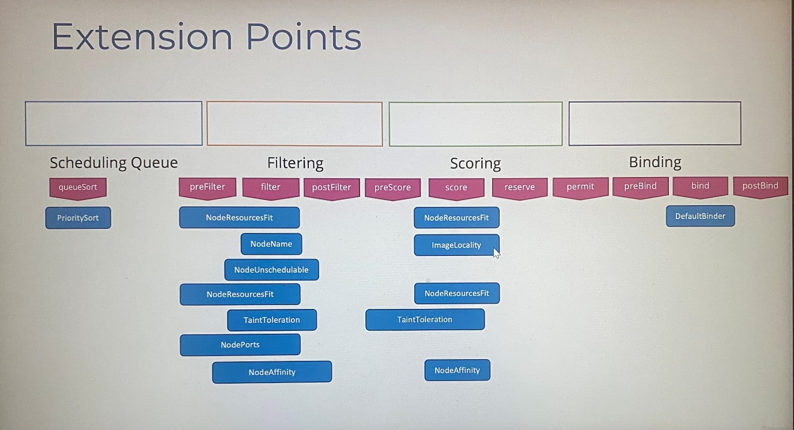

 

\- With 1.18 release of Kubernetes, multiple profiles support in single
scheduler configuring scheduler configuration file

 

 

\- In scheduler profiles, we can enable or disable plugins and specify
extension points

 

 

 

**References**

<https://github.com/kubernetes/community/blob/master/contributors/devel/sig-scheduling/scheduling_code_hierarchy_overview.md>

 

<https://kubernetes.io/blog/2017/03/advanced-scheduling-in-kubernetes/>

 

<https://jvns.ca/blog/2017/07/27/how-does-the-kubernetes-scheduler-work/>

 

<https://stackoverflow.com/questions/28857993/how-does-kubernetes-scheduler-work>

 

 

**Admission Controllers**

 

Securing Kubernetes: When we run command on Kubectl utility to perform
operation, kube-api server validate the request and the information is
persisted in the ETCD database

 

Authentication: When the request hits the kube-api server, it goes
through authentication process using the certificates configured in Kube
config file by identifying the user who send the request

 

Authorization: It checks if the user has permission to perform that
operation through role-based access controls. If the request that came
in matched any of rule conditions in the role, it is allowed to go
through, otherwise it is rejected.

 

 

RBAC can place different kind of restrictions such as allow/deny
particular role, verbs, specific resource names, access within specific
namespace.

 

Most of these rules that you can create with RBAC is at the Kubernetes
API level, and what user is allowed, access to what kind of API
operations. But what if you want to do more than just define what kind
of access an user has to an object?

 

For example, when a pod creation request comes in, you want to review
the configuration file and look,

 

\- image name not to allow images from a public docker hub registry,
only allow images from a specific internal registry.

\- enforce to use the latest tag for any images.

\- if the container is running as the root user, not to allow that
request or allow certain capabilities only

\- enforce that the metadata always contains labels.

 

These features cannot be achieved through existing RBAC. That is where
admission controllers comes in.

 

 

Admission controllers help to implement better security measures to
enforce how a cluster is used by validating configuration. Also it
changes the request itself or perform additional operations before the
pod gets created.

 

There are a number of admission controllers that come pre-built with
Kubernetes.

 

- AlwaysPullImages - ensures that every time a pod is created, the
  images are pulled.

- DefaultStorageClass - observes the creation of PVCs and automatically
  adds a default storage class to them if storage class is not specified

- EventRateLimit - set a limit on the request with the API server can
  handle at a time to prevent the API server from flooding with
  requests.

- NamespaceExists - rejects requests to namespace that do not exist

- NamespaceAutoProvision - This will automatically create the namespace
  if it does not exist. Itis not enabled by default.

 

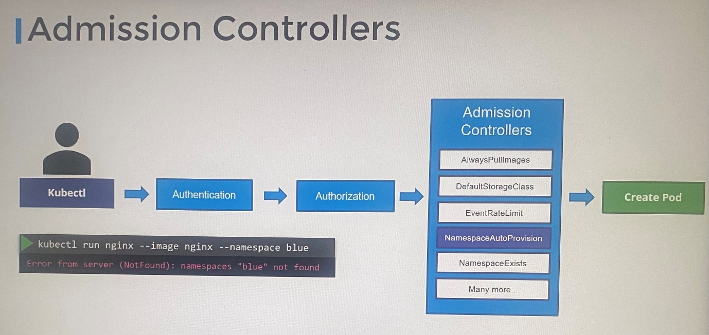

 

 

kube-apiserver -h \| grep enable-admission-plugins ; view enabled
admission controllers

 

kubectl exec -it kube-apiserver-controlplane -n kube-system --
kube-apiserver -h \| grep 'enable-admission-plugins' ; if you are
running this in a kubeadm based setup

 

Check enable-admission-plugins flag in kube-apiserver.yaml file to check
admission controller is enabled in cluster which is normally disabled

 

grep enable-admission-plugins
/etc/kubernetes/manifests/kube-apiserver.yaml

 

 

To add admission controller plugins,

 

- update the enable-admission-plugins flag on the kube API server
  service.

- If you are in Kubeadm based setup, then update the flag within Kube
  api server manifest file.

 

To disable admission controller plugins,

 

- update the disable-admission-plugins flag on the kube API server
  service.

- If you are in Kubeadm based setup, then update the flag within Kube
  api server manifest file.

 

 

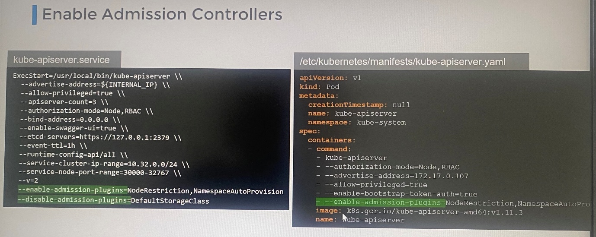

 

 

Once you update **NamespaceAutoProvision** in enable-admission-plugins
flag to provision a pod in a namespace that does not exist yet. The
request goes through authentication, then authorization, and then the
Namespace Auto Provision Admission Controller, at which point it
realizes that the namespace doesn't exist. So it creates the namespace
automatically and the request goes through successfully to create the
pod.

 

NamespaceAutoProvision and NamespaceExists admission controllers are
deprecated and replaced with NamespaceLifeCycle admission controller
which make sure that validate the namespace that already exists,
requests to a non-existent namespace is rejected, and it safeguards the
default namespaces, including default, kube-system, and kube-public,
from being deleted.

 

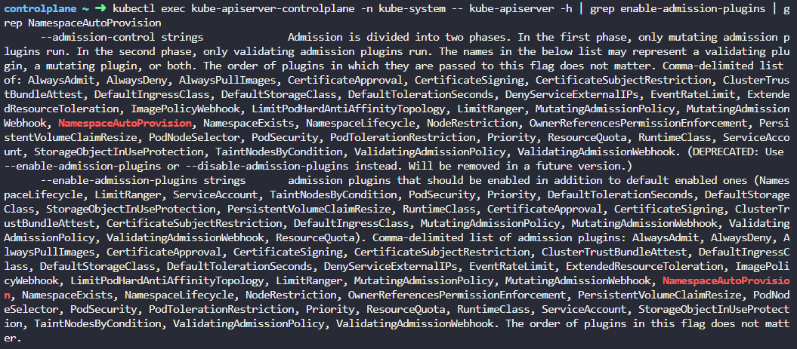

 

 

ps -ef \| grep kube-apiserver \| grep admission-plugins ; Since
the kube-apiserver is running as pod you can check the process to see
enabled and disabled plugins.

 

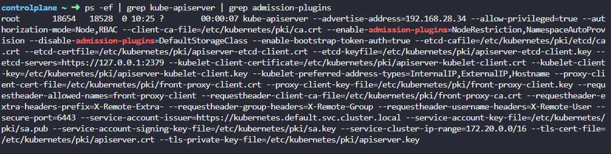

 

 

 

Mutating webhook should reject the request as its asking to run as root
user without setting runAsNonRoot: false

 

controlplane ~ ➜ kubectl create -f /root/pod-with-conflict.yaml

Error from server: error when creating "/root/pod-with-conflict.yaml":
admission webhook "webhook-server.webhook-demo.svc" denied the request:
runAsNonRoot specified, but runAsUser set to 0 (the root user)

 

**Validating & Mutating Admission Controllers**

 

We can configure our own admission controller.

 

*NamespaceLifeCycle* admission controller validate a namespace that
already exists and requests to a non-existent namespace is rejected.
This type of admission controller is known as a ***validating admission
controller*** which can validate the request, and allow or deny it,

 

*DefaultStorageClass* plugin is enabled by default and check if the
request creating PVC has a storage class mentioned in it. If not, it
modify the storage class as default. This type of admission controller
is known as a ***mutating admission controller***. It can change or
mutate the object itself before it is created.

 

There are admission controllers that can mutate a request as well as
validate a request. Generally, mutating admission controllers are
invoked first, followed by validating admission controllers so that any
change made by the mutating admission controller can be considered
during the validation process.

 

As example, the NamespaceAutoProvision admission controller, which is a
mutating admission controller is run first followed by the validating
admission controller, NamespaceExists. If it was run the other way, then
the NamespaceExists admission controller would always reject the request
for a namespace that does not exist and the NamespaceAutoProvision
controller would never be invoked to create the missing namespace.

 

These are all built-in admission controllers that are part of the
Kubernetes source code that are compiled and shipped with Kubernetes.

 

What if we want our own admission controller with our own mutations and
validations that has our own logic?

 

- To support external admission controllers, there are two special
  admission controllers available, ***MutatingAdmissionWebhook*** and
  ***ValidatingAdmissionWebhook***.

- We can configure these webhooks to point to a server that's hosted
  either within the Kubernetes cluster or outside it

- After a request goes through all the built-in admission controllers,
  it hits these admission webhook that are configured.

- Then it makes a call to the admission webhook server by using an
  **AdmissionReview** object in a JSON format which has all the details
  about the request such as the user made the request, the type of
  operation the user is trying to perform, on what objects and the
  details about the object itself

- On receiving the request, the admission webhook server responds with
  an **AdmissionReview** object with a result of whether the request is
  allowed or not.

 

 

We set up this as follows.

 

1.  Deploy admission webhook server which will have our own logic. This
    could be an API server built in any platform. Kubernetes
    documentation page has code of webhook server written in Go
    language. It must accept the mutate and validate APIs and respond
    with a JSON object that the web server expects.

 

Webhook server pseudo code contain two calls, a validate call and a
mutate call.

 

 

 

Then the code needs to be hosted as a server or container that deploy
within the Kubernestes cluster itself as a deployment. If it deployed as
a deployment in the cluster, then it needs a service for it to be
accessed.

 

 

2.  Configure the admission webhook on Kubernetes by creating a webhook
    configuration object to reach to the service and validate or mutate
    the requests.

 

If we deploy this webhook server externally on our own, that is not a
part of a deployment in Kubernetes cluster, simply provide URL path to
the server in **webhooks\[\].clientConfig.url**

 

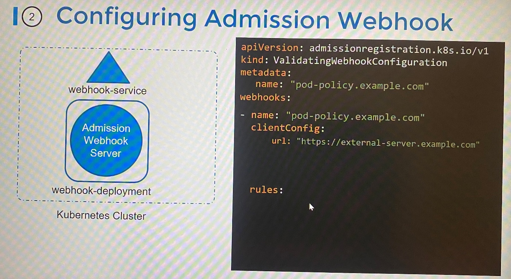

 

If we deploy the server as another service our own cluster, simply
provide service name and namespace in clientConfig
**webhooks\[\].clientConfig.service**

 

 

Create TLS secret webhook-server-tls for secure webhook communication in
webhook-demo namespace. We have already created below cert and key for
webhook server which should be used to create secret.

 

Certificate : /root/keys/webhook-server-tls.crt

Key : /root/keys/webhook-server-tls.key

 

kubectl -n webhook-demo create secret tls webhook-server-tls \\

--cert "/root/keys/webhook-server-tls.crt" \\

--key "/root/keys/webhook-server-tls.key"

 

 

controlplane ~ ➜ cat webhook-configuration.yaml

apiVersion: admissionregistration.k8s.io/v1

kind: MutatingWebhookConfiguration

metadata:

name: demo-webhook

webhooks:

\- name: webhook-server.webhook-demo.svc

clientConfig:

service:

name: webhook-server

namespace: webhook-demo

path: "/mutate"

caBundle:
LS0tLS1CRUdJTiBDRVJUSUZJQ0FURS0tLS0tCk1JSURQekNDQWllZ0F3SUJBZ0lVWWdoV2dlcVJNNHg0amtnUU1qNExudC9YcE84d0RRWUpLb1pJaHZjTkFRRUwKQlFBd0x6RXRNQ3NHQTFVRUF3d2tRV1J0YVhOemFXOXVJRU52Ym5SeWIyeHNaWElnVjJWaWFHOXZheUJFWlcxdgpJRU5CTUI0WERUSTFNRE15TXpBek1qVXlObG9YRFRJMU1EUXlNakF6TWpVeU5sb3dMekV0TUNzR0ExVUVBd3drClFXUnRhWE56YVc5dUlFTnZiblJ5YjJ4c1pYSWdWMlZpYUc5dmF5QkVaVzF2SUVOQk1JSUJJakFOQmdrcWhraUcKOXcwQkFRRUZBQU9DQVE4QU1JSUJDZ0tDQVFFQXNYMWJnWUV6bWNqdzhZV3hHZmRXRmovM0xocVJjVkM1SjVDSgpqZndLNzNOSXZHMzhjd2tLZFlRVTRORUpSVVUvRkovT1dPSHEvdWNFR3F1U2lsU3hTSVVHa0dJWGszcFM3eE1TCmxPNklFendSTE9ldEF6dFhIOXVlZU95Wit5VEZRNnNrVVBXeWpyQWZuUkl1bUxwQWxLZzlORHFYNWd5aFpDRGUKMlhPeE55ZWJlSjRWQzJKN1FWL2k3YWRoclJTZkNkNjY0Y3BoSVRlcE1FYmpoS2p0ZEFCZWpxT3VtVCtvR3MyegozT1BSZDRDQ2R0dU5pMW52Y3I4T1hkZ1l4TkoyL2hUN2NDUXNrSHFtcUNPTzBBQmpZbjFIYnM3ckcyQVZMb0gyCnlBSkVDT1JMRnAwdzNpYkpvWnROd1NVSnVNaW9CZW1yaTJKTHh0RHpOKzBLbG9YbGNRSURBUUFCbzFNd1VUQWQKQmdOVkhRNEVGZ1FVOVVuaWhCTW9jbjJ6SzRIMnJVRGxiaGUwWVFrd0h3WURWUjBqQkJnd0ZvQVU5VW5paEJNbwpjbjJ6SzRIMnJVRGxiaGUwWVFrd0R3WURWUjBUQVFIL0JBVXdBd0VCL3pBTkJna3Foa2lHOXcwQkFRc0ZBQU9DCkFRRUFBUVJRRkRwWVJLaFRESDRna2hDdDY2Wmg0b091TEZJSWpidG1xQkJYSU90bmRpNUNabTR0eUw3MEpGUm8KL2dkeE5CZnNwdWVWTnBGaFlmekRNaU5TRngxMkVMRjM3SzYrYk54NDJOamd6TFZoL1pIemhuMC85OE1DK2s2bQphaCtWZVNFTzZjanpmZE9PY0NPdmx2SEExZjZyVFdVWmpCQUhJVEpqbU4yREpZVU04SlRMRmZXdC96akFBOXdRCjBZN0pVSlNkTlFSUXBmMFY1VHkwV2dlSC9nd2I3R0kycm00azVzUjlXOGNMK3U2aUttK2NUb2IzUVVuOTVoS1YKeS9CRTNZRUxHeVdsUGEwMXhWNFlPNm9hNTRDaDB4SVByVVMyQ1Q4SWV2Z2dpUy9JV2grU3dlUGRRYnU2eUs1ZQpWRVhxemE0Ym0rNDlrU1oxbEVUQUMyTHVwdz09Ci0tLS0tRU5EIENFUlRJRklDQVRFLS0tLS0K

rules:

\- operations: \[ "CREATE" \]

apiGroups: \[""\]

apiVersions: \["v1"\]

resources: \["pods"\]

admissionReviewVersions: \["v1beta1"\]

sideEffects: None

 

 

We have deployed Admission webhook server with following validation
conditions.

 

\- Denies all request for pod to run as root in container if no
securityContext is provided.

 

\- If no value is set for runAsNonRoot, a default of true is applied,
and the user ID defaults to 1234

 

\- Allow to run containers as root if runAsNonRoot set explicitly to
false in the securityContext

 

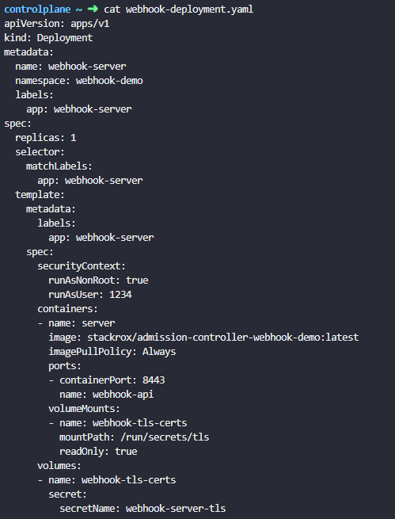

 

**Monitor cluster components**

 

***Monitor***

 

Node level metric : Number of nodes/pods in the cluster, how many
nodes/pods are healthy

 

Performance metrics: CPU, memory, disk and network utilization on
nodes/pods

 

\- Kubernetes doesn’t come with full-features built in monitoring and
analytics solution. There are number of open source solution available
such as ***metrics server, Prometheus, Elastic stack*** and proprietary
solution ***Datadog, Dynatrace***

 

\- ***Heapster*** was monitoring and analytics solution which was
deprecated

-Metrics server can have one per Kubernetes cluster

-Metrics server retrieves metrics from pods and nodes, aggregates and
stores them in memory

\- Metrics server is an in-memory monitoring solution and doesn’t store
in disks which means it doesn’t provide historical performance data

\- The Kubelet has sub component is known as cAdvisor(Container Advisor)
is responsible to retrieving performance metrics from pods and exposing
them through the Kubelet API to make the metrics available for Metrics
server

 

***Deploy Metrics server***

 

If you use Minikube in the cluster,

 

minikube addons enable metrics-server

 

For other environments, clone metric server deployment file from GitHub
repository and deploy the required components from kubectl create
command which creates set of pods, service and roles to pull performance
metrics, then process the data.

 

git clone <https://github.com/kubernetes-incubator/metrics-server.git> ;
pull all the components required for metrics server and create all
components by kubectl create command. This is not suitable for
production environment.

 

kubectl create -f . ; create all components that cloned to the current
directory

 

OR

 

kubectl apply -f
<https://github.com/kubernetes-sigs/metrics-server/releases/latest/download/components.yaml>

 

 

Once deploy, give metrics server to pull performance metrics and process
the data

 

Kubectl top node ; to view CPU and memory consumption as bytes and
percentage each of nodes

 

controlplane ~ ➜ kubectl top node

 

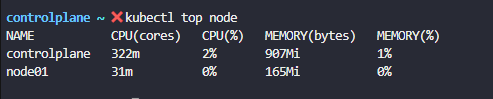

 

kubectl top pod ; to view CPU and memory consumption of pods

 

controlplane ~ ➜ kubectl top pods

 

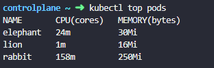

 

 

**Application Logs**

 

If we need to run docker container in detach mode, you wouldn't see the
logs. To see the live logs, run the following command.

 

docker logs -f \<container ID\>

 

kubectl logs \<name of pod \> ; show the logs of pod

 

kubectl logs -f \<name of pod \> ; show live logs on the pod. These logs
are specific to the container running inside the pod

 

Pods may run multiple containers in it. In that case, you need to
specify container name that you need to see live logs on it.

 

kubectl logs -f \<name of pod \> \<name of container \>

 

