# Kubernetes - Security

 

**Security primitives**

***Secure Hosts***

 

Secure the physical or virtual infrastructure that hosts Kubernetes with
the following controls.

 

- Root access disabled

- Password based authentication disabled

- Only SSH key based authentication enabled

 

As the kubeapi-server is the central component of Kubernetes cluster
that allows to interact through kubectl utility or by accessing the API
directly, controlling access to kubeapi-server itself is the first line
of defense.

 

**Authentication** (Who can access)

 

Admins, developers and service accounts(third party application like
bots who access the cluster for integration purpose) need access to
cluster for administrative purpose. Security of end users who access the
application deployed on the cluster is managed by application themselves
internally.

 

***Accounts***

 

Kubernetes does not manage user accounts and also cannot create users
natively. It relies on an external source such as files with user
details, certificates, or third party identity service(LDAP)

 

However, Kubernetes can create and manage service accounts using
Kubernetes API for external processes, services or applications.

 

kubectl create serviceaccount \<sa1\>

 

Kubectl get serviceaccount

 

\- All user access requests are managed by kube-apiserver regardless
they are through kubectl or REST API (curl
<https://kube-server-ip:6443>)

-Kubeapi-server can authenticate requests for the following mechanism

 

***Authentication mechanism***

 

\- Static password files - Username and Passwords

\- Static token files - Username and Tokens

\- Certificates

\- External Authentication Providers -LDAP, Kerberos, NTLM
authentication

\- Service accounts

 

*Static password file*

 

\- Define password file as source with password, username, user ID and
group in CSV file

\- Then pass the file name as option to the kube-apiserver, you must
restart kube-apiserver service later for these options to take effect

 

\- -basic-auth-file=user-details.csv

 

\- If the cluster is deployed with kubeadm tool, it automatically
restarts kube-apiserver once you update spec.containers\[\].command
section with the option in pod definition file for kube-apiserver

 

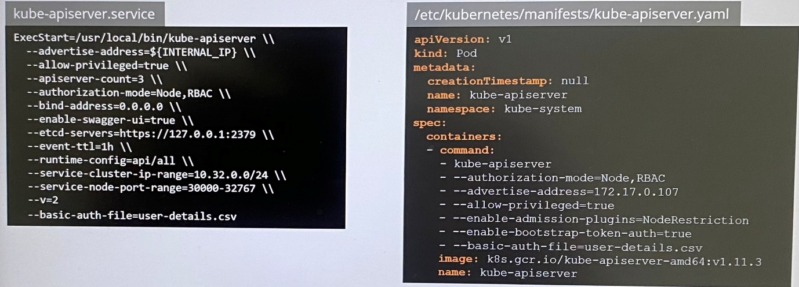

 

curl -v -k <https://master-node-ip:6443/api/v1/pods> -u “user1:password
123” ; specify user ID and password while authenticating to
kube-apiserver

 

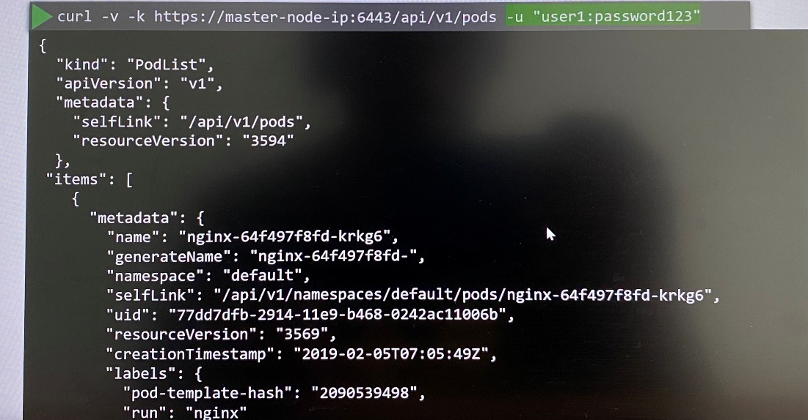

 

 

 

**Setup basic authentication on Kubernetes (Deprecated in 1.19)**

 

Note: This is not recommended in a production environment. This is only
for learning purposes. Also note that this approach is deprecated in
Kubernetes version 1.19 and is no longer available in later releases

Follow the below instructions to configure basic authentication in a
kubeadm setup.

Create a file with user details locally at /tmp/users/user-details.csv

 

\# User File Contents

password123,user1,u0001

password123,user2,u0002

password123,user3,u0003

password123,user4,u0004

password123,user5,u0005

 

Edit the kube-apiserver static pod configured by kubeadm to pass in the
user details. The file is located
at /etc/kubernetes/manifests/kube-apiserver.yaml

 

 

apiVersion: v1

kind: Pod

metadata:

name: kube-apiserver

namespace: kube-system

spec:

containers:

\- command:

\- kube-apiserver

\<content-hidden\>

image: k8s.gcr.io/kube-apiserver-amd64:v1.11.3

name: kube-apiserver

volumeMounts:

\- mountPath: /tmp/users

name: usr-details

readOnly: true

volumes:

\- hostPath:

path: /tmp/users

type: DirectoryOrCreate

name: usr-details

 

Modify the kube-apiserver startup options to include the basic-auth file

 

 

apiVersion: v1

kind: Pod

metadata:

creationTimestamp: null

name: kube-apiserver

namespace: kube-system

spec:

containers:

\- command:

\- kube-apiserver

\- --authorization-mode=Node,RBAC

\<content-hidden\>

\- --basic-auth-file=/tmp/users/user-details.csv

Create the necessary roles and role bindings for these users:

 

 

---

kind: Role

apiVersion: rbac.authorization.k8s.io/v1

metadata:

namespace: default

name: pod-reader

rules:

\- apiGroups: \[""\] \# "" indicates the core API group

resources: \["pods"\]

verbs: \["get", "watch", "list"\]

 

---

\# This role binding allows "jane" to read pods in the "default"
namespace.

kind: RoleBinding

apiVersion: rbac.authorization.k8s.io/v1

metadata:

name: read-pods

namespace: default

subjects:

\- kind: User

name: user1 \# Name is case sensitive

apiGroup: rbac.authorization.k8s.io

roleRef:

kind: Role \#this must be Role or ClusterRole

name: pod-reader \# this must match the name of the Role or ClusterRole
you wish to bind to

apiGroup: rbac.authorization.k8s.io

Once created, you may authenticate into the kube-api server using the
users credentials

curl -v -k <https://localhost:6443/api/v1/pods> -u "user1:password123"

 

 

*Static token files*

 

\- Define password file as source with token, username, user ID and
group in CSV file

 

\- -token-auth-file=user-details.csv

 

curl -v -k <https://master-node-ip:6443/api/v1/pods> - -header
“Authorization: Bearer Khsoheynekbst” ; specify the token as
authorization bearer token.

 

**Note:**

 

\- These are not recommended authentication mechanism as it stores
passwords and token in a clear text in static file

\- Consider volume mount while providing the auth file in kubeadm setup

 

 

spec:

containers:

\- command:

volumeMounts:

\- mountPath: /tmp/users

name: usr-details

readOnly: true

volumes:

\- hostPath:

path: /tmp/users

type: DirectoryOrCreate

name: usr-details

 

\- Setup Role Based Authorization for new users

 

**TLS certificates basics**

 

All communication between components in the cluster are secured by TLS
encryption

 

\- Certificate makes guarantee trust between two parties during a
transaction

\- TLS certificates ensure data transfers between the parties is
encrypted with encryption keys

\- ***Symmetric encryption*** uses single key to encrypt and decrypt the
data where the key in plaintext exchange between sender and receiver
along with data over same network may be exposed to hacker. That is
where asymmetric encryption comes in.

\- ***Asymmetric encryption*** uses pair of keys such private key and
public key(public lock) where user/browser encrypts data with public key
and transfer data to server and server decrypts the data transferred
using the private key

 

***Asymmetric encryption- SSH***

 

**\>ssh-keygen** ; generate private key and public key(public lock)

id_rsa id_rsa.pub

 

**\>cat ~/.ssh/authrorized_keys** ; add entry with your public key into
the server's SSH authorized_keys file

ssh-rsa ASJDJVDOONE…SJBKACJJDCDCD user1

 

\>ssh -i id_rsa user1@server1 ; specify the location of your private key
when you ssh

 

Thus many users can create private and public key pairs and gain ssh
access to server.

 

***Asymmetric encryption- HTTPS***

 

**\>openssl genrsa -out my-bank.key 1024** ; server generates private
key with openssl

my-bank.key

 

**\>openssl rsa -in my-bank.key -pubout \> mybank.pem** ; server
generates public key using private key

my-bank.key mybank.pem

 

- User gets the public key from the web server when the user accesses
  the web server using HTTPS. Since the hacker is sniffing all traffic,
  he may get a copy of the public key

- The user's browser then encrypt the symmetric key using the public key
  provided by the server and send this to the server

- The server uses the private key to decrypt the encrypted data and
  retrieve the symmetric key from it. However, the hacker doesn't have
  private key to decrypt and retrieve the symmetric key from the
  message. Hacker will leave encrypted data and public key

- Now the symmetric key is safely available to the user and the server
  to encrypt and decrypt at both ends

- With asymmetric encryption, user successfully transfer the symmetric
  key to the server. Then we secure all future data transfers between
  them with symmetric encryption.

- Then hacker now looks for new ways to hack into your account by
  impersonating with a website looks exactly like original website to
  steal user's credentials. In this way, hacker generates private and
  public key pairs and configures them on his web server. Then the
  hacker manages to route your request to his web server. The user
  encrypt symmetric key with public key that hacker's web server offers,
  then hacker steal the symmetric key from user and then user start to
  transfer his credentials with hacker's web server. Thus hacker steals
  user's credentials which will use to authenticate to web server.

- To avoid hackers intervention in this way, the user's browser must
  verify the public key received is legitimate key. Hence the server
  shares a certificate that has the public key in it with the user, the
  certificate in digital format which includes to whom the certificate
  is issued to, the public key of the server, location of the server
  etc.

 

*Output of actual certificate*

 

\- Serial number

\- Signature algorithm

\- Issuer

\- Validity

\- Subject (CN); person or subject to whom certificate issued to

\- Subject Alternative name(DNS); If the subject is known by any other
names that users can use to access the application

\- Public key info

 

If any certificate is signed by hacker can be identified whether it is
legitimate by its signature in the certificate.

 

If you generate a certificate which will have to sign it by yourself
which is called self-signed certificate

 

All the web browsers are built in with a certificate validation
mechanism where the browser checks and validates it whether certificate
is legitimate. If browser identifies a fake certificate, it shows a
warning message.

 

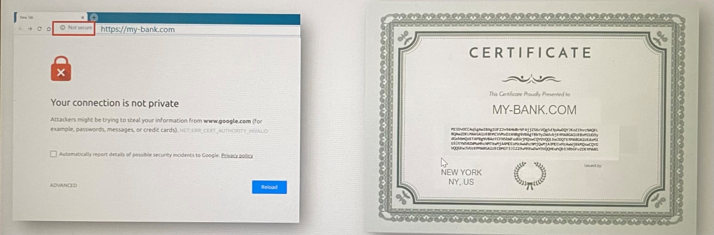

 

To create legitimate certificate that browsers will trust, the
certificate you generated can be signed and validated by Certificate
Authority such as Symantec, DigiCert, Comodo, GlobalSign

 

You generate certificate signing request(CSR) using key generated and
the domain name of your website to send to CA for signing. CA verified
your details and uses their private key to sign the certificate. CSR
itself is a certificate.

 

**\>openssl req -new -key my-bank.key -out my-bank.csr -subj
“/C=US/ST=CA/O=MyOrg, Inc./CN=my-bank.com”**

my-bank.key my-bank.csr

 

If a hacker tries to get sign a certificate with a request in similar
way from CA, CA rejects signing the certificate by verifying the
identity of originals. The CA uses different techniques to make sure the
actual owner of the domain.

 

Now you have a certificate signed by a CA that browser trust.

 

How do the browser know the CA who signed the certificate is a
legitimate CA?, not by someone who says they are legitimate? The CAs
themselves have set of private and public key pairs. The CAs use their
private keys to sign the certificates. The public keys of CAs are built
in to the browsers. The browser uses the public key of the CA to
validate that the certificate was actually signed by the CA themselves.
You can actually see the Trusted Root Certificate Authorities tab under
certificate in the settings of the browser.

 

 

 

Public CAs don't help to validate sites hosted privately. For sites
hosted within the organization can be validated with private CA server
that you can deploy internally and then public key of internal CA should
be installed on all employees browsers and establish secure connectivity
within the organization.

 

An admin uses a pair of keys to secure SSH connectivity to the servers.

 

1\. The server uses pair of keys to secure HTTPs traffic. For this,
generate certificate signing request(CSR) using key generated and the
domain name of your website and send it to CA for signing

2\. CA has private and public key pair which is called trusted root CA
certificate. CA uses its CA private key to sign the CSR which has server
certificate.

3\. All users/browsers have a copy of CAs public key

4\. The certificate signed by CA is sent back to the server. Now the
organization has a certificate signed by CA that the all browsers trust.

5\. The server configures web application with signed certificate

6\. When user access web application, the server first sends the
certificate with its public key

7\. The users/browsers reads the certificate and uses CA's public key
that comes built in the browsers to validate and retrieve the server’s
public key

8\. Then user/browser generates a symmetric key for all communication
going forward and the symmetric key is encrypted using server’s public
key and send back to the server

9\. The server uses private key to decrypt the message and retrieve the
symmetric key

10\. The symmetric key is used to communicate going forward securely.

 

- The administrator generates a key pair for securing SSH

- The web server generates a key pair for securing the websites with
  HTTPS

- The certificate authority generates its own pair of key to sign
  certificate

- The user/browser only generates a single symmetric key

Once the user establishes trust with the web server, he uses
username/password to authenticate to the web application hosted in web
server.

 

\*\*Now the client is able to validate the server is who they say they
are. But the server does not for sure know the client is who they say
they are. For this, as part of the initial trust building exercise, the
server can request a certificate from the client. The client must
generate a pair of keys and a signed certificate from a valid CA. The
client then sends the certificate to the server for it to verify that
the client is who they say they are. However, TLS client certificates
are not generally implemented on web servers. So a normal user don't
have to generate and manage certificates manually.

 

In the same way administrator generates a key pair for securing SSH.

 

The whole infrastructure including the CA, the servers, people and
process of generating, distributing and maintaining digital certificate
is known as ***Public Key Infrastructure(PKI)***

 

If the data is encrypted with private key, the data that encrypted by
private key can only be decrypted using public key. We cannot use the
same key either public key or private key for both encrypt or decrypt
data.

 

The certificates with public key are named \*.crt or \*.pem extension.

 

Server.crt

Server.pem

Client.crt

Client.pem

 

The private key are usually named with \*.key or XXX- key.pem

 

Server.key

Server-key.pem

Client.key

Client-key.pem

 

 

**TLS in Kubernetes**

 

Following components are primarily involved in TLS

 

\- Server certificate- for servers to verify who they say they are

\- Root certificate- CAs to verify who they say they are

\- Client certificate- for clients to verify who they say they are

 

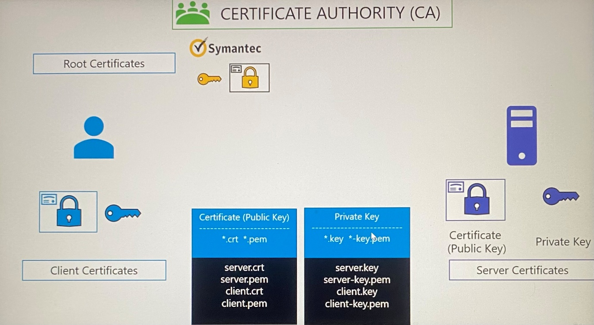

 

***Server certificate for servers in the cluster***

 

***Kube-apiserver*** exposes HTTPS service to communicate with its
clients. It generates a certificate and key pair which is called
apiserver.crt and apiserver.key

 

***ETCD server*** generates etcdserver.crt and etcdserver.key

 

***Kubelet server*** exposes an HTTPS endpoint that kube-api server
talks to interact with worker nodes. It generates kubelet.crt and
kubelet.key

 

 

***Client certificate for clients in the cluster***

 

Clients are administrators who access through kubectl or REST API.

 

***Admin(kubectl)*** generates admin.crt and admin.key

 

The following components access kube-api server through API.

 

***Kube-scheduler*** generates scheduler.crt and scheduler.key

 

***Kube-controller-manager*** generates controller-manger.crt and
controller-manager.key

 

***Kube-proxy*** generates kube-proxy.crt and kube-proxy.key

 

***Kube-apiserver*** is the only components that talks to ETCD server so
that it use original certificate and key or specifically generates
apiserver-etcd-client.crt and apiserver-etcd-client.key.

 

***Kube-apiserver*** uses original certificate and key or specifically
generates apiserver-kubelet-client.crt and apiserver-kubelet-client.key
to talk with Kubelet server .

 

***Kubelet*** uses client certificate and key when talk to
kubeapi-server kubelet-client.crt and kubelet-client.key

 

 

 

Kubernetes cluster needs a CA for all certificate signing or more than
one CA where one CA for all components except ETCD server and other CA
for ETCD server.

 

**TLS in Kubernetes - Certificate creation**

 

We can use different tools to create certificates such as EasyRSA,
OpenSSL, CFSSL

 

***Generating CA certificate***

 

CA need to have its private key and root certificate file for signing
other certificate signing requests.

 

**\>openssl genrsa -out ca.key 2048** ; generate a private key with
openssl

 

**\>openssl req -new -key ca.key -subj “/CN=KUBERNETES-CA” -out ca.csr**
; generate CSR with the private key generated and specifying the common
name. This is for creating a certificate for the Kubernetes CA.

 

Certificate Signing Request(CSR) is a certificate with all the details
but with no signature.

 

**\>openssl x509 -req -in ca.csr -signkey ca.key -out ca.crt** ; sign
the certificate by specifying the private key of CA. This is a
self-signed certificate by the CA using own private key generated in the
first step.

 

Going forward, we will use CA key pairs(private key and root certificate
file) to sign all other certificates.

 

***Generating client certificate***

 

We generate certificate for admin user.

 

**\>openssl genrsa -out admin.key 2048** ; generate private key with
openssl

 

**\>openssl req -new -key admin.key -subj “/CN=Kube-admin” -out
admin.csr** ; generate CSR with the key generated. The CN is the common
name Kubectl client authenticates with when you kubectl command

 

**\>openssl x509 -req -in admin.csr -CA ca.crt -CAkey ca.key -out
admin.crt** ; sign the certificate by specifying CA key pair (private
key and root certificate file)

 

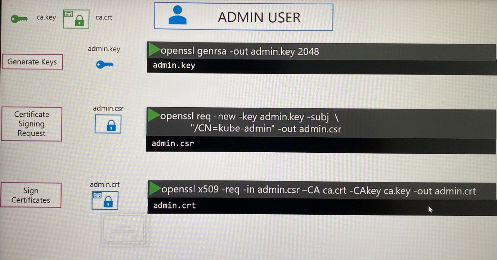

 

This whole process generating key and certificate pair is similar to
crating user account for new user, the key is like password and
certificate is validated user ID. This process is more secure than
username/password.

 

To differentiate this user to any other user, the user account needs to
be identified as admin user. We can do that by specifying a group
details for the user. In that case, Group: SYSTEM:MASTERS exists on
Kubernetes with administrator privileges when we generate CSR.

 

**\>openssl req -new -key admin.key -subj
“/CN=Kube-admin/O=system:masters ” -out admin.csr**

 

Thus we consider creating client certificates for system component with
the naming convention by SYSTEM prefix using OpenSSL for kube-scheduler,
kube-controller-manager, kube-proxy, kube-api servers and Kubelet

 

SYSTEM:KUBE-SCHEDULER

SYSTEM:KUBE-CONTROLLER-MANAGER

SYSTEM:KUBE-PROXY

 

You can specify these certificates and key instead of username and
password in a REST API call you make to the Kube-apiserver. Use
following ways.

 

1\. Using curl command with options

 

curl <https://kube-apiserver:6443/api/v1/pods> \\

\- -key admin.key - -cert admin.crt - -cacert ca.crt

 

2\. Moving parameters into configuration file which is called kubeconfig

 

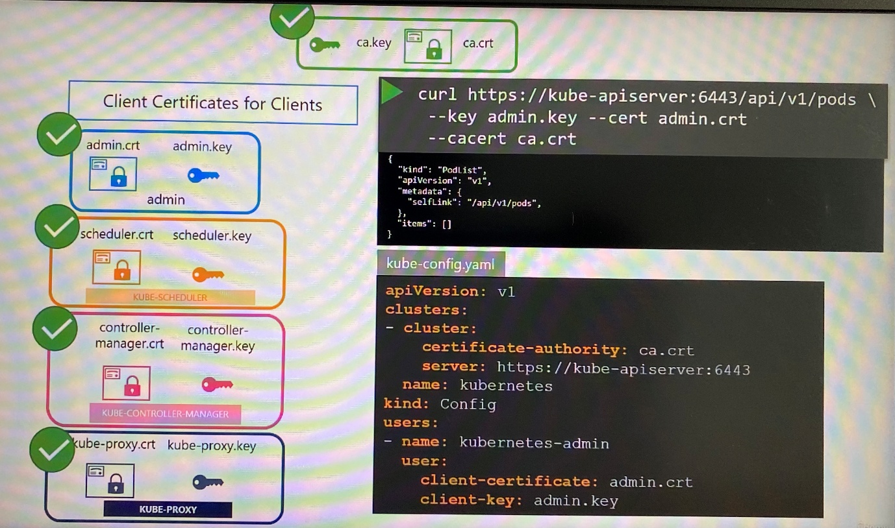

 

\*\*In Kubernetes for these various components to verify each other,
they all need a copy of the CA's root certificate whenever you configure
a server or a client with certificates

 

***Generating server certificate***

 

*ETCD servers*

 

ETCD server can be deployed as cluster across multiple servers as high
availability environment. In that case, we must generate additional peer
certificate to secure communication.

 

 

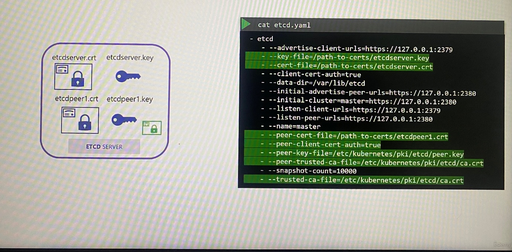

 

 

*Kube-api server*

 

Kube-api server goes with many names and alias within the cluster.
KUBE-API Server is the real name.

 

\- kuburnetes

\- Kubernetes.default

\- Kubernetes.default.svc

\- Kubernetes.default.svc.cluster.local

-Host IP address that run Kube-apiserver

 

All of these names must be present in the certificate generated for kube
apiserver.

 

**\>openssl genrsa -out apiserver.key 2048** ; generate keys with
openssl

 

**\>openssl req -new -key apiserver.key -subj “/CN=kube-apiserver” -out
apiserver.csr -config openssl.cnf** ; generate CSR with the key
generated and pass the OpenSSL config file that have all subject
alternate names

 

To specify all subject alternate name and IP address, you must create
the OpenSSL config file as openssl.cnf and specify them alt_names
section, then pass this config file as option when generate CSR.

 

------------openssl.cnf -----------------

\[req\]

req_extensions = v3_req

distinguished_name= req_distinguished_name

\[v3_req\]

basicConstraints = CA:FALSE

keyUsage =nonRepudiation,

subjectAltName= @alt_names

\[alt_names\]

DNS.1 = Kubernetes

DNS.2 = Kubernetes.default

DNS.3 = Kubernetes.default.svc

DNS.4 = Kubernetes.default.svc.cluster.local

IP.1 = 10.93.2.1

IP.2 = 172.16.3.2

 

**\>openssl x509 -req -in apiserver.csr -CA ca.crt -CAkey ca.key -out
apiserver.crt** ; signing the certificate with CA key pair by specifying
CA certificate and CA key

 

 

The location of Kube-apiserver client and server certificates are passed
into Kube-apiserver's executable or service configuration file.

 

- API server certificates under the TLS cert options

- Kube API serve client certificates used to connect to the ETCD server

- Kube API server client certificates to connect to kubelet on worker
  nodes

 

 

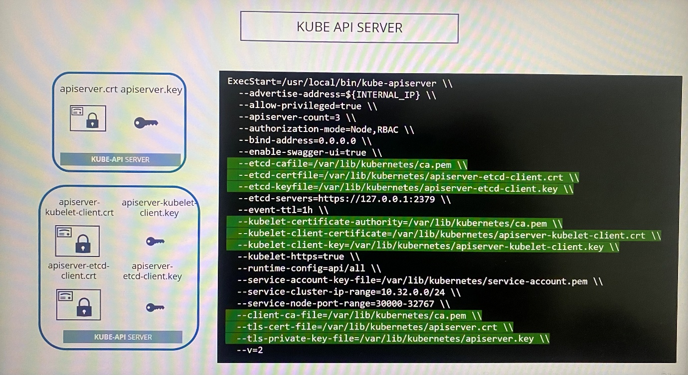

 

*Kubelet*

 

The kubelet server is a HTTPS API server that runs on each worker node
to manage node. Kube-apiserver talks to Kubelet to monitor the node and
send information regarding what pods to schedule on the node.

 

For Kubelets, the certificate and keys are named with name of each
worker nodes such as node01, node02 so on

 

Once the certificate are created, use them in kubelet-config.yaml file

 

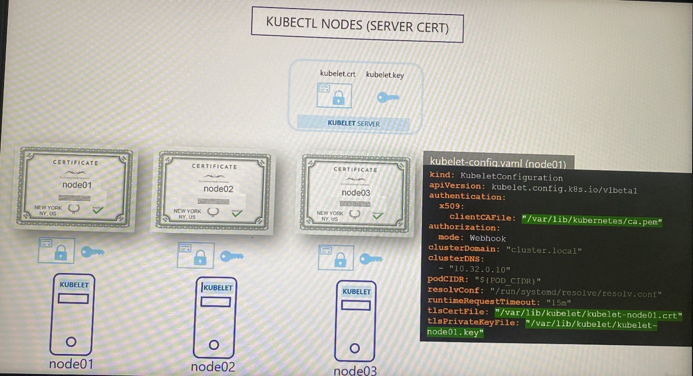

 

When Kubelet talks to kube-apiserver, it needs to create client
certificate. To distinguish the node that comes request, it use a group
having admin privilege that is called **SYSTEM:NODES** as the nodes are
system components. The nodes must be added to a group system node such
as system:node:node01 and system:node:node02. These client certificates
are also specified in kubelet-config.yaml file

 

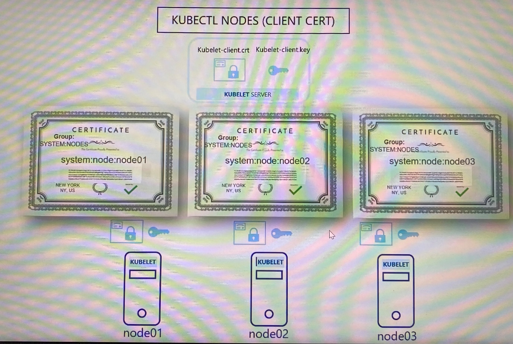

 

 

root@controlplane:~# ls -l /etc/kubernetes/pki/etcd/server\* \| grep
.crt

-rw-r--r-- 1 root root 1188 May 20 00:41
/etc/kubernetes/pki/etcd/server.crt

root@controlplane:~#

 

 

root@controlplane:~# crictl logs --tail=2 1fb242055cff8

W0916 14:19:44.771920 1 clientconn.go:1331\] \[core\] grpc:
addrConn.createTransport failed to connect to {127.0.0.1:2379 127.0.0.1
\<nil\> 0 \<nil\>}. Err: connection error: desc = "transport:
authentication handshake failed: x509: certificate signed by unknown
authority". Reconnecting...

E0916 14:19:48.689303 1 run.go:74\] "command failed" err="context
deadline exceeded"

 

This indicates an issue with the ETCD CA certificate used by
the kube-apiserver. Correct it to use the
file /etc/kubernetes/pki/etcd/ca.crt.

 

 

**View certificate details**

 

We discuss how certificate configures in Kubeadm tool

 

Kubernetes cluster can be created either using from the scratch or
kubeadm tool. Depends on the way the cluster set up, they use different
methods to generate and manage certificates either manually or
automatically by kubeadm tool.

 

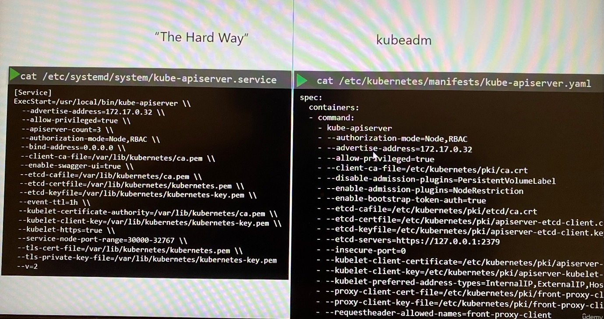

 

These details are mainly attached with certificate for components.

 

\- Type( client or server)

\- Certificate path

\- CN Names

\- ALT Names

\- Organization

\- Issuer

\- Expiration

 

With kubeadm tool,

 

Kube-apiserver: certificate path in spec.containers.command -
/etc/kubernetes/manifests/kube-apiserver.yaml

 

**\>openssl x509 -in /etc/kubernetes/pki/apiserver.crt -text -noout**
;run the openssl command and provide the certificate file path as input
to decode the certificate intext form

 

 

 

**\>journalctl -u etcd.service -l ;** inspect service logs when the
cluster setup from the scratch and the service is configured as native
in the OS

 

 

**\>kubectl logs etcd-master** ; inspect the logs etcd pod if the
cluster setup from kubeadm

 

If kube-api server and etcd server are down, kubectl utility won't
function, you can inspect logs using docker to fetch the logs

 

**\>docker ps -a \| grep kube-apiserver** ; find the docker container ID

 

**\>docker logs \<container ID\>**

 

If docker command doesn't find from bash, try crictl command.

 

\*\*Run crictl ps -a for environments using crio instead of docker.

 

crictl ps -a \| grep kube-apiserver

 

crictl logs --tail=2 1fb242055cff8

 

\*\*All the server and client certificates for kube-apiserver except
ETCD are placed under **/etc/kubernetes/pki/**

\*\*The ETCD has its own CA and the CA root certificate is placed in
**/etc/kubernetes/pki/etcd/**

 

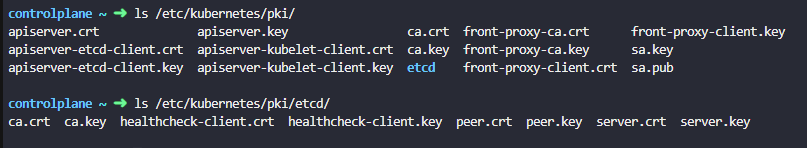

 

 

**Certificate workflow & API**

 

\- If an user needs pair of certificate(client certificate and root CA
certificate) and key, he must generate CSR from a private key generated
and the CSR needs to be signed by CA server’s private key and provide
root CA certificate. Then admin provide signed pair of certificate and
key to user. This process repeats when the signed certificate is
expired. If it is a new user comes or a certificate is expired, CSR can
be generated by an existing admin to get signed by CA.

\- The CA server is the pair of key and certificate files whoever gains
access to these pair of files can sign any certificate for the
Kubernetes. These files need to be protected and stored in safe
environment.

\- In Kubeadm, the master node is the CA server which has pair of key
and certificate files

\- The process of signing certificate and rotating when it expires
should be automated when number of users increase and your team grows.
Kubernetes has a built in certificate API that automates signing
certificate and rotating when it expires.

\- With the certificates API, you now send CSR directly to Kubernetes
through an API call. When administrator receives a CSR, instead
administrator log in to master node and signing certificate by himself,
he creates Kubernetes API object which is called
***CertificateSigningRequest***

\- Once object is created, all CSR requests can be seen by administrator
of the cluster. The CSR can be reviewed and approved by kubectl command.
These certificate can be extracted and shared with the users.

 

 

1\. An user creates a key

 

**\>openssl genrsa -out jane.key 2048**

 

2\. Create a CSR with the CN and send CSR to administrator

 

**\>openssl req -new -key Jane.key -subj “/CN=jane” -out jane.csr**

 

3\. Administrator takes the key and create CertificateSigningRequest
object. The CertificateSigningRequest object is created like any other
kubernetes object using manifest file

 

apiVersion: certificate.K8s.io/v1

kind: CertificateSigningRequest

metadata:

name: jane

spec:

groups:

\- system:authenticated

usages:

\- digital signature

\- key encipherment

\- server auth

request: \$(cat server.csr \| base64 -w 0)

 

---

apiVersion: certificates.k8s.io/v1

kind: CertificateSigningRequest

metadata:

name: akshay

spec:

groups:

\- system:authenticated

request: \<Paste the base64 encoded value of the CSR file\>

signerName: kubernetes.io/kube-apiserver-client

usages:

\- client auth

 

 

------------------------

 

controlplane ~ ➜ kubectl get csr agent-smith -o yaml

apiVersion: certificates.k8s.io/v1

kind: CertificateSigningRequest

metadata:

creationTimestamp: "2025-08-07T02:55:36Z"

name: agent-smith

resourceVersion: "2567"

uid: 55a28de3-27c2-4562-8bf1-19f831677f67

spec:

extra:

authentication.kubernetes.io/credential-id:

\-
X509SHA256=1c51b47fb683eff4f08aa544cf52bf89d7e67ceb0e4e040d199ec91501a6bde9

groups:

\- system:masters

\- system:authenticated

request:
LS0tLS1CRUdJTiBDRVJUSUZJQ0FURSBSRVFVRVNULS0tLS0KTUlJQ1dEQ0NBVUFDQVFBd0V6RVJNQThHQTFVRUF3d0libVYzTFhWelpYSXdnZ0VpTUEwR0NTcUdTSWIzRFFFQgpBUVVBQTRJQkR3QXdnZ0VLQW9JQkFRRE8wV0pXK0RYc0FKU0lyanBObzV2UklCcGxuemcrNnhjOStVVndrS2kwCkxmQzI3dCsxZUVuT041TXVxOTlOZXZtTUVPbnJEVU8vdGh5VnFQMncyWE5JRFJYall5RjQwRmJtRCs1eld5Q0sKeTNCaWhoQjkzTUo3T3FsM1VUdlo4VEVMcXlhRGtuUmwvanYvU3hnWGtvazBBQlVUcFdNeDRCcFNpS2IwVSt0RQpJRjVueEF0dE1Wa0RQUTdOYmVaUkc0M2IrUVdsVkdSL3o2RFdPZkpuYmZlek90YUF5ZEdMVFpGQy93VHB6NTJrCkVjQ1hBd3FDaGpCTGt6MkJIUFI0Sjg5RDZYYjhrMzlwdTZqcHluZ1Y2dVAwdEliT3pwcU52MFkwcWRFWnB3bXcKajJxRUwraFpFV2trRno4MGxOTnR5VDVMeE1xRU5EQ25JZ3dDNEdaaVJHYnJBZ01CQUFHZ0FEQU5CZ2txaGtpRwo5dzBCQVFzRkFBT0NBUUVBUzlpUzZDMXV4VHVmNUJCWVNVN1FGUUhVemFsTnhBZFlzYU9SUlFOd0had0hxR2k0CmhPSzRhMnp5TnlpNDRPT2lqeWFENnRVVzhEU3hrcjhCTEs4S2czc3JSRXRKcWw1ckxaeTlMUlZyc0pnaEQ0Z1kKUDlOTCthRFJTeFJPVlNxQmFCMm5XZVlwTTVjSjVURjUzbGVzTlNOTUxRMisrUk1uakRRSjdqdVBFaWM4L2RoawpXcjJFVU02VWF3enlrcmRISW13VHYybWxNWTBSK0ROdFYxWWllKzBIOS9ZRWx0K0ZTR2poNUw1WVV2STFEcWl5CjRsM0UveTNxTDcxV2ZBY3VIM09zVnBVVW5RSVNNZFFzMHFXQ3NiRTU2Q0M1RGhQR1pJcFVibktVcEF3a2ErOEUKdndRMDdqRytocGtueG11RkFlWHhnVXdvZEFMYUo3anUvVERJY3c9PQotLS0tLUVORCBDRVJUSUZJQ0FURSBSRVFVRVNULS0tLS0K

signerName: kubernetes.io/kube-apiserver-client

usages:

\- digital signature

\- key encipherment

\- server auth

username: agent-x

status: {}

 

 

**cat jane.csr \| base64 \| tr -d “\n”**

**cat jane.csr \| base64 -w 0** ; encode the CSR to base64 with single
line

 

 

**kubectl get csr** ; Administrator can see all CSR request once create
CertificateSigningRequest object

 

**kubectl certificate approve \<name of CSR\>** ; identify the new CSR
request that has condition pending and approve the request

 

**kubectl certificate deny \<name of CSR\>** ; Deny the certificate
signing request

 

**kubectl delete csr \<name of CSR\>** ; Delete the certificate signing
request

 

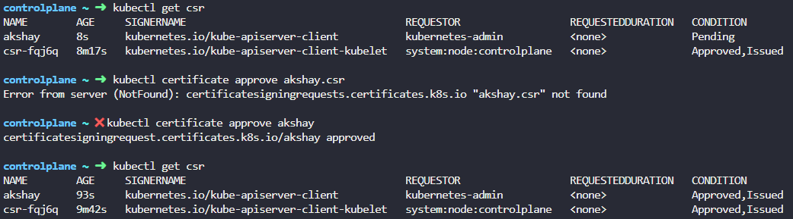

 

Kubernetes signs the certificate using CA key pairs and generate
certificate for the user. This certificate can be extracted and shared
with the user after decoding signed certificate as follows.

 

**kubectl get csr \<name of CSR\> -o yaml** ; view
CertificateSigningRequest object file to get output of generated
certificate

 

**echo "\<encoded certificate\>" \| base64 --decode** ;decode the signed
certificate into plaintext format

 

 

\- All certificates related operations are carried out by the controller
manager

\- It has controllers as **CSR-APPROVING** and **CSR-SIGNING** where
they are responsible to carry out the specific task.

\- To sign certificates, it needs CA server's root certificate and
private key. In controller manager service configuration file has two
options where path of CA key file and CA root certificate file are
specified

 

--cluster-signing-cert-file=/etc/kubernetes/pki/ca.cert

--cluster-signing-key-file=/etc/kubernetes/pki/ca.key

 

 

 

apiVersion: certificates.k8s.io/v1

kind: CertificateSigningRequest

metadata:

creationTimestamp: "2025-04-22T09:35:52Z"

name: agent-smith

resourceVersion: "1515"

uid: 05b1b0a1-468f-43be-b051-a48789bde394

spec:

extra:

authentication.kubernetes.io/credential-id:

\-
X509SHA256=71bc1e033948646ade2e17cdfb5a9044152fc8733439fc77f024928e4dbb3594

groups:

\- system:masters

\- system:authenticated

request:
LS0tLS1CRUdJTiBDRVJUSUZJQ0FURSBSRVFVRVNULS0tLS0KTUlJQ1dEQ0NBVUFDQVFBd0V6RVJNQThHQTFVRUF3d0libVYzTFhWelpYSXdnZ0VpTUEwR0NTcUdTSWIzRFFFQgpBUVVBQTRJQkR3QXdnZ0VLQW9JQkFRRE8wV0pXK0RYc0FKU0lyanBObzV2UklCcGxuemcrNnhjOStVVndrS2kwCkxmQzI3dCsxZUVuT041TXVxOTlOZXZtTUVPbnJEVU8vdGh5VnFQMncyWE5JRFJYall5RjQwRmJtRCs1eld5Q0sKeTNCaWhoQjkzTUo3T3FsM1VUdlo4VEVMcXlhRGtuUmwvanYvU3hnWGtvazBBQlVUcFdNeDRCcFNpS2IwVSt0RQpJRjVueEF0dE1Wa0RQUTdOYmVaUkc0M2IrUVdsVkdSL3o2RFdPZkpuYmZlek90YUF5ZEdMVFpGQy93VHB6NTJrCkVjQ1hBd3FDaGpCTGt6MkJIUFI0Sjg5RDZYYjhrMzlwdTZqcHluZ1Y2dVAwdEliT3pwcU52MFkwcWRFWnB3bXcKajJxRUwraFpFV2trRno4MGxOTnR5VDVMeE1xRU5EQ25JZ3dDNEdaaVJHYnJBZ01CQUFHZ0FEQU5CZ2txaGtpRwo5dzBCQVFzRkFBT0NBUUVBUzlpUzZDMXV4VHVmNUJCWVNVN1FGUUhVemFsTnhBZFlzYU9SUlFOd0had0hxR2k0CmhPSzRhMnp5TnlpNDRPT2lqeWFENnRVVzhEU3hrcjhCTEs4S2czc3JSRXRKcWw1ckxaeTlMUlZyc0pnaEQ0Z1kKUDlOTCthRFJTeFJPVlNxQmFCMm5XZVlwTTVjSjVURjUzbGVzTlNOTUxRMisrUk1uakRRSjdqdVBFaWM4L2RoawpXcjJFVU02VWF3enlrcmRISW13VHYybWxNWTBSK0ROdFYxWWllKzBIOS9ZRWx0K0ZTR2poNUw1WVV2STFEcWl5CjRsM0UveTNxTDcxV2ZBY3VIM09zVnBVVW5RSVNNZFFzMHFXQ3NiRTU2Q0M1RGhQR1pJcFVibktVcEF3a2ErOEUKdndRMDdqRytocGtueG11RkFlWHhnVXdvZEFMYUo3anUvVERJY3c9PQotLS0tLUVORCBDRVJUSUZJQ0FURSBSRVFVRVNULS0tLS0K

signerName: kubernetes.io/kube-apiserver-client

usages:

\- digital signature

\- key encipherment

\- server auth

username: agent-x

status: {}

 

 

 

After CSR approved

 

controlplane ~ ➜ kubectl get csr akshay -o yaml

apiVersion: certificates.k8s.io/v1

kind: CertificateSigningRequest

metadata:

annotations:

kubectl.kubernetes.io/last-applied-configuration: \|

{"apiVersion":"certificates.k8s.io/v1","kind":"CertificateSigningRequest","metadata":{"annotations":{},"name":"akshay"},"spec":{"expirationSeconds":86400,"request":"LS0tLS1CRUdJTiBDRVJUSUZJQ0FURSBSRVFVRVNULS0tLS0KTUlJQ1ZqQ0NBVDRDQVFBd0VURVBNQTBHQTFVRUF3d0dZV3R6YUdGNU1JSUJJakFOQmdrcWhraUc5dzBCQVFFRgpBQU9DQVE4QU1JSUJDZ0tDQVFFQWxnaVhscUlYN1c5cWc1UG90YVBQN0RLWmZ1eU0ySDlaeS9HcWp5RG81Nlk1CmZGeXFKVmdYVHE5ZmVqaFFWT0FEdlZCeHZwWWQxSTB3eHQ3NHNDYmQ1Z3NjUG1uZjc3TktkZ3N0WklPMEJmSjMKSGJsZ2Z3N3VURVFTcXdWZTZEOEEyV2hhaXorRXNqM2FoMWZ5VTJSVnBEakJUV1Y5SnJmRDBCY0ZYaGc5WDZ5RQpZRi93T0dpQlUvc01HalMxR3h3WUpmU1ZDaFc2dXRRMGZ1elFkZk8yKzhRdGxmLzdYL3V4RXM2QXd5K3ZRNENhCktBMWhmYTZBWjlWdWgyb1ZkWHI3aEVrZWxMK1JEaTBienI3SUpyVWw0dENsT2VCb2h1SnJ3Z1BVRG5CS1pUUGoKYkxqZXZRNU0yNkR2VnV2VEwxa1BuVHVtMzFTMkVLUUlRNjRDZ0YycmlRSURBUUFCb0FBd0RRWUpLb1pJaHZjTgpBUUVMQlFBRGdnRUJBR2pGb2hkNEZhekFIMVJXVDNhRjZ3MG1kYnFOS2ZXZTA1OGlOa3d4a1VSNmpZQUlCTUlCCm1jNUFWalZvOTlLR1BSQ2pucXB3b0JXR2pMbTBvckxKejNrWmdUNGNIS29MdlFNTFRlQmIrRURoMEdqeEg0MWcKUkgvMjRHY3dwelBwQ1E5NXY1QVRmZVJxcnVJT2dyUUZ4eE9HbFZuSXpIZFhoeDZCUHFuU0x4Yk55QVBqQlY4egpSWWhMcjNYR0dsR2RkK2s2SGMxeG5QVEVIdG5LaVdmb21MSzk5b0ZFeTFidE1Fclo1Y0hGaW5vS1MvMS82c3FUClZtR1ViT2JubUdlMzJVYW5NczFyaUsxbmRKdUJLWmt0ZTF1TUt2OHdNL2hFNWJtZzZVOUhPeWZ3WndIdGF5Z1kKdk1MSmRVNnUxNUZKcHp4UlZtdGR5ckFpTTRNTEd0THdEV1U9Ci0tLS0tRU5EIENFUlRJRklDQVRFIFJFUVVFU1QtLS0tLQo=","signerName":"kubernetes.io/kube-apiserver-client","usages":\["client
auth"\]}}

creationTimestamp: "2025-04-22T09:54:02Z"

name: akshay

resourceVersion: "1180"

uid: d2edea21-5154-458a-a786-6b045c47cc60

spec:

expirationSeconds: 86400

extra:

authentication.kubernetes.io/credential-id:

\-
X509SHA256=c34051985acc249ae0b1a1bac4d71983b2fa2ac333c70de6831985341ee753c3

groups:

\- kubeadm:cluster-admins

\- system:authenticated

request:
LS0tLS1CRUdJTiBDRVJUSUZJQ0FURSBSRVFVRVNULS0tLS0KTUlJQ1ZqQ0NBVDRDQVFBd0VURVBNQTBHQTFVRUF3d0dZV3R6YUdGNU1JSUJJakFOQmdrcWhraUc5dzBCQVFFRgpBQU9DQVE4QU1JSUJDZ0tDQVFFQWxnaVhscUlYN1c5cWc1UG90YVBQN0RLWmZ1eU0ySDlaeS9HcWp5RG81Nlk1CmZGeXFKVmdYVHE5ZmVqaFFWT0FEdlZCeHZwWWQxSTB3eHQ3NHNDYmQ1Z3NjUG1uZjc3TktkZ3N0WklPMEJmSjMKSGJsZ2Z3N3VURVFTcXdWZTZEOEEyV2hhaXorRXNqM2FoMWZ5VTJSVnBEakJUV1Y5SnJmRDBCY0ZYaGc5WDZ5RQpZRi93T0dpQlUvc01HalMxR3h3WUpmU1ZDaFc2dXRRMGZ1elFkZk8yKzhRdGxmLzdYL3V4RXM2QXd5K3ZRNENhCktBMWhmYTZBWjlWdWgyb1ZkWHI3aEVrZWxMK1JEaTBienI3SUpyVWw0dENsT2VCb2h1SnJ3Z1BVRG5CS1pUUGoKYkxqZXZRNU0yNkR2VnV2VEwxa1BuVHVtMzFTMkVLUUlRNjRDZ0YycmlRSURBUUFCb0FBd0RRWUpLb1pJaHZjTgpBUUVMQlFBRGdnRUJBR2pGb2hkNEZhekFIMVJXVDNhRjZ3MG1kYnFOS2ZXZTA1OGlOa3d4a1VSNmpZQUlCTUlCCm1jNUFWalZvOTlLR1BSQ2pucXB3b0JXR2pMbTBvckxKejNrWmdUNGNIS29MdlFNTFRlQmIrRURoMEdqeEg0MWcKUkgvMjRHY3dwelBwQ1E5NXY1QVRmZVJxcnVJT2dyUUZ4eE9HbFZuSXpIZFhoeDZCUHFuU0x4Yk55QVBqQlY4egpSWWhMcjNYR0dsR2RkK2s2SGMxeG5QVEVIdG5LaVdmb21MSzk5b0ZFeTFidE1Fclo1Y0hGaW5vS1MvMS82c3FUClZtR1ViT2JubUdlMzJVYW5NczFyaUsxbmRKdUJLWmt0ZTF1TUt2OHdNL2hFNWJtZzZVOUhPeWZ3WndIdGF5Z1kKdk1MSmRVNnUxNUZKcHp4UlZtdGR5ckFpTTRNTEd0THdEV1U9Ci0tLS0tRU5EIENFUlRJRklDQVRFIFJFUVVFU1QtLS0tLQo=

signerName: kubernetes.io/kube-apiserver-client

usages:

\- client auth

username: kubernetes-admin

status:

certificate:
LS0tLS1CRUdJTiBDRVJUSUZJQ0FURS0tLS0tCk1JSUM5akNDQWQ2Z0F3SUJBZ0lRS3dMQy9PdjlUcmtlVTE3cHNkWmN2VEFOQmdrcWhraUc5dzBCQVFzRkFEQVYKTVJNd0VRWURWUVFERXdwcmRXSmxjbTVsZEdWek1CNFhEVEkxTURReU1qQTVOVEF5TmxvWERUSTFNRFF5TXpBNQpOVEF5Tmxvd0VURVBNQTBHQTFVRUF4TUdZV3R6YUdGNU1JSUJJakFOQmdrcWhraUc5dzBCQVFFRkFBT0NBUThBCk1JSUJDZ0tDQVFFQWxnaVhscUlYN1c5cWc1UG90YVBQN0RLWmZ1eU0ySDlaeS9HcWp5RG81Nlk1ZkZ5cUpWZ1gKVHE5ZmVqaFFWT0FEdlZCeHZwWWQxSTB3eHQ3NHNDYmQ1Z3NjUG1uZjc3TktkZ3N0WklPMEJmSjNIYmxnZnc3dQpURVFTcXdWZTZEOEEyV2hhaXorRXNqM2FoMWZ5VTJSVnBEakJUV1Y5SnJmRDBCY0ZYaGc5WDZ5RVlGL3dPR2lCClUvc01HalMxR3h3WUpmU1ZDaFc2dXRRMGZ1elFkZk8yKzhRdGxmLzdYL3V4RXM2QXd5K3ZRNENhS0ExaGZhNkEKWjlWdWgyb1ZkWHI3aEVrZWxMK1JEaTBienI3SUpyVWw0dENsT2VCb2h1SnJ3Z1BVRG5CS1pUUGpiTGpldlE1TQoyNkR2VnV2VEwxa1BuVHVtMzFTMkVLUUlRNjRDZ0YycmlRSURBUUFCbzBZd1JEQVRCZ05WSFNVRUREQUtCZ2dyCkJnRUZCUWNEQWpBTUJnTlZIUk1CQWY4RUFqQUFNQjhHQTFVZEl3UVlNQmFBRkdlWC9YSWMydWNJK3pkanVSR3cKZ2c1eDNWckVNQTBHQ1NxR1NJYjNEUUVCQ3dVQUE0SUJBUUNPbzhTKzl1ekNhT01INDAzdGVPcmJlZWFlNHpBVwplVFZoZVNCNVBqRjZQYVg5U2FPbU85ZjMxMTIwcVZvWm1mVnIyZ3daV0JndzZWazFmdFhJcGtNN3ZKcmI5aDhWCmFJcmlTTEJzOTJiNTlQK1VqbVk0UkQyK29RTTlVb292L1pRaXJtS0JOZUdocURPV09QZGd3QjRCMzczSkhwSTEKSlNaVGlYSUZJVFhKUlVGQkxlbWFMVWJlWHhVZloxL2NjMXdQdU95aTRaUXp1cjErdHJYdzBBSTBoRGV2NGovWAprTHZPM1A4d0l3S1dkb2FrbzhVVlEwMmNuSUJMR1JnaEdXRUxaSXJjNXdiL1pLWHBIN0IxUjlBdkFYYk5rOGdaCnRnTmEvMmRTaWFjWXpWTGRtODhxNm44UzRqMG8vT3BoQk9jWEVoUlVieE1oNi81c0ZEZlRHRG95Ci0tLS0tRU5EIENFUlRJRklDQVRFLS0tLS0K

conditions:

\- lastTransitionTime: "2025-04-22T09:55:26Z"

lastUpdateTime: "2025-04-22T09:55:26Z"

message: This CSR was approved by kubectl certificate approve.

reason: KubectlApprove

status: "True"

type: Approved

 

controlplane ~ ➜ echo
"LS0tLS1CRUdJTiBDRVJUSUZJQ0FURS0tLS0tCk1JSUM5akNDQWQ2Z0F3SUJBZ0lRS3dMQy9PdjlUcmtlVTE3cHNkWmN2VEFOQmdrcWhraUc5dzBCQVFzRkFEQVYKTVJNd0VRWURWUVFERXdwcmRXSmxjbTVsZEdWek1CNFhEVEkxTURReU1qQTVOVEF5TmxvWERUSTFNRFF5TXpBNQpOVEF5Tmxvd0VURVBNQTBHQTFVRUF4TUdZV3R6YUdGNU1JSUJJakFOQmdrcWhraUc5dzBCQVFFRkFBT0NBUThBCk1JSUJDZ0tDQVFFQWxnaVhscUlYN1c5cWc1UG90YVBQN0RLWmZ1eU0ySDlaeS9HcWp5RG81Nlk1ZkZ5cUpWZ1gKVHE5ZmVqaFFWT0FEdlZCeHZwWWQxSTB3eHQ3NHNDYmQ1Z3NjUG1uZjc3TktkZ3N0WklPMEJmSjNIYmxnZnc3dQpURVFTcXdWZTZEOEEyV2hhaXorRXNqM2FoMWZ5VTJSVnBEakJUV1Y5SnJmRDBCY0ZYaGc5WDZ5RVlGL3dPR2lCClUvc01HalMxR3h3WUpmU1ZDaFc2dXRRMGZ1elFkZk8yKzhRdGxmLzdYL3V4RXM2QXd5K3ZRNENhS0ExaGZhNkEKWjlWdWgyb1ZkWHI3aEVrZWxMK1JEaTBienI3SUpyVWw0dENsT2VCb2h1SnJ3Z1BVRG5CS1pUUGpiTGpldlE1TQoyNkR2VnV2VEwxa1BuVHVtMzFTMkVLUUlRNjRDZ0YycmlRSURBUUFCbzBZd1JEQVRCZ05WSFNVRUREQUtCZ2dyCkJnRUZCUWNEQWpBTUJnTlZIUk1CQWY4RUFqQUFNQjhHQTFVZEl3UVlNQmFBRkdlWC9YSWMydWNJK3pkanVSR3cKZ2c1eDNWckVNQTBHQ1NxR1NJYjNEUUVCQ3dVQUE0SUJBUUNPbzhTKzl1ekNhT01INDAzdGVPcmJlZWFlNHpBVwplVFZoZVNCNVBqRjZQYVg5U2FPbU85ZjMxMTIwcVZvWm1mVnIyZ3daV0JndzZWazFmdFhJcGtNN3ZKcmI5aDhWCmFJcmlTTEJzOTJiNTlQK1VqbVk0UkQyK29RTTlVb292L1pRaXJtS0JOZUdocURPV09QZGd3QjRCMzczSkhwSTEKSlNaVGlYSUZJVFhKUlVGQkxlbWFMVWJlWHhVZloxL2NjMXdQdU95aTRaUXp1cjErdHJYdzBBSTBoRGV2NGovWAprTHZPM1A4d0l3S1dkb2FrbzhVVlEwMmNuSUJMR1JnaEdXRUxaSXJjNXdiL1pLWHBIN0IxUjlBdkFYYk5rOGdaCnRnTmEvMmRTaWFjWXpWTGRtODhxNm44UzRqMG8vT3BoQk9jWEVoUlVieE1oNi81c0ZEZlRHRG95Ci0tLS0tRU5EIENFUlRJRklDQVRFLS0tLS0K"
\| base64 --decode

-----BEGIN CERTIFICATE-----

MIIC9jCCAd6gAwIBAgIQKwLC/Ov9TrkeU17psdZcvTANBgkqhkiG9w0BAQsFADAV

MRMwEQYDVQQDEwprdWJlcm5ldGVzMB4XDTI1MDQyMjA5NTAyNloXDTI1MDQyMzA5

NTAyNlowETEPMA0GA1UEAxMGYWtzaGF5MIIBIjANBgkqhkiG9w0BAQEFAAOCAQ8A

MIIBCgKCAQEAlgiXlqIX7W9qg5PotaPP7DKZfuyM2H9Zy/GqjyDo56Y5fFyqJVgX

Tq9fejhQVOADvVBxvpYd1I0wxt74sCbd5gscPmnf77NKdgstZIO0BfJ3Hblgfw7u

TEQSqwVe6D8A2Whaiz+Esj3ah1fyU2RVpDjBTWV9JrfD0BcFXhg9X6yEYF/wOGiB

U/sMGjS1GxwYJfSVChW6utQ0fuzQdfO2+8Qtlf/7X/uxEs6Awy+vQ4CaKA1hfa6A

Z9Vuh2oVdXr7hEkelL+RDi0bzr7IJrUl4tClOeBohuJrwgPUDnBKZTPjbLjevQ5M

26DvVuvTL1kPnTum31S2EKQIQ64CgF2riQIDAQABo0YwRDATBgNVHSUEDDAKBggr

BgEFBQcDAjAMBgNVHRMBAf8EAjAAMB8GA1UdIwQYMBaAFGeX/XIc2ucI+zdjuRGw

gg5x3VrEMA0GCSqGSIb3DQEBCwUAA4IBAQCOo8S+9uzCaOMH403teOrbeeae4zAW

eTVheSB5PjF6PaX9SaOmO9f31120qVoZmfVr2gwZWBgw6Vk1ftXIpkM7vJrb9h8V

aIriSLBs92b59P+UjmY4RD2+oQM9Uoov/ZQirmKBNeGhqDOWOPdgwB4B373JHpI1

JSZTiXIFITXJRUFBLemaLUbeXxUfZ1/cc1wPuOyi4ZQzur1+trXw0AI0hDev4j/X

kLvO3P8wIwKWdoako8UVQ02cnIBLGRghGWELZIrc5wb/ZKXpH7B1R9AvAXbNk8gZ

tgNa/2dSiacYzVLdm88q6n8S4j0o/OphBOcXEhRUbxMh6/5sFDfTGDoy

-----END CERTIFICATE-----

 

 

**KubeConfig**

 

\- Client uses the certificate file and keys to query the Kubernetes
REST API for list of pods using CURL

 

curl <https://my-kube-playground.6443/api/v1/pods> \\

\- -key admin.key

\- -cert admin.crt

\- -cacert ca.crt

 

\- The request is validated by kube-APIserver to authenticate the user.

 

This is how you should access a cluster with kubectl command.

 

kubectl get pods

\- -server my-kube-playground:6443

\- -client-key admin.key

\- -client-certificate admin.crt

\- -certificate-authority ca.crt

 

\- Typing these commands each time is tedious task. We move these
information to configuration file which is called KubeConfig file and
specify the file in kubeconfig option your kubectl command, kubectl get
pods --kubeconfig config

\- By default, kubectl tool looks for file **config** under the user's
home directory **\$HOME/.kube/config**. If you configure kubeconfig file
in the home directory, you don’t have to specify the path explicitly in
the kubectl command. That is the reason, you haven't been specified any
option in kubectl command so far.

\- Kubeconfig file has specific format with 3 sections

 

Clusters - the various kubernetes clusters that users need to access to
such as Development, production, cloud providers(Google, Azure, AWS),
different organization

 

Users - user accounts with which you have access to the clusters such as
admin, Dev User, Prod user. These users may have different privileges on
different clusters.

 

Contexts - defines which users use to access which clusters. Example;
admin@production, Dev@Google

 

In this process, you only use existing users with their existing user
authorization and clusters where define what users must access to what
cluster. This way you don't have to specify the user certificates and
server address in each kubectl command.

 

**server** and **certificate-authority** go to clusters section.

**client-key** and **client-certificate** go to users section.

 

 

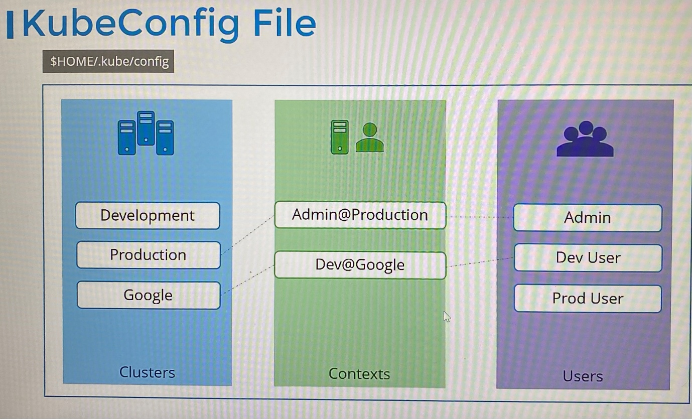

 

We can create YAML file with array format for each clusters, contexts
and users.

 

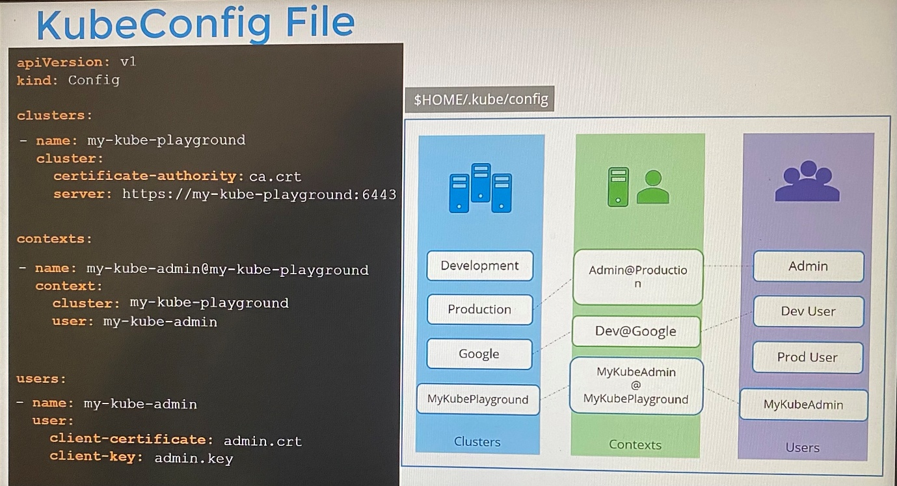

 

apiVersion: v1

kind: Config

current-context: my-kube-admin@my-kube-playground ; define default
context to choose from

clusters:

\- name: my-kube-playground

cluster:

certificate-authority: ca.crt

server: <https://my-kube-playground.6443>

contexts:

\- name: my-kube-admin@my-kube-playground

context:

cluster: my-kube-playground

user: my-kube-admin

namespace: finance

users:

\- name: my-kube-admin

user:

client-certificate: admin.crt

client-key: admin.key

 

\*Once kubeconfig file is ready, you don't have to create any object
like you usually do for other Kubernetes objects. The file is left as is
in \$HOME/.kube/config and is read by the kubectl command and required
values are used.

 

 

You can modify kubeconfig file with kubectl config command with its
option.

 

kubectl config view ; view the contents of default config file located
in user's home directory \$HOME/.kube/config

 

kubectl config view - -kubeconfig=my-custom-config ; specify custom
kubeconfig file by passing the kubeconfig option

 

-Move custom config file to the home directory, so it becomes the
default config file

 

kubectl config use-context prod-user@production ; to change
current-context in kubeconfig file

 

kubectl config use-context prod-user@production -
-kubeconfig=my-custom-config ; to switch current-context in particular
kubeconfig file

 

kubectl config current-context - -kubeconfig=my-custom-config ;to see
current context in new kubeconfig file

 

 

\*\*\*Set the custom kubeconfig file as the default kubeconfig file and
make it persistent across all sessions without overwriting the existing
~/.kube/config. Ensure any configuration changes persist across reboots
and new shell sessions.

 

The solution should set the KUBECONFIG environment variable to point to
your kubeconfig file. This can be done by adding an export statement to
your shell configuration file (like ~/.bashrc).

 

1.  Open your shell configuration file:

 

vi ~/.bashrc

 

2.  Add the following line to export the variable:

 

export KUBECONFIG=/root/my-kube-config

 

3.  Apply the Changes: Reload the shell configuration to apply the
    changes in the current session:

 

source ~/.bashrc

 

 

 

\*\*Move the custom kubeconfig file to path of default kubeconfig file

 

\>mv /root/my-kube-config \$HOME/.kube/config ; move new kubeconfig file
to replace the existing kubeconfig file placed in \$HOME/.kube/

 

\>cat /\$HOME/.kube/config ; check the default kubeconfig file after
moving

 

\>kubectl config view ; This shows default kubeconfig file

 

kubectl config -h

 

 

student-node ~ ✖ kubectl config

Modify kubeconfig files using subcommands like "kubectl config set
current-context my-context".

 

The loading order follows these rules:

 

1\. If the --kubeconfig flag is set, then only that file is loaded. The
flag may only be set once and no merging takes

place.

2\. If \$KUBECONFIG environment variable is set, then it is used as a
list of paths (normal path delimiting rules for

your system). These paths are merged. When a value is modified, it is
modified in the file that defines the stanza. When

a value is created, it is created in the first file that exists. If no
files in the chain exist, then it creates the

last file in the list.

3\. Otherwise, \${HOME}/.kube/config is used and no merging takes place.

 

Available Commands:

current-context Display the current-context

delete-cluster Delete the specified cluster from the kubeconfig

delete-context Delete the specified context from the kubeconfig

delete-user Delete the specified user from the kubeconfig

get-clusters Display clusters defined in the kubeconfig

get-contexts Describe one or many contexts

get-users Display users defined in the kubeconfig

rename-context Rename a context from the kubeconfig file

set Set an individual value in a kubeconfig file

set-cluster Set a cluster entry in kubeconfig

set-context Set a context entry in kubeconfig

set-credentials Set a user entry in kubeconfig

unset Unset an individual value in a kubeconfig file

use-context Set the current-context in a kubeconfig file

view Display merged kubeconfig settings or a specified kubeconfig file

 

Usage:

kubectl config SUBCOMMAND \[options\]

 

Use "kubectl config \<command\> --help" for more information about a
given command.

Use "kubectl options" for a list of global command-line options (applies
to all commands).

 

 

***Namespaces***

 

\- Each clusters may be configured with multiple namespaces. You can
configure namespace in context section so that you can be in particular
namespace when you use particular context. Thus you will automatically
be in a specific namespace when you switch to that context.

 

***Certificates in Kubeconfig***

 

\- It’s better to use full path to certificate

 

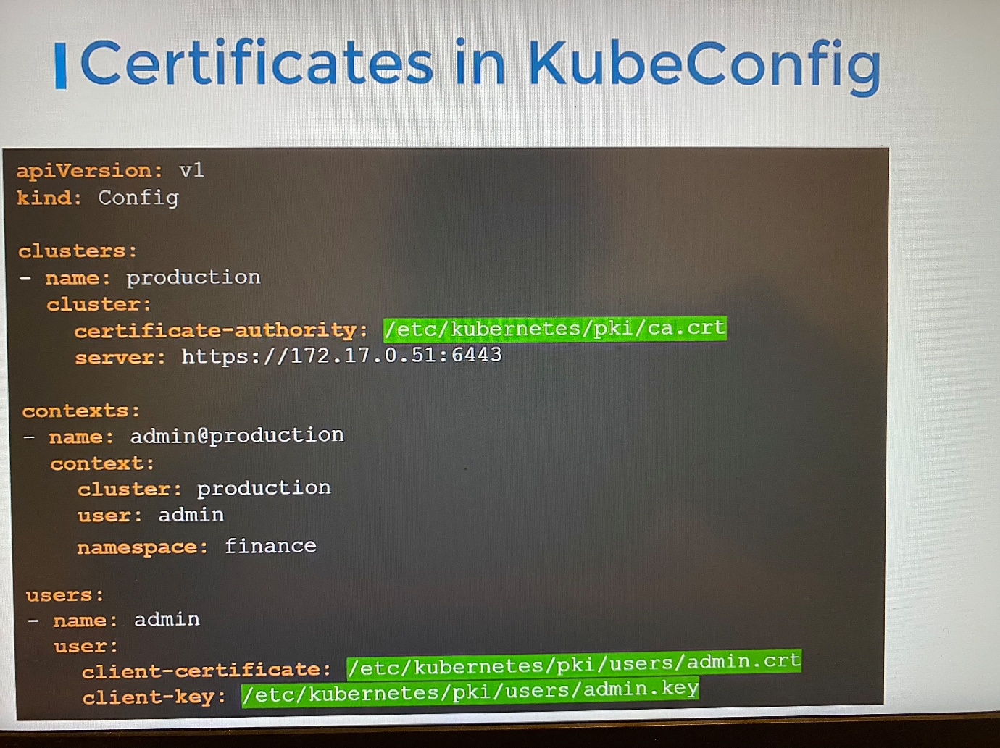

 

\- You can specify data of certificate instead of path with following
option in base64 encoded format

 

 

certificate-authority-data: \<base64 encoded data\>

 

cat ca.crt \| base64 ; encode the certificate

 

echo "\<encoded certificate\>" \| base64 --decode ; decode the encoded
certificate

 

If you need to set new kubeconfig file as default, move the file to
\$HOME/.kube/config.

 

---------------------------------

 

apiVersion: v1

kind: Config

 

clusters:

\- name: production

cluster:

certificate-authority: /etc/kubernetes/pki/ca.crt

server: <https://controlplane:6443>

 

\- name: development

cluster:

certificate-authority: /etc/kubernetes/pki/ca.crt

server: <https://controlplane:6443>

 

\- name: kubernetes-on-aws

cluster:

certificate-authority: /etc/kubernetes/pki/ca.crt

server: <https://controlplane:6443>

 

\- name: test-cluster-1

cluster:

certificate-authority: /etc/kubernetes/pki/ca.crt

server: <https://controlplane:6443>

 

contexts:

\- name: test-user@development

context:

cluster: development

user: test-user

 

\- name: aws-user@kubernetes-on-aws

context:

cluster: kubernetes-on-aws

user: aws-user

 

\- name: test-user@production

context:

cluster: production

user: test-user

 

\- name: research

context:

cluster: test-cluster-1

user: dev-user

 

users:

\- name: test-user

user:

client-certificate: /etc/kubernetes/pki/users/test-user/test-user.crt

client-key: /etc/kubernetes/pki/users/test-user/test-user.key

\- name: dev-user

user:

client-certificate:
/etc/kubernetes/pki/users/dev-user/developer-user.crt

client-key: /etc/kubernetes/pki/users/dev-user/dev-user.key

\- name: aws-user

user:

client-certificate: /etc/kubernetes/pki/users/aws-user/aws-user.crt

client-key: /etc/kubernetes/pki/users/aws-user/aws-user.key

 

current-context: test-user@development

preferences: {}

 

 

------------------------------------------------------------------------------

 

controlplane ~ ➜ kubectl get pods

error: unable to read client-cert
/etc/kubernetes/pki/users/dev-user/developer-user.crt for dev-user due
to open /etc/kubernetes/pki/users/dev-user/developer-user.crt: no such
file or directory

 

This error occurs when the client certificate is not available in
specified path in users section kubeconfig file. Edit correct client
certificate name in the path in users section kubeconfig file.

 

controlplane ~ ➜ ls /etc/kubernetes/pki/users/dev-user/

dev-user.crt dev-user.csr dev-user.key

 

 

-----------------------------------------------------------------------

 

**API Groups**

 

-Whatever operation we do with the kube-apiserver, we interact with
kube-apiserver through either kubectl utility or REST API

-All resources of Kubernetes API are grouped into different API groups

\- The Kubernetes APIs are grouped into multiple groups based on their
purpose. Followings are few APIs for different purpose.

 

/version - view the version of the cluster

/metrics and /healthz - monitor the health of the cluster

/logs - integrate with third party logging applications

/api

/apis

 

We focus on APIs that responsible for cluster functionality are
categorized as follows

 

/api/v1 - ***core*** group is where all core functionality exists such
as namespaces, pods, replication controllers, events, endpoints, nodes,
bindings, persistent volumes, persistent volume claims, configmaps,
secrets, services

 

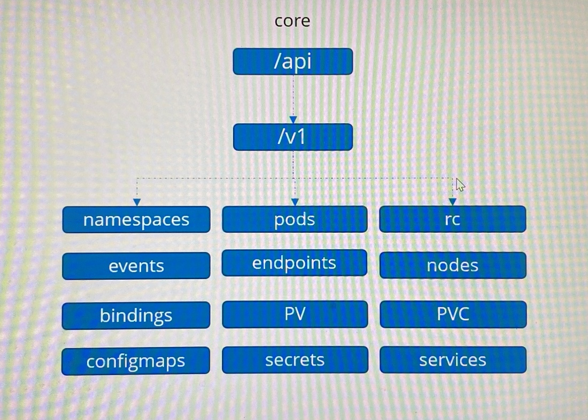

 

 

/apis - ***named*** group are more organized. Going forward all newer
features are made available through named groups such as apps,
extensions, networking, storage, authentication, certificates,
authorization. These API groups have resources under them.

 

***Resources***

 

/apps/v1 - /deployments, /replicasets, /statefulsets

/networking.k8s.io/v1- /networkpolicies

/certificates.k8s.io/v1 - /certificatesigningrequests

 

***Verbs***

 

Each resources have set of actions associated with them which are known
as verbs

 

Set of actions - list, get, create, delete, update, watch

 

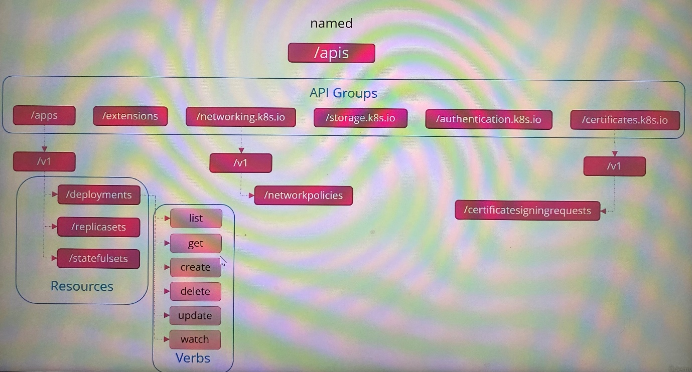

 

curl <http://localhost:6443> -k ; access kube-apiserver and list all API
groups available.

 

curl <http://localhost:6443/apis> -k \| grep “name” ; list all supported
resource groups in named groups

 

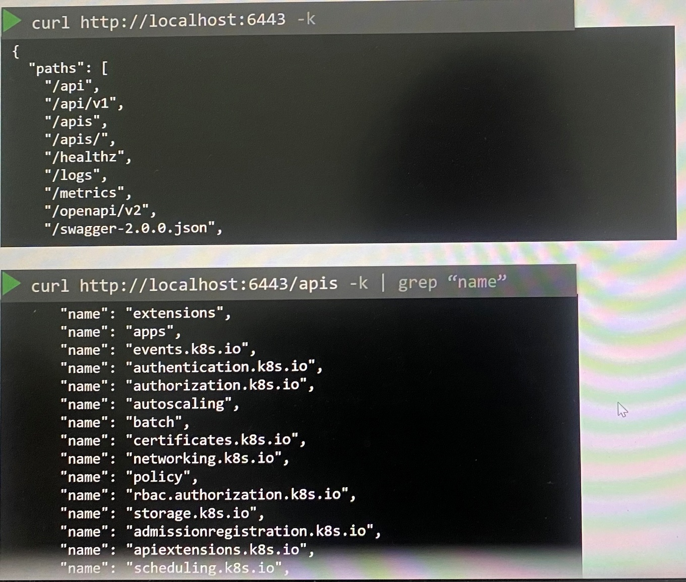

 

 

 

curl <http://localhost:6443> -k - -key admin.key - -cert admin.crt -
-cacert ca.crt ;

However fetching data will be restricted if the user is not passing pair
of certificates and key of user as options. User will not be allowed to
access without certificates and key except certain APIs like version.

 

The alternative option is to start kubectl proxy client to access
kube-apiserver without specifying pair of certificates and key

 

***Kubectl proxy***

 

***kubectl proxy*** command launches a proxy service locally on port
8001 and the proxy will use the credentials and certificates in
kubeconfig file to forward the request to kube-APIserver instead using
the credentials in the cURL command each time.

 

Kubectl proxy is HTTP proxy service created by kubectl utility to access
kube-apiserver

 

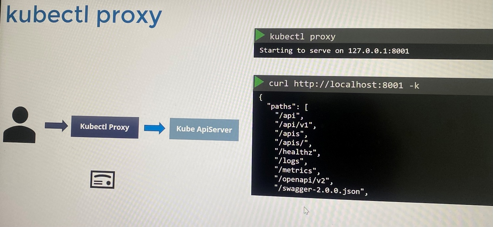

 

kubectl proxy ; To start proxy service locally

 

curl <http://localhost:8001> -k ; list all available APIs at root

 

Kube proxy is not similar to kubectl proxy.

 

We use resources that grouped with API groups to allow or deny access to
users on authorization.

 

 

**Authorization** (What they can do)

 

Administrator of the cluster is able to perform operation such as
viewing objects, creating or deleting objects

It defines the level of access and operation can be performed by
administrators, developers, testers, applications like monitoring
application, continuous delivery applications like Jenkins. We don't
want all of them to have same level of access to modify cluster
configuration.

We share our cluster to different organization, teams by logically
partitioning it using namespaces by restricting access to the users to
particular namespace.

 

***Authorization Mechanism***

 

\- Role Based RBAC authorization

\- Attribute based ABAC authorization

\- Node authorization

\- Webhook Mode

 

*Node authorization*

 

\- Administrators and Kubelet access Kube-APIserver to read information
about service, endpoints, nodes and pods, Kubelet also reports
information about nodes such as node status

\- These requests are handled by a special authorizer which is called
***node authorizer***

\- Kubelet have a name prefixed with system:node:\<node name\> and any
request coming from a user, system node and part of system node group is
authorized by the node authorizer and are granted the privileges

 

*ABAC authorization*

 

\- Use basically for external access to the API

\- ABAC associates users or group of users with set of permission. For
instance, dev users can view, create and delete PODs

\- This can be done by creating policy file with set of policies in JSON
format and passing it to API server. We create a ***policy definition
file*** for each user or group in this file.

\- If you modify the policy definition file with some policies, it needs
to restart the kube-apiserver after modification. Hence, ABAC
configuration is difficult to manage.

 

 

*RBAC authorization*

 

\- Define roles with associating set of permissions instead directly
associated with a user or group and associate users to role created

\- If we change set of permission in role, it reflects to all users
associated to the role immediately

-RBAC provides a more standard approach to manage accessing within
Kubernetes cluster

 

*Webhook*

 

\- When you need to manage authorization externally and not through
built-in mechanism.

\- For instance, ***Open Policy Agent*** is a third party tool that
helps with admission control and authorization where Kubernetes makes
API call to the open policy agent with the information about user and
his access requirements, then open policy agent decides whether user
should be permitted or not. Based on the response , user is granted
access.

 

***Authorization Mode***

 

In addition, these authorization modes have in Kubernetes. These mode
are set using ***--authorization-mode*** option on the kube-api server.

 

AlwaysAllow - allow all requests coming from users and groups. This is
the mode by default if a mode is not specified in kube-apiserver

 

AlwaysDeny - deny all requests coming from users and groups

 

\- -authorization-mode=AlwaysAllow \\

 

\- -authorization-mode=Node,RBAC,Webhook \\ ;

When you specify multiple modes where it authorizes based on the order
of mode specified. It checks the subsequent mode until a module approves
the request and grant permission for user. Every time a module denies
the request, it goes to the next one in the chain and as soon as a
module approves the request no more checks are done and the user is
granted permission.

 

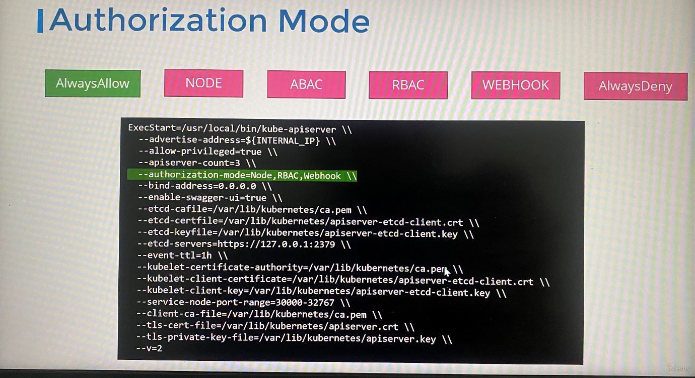

 

 

**Role Based Access Controls**

 

1.  We should first define the set of permissions that needs to enroll
    with the role before creating role object using role definition
    file.

 

kubectl create role \<role name\> - -verb=list, create, delete -
-resource=pods ; create a role in imperative method

 

kubectl create role foo --verb=get,list,watch --resource=rs.apps

 

kubectl create role pod-reader --verb=get --resource=pods
--resource-name=readablepod --resource-name=anotherpod

 

-------developer-role.yaml------------------

 

apiVersion: rbac.authorization.k8s.io/v1

kind: Role

metadata:

name: developer

rules:

\- apiGroups: \[“”\]

resources: \[“pods”\]

verbs: \[“list”, “get”, “create”, “update”, “delete”\]

\- apiGroups: \[“”\]

resources: \[“ConfigMap”\]

verbs: \[“get”, “create”\]

 

-------------------------------------------------------------------

 

apiVersion: rbac.authorization.k8s.io/v1

kind: Role

metadata:

creationTimestamp: "2025-04-24T01:56:10Z"

name: developer

namespace: blue

resourceVersion: "5252"

uid: 21e52cef-d688-44c9-a01f-a1cbe83e7709

rules:

\- apiGroups:

\- ""

resourceNames:

\- dark-blue-app

resources:

\- pods

verbs:

\- get

\- watch

\- create

\- delete

\- apiGroups:

\- apps

resources:

\- deployments

verbs:

\- create

 

-------------------------------------------------------------------------------

 

 

kubectl create -f developer-role.yaml

 

\- For core group, we can leave the API group section as blank.

\- For any other group, you specify the group name

\- You can add multiple rules to single role as list/array

 

2.  To link a role to user, we create Role binding object using
    RoleBinding definition file and links user object to the role

 

kubectl create rolebinding \<name of RoleBinding\> - -role=developer -
-user=dev-user

 

 

apiVersion: rbac.authorization.k8s.io/v1

kind: RoleBinding

metadata:

name: devuser-developer-binding

subjects:

\- kind: User

name: dev-user

apiGroup: rbac.authorization.k8s.io/v1

roleRef:

kind: Role

name: developer

apiGroup: rbac.authorization.k8s.io/v1

 

-In subjects, add multiple user as list/array

-In roleRef, we add the role created

 

\- Note that Role and RoleBinding fall under the scope of namespaces. If
no namespace is specified, they fall under default namespace

\- You can control user access within a namespace by specifying
namespace in the metadata of Rola and RoleBinding definition file

 

kubectl get roles ; list roles

 

kubectl get rolebindings ; list the RoleBindings

 

kubectl describe role developer ; detail of the role

 

kubectl describe rolebinding devuser-developer-binding

 

kubectl edit role -n blue developer

 

*Check access*

 

To check by yourself whether you have access to particular resource in
the cluster

 

\>kubectl auth can-i create deployments

yes

 

\>kubectl auth can-i delete pods

no

 

To verify whether granted permission for an user is working by
impersonating the user

 

kubectl auth can-i create pods - -as dev-user

 

kubectl auth can-i create pods - -as dev-user - -namespace test ; To
verify whether granted permission for an user is working by
impersonating the user in the namespace

 

kubectl get pods - -as dev-user ; To verify permission for the action as
a particular user

 

controlplane ~ ✖ kubectl auth can-i get pod/dark-blue-app --as=dev-user
--namespace blue ; To check status on a pod

No

 

controlplane ~ ➜ kubectl auth can-i create deployment --as=dev-user
--namespace blue

yes

 

controlplane ~ ➜ kubectl auth can-i list pods --as dev-user

No

 

 

ps -aux \| grep authorization ; check the processes on the controlplane,
this is the way to check mode of authorization

 

 

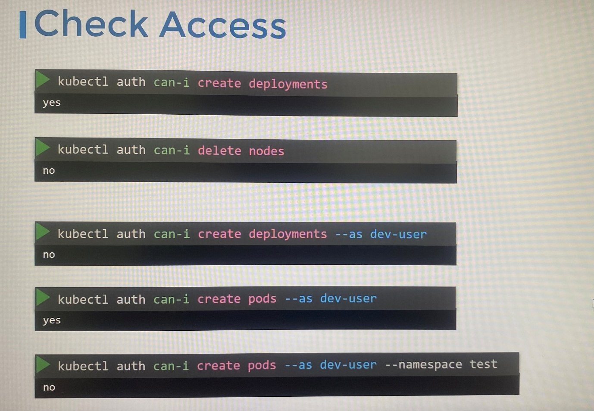

 

 

controlplane ~ ➜ kubectl get role -A

NAMESPACE NAME CREATED AT

blue developer 2025-04-24T01:56:10Z

kube-public kubeadm:bootstrap-signer-clusterinfo 2025-04-24T01:41:56Z

kube-public system:controller:bootstrap-signer 2025-04-24T01:41:55Z

kube-system extension-apiserver-authentication-reader
2025-04-24T01:41:55Z

kube-system kube-proxy 2025-04-24T01:41:56Z

kube-system kubeadm:kubelet-config 2025-04-24T01:41:55Z

kube-system kubeadm:nodes-kubeadm-config 2025-04-24T01:41:55Z

kube-system system::leader-locking-kube-controller-manager
2025-04-24T01:41:55Z

kube-system system::leader-locking-kube-scheduler 2025-04-24T01:41:55Z

kube-system system:controller:bootstrap-signer 2025-04-24T01:41:55Z

kube-system system:controller:cloud-provider 2025-04-24T01:41:55Z

kube-system system:controller:token-cleaner 2025-04-24T01:41:55Z

 

 

controlplane ~ ➜ kubectl describe role kube-proxy -n kube-system

Name: kube-proxy

Labels: \<none\>

Annotations: \<none\>

PolicyRule:

Resources Non-Resource URLs Resource Names Verbs

--------- ----------------- -------------- -----

configmaps \[\] \[kube-proxy\] \[get\]

 

controlplane ~ ➜ kubectl describe rolebindings.rbac.authorization.k8s.io
dev-user-binding

Name: dev-user-binding

Labels: \<none\>

Annotations: \<none\>

Role:

Kind: Role

Name: developer

Subjects:

Kind Name Namespace

---- ---- ---------

User dev-user

 

-------------------------------------------------------------------

 

 

***Resource Names***

 

To restrict particular resources within the namespace. Let assume, there
are 5 pods and each belongs to 5 different namespace. You want to grant
set of actions only 2 pods.

 

apiVersion: rbac.authorization.k8s.io/v1

kind: Role

metadata:

name: developer

namespace: blue

rules:

\- apiGroups: \[“”\]

resources: \[“pods”\]

verbs: \[“list”, “get”, “create”, “update”, “delete”\]

resourceNames: \[“blue”, “orange”\]

 

 

 

**Cluster Roles**

 

\- Nodes cannot be grouped within a namespace because nodes are
cluster-wide or cluster-scoped resource

-The resources are categorized either **namespaced** or
**cluster-scoped**

 

Namespaced resources - pods,replicasets, jobs, deployments, services,
secrets, roles, rolebindings, configmaps, PVC

 

Cluster-scoped resources - nodes, PV, clusterroles, clusterrolebindings,
certificatesigningrequests, namespaces

 

kubectl api-resources - -namespaced=true ; to view namespaced resources

 

kubectl api-resources - -namespaced=false ; to view cluster scoped
resources

 

kubectl api-resources ; list all resources with short name of resources,
api version, namespaced or not, kind

 

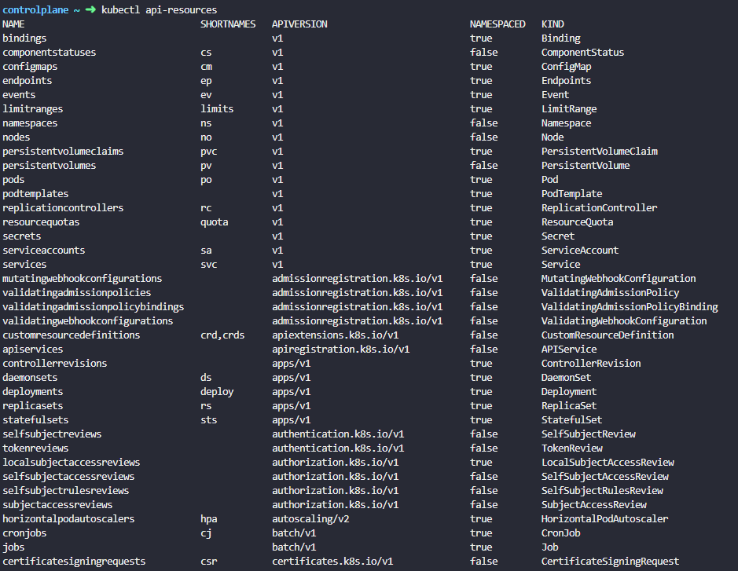

 

\- Clusterroles and clusterrolebindings use to authorize users cluster
scoped resources

 

Cluster admin - to view, create, delete nodes in the cluster

Storage admin - to view, create, delete persistent volumes and claims

 

kubectl create clusterrole michelle --verb=\* --resource=nodes ; to
perform any action at nodes

 

apiVersion: rbac.authorization.k8s.io/v1

kind: ClusterRole

metadata:

name: cluster-administrator

rules:

\- apiGroups: \[“”\]

resources: \[“nodes”\]

verbs: \[“list”, “get”, “create”, “update”, “delete”\]

 

 

---------------------------------------------------------------

apiVersion: rbac.authorization.k8s.io/v1

kind: ClusterRole

metadata:

annotations:

rbac.authorization.kubernetes.io/autoupdate: "true"

creationTimestamp: "2025-04-24T05:05:16Z"

labels:

kubernetes.io/bootstrapping: rbac-defaults

name: cluster-admin

resourceVersion: "70"

uid: 6096c8a1-c80f-4d84-82ea-9f8d95c12ae4

rules:

\- apiGroups:

\- '\*'

resources:

\- '\*'

verbs:

\- '\*'

\- nonResourceURLs:

\- '\*'

verbs:

\- '\*'

 

---------------------------------------------------------------

 

kubectl create clusterrolebinding michelle-crbinding
--clusterrole=michelle --user=michelle

 

apiVersion: rbac.authorization.k8s.io/v1

kind: ClusterRoleBinding

metadata:

name: cluster-admin-role-binding

subjects:

\- kind: User

name: cluster-admin

apiGroup: rbac.authorization.k8s.io/v1

roleRef:

kind: ClusterRole

name: cluster-administrator

apiGroup: rbac.authorization.k8s.io/v1

 

-----------------------------------------------------------------------------------

apiVersion: rbac.authorization.k8s.io/v1

kind: ClusterRoleBinding

metadata:

annotations:

rbac.authorization.kubernetes.io/autoupdate: "true"

creationTimestamp: "2025-04-24T05:05:16Z"

labels:

kubernetes.io/bootstrapping: rbac-defaults

name: cluster-admin

resourceVersion: "134"

uid: a9509d9e-615e-4abe-8c8f-cba2776a78e2

roleRef:

apiGroup: rbac.authorization.k8s.io

kind: ClusterRole

name: cluster-admin

subjects:

\- apiGroup: rbac.authorization.k8s.io

kind: Group

name: system:masters

-----------------------------------------------------------------------------------

 

Kubectl get nodes --as michelle

kubectl auth can-i list storageclasses --as michelle ; check the access
as michelle

 

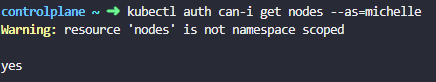

 

\- You can create ClusterRole for namespaced resources as well. When you
do that users will have access to the resources across all namespaces in
the cluster

-Kubernetes creates number of clusterrole by default when the cluster is
first set up

-Kind of the subject can be **User**, **Group** or **ServiceAccount**

 

------------------------------------------------------------------------------

 

controlplane ~ ➜ kubectl describe clusterrole cluster-admin

Name: cluster-admin

Labels: kubernetes.io/bootstrapping=rbac-defaults

Annotations: rbac.authorization.kubernetes.io/autoupdate: true

PolicyRule:

Resources Non-Resource URLs Resource Names Verbs

--------- ----------------- -------------- -----

\*.\* \[\] \[\] \[\*\]

\[\*\] \[\] \[\*\]

 

 

controlplane ~ ➜ kubectl describe
clusterrolebindings.rbac.authorization.k8s.io cluster-admin

Name: cluster-admin

Labels: kubernetes.io/bootstrapping=rbac-defaults

Annotations: rbac.authorization.kubernetes.io/autoupdate: true

Role:

Kind: ClusterRole

Name: cluster-admin

Subjects:

Kind Name Namespace

---- ---- ---------

Group system:masters

 

-----------------------------------------------------------------------------------------------------------

 

These events can see when image update as private registry on deployment
that it can't authenticate to image repository

 

Events:

Type Reason Age From Message

---- ------ ---- ---- -------

Normal Scheduled 106s default-scheduler Successfully assigned
default/web-7968dfbf7f-wmjm7 to controlplane

Normal Pulling 17s (x4 over 105s) kubelet Pulling image
"myprivateregistry.com:5000/nginx:alpine"

Warning Failed 17s (x4 over 105s) kubelet Failed to pull image
"myprivateregistry.com:5000/nginx:alpine": failed to pull and unpack
image "myprivateregistry.com:5000/nginx:alpine": failed to resolve
reference "myprivateregistry.com:5000/nginx:alpine": pull access denied,
repository does not exist or may require authorization: authorization
failed: no basic auth credentials

Warning Failed 17s (x4 over 105s) kubelet Error: ErrImagePull

Normal BackOff 5s (x6 over 105s) kubelet Back-off pulling image
"myprivateregistry.com:5000/nginx:alpine"

Warning Failed 5s (x6 over 105s) kubelet Error: ImagePullBackOff

 

----------------------------------------------------------------------------------------------------------

 

 

 

**Service accounts**

 

A service account could be an account used by an application to interact
with a Kubernetes cluster.

 

For example, a monitoring application like Prometheus uses a service
account to pull the Kubernetes API for performance metrics, an automated
build tool like Jenkins uses service account to deploy applications in
the cluster

 

\- In order for those application to query Kubernetes API, it has to be
authenticated. For that we use a service account.

 

kubectl create serviceaccount \<name of service account \> ; create a
service account

 

kubectl get serviceaccount ; list all service accounts

 

\- When you create a service account, it first creates service account
object. Then it automatically creates a token for service account. This
service account token is what must be used by external application as an
authentication bearer token while making a REST call to Kubernetes API

\- Then it creates a secret object and stores service account token
inside the secret object. Ex: dashboard-sa-token-kbbdm

\- Secret object is then linked to the service account

 

kubectl describe secret \<name of the secret\> ; to view the token
created for the service account

 

 

curl <https://kube-apiserverIP:6443/api> -insecure --header
"Authorization: Bearer lkfanjkfnkjqfkjebq"

 

\- To authenticate to dashboard application, you can copy and paste the
token into dashboard

 

1.  Create service account

2.  Assign a role to service account using RBAC

3.  Export the service account token

4.  Use the token to configure third party application to authenticate
    Kubernetes API

 

\- If the application is hosted in Kubernetes cluster itself, exporting
the service account token and configuring third party application is
pretty simple by automatically mounting the service token secret as a
volume inside the pod that host the third party application. Thus the
application can easily read the token inside the pod.

\- Each and every namespace in Kubernetes has its own service account
named **default** is automatically created whenever a namespace is
created.

\- Whenever a pod is created, the default service account and its token
are automatically mounted to the pod as a volume . The describe command
for the pod shows the volume created as **secretName** for the default
service account as default-token-\<randomdigits\>

\- The secret token is mounted at location
/var/run/secrets/kubernetes.io/serviceaccount inside the pod. This makes
the token accessible to a process that is running within the pod and
allows the process to query kubernetes API.

 

 

-If you ls command to list the directory inside the pod,

 

kubectl exec -it \<pod name\> -- ls
/var/run/secrets/kubernetes.io/serviceaccount ; 3 files are mounted in
the location(ca.crt, token, namespace), the one with actual **token** is
the file named token. If you see contents of this file, you will see the
token that to be used for accessing the Kubernetes API.

 

kubectl exec -it \<pod name\> cat
/var/run/secrets/kubernetes.io/serviceaccount/token ; to view the exact
token associated to the service account

 

 

\- The default service account is much restricted and it only has
permission to run basic Kubernetes API queries

\- If you like to different service account with custom RBAC, you can
specify a custom service account in a pod definition file.

 

spec:

serviceAccountName: \<service account name\>

 

Note: Use following command to set custom service account on deployment
other than default service account.

 

kubectl set serviceaccount deploy/web-dashboard dashboard-sa

 

 

\- Note that you cannot edit the service account in the existing pod, so
you have to delete and recreate the pod

\- However, the service account can be edited for the deployment as any
changes to pod definition file will automatically trigger a new rollout
for the deployment. So the deployment will take care of deleting and
recreating new pods with the right service account

\- Kubernetes mounts default service account that has in namespace if
you haven’t explicitly specified any of service account. You can choose
not to mount service account automatically by setting the
**automountServiceAccountToken** field to false in pod spec section

 

spec:

automountServiceAccountToken: false

 

***Since Kubernetes release version 1.22,***

 

kubectl exec -it \<pod name\> ls
/var/run/secrets/kubernetes.io/serviceaccount ;list the files in the
directory

 

kubectl exec -it \<pod name\> cat
/var/run/secrets/kubernetes.io/serviceaccount/token ; to view the exact
token associated to the service account

 

jq -R 'split(".") \| select(length \> 0) \| .\[0\],.\[1\] \| @base64d \|
fromjson' \<\<\< bfhkfnekfkjebk ; decode the token from this command

 

Or

 

You can view the decoded token using the site ***jwt.io***

 

-The token has no expiry date defined in the payload section, basically
it is not time bound

\- The JWT is valid as long as the service account exists . Each JWT
requires a separate secret object per service account which results in
scalability issue

\- Since v1.22, it no longer relies on service account secret token to
be automatically mounted when a pod is created. Instead
**TokenRequestAPI** is introduced for provisioning Kubernetes service
account tokens that are more secure and scalable via an API

\- The token generated by TokenRequestAPI is ***audience bound, time
bound, object bound*** through which it is more secure

\- Without relying on default service account token in namespace, the
token with a defined lifetime is created through TokenRequestAPI by
**service account admission controll**er which is mounted as projected
volume onto the pod that communicates with TokenRequestAPI to get token
for the pod.

 

 

 

***Since Kubernetes release version 1.24,***

 

With version 1.24, it doesn’t automatically create a secret or token
access secret when you create a service account. So you must create a
token manually followed by the name of service account.

 

kubectl create serviceaccount \<name of service account\> ; create a
service account

 

kubectl create token \<name of service account\> ; create a token
manually and print the token on the screen

 

\- You can decode the token and see expiry date as well as run
additional command to increase the expiry date of the token

 

jq -R 'split(".") \| select(length \> 0) \| .\[0\],.\[1\] \| @base64d \|
fromjson' \<\<\< bfhkfnekfkjebk ; decode the token from this command

 

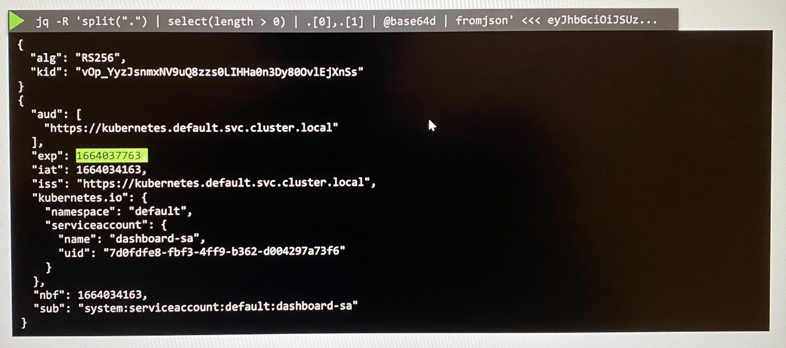

 

-You can see the token has expiry date defined. If you haven't specified
any time limit, it is usually one hour since the time you created.
Further you can specify option to define time limit.

 

-In 1.24 if you still need secret object with non-expiring token, create
a secret object with type set to kubernetes.io/service-account-token and
the name of the service account specified within annotations in metadata
section.

 

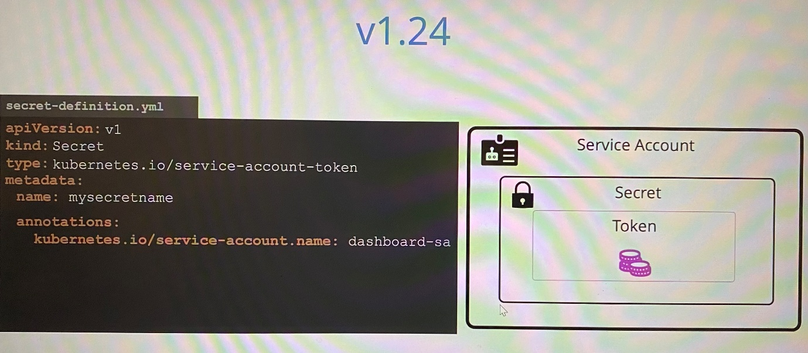

 

 

\*You should only create service account token secrets if you can't use
the TokenRequestAPI to obtain a token.

 

\- In a deployment, serviceaccount should specify in spec section in
pods

 

\*\* TokenRequestAPI is recommended instead using service account token.

 

----------------------------------------------------------------------------------------------------

 

To check the user who is running the pod

 

controlplane ~ ➜ kubectl exec -it ubuntu-sleeper -- whoami

Root

 

 

NOTE: TO delete the pod faster, you can run kubectl delete pod
ubuntu-sleeper --force. This can be done for any pod in the lab or the
actual exam. It is not recommended to run this in Production, so keep a
note of that.

 

controlplane ~ ✖ kubectl delete pod ubuntu-sleeper --force

Warning: Immediate deletion does not wait for confirmation that the
running resource has been terminated. The resource may continue to run
on the cluster indefinitely.

pod "ubuntu-sleeper" force deleted

 

 

 

**Image security**

 

Images are pulled from secured repositories and deployed a container in
it. Pod definition file has the image as following format.

 

image: nginx ; it’s actually **library/nginx** where first part stands
for the account name and other part is image repository. If you doesn’t
specify the account name, it assumes to be library as default account
where Docker's official images are stored.

 

These images promote best practices and are maintained by a dedicated
team for reviewing and publishing images under it.

 

image: docker.io/library/nginx

 

docker.io - Registry

library - User/Account

nginx - Image/Repository

 

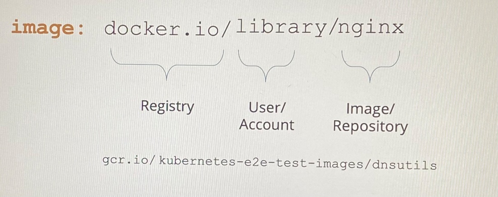

 

docker.io is DNS name of docker registry such as gcr.io where a lot of
Kubernetes related images are stored.

 

***Private repository***

 

Private registry are provided by AWS, Azure and GCP by default and it
can be accessed using a set of credentials.

 

To run a container using a private image that stores in repository, you
first log into private registry.

 

docker login private-registry.io ; provide username and password to
access private registry.

 

docker run private-registry.io/apps/internal-app ; run the container
after login to the registry

 

 

Thus we can specify an image in private registry with the full path in
the pod definition file where docker runtime on worker node should pull
the image after login. To pass credentials to access private registry,
we have to create secret object with the credentials of private
repository in it.

 

kubectl create secret docker-registry regcred \\

\- -docker-server= private-registry.io \\

\- -docker-username= registry-user \\

\- -docker-password= registry-password \\

\- -docker-email= registry-user@org.com

 

kubectl create secret docker-registry private-reg-cred
--docker-username=dock_user --docker-password=dock_password
--docker-email=dock_user@myprivateregistry.com
--docker-server=myprivateregistry.com:5000

 

 

\*\*Docker registry is a built in secret type that was built for storing
Docker credentials for Docker registry

 

Then we can specify the secret inside the pod definition file. Kubelet
in the worker nodes use credentials specified with
**spec.imagePullSecrets\[\]** to pull the image.

 

apiVersion: v1

kind: Pod

metadata:

name: nginx-pod

spec:

containers:

\- name: nginx

image: private-registry.io/apps/internal-app

imagePullSecrets:

\- name: regcred

 

kubectl create secret (docker-registry \| generic \| tls)

 

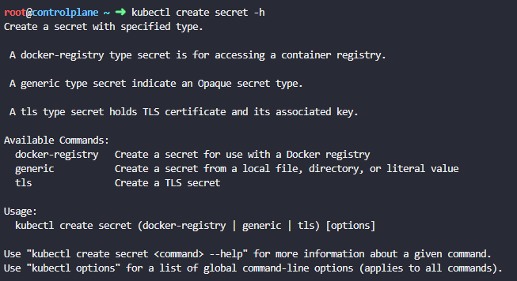

 

 

**Security in Docker**

 

***Process isolation***

 

\- Unlike VM, containers are not completely isolated from their host.
Containers and the host share the same Kernal

\- Containers are isolated using namespaces in Linux. The host has a
namespace and the containers have their own namespace.

\- All the processes run by the containers are in fact run on the host
itself but they are in their own namespace and it can see its own
processes along with its own process ID.

 

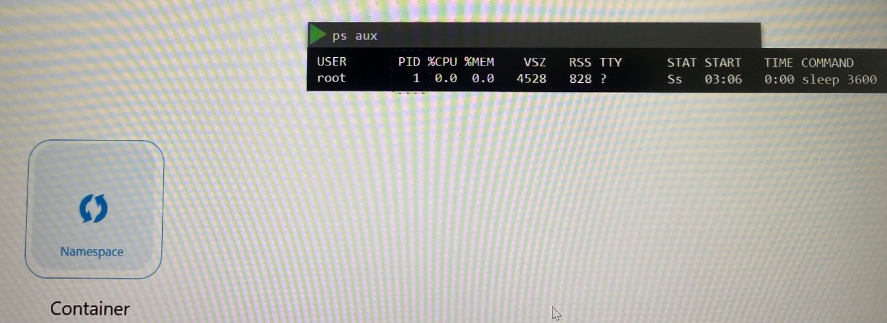

 

-For the Docker host, all processes have of its own namespace, as well
as those processes in the child namespaces are visible as just another
process in the host but with different process ID. that's how Docker
isolates containers within a host.

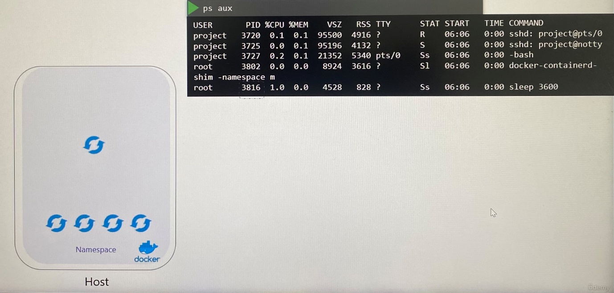

 

 

\>ps aux ; list the process run within the Docker container

 

***Users in Security***

 

\- Docker host has set of users, a root user and number of non-root
users

\- By default, docker run processes within containers as the root user

-The process is run as root user both within the container and outside
the container on the host.

\- You can specify user ID to run processes in the container if you want
to change from root user.

 

\>docker run - -user=1000 ubuntu sleep 3600

 

\- Another way to enforce user security is to define the user
instruction in Dockerfileat building of docker image using Dockerfile
and then use that custom image without specifying the user ID to run
container.

 

-----Dockerfile------

 

FROM ubuntu

 

USER 1000

 

-----------------

 

\>docker build -t my-ubuntu-image .

 

\>docker run my-ubuntu-image sleep 3600

 

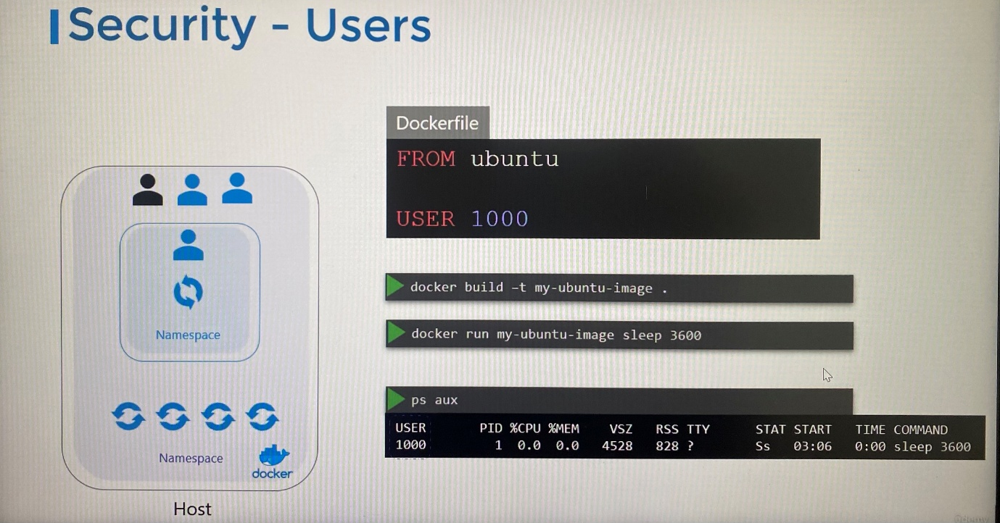

 

\- There is a security risk if the root user runs the processes in the
container is same privilage as the root user runs the processes on the
host. To mitigate this, docker implement security features that limits
the capabilities of root user within the container against root user
within the host.

\- As root user is most powerful user on a system, it has unrestricted
access to systems, modifying files and permissions on files, access
control, creating and killing processes, setting group ID and user ID,
performing network related operations such as binding two network ports,
broadcasting on a network, controlling network ports, system related
operations like rebooting the host, manipulating system clock and many
more.

 

You can see all capabilities on Linux system in this path:
**/usr/include/linux/capability.h**

 

-By default, Docker runs a container with a limited set of capabilities.
The processes running within the container do not have the privileges to
reboot the host or perform operations that can disrupt the host or other
containers on the same host.

 

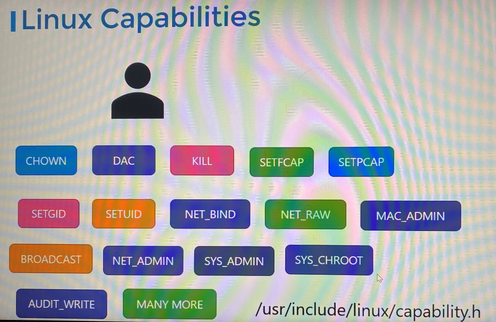

 

docker run --cap-add MAC_ADMIN ubuntu ; To provide additional privileges
to an user in the container by overriding the default behavior

 

docker run --cap-drop KILL ubuntu ; To drop privileges to an user in the
container

 

docker run --privileged ubuntu ; run a container with all privileges
enabled

 

 

**Security context in Kubernetes**

 

-When you run Docker container, you have the option to define a set of
security standards, such as the ID of the user uses to run the
container, the Linux capabilities that can be added or removed from the
container, etc. These can be configured in Kubernetes as well

\- You can configure security settings at a container level or pod level

\- If security settings configure at pod level, it will carry over all
the containers within the pod

\- If security settings configure at the pod and the container, the
security settings on the container will override the settings on the pod

 

To apply security settings at pod level,

 

apiVersion: v1

kind: Pod

metadata:

name: web-pod

spec:

securityContext:

runAsUser: 1000 ; set user ID of the user

containers:

\- name: ubuntu

image: ubuntu

command: \[“sleep”, “3600”\]

 

To apply security settings at container level,

 

apiVersion: v1

kind: Pod

metadata:

name: web-pod

spec:

containers:

\- name: ubuntu

image: ubuntu

command: \[“sleep”, “3600”\]

securityContext:

runAsUser: 1000 ; set user ID of the user

capabilities:

add: \[“MAC_ADMIN”\] ; add list of capabilities at container level

 

\*Capabilities are only supported at the container level not at the pod
level

 

kubectl exec \<pod name\> -- whoami ; to check the user who is running
the pod

 

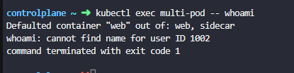

 

\*If no user defined in securityContext in pod level, by default process
will be run as root user. So if you want run container as root with
different capabilities, add security context without runAsUser.

 

 

**Network policy**

 

***Network security***

 

-Let consider ingress/egress traffic flow of solution that have web
server as frontend, API server as backend and Database server are
communicated as follows.

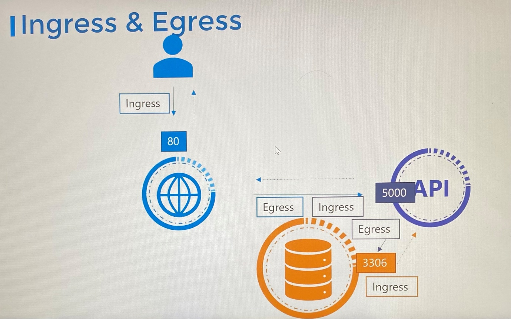

 

\- Whatever networking solution you implement, the pods should be able
to communicate with each other without having to configure any
additional settings like routes

\- All pods that span across the node in the cluster are on a virtual
private network and they by default reach each other using IP, pod names
or service for that purpose as Kubernetes is configured by default with
an "All Allow" rule that allows traffic from any pod to any other pod or
service within the cluster

 

-What if the front end web server not to be able to communicate with the
database server directly? This is where **Network policy** comes that is
used to restrict the traffic from one pod or to another pod.

\- Network policy is an object like pods, replicasets or services in
Kubernetes namespace. Network policy must be linked to one or more pods
where you can define rules

-Once you add specific allow rule into network policy and then link to a
pod, it blocks all other traffic to the pod except the traffic matches
the allow rule.

\- We use labels and selectors like replicasets or services to link
network policy to pods where we specify ***labels*** on the pods and
***podSelector.matchLabels*** on the network policy.

 

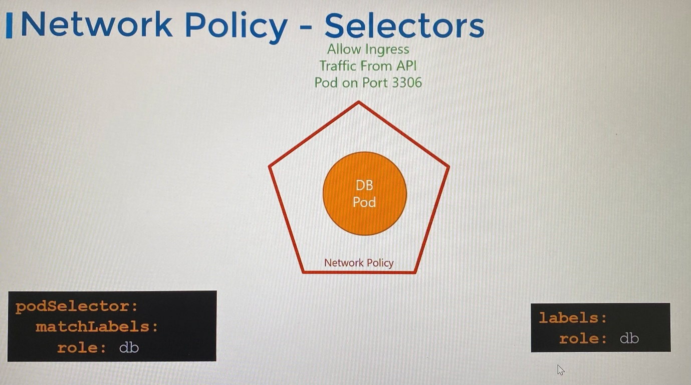

-Then we build rule to allow ingress or egress traffic or both under
network policy types

\- Network policies are enforced by the network solution implemented on
Kubernetes cluster and not all network solution supports network

 

Support: Kube-router, Calico, Romana, Weave-net

Not supported: Flannel

 

-For networking solutions that doesn't support network policies, you can
still create network policy but they will not be able to enforce. You
will not get an error message that network solution does not support
network policies.

 

apiVersion: networking.k8s.io/v1

kind: NetworkPolicy

metadata:

name: db-policy

spec:

podSelector:

matchLabels:

role: db ; this will be blocked all traffic

policyTypes:

\- Ingress

ingress:

\- from:

\- podSelector:

matchLabels:

name: api-pod

ports:

\- protocol: TCP

port: 3306

 

-Ingress or egress isolation only comes into effect if you have ingress
or egress in the **policyTypes**. If you mention ingress in
**policyTypes**, only ingress traffic is isolated and all egress traffic
is unaffected which means egress is not blocked.

 

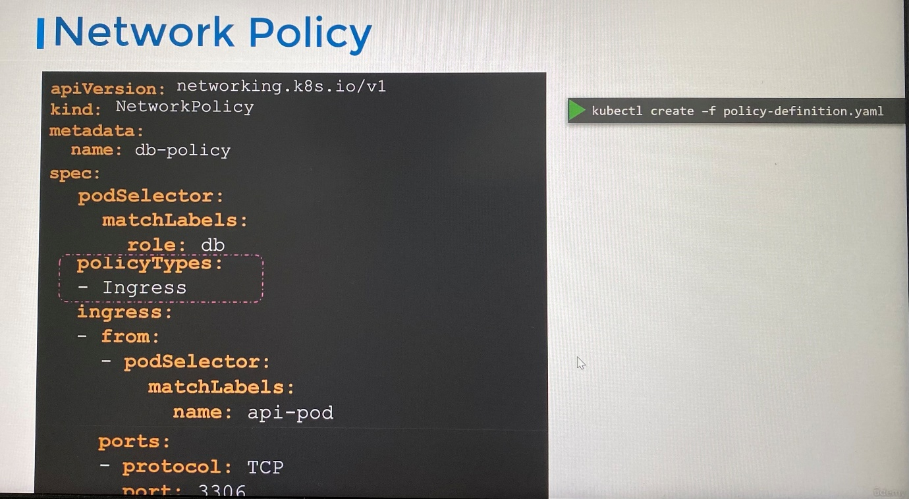

 

***Developing network policies***

 

-Kubernetes by default allows all traffic from all pods to all
destinations.

\- Once you associate network policy to a pod using podSelector, then it
blocks out all traffic. Only defined traffic by rule either ingress or
egress traffic is allowed automatically.

-When decide the type of rule is to be created in network policy, you
only need to concern about the direction of the request originates from.
Once you allow traffic based on direction, response or reply traffic is
allowed back automatically. So we don't need separate rule for that.

-Single network policy can have ingress type or egress type of rule or
both in cases.

\- This will allow ingress traffic from any pods in any namespaces. that
match the label defined.

 

spec:

podSelector:

matchLabels:

role: db

policyTypes:

\- Ingress

ingress:

\- from: ; from field for ingress of traffic

\- podSelector:

matchLabels:

name: api-pod

namespaceSelector:

matchLabels:

name: prod

ports:

\- protocol: TCP

port: 3306

 

-To restrict ingress traffic from pod in specific namespace, use
**namespaceSelector** property with **podSelector.** Note that you must
first have the label set on the namespaces.

\- If there is no podSelector but only have namespaceSelector, all pods
in the namespace matched will only be allowed for ingress traffic to the
pod that network policy is assigned

 

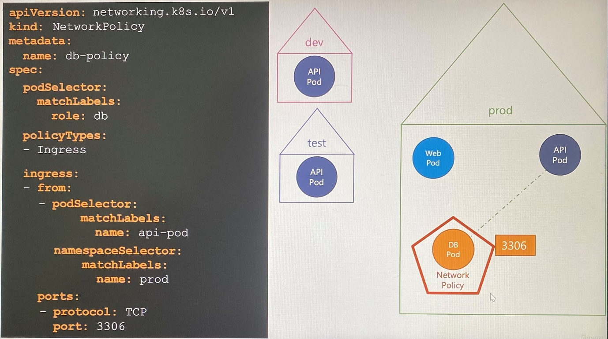

 

\- If there is backup server outside the Kubernetes cluster that need to
connect with DB pod, the **podSelector** or **namespaceSelector** won't
work as it is not a pod in the cluster. In that case, we use IP address
of the server to allow ingress traffic from range of IP addresses using
**ipBlock** property.

-These **podSelector, namespaceSelector** and **ipBlock** are supported
selectors under from section in ingress rule as well as to section in
egress rule

 

spec:

podSelector:

matchLabels:

role: db

policyTypes:

\- Ingress

ingress:

\- from:

\- podSelector:

matchLabels:

name: api-pod

namespaceSelector:

matchLabels:

name: prod

\- ipBlock:

cidr: 192.168.5.10/32

 

ports:

\- protocol: TCP

port: 3306

 

-The following network policy has two elements in ingress rules as
list/array. This works like OR operation. However, first rule has
podSelector and namespaceSelector as AND operation to match the pod.

 

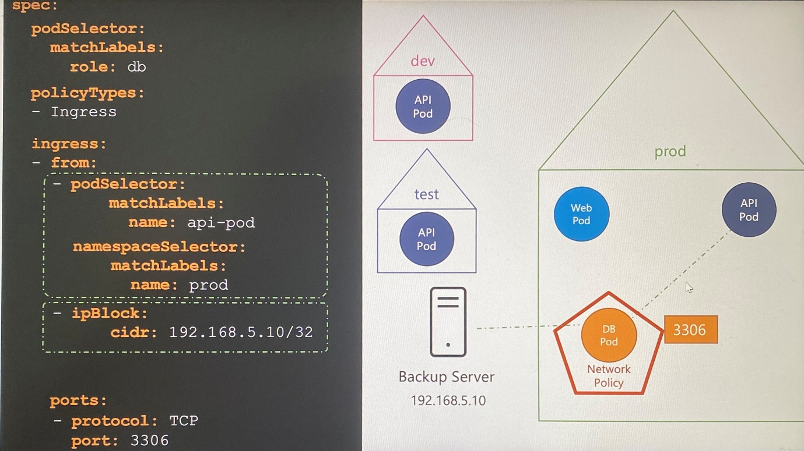

 

 

\- Multiple rule of ingress or egress can be configured in same network
policy as arrays

 

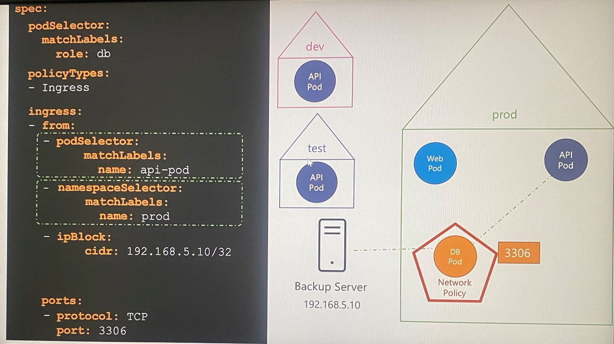

 

 

\- We can create ingress and egress rules in same network policy as well
where rules are defined with from for ingress and to for egress

 

spec:

podSelector:

matchLabels:

role: db

policyTypes:

\- Ingress

\- Egress

ingress:

\- from:

\- podSelector:

matchLabels:

name: api-pod

ports:

\- protocol: TCP

port: 3306

 

egress:

\- to:

\- ipBlock:

cidr: 192.168.5.10/32

ports:

\- protocol: TCP

port: 80

 

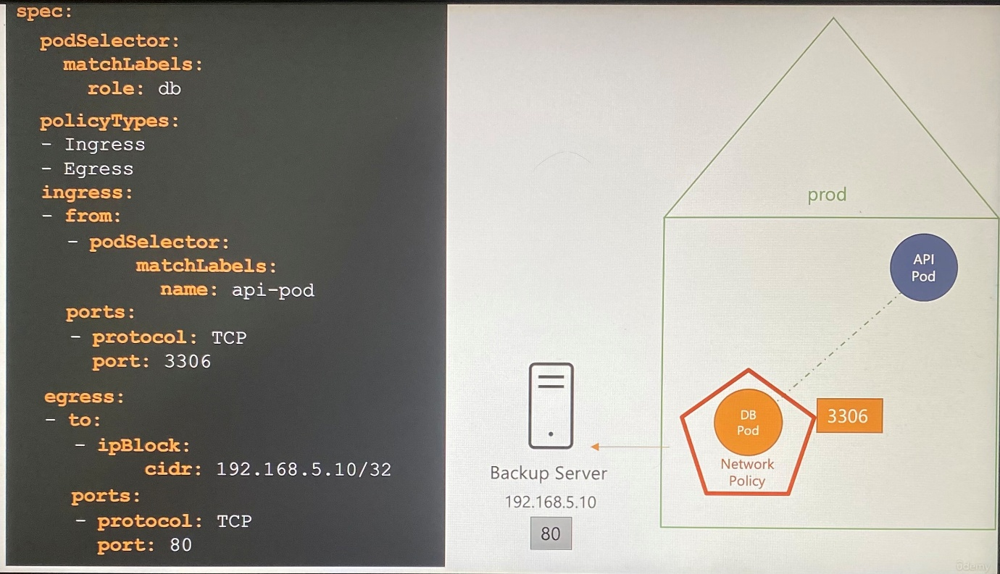

 

kubectl get networkpolicies ; to list network policies with the pod
selector that the network policy is applied on

 

kubectl get netpol ; list network policies by using short form

 

kubectl describe netpol \<name of network policy \> ; shows what type of
traffic is affected

 

 

-----------Network policy with multiple rules-----------------------

 

apiVersion: networking.k8s.io/v1

kind: NetworkPolicy

metadata:

name: internal-policy

namespace: default

spec:

podSelector:

matchLabels:

name: internal

policyTypes:

\- Egress

\- Ingress

ingress:

\- {}

egress:

\- to:

\- podSelector:

matchLabels:

name: mysql

ports:

\- protocol: TCP

port: 3306

 

\- to:

\- podSelector:

matchLabels:

name: payroll

ports:

\- protocol: TCP

port: 8080

 

\- ports:

\- port: 53

protocol: UDP

\- port: 53

protocol: TCP

 

**Note:** We have also allowed Egress traffic to TCP and UDP port. This
has been added to ensure that the internal DNS resolution works from
the internal pod.

 

**Remember:** The kube-dns service is exposed on port 53:

 

root@controlplane:~\> kubectl get svc -n kube-system

NAME TYPE CLUSTER-IP EXTERNAL-IP PORT(S) AGE

kube-dns ClusterIP 10.96.0.10 \<none\> 53/UDP,53/TCP,9153/TCP 18m

 

root@controlplane:~\>

 

-----------------------------------------------------------------------------------------------

 

Controlplane ~ ➜ kubectl describe networkpolicies.networking.k8s.io
payroll-policy

Name: payroll-policy

Namespace: default

Created on: 2025-04-28 11:24:23 +0000 UTC

Labels: \<none\>

Annotations: \<none\>

Spec:

PodSelector: name=payroll

Allowing ingress traffic:

To Port: 8080/TCP

From:

PodSelector: name=internal

Not affecting egress traffic

Policy Types: Ingres

 

---------------------------------------------------------------------------------------------------------------

 

 

Usually, Kubeadm tool deploy kube-proxy as pod where
***--cluster-cidr*** option is defined in volume as ConfigMap.

 

Mounts:

/lib/modules from lib-modules (ro)

/run/xtables.lock from xtables-lock (rw)

/var/lib/kube-proxy from kube-proxy (rw)

/var/run/secrets/kubernetes.io/serviceaccount from kube-api-access-l85tj
(ro)

 

Volumes:

kube-proxy:

Type: ConfigMap (a volume populated by a ConfigMap)

Name: kube-proxy

Optional: false

 

------------------------------------------------------

 

controlplane ~ ➜ kubectl describe configmaps kube-proxy -n kube-system

Name: kube-proxy

Namespace: kube-system

Labels: app=kube-proxy

Annotations: kubeadm.kubernetes.io/component-config.hash:
sha256:906b8697200819e8263843f43965bb3614545800b82206dcee8ef93a08bc4f4b

 

Data

====

config.conf:

----

apiVersion: kubeproxy.config.k8s.io/v1alpha1

bindAddress: 0.0.0.0

bindAddressHardFail: false

clientConnection:

acceptContentTypes: ""

burst: 0

contentType: ""

kubeconfig: /var/lib/kube-proxy/kubeconfig.conf

qps: 0

**clusterCIDR: 10.244.0.0/16**

configSyncPeriod: 0s

conntrack:

maxPerCore: null

min: null

tcpBeLiberal: false

tcpCloseWaitTimeout: null

tcpEstablishedTimeout: null

udpStreamTimeout: 0s

udpTimeout: 0s

detectLocal:

bridgeInterface: ""

interfaceNamePrefix: ""

detectLocalMode: ""

enableProfiling: false

healthzBindAddress: ""

hostnameOverride: ""

iptables:

localhostNodePorts: null

masqueradeAll: false

masqueradeBit: null

minSyncPeriod: 0s

syncPeriod: 0s

ipvs:

excludeCIDRs: null

minSyncPeriod: 0s

scheduler: ""

strictARP: false

syncPeriod: 0s

tcpFinTimeout: 0s

tcpTimeout: 0s

udpTimeout: 0s

kind: KubeProxyConfiguration

logging:

flushFrequency: 0

options:

json:

infoBufferSize: "0"

text:

infoBufferSize: "0"

verbosity: 0

metricsBindAddress: ""

mode: ""

nftables:

masqueradeAll: false

masqueradeBit: null

minSyncPeriod: 0s

syncPeriod: 0s

nodePortAddresses: null

oomScoreAdj: null

portRange: ""

showHiddenMetricsForVersion: ""

winkernel:

enableDSR: false

forwardHealthCheckVip: false

networkName: ""

rootHnsEndpointName: ""

sourceVip: ""

 

kubeconfig.conf:

----

apiVersion: v1

kind: Config

clusters:

\- cluster:

certificate-authority:
/var/run/secrets/kubernetes.io/serviceaccount/ca.crt

server: <https://controlplane:6443>

name: default

contexts:

\- context:

cluster: default

namespace: default

user: default

name: default

current-context: default

users:

\- name: default

user:

tokenFile: /var/run/secrets/kubernetes.io/serviceaccount/token

 

 

BinaryData

====

 

Events: \<none\>

 

ubectl describe con

 

 

If you do set the ***--cluster-cidr*** option on kube-proxy process,
make sure it matches IPALLOC_RANGE given to Weave Net where we can pass
the cidr value as environment variable in pod manifest file.

 

containers:

\- name: weave

env:

\- name: IPALLOC_RANGE

value: 10.244.0.0/16

 

---------------------------------------------------------------------------------------------------------------

 

 

**Kubectx and Kubens – Command line Utilities**

 

Throughout the course, you have had to work on several different
namespaces in the practice lab environments. In some labs, you also had
to switch between several contexts.

 

While this is excellent for hands-on practice, in a real “live”
kubernetes cluster implemented for production, there could be a
possibility of often switching between a large number of namespaces and
clusters.

 

This can quickly become and confusing and overwhelming task if you had
to rely on kubectl alone. This is where command line tools such as
kubectx and kubens come in to picture.

 

***Kubectx***

 

With this tool, you don't have to make use of lengthy “kubectl config”
commands to switch between contexts. This tool is particularly useful to
switch context between clusters in a multi-cluster environment.

 

Installation:

 

sudo git clone [https://github.com/ahmetb/kubectx
/opt/kubectx](https://github.com/ahmetb/kubectx%20/opt/kubectx)

sudo ln -s /opt/kubectx/kubectx /usr/local/bin/kubectx

 

 

Syntax:

 

kubectx ;To list all contexts

 

kubectx \<context_name\> ; To switch to a new context

 

kubectx - ; To switch back to previous context

 

kubectx -c ; To see current context

 

 

***Kubens***

 

This tool allows users to switch between namespaces quickly with a
simple command.

 

Installation:

 

sudo git clone [https://github.com/ahmetb/kubectx
/opt/kubectx](https://github.com/ahmetb/kubectx%20/opt/kubectx)

sudo ln -s /opt/kubectx/kubens /usr/local/bin/kubens

 

 

Syntax:

kubens \<new_namespace\> ; To switch to a new namespace

 

kubens - ; To switch back to previous namespace

 

**Custom Resource Definitions(CRD)**

 

Custom Resource is an extension of the Kubernetes API that is not
necessarily available in a default Kubernetes installation.

 

-When you create a deployment with defined replicas, deployment
controller is built in to Kubernetes continuously monitor the status of
resources that need to manage. The deployment controller is written in
Go and is part of the Kubernetes source code.

-Each resources in the cluster have controller its own that are
responsible for watching the status of these objects and making the
necessary changes on the cluster to maintain the state as expected.

 

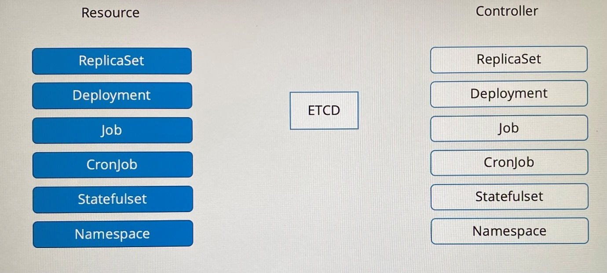

 

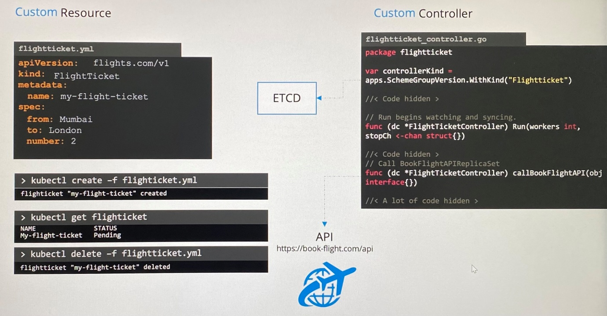

 

-Thus we can create custom resources as Kubernetes object and custom
controller to manage resources in Kubernetes.

 

 

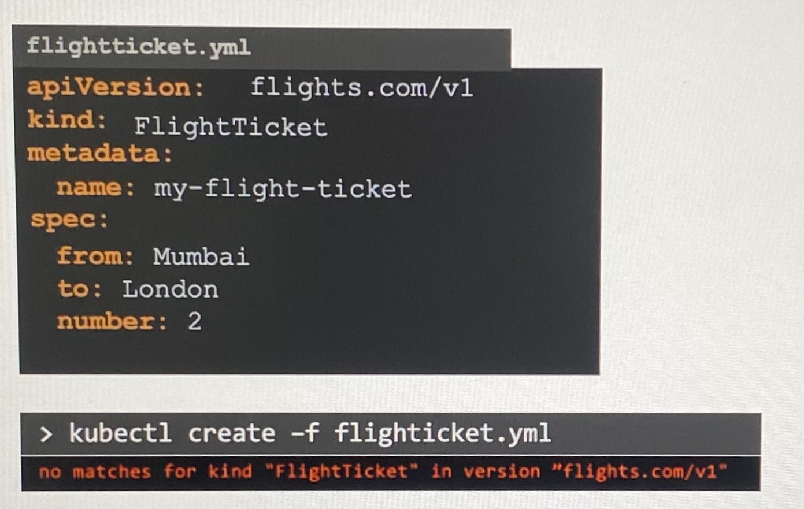

 

-To create any custom resource you want, you need to configure custom
resource in the Kubernetes API and store then in ETCD so that we need
custom resource definition(CRD)

-CRD includes following specification.

 

scope - Namespaced or clusterscoped

group - api group where it specifies apiVersion

names - kind, singular, plural, shortnames

versions - whether alpha or beta, storage version

schema

 

Multiple version can be configured for that same resource where we must
choose which ones are served through API server

-If you have multiple storage version, only one version can be marked as
the storage version.

-Schema defines all the parameters that can be specified under the spec
section when you create the object. It defines what fields are supported
and what type of value that fields support.

 

 

 

apiVersion: apiextensions.k8s.io/v1

kind: CustomResourceDefinition

metadata:

name: flighttickets.flights.com

spec:

scope: Namespaced

group: flight.com

names:

kind: FlightTicket

singular: flightticket

plural: flighttickets

shortnames:

\- ft

versions:

\- name: v1

served: true

storage: true

 

schema:

openAPIV3Schema:

type: object

properties:

spec:

type: object

properties:

from:

type: string

to:

type: string

member:

type: integer

minimum:

maximum: 10 ; validation line minimum and maximum values

 

 

 

kubectl create -f flightticket-custom-definition.yaml ; create custom
resource defintion

 

\*Thus Custom Resource Definitions or CRDs to create any kind of
resource you want on Kubernetes and specify a schema and add
validations.

 

-CRD allows to create resource and store data about resource in ETCD.
But it is not actually going to do anything because we don't have a
controller for it. To perform action with the resource created based on
the resource specifications, you need to build custom controller.

 

 

**Custom Controllers**

 

-To monitor the status of the resource objects in ETCD and perform
actions such as making API call to create resorces, we need a custom
controller.

 

Controller is any process or code that runs in a loop and is
continuously monitoring the Kubernetes cluster and listening to events
of specific objects being changed.

 

Developing a controller in Python may be challenging as the calls made
to the APIs may become expensive, and we will need to create our own
queuing and caching mechanisms.

 

To build a custom controller,

 

1.Install Go programming language

2.Clone GitHub Repo named sample-controller into the sample controller
directory

3.Customize the **controller.go** with your custom logic,

4.Build the code

5.Run by specifying the kubeconfig file(\$HOME/.kube/config) that the
controller can use to authenticate to the Kubernetes API

 

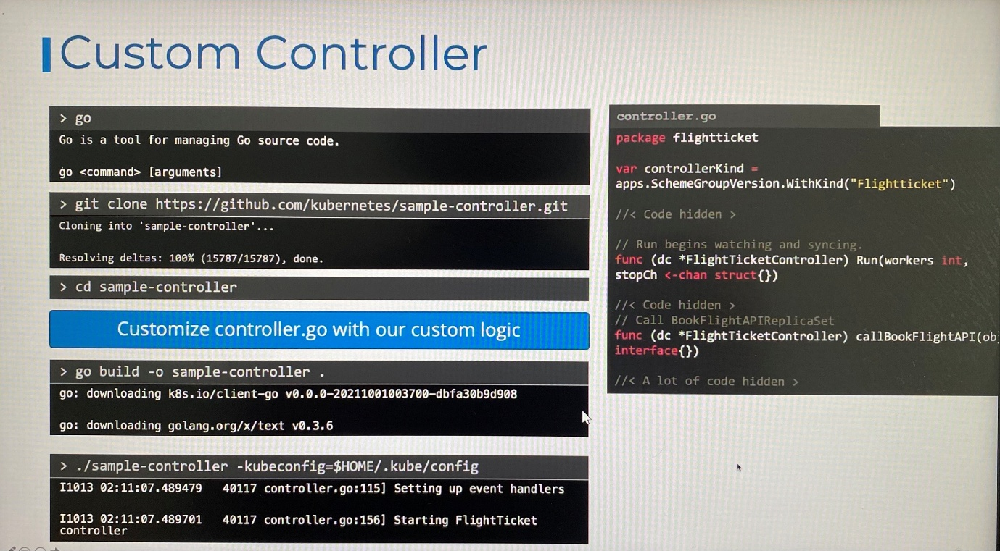

 

Then controller process starts locally. It watches the actions requires
to make necessary calls. Without build and run it each time, you can
package the custom controller in a docker image and choose to run it
inside the Kubernetes cluster as a pod or deployment.

 

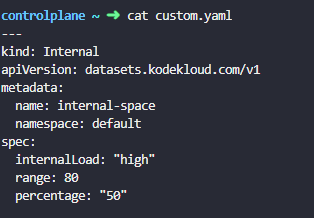

 

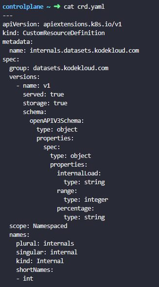

 

 

**Exam topics:**

 

There may be questions to build custom resource definitions and work
with customer resource definition files in the exam.

 

 

**Operator Framework**

 

Creating a custom resource definition(CRD) and a custom controller that
has the logic to work with that CRD are separate entities. We have to
manually create the CRD and the resources using the CRD, then we deploy
the controller as a pod or a deployment.

 

However, these two entities can be packaged together to be deployed as a
single entity using the operator framework.

 

-Operator framework does much more than just deploying CRD and Custom
Controller

-The most popular operator is the ETCD operator which is used to deploy
and manage ETCD cluster within Kubernetes. It has an **ETCDCluster** CRD
and **ETCD Controller** custom controller that watches ETCDCluster
resource.

-It can do much more such as take a backup using **ETCDBackup** and
**Backup Operator**, restore a backup using **ETCDRestore** and
**Restore Operator**

-Kubernetes operator manages a specific application such as installing,
maintaining, taking backup, restoring backup, fixing issue on
application

 

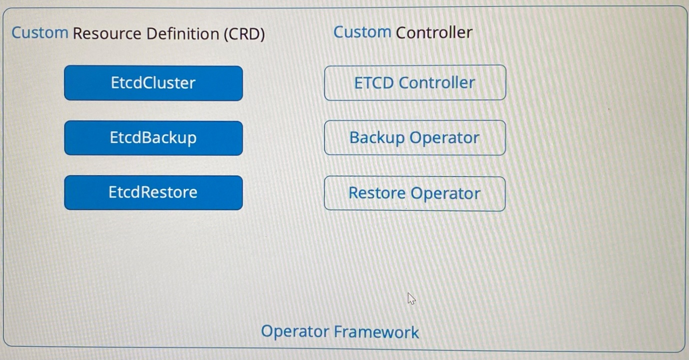

 

 

-All operators are available at the **OperatorHub**. You can find
operators for many of the popular applications like ETCD, MySQL,
Prometheus, Grafana, Argo CD, Istio. Click install button to get
installation instructions to install operator.

 

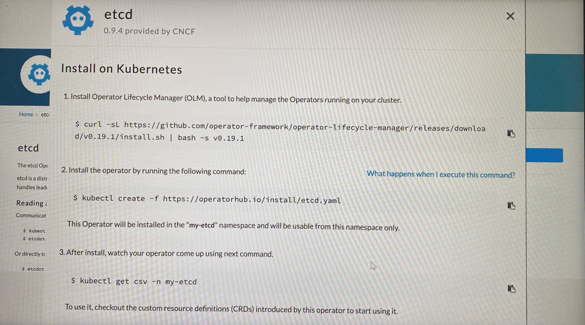

-Deploy application in following way.

 

1.Install Operator Lifecycle Manager(OLM), a tool to help manage the
operator running on your cluster

2.Install the operator

3.Watch your operator come up after installation

 

 

**Examtips:**

 

We don't anticipate question comes from Operator Framework on exam
