**Storage**

 

There are two concepts in storage in Docker.

1.  Storage drivers

2.  Volume drivers

 

**Docker storage**

 

***File system***

When you install docker on a system, it creates the following folder
structure.

 

/var/lib/docker/

 

Docker by default stores all its data in these folders such as aufs,
containers, image, volumes under /var/lib/docker/

 

***Layered architecture***

 

Docker builds images from Dockerfile in a layered architecture.

 

- Each line of instruction in the Dockerfile creates a new layer in the
  Docker image with changes from the previous layer

- As each layer only stores the changes of previous layer, it is
  reflected the size of layer.

- With layered architecture, the each layer that Docker build is cached.
  If you use a Dockerfile that has similar line of instruction like
  previous Dockerfile that you built, those similar layers will not be
  built again because those layers are cached

- Docker simply reuses all the previous layers from cache and quickly
  rebuild the image.

 

 

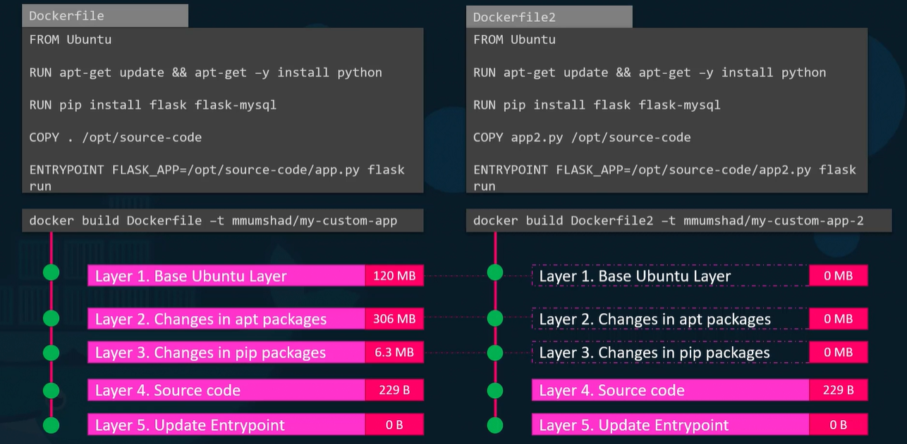

 

 

Thus, you build another app with same base image, packages and
dependencies, docker will reuse first 3 layers that use for the first
application from the cache and only creates last 2 layers in faster and
efficient manner saving the disk space and time to build image.

 

Whenever the application needs to update the source code, it reuse
previous 3 layers from cache.

 

Dockerfile contains base image, packages, dependencies, source code and
entrypoint.

 

Once you build an image from Dockerfile, it is read-only and you have to
initiate new build if you want to make changes.

 

When you create a docker container based on an image, you creates new
writable layer on top of image layers where you can store data created
by the container such as log files, temporary files or any files. This
layer and all of changes stored on it is destroyed when the container is
destroyed.

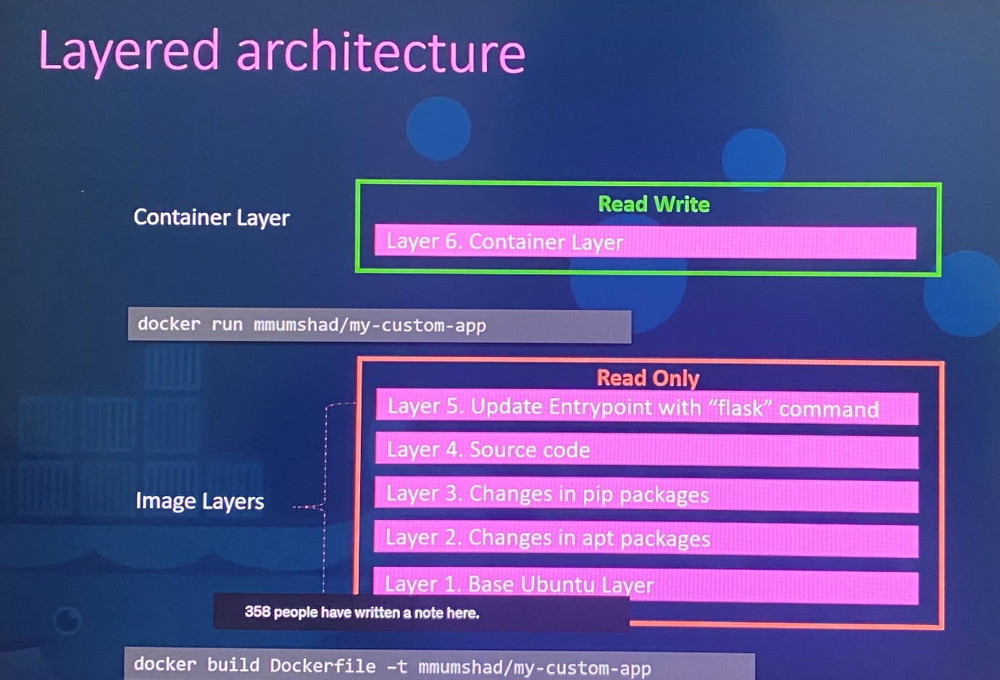

 

Image layers \> read only

Container layer \> Read Write

 

Same image layer is shared by multiple containers created from this
image. The files in image layer such as source code can be modified only
in container layer so that it gets copy of file onto container layer,
then it allows you to do any modification on the file and save in
container layer which is called ***COPY-ON-WRITE*** mechanism. Since
image layer is read only, files in image layer will not be modified in
the image itself. The image will remain the same until you rebuild the
image using *docker build* command.

 

Once container delete, all the data stored in container layer are
removed. If you need to persist the data to preserve even after the
container deletes, you could add a persistent volume to the container.

 

***Volumes in Docker***

 

When you need to preserve the data in the container, we can add
persistent volume to the conatiner.

 

docker volume create \<name of the volume\> ; create a volume under the
**/var/lib/docker/volumes** directory

 

docker run -v data_volume:var/lib/mysql mysql ; create docker container
with image mysql by mounting volume data_volume followed by default
location of application stores data in the container.

 

If you run **docker run -v data_volume2:var/lib/mysql mysql** command
without creating a volume specifically with **docker volume create**
command, it will create new volume on Docker host automatically and
mount it to location of application stores data in the container.

 

This is called ***volume mounting*** where mount the volume from volume
directory on Docker host to the location the application store the data.

 

ls /var/lib/docker/volumes ; list the all volumes created.

 

If you have external storage on the Docker host at /data/mysql, you can
store data in that volume instead default volume directory in the Docker
host.

 

docker run -v /data/mysql:var/lib/mysql mysql ; create docker container
with image mysql by mounting a full directory path of any location on
the docker host. This is called ***bind mounting***.

 

 

-v is old style to mount volume and the following is the preferred way
as it is more verbose, so you have to specify each parameter in key
value format.

 

docker run \\

\- -mount type=bind,source=/data/mysql,target=/var/lib/mysql mysql

 

source : location in the docker host

target : location in the container

 

Who is responsible to maintain the layered architecture, creating a
writeable layer, moving files across layers to enable copy and write,
help to manage storage on images and container, it is **storage
drivers**

 

***Storage drivers***

 

Docker use storage drivers to maintain the layered architecture,
creating a writeable layer, moving files across layers to enable copy
and write, help to manage storage on images and containers.

 

\- AUFS ; default storage driver for Ubuntu. This is not available for
Fedora, CentOS

\- ZFS

\- BTRFS

\- Device Mapper ; storage driver for Fedora, CentOS

\- Overlay

\- Overlay2

 

Selection of storage driver depends on underlying OS in use. Docker
selects better storage drivers automatically based on the operating
system it hosts. The different storage drivers provide different
performance and stability.

 

**Volume driver plugins in docker**

 

Volumes are not handled by storage drivers. Volumes we create are
handled by volume driver plugins.

 

The default volume driver plugin is Local which helps to create volume
in docker host and store its data under /var/lib/docker/volumes
directory.

 

***Third party volume driver plugin***

 

Some of these volume driver plugins support different storage provider.

 

- Azure File Storage

- Convoy

- DigitalOcean Block Storage

- Flocker

- Google Compute Persistent Disk(gce-docker)

- GlusterFS

- NetApp

- RexRay - support to provision storage on different storage providers
  such as AWS EBS, S3, Google Persistent Disk, Openstack Cinder, EMC
  storage arrays link Isilon, ScaleIO

- Portworx

- VMware vSphere storage

 

When you run docker container, you can choose specific volume driver as
follows.

 

docker run -it \\

\- -name mysql

\- -volume-driver rexray/ebs

\- -mount src=ebs-vol,target=/var/lib/mysql

mysql

 

This will create the container and mount the volume from AWS EBS where
the data is safe even if the container exits.

 

 

**Exam tips:**

 

Additional topics such as StatefulSets are out of scope for the exam.
However, if you wish to learn them, they are covered in the  Certified
Kubernetes Application Developer (CKAD) course.

 

 

**Container storage interface(CSI)**

 

Initially Kubernetes uses docker runtime as container runtime engine
embedded with Kubernetes source code. With new container runtime like
rocket, cri-o, the **container runtime interface(CRI) plugin** is
developed to make communication new container runtime with Kubernetes
where those are not be dependent on Kubernetes source code.

 

The Container Runtime Interface is a standard that defines how an
orchestration solution like Kubernetes would communicate with other
container runtimes like Docker. In future, if any container runtime is
developed, they should follow the CRI standards so that new container
runtime would work with Kubernetes without really work with Kubernetes
team or touch Kubernetes source code.

 

Similarly, Kubernetes communicates with different networking solutions
such as weaveworks, flannel, cilium using **Container Network
Interface(CNI) plugin** as long as they are developed based on CNI
standards.

 

Similarly, different CSI drivers can develop according to Container
Storage Interface(CSI) standards such as portworx, Amazon EBS, Azure
Disk, DellEMC Isilon, GlusterFS, PowerMax, Unity, XtremIO, NetApp,
Nutanix, HPE, Hitachi, Pure Storage. Everyone gets their own **Container
Storage Interface(CSI) drivers**

 

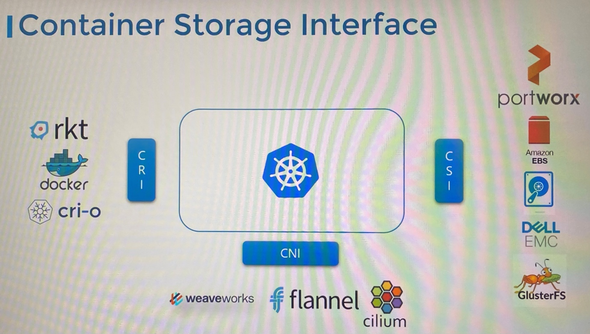

 

CSI is not a Kubernetes specific standards. CSI allows any container
orchestration tool such as Kubernetes, CloudFoundry, Mesos to work with
any storage vendor with a supported plugin.

 

CSI defines set of RPC(Remote Procedure Call) that will be called by
container orchestrators and these must be implemented by storage
drivers.

 

For example, CSI says that when a pod is created and requires a volume,
the container orchestrators such as Kubernetes calls ***CreateVolume***
RPC and pass set of details such as volume name. The storage drivers
should implement this RPC and handle the request and provision a new
volume on storage array and return the result of that operation.
Similarly, container orchestrator should call ***DeleteVolume*** RPC
when the volume needs to be deleted, then storage driver should
implement the code to decommission the volume from the array.

 

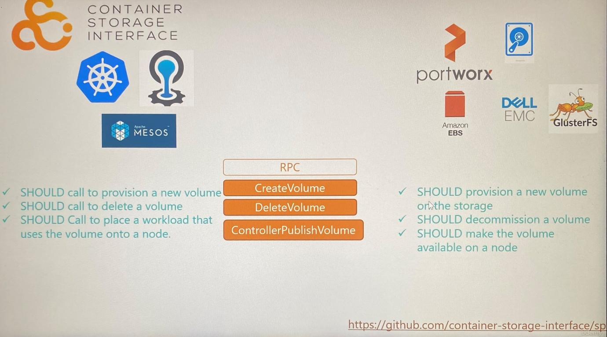

 

Specification details of what parameter should be sent, what should be
received by storage solution and what error code should be exchanged can
be referred in <https://github.com/container-storage-interface/sp>

 

**Volumes in Kubernetes**

 

\- Data within the container is destroyed along with the container as
soon as the process is complete

\- To persist the data created by container, we attach the volumes to
the containers when container is created

\- The data generated or processed by container is persisted in the
volume even after the container is deleted

\- Similarly processed data by pod is also deleted when pod gets
deleted. Hence we attach the volume to the pod created and store the
data in the volume will remains.

 

spec:

containers:

\- image: alpine

name: alpine

command:

args:

volumeMounts:

\- mountPath: /opt ;mount the volume inside container

name: data-volume

 

volumes:

\- name: data-volume

hostPath:

path: /data ; directory path on the node

type: Directory

 

1.  Create a volume on node to store data in the directory

2.  Mount the volume inside the container to access it by the container

 

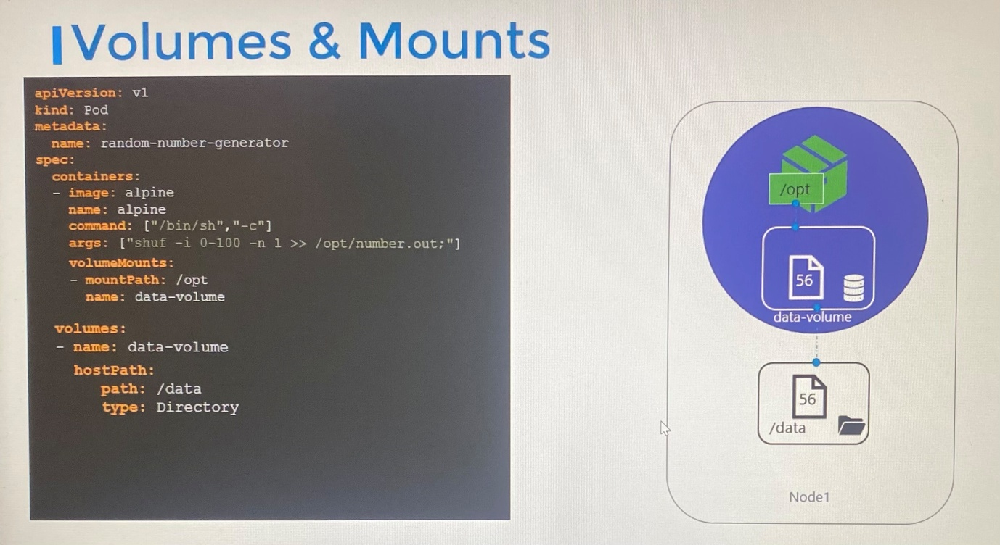

 

\- Data writes in volume mounted in the container first and it
replicates to hostPath. Hence pod is destroyed, data is still live in
the volume in the host

\- However, this is not recommended for multi node cluster because the
volume directory in hostPath cannot be same on all nodes in the cluster
unless you configure external replicated cluster storage solution.

 

Storage solution: NFS, GlusterFS, Flocker, Fiber Channel, SCALEIO,
CephFS and public cloud solutions such as AWS EBS, Azure Disk or File,
Google Persistent Disk

 

volumes:

\- name: data-volume

awsElasticBlockStore:

volumeID: \<volume-ID\> ; volume ID in Amazon EBS

fstype: ext4 ; file system type

 

 

**Persistent volumes**

 

\- When we create volumes that needs to configure using pod definition
file for each pod. When you have large environment with lot of users are
deploying pods, the users would have to configure storage every time for
each pod. Whatever storage solution is used and when every time changes
are made, the users would have to make the change on all pods.

-Instead, administrator can manage storage centrally as large pool of
storage, users can get piece from it.

\- Persistent volumes is a cluster wide pool of storage volumes that are
configured by administrator to use by users deploying applications on
the cluster.

\- Users can now select a storage from the pool by using ***Persistent
Volume Claim(PVC)***

 

 

apiVersion: v1

kind: PersistentVolume

metadata:

name: pv-vol1

spec:

accessModes:

\- ReadWriteOnce

capacity:

storage: 1Gi

hostPath:

path: /tmp/data ; Using storage from node's local directory is not
recommended for production environment

 

------------------------

 

 

apiVersion: v1

kind: PersistentVolume

metadata:

name: pv-vol1

spec:

accessModes:

\- ReadWriteOnce

capacity:

storage: 1Gi

awsElasticBlockStore: ; Using AWS EBS

volumeID: \<volume-ID\>

fstype: ext4

 

------------------------

apiVersion: v1

kind: PersistentVolume

metadata:

name: pv-vol1

spec:

accessModes:

\- ReadWriteOnce

capacity:

storage: 1Gi

gcePersistentDisk: ; Using Google Persistent Disk

pdName: pd-disk

fstype: cxt4

 

 

--------------------------------

 

*Specification of Persistent Volume*

 

\- Access mode defines how a volume should be mounted on the host
whether in ***ReadOnlyMany, ReadWriteOnce, ReadWriteMany***

\- Capacity specifies the amount of storage to be reserved

\- Replace the hostPath with external storage solution such
awsElasticBlockStore

 

***ReadWriteOnce*** - the volume can be mounted as read-write by a
single node. ReadWriteOnce access mode still can allow multiple pods to
access (read from or write to) that volume when the pods are running on
the same node. For single pod access, please see ***ReadWriteOncePod***.

 

***ReadOnlyMany*** - the volume can be mounted as read-only by many
nodes.

 

***ReadWriteMany***- the volume can be mounted as read-write by many
nodes.

 

***ReadWriteOncePod*** - the volume can be mounted as read-write by a
single Pod. Use ReadWriteOncePod access mode if you want to ensure that
only one pod across the whole cluster can read that PVC or write to it.

 

 

kubectl create -f pv-defintion.yaml

 

kubectl get persistentvolume \| pv

 

Once PV is created, its status is **Available** until PV binds with PVC.
Then status of PV is **Bound**

 

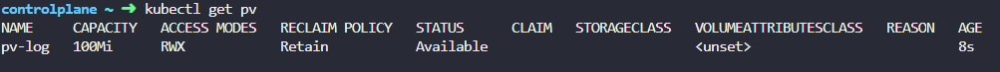

 

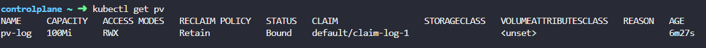

 

apiVersion: v1

kind: PersistentVolume

metadata:

name: pv-log

spec:

capacity:

storage: 100Mi

persistentVolumeReclaimPolicy: Retain

accessModes:

\- ReadWriteMany

hostPath:

path: /pv/log

 

 

**Persistent Volume Claim(PVC)**

 

-PV and PVC are separate Kubernetes objects

-Persistent Volume Claim is to make the storage available to a node.

-Administrator creates set of persistent volumes and user creates
persistent volume claim to use the storage

-Once PVCs are created, Kubernetes binds the persistent volumes to
persistent volume claims based on the requests and properties set on the
volumes.

-Every Persistent Volume Claim is bound to single Persistent Volume in
the binding process

 

- In the binding process, Kubernetes tries to find persistent volumes
  that meet these criteria requested by the claim such as **Sufficient
  Capacity, Access Modes, Volume Modes, Storage Class, Selector** etc..

 

- If there are multiple possible matches for a single claim and need to
  bind with a particular volume, you should still use labels and
  selectors(selector.matchLabels) to bind to the particular PV.

 

- Smaller claim may get bound to larger volumes if all other criteria
  matches. Since there is one-to-one relationship between PVC and PV, no
  other claim can utilize the remaining capacity in that volume.

 

- If there is no volume available that matches with criteria of claim,
  the claim will remain in **Pending** state until newer volume is
  available in the cluster.

 

\*\* PVC must be in same namespace as pod is in even though PV is in
different namespace.

 

apiVersion: v1

kind: PersistentVolumeClaim

metadata:

name: myclaim

spec:

accessModes:

\- ReadWriteOnce

resources:

requests:

storage: 500Mi

 

kubectl create -f pvc-defintion.yaml

 

-Once a PVC is created, status shows as **Pending** until it find a PV
matches. Once find the best match in PV, status changes as **Bound**

 

 

 

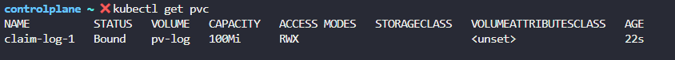

 

kubectl get persistentvolumeclaim \| pvc ; initially this will be in
pending state

 

 

***Delete PVCs***

 

kubectl delete persistentvolumeclaim myclaim ; delete the1 claim

 

When the claim is deleted, you can choose what is to happen to the
volume that has been bound to PVC we deleted where you can retain the
volume bound with the claim using ***persistentVolumeReclaimPolicy:
Retain.*** By default it is set to Retain. Then the persistent volume
will remain until administrator delete the volume manually and it is not
available to reuse by any other claim.

 

Or, the PV can be deleted automatically along with PVC when the claim
deletes if ***persistentVolumeReclaimPolicy: Delete***

 

***persistentVolumeReclaimPolicy: Recycle*** ; the data in the data
volume will be scrubbed before making it available for other claims.

 

**Using PVC in Pods**

 

Once you create a PVC use it in a pod definition file by specifying the
PVC claim under presistentVolumeClaim section in the volumes

 

apiVersion: v1

kind: Pod

metadata:

name: mypod

spec:

containers:

\- name: myfrontend

image: nginx

volumeMounts:

\- mountPath: "/var/www/html"

name: mypd

volumes:

\- name: mypd

persistentVolumeClaim:

claimName: myclaim

 

The same is true for ReplicaSets or Deployments. Add this to the pod
template section of a Deployment on ReplicaSet.

 

 

kubectl exec webapp - - cat /log/app.log ; exec into the container and
open the file.

 

If a PVC is associated with a pod, deleting PVC will be stuck in
terminating state as it uses with a pod. The PV will be bound with PVC.
The PVC will be deleted once the pod is deleted.

 

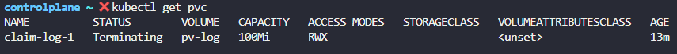

 

 

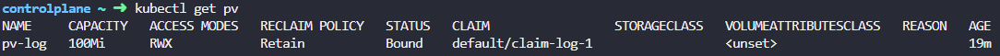

 

Once the pod deletes, the PVC associates to the pod as a volume will
also be deleted and the PV will be released.

 

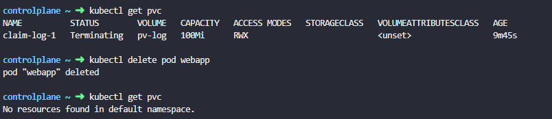

 

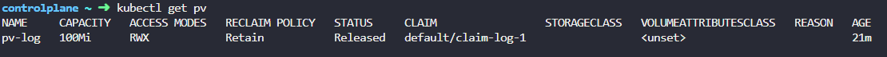

 

controlplane ~ ✖ kubectl get pv

NAME CAPACITY ACCESS MODES RECLAIM POLICY STATUS CLAIM STORAGECLASS
VOLUMEATTRIBUTESCLASS REASON AGE

pv-log 100Mi RWX Retain Released default/claim-log-1 \<unset\> 25m

 

 

**Storage Class**

 

Before creating PV, you must have created a disk in a provisioner such
as GCP, AWS or Azure.

 

Manually provisioning a disk in a provisioner such as GCP, AWS and then
specify it on persistent volume definition file is called as ***static
provisioning volumes.***

It would have been nice if the volume gets provisioning automatically
when the application requires it. That’s where storage classes comes in.

 

With the storage class, you can define provisioners such as Google
storage, Azure storage that automatically provision storage and attach
that storage to pod when PVC is made. That is called ***dynamic
provisioning volumes***. You do that using storage class object.

 

--------Storageclass-definition.yaml--------------------------------------

 

apiVersion: storage.K8s.io/v1

kind: StorageClass

metadata:

name: google-storage

provisioner: kubernetes.io/gce-pd ; how volumes provision

 

With the storage class, persistent volume will no longer be needed to
manually create because the PV and any associated storage is going to be
created automatically by storage class when the storage class is
created. For PVC to use storage class we defined, we can define storage
class name in persistent volume claim definition file with
**spec.storageClassName** and then define claim name in pod definition
file.

 

apiVersion: v1

kind: PersistentVolumeClaim

metadata:

name: myclaim

spec:

accessModes:

\- ReadWriteOnce

storageClassName: google-storage

resources:

requests:

storage: 500Mi

 

 

When PVC created with storage class associated, it uses the defined
provisioner to provision a new disk with the required size by
provisioner. Then create PV and then bind it to PVC.

 

We use GCE provisioner to create volume on GCP.

 

Volume provisioners : AWSElasticBlockStore, AzureFile, AzureDisk,
CephFS, Portworx, ScaleIO, Cinder

 

With these provisioners, you can pass additional parameters such as type
of disks to provision, replication-type. These parameters are very
specific to the provisioner.

 

apiVersion: storage.K8s.io/v1

kind: StorageClass

metadata:

name: google-storage

provisioner: kubernetes.io/gce-pd

parameters:

type: pd-standard \[pd-ssd \| pd-standard\]

replication-type: none \[ none \| regional-pd\]

 

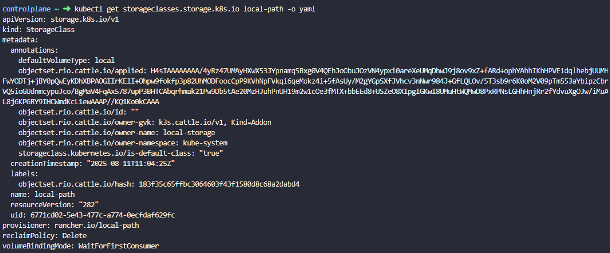

 

You can create different storage classes, each using different type of
disks.

 

Sliver storage class- standard disks

Gold storage class- SSD drives

Platinum storage class - SSD drives and replication

 

 

If PVC doesn't bind to PV despite all the matches are met and also PVC
use storage class, it needs to inspect events on PVC.

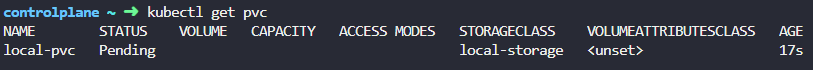

 

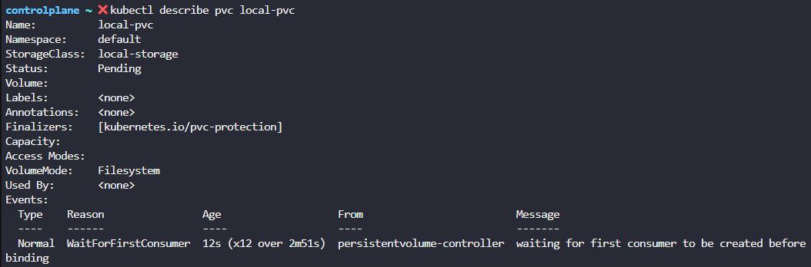

 

If the storage class use of ***VolumeBindingMode*** set to
***WaitForFirstConsumer***, This will delay the provisioning and binding
of a PersistentVolume until a Pod that uses the PersistentVolumeClaim is
created.

 

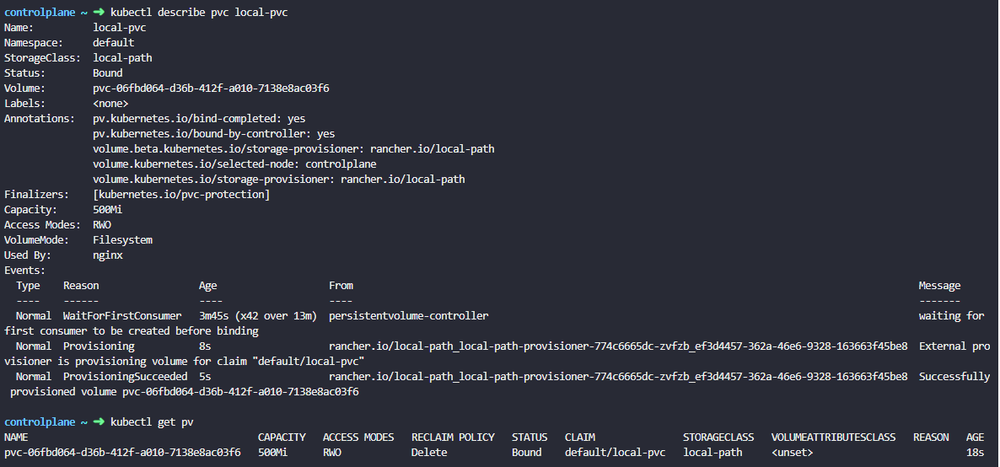

 

kubectl get sc ; list storage classes available

 

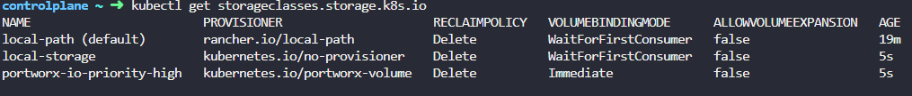

 

----------------------------------------------------------------

 

apiVersion: storage.k8s.io/v1

kind: StorageClass

metadata:

name: low-latency

annotations:

storageclass.kubernetes.io/is-default-class: "false"

provisioner: csi-driver.example-vendor.example

reclaimPolicy: Retain \# default value is Delete

allowVolumeExpansion: true

mountOptions:

\- discard \# this might enable UNMAP / TRIM at the block storage layer

volumeBindingMode: WaitForFirstConsumer

parameters:

guaranteedReadWriteLatency: "true" \# provider-specific
