# Kubernetes - Troubleshooting

**Kubectl autocomplete**

** **

To setup autocomplete in bash into current shell, refer the [kubectl
Cheat Sheet \|
Kubernetes](https://kubernetes.io/pt-br/docs/reference/kubectl/cheatsheet/)

 

Run the following command on CLI,

source \<(kubectl completion bash)

**Application Failure**

 

Assume that an user report an issue with accessing two-tier application
with web and database tiers.

 

*Check Accessibility*

 

\>curl
[http://web-service-ip:node-port](http://web-service-ip:node-port)

 

*Check service status*

 

\>kubectl describe service web-service

 

If it doesn't discover endpoints in the output, you might want to check
the service to pod discovery. Compare the selector configured on the
service to the labels configured on pod and make sure they match.

 

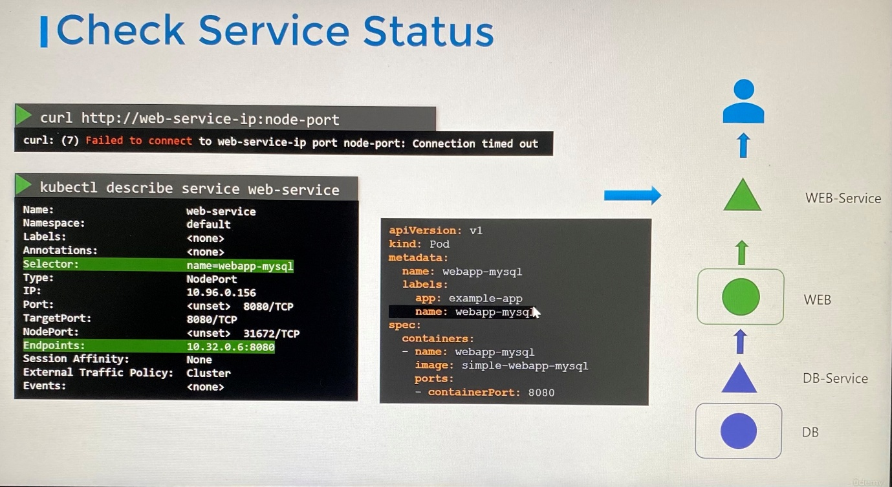

 

 

*Check POD*

 

\>kubectl get pod

 

Make sure the pod is in running state and the number of restarts will
give an idea of whether the application on the pod is running or is
getting restarted.

 

\>kubectl describe pod web

 

\>kubectl logs web

 

Check the events related to the pod and check logs of the application
using logs command.

 

If the pod is restarting due to a failure, then the logs in the current
version of the pod that's running the current version of the container
may not reflect why it failed the last time. You have to watch these
logs using -f option and wait application to fail again or use the
previous option to view the logs of a previous pod.

 

\>kubectl logs web -f

 

\>kubectl logs web -f --previous

 

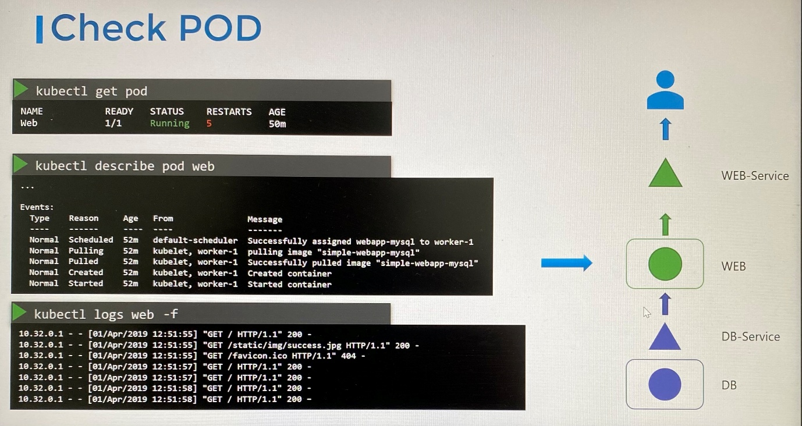

 

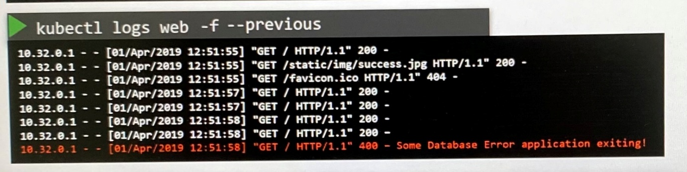

 

 

*Check dependent service*

 

\>kubectl describe service db-service ;Check the DB service

 

 

*Check dependent applications*

 

\>kubectl get pod

 

\>kubectl describe pod db

 

\>kubectl logs db

 

 

***Practice test summary***

 

\*In two tier application, if web interface loads, the web application
seems fine.

 

\*To switch to specific namespace,

 

\>kubectl config --help

 

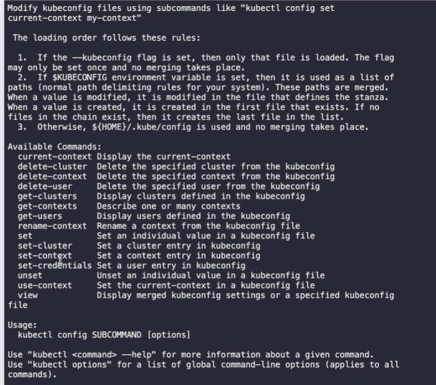

 

\>kubectl config set-context --help

 

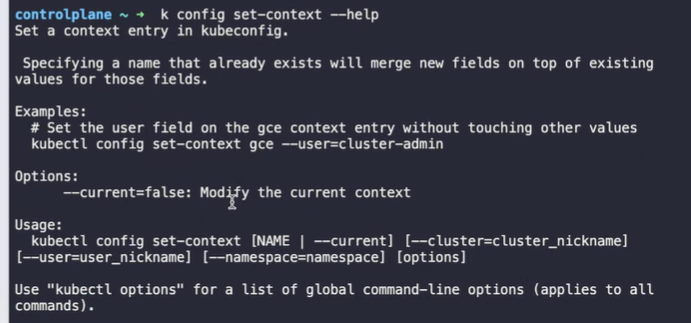

 

\>kubectl config set-context --current --namespace=\<namespace name\>

 

\*Usually web application should be a deployment which database should
be a pod.

 

\*Check status of web application access from CLI

 

\>curl [http://localhost:\<nodeport\>](http://localhost:%3cnodeport%3e)

 

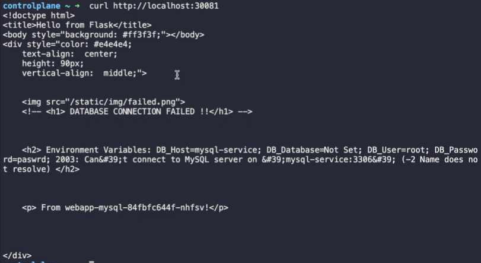

 

**\***If web interface doesn't load, the problem occur on web
application.

 

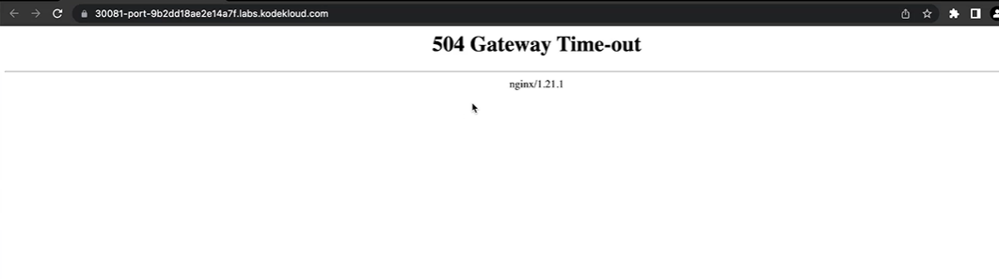

 

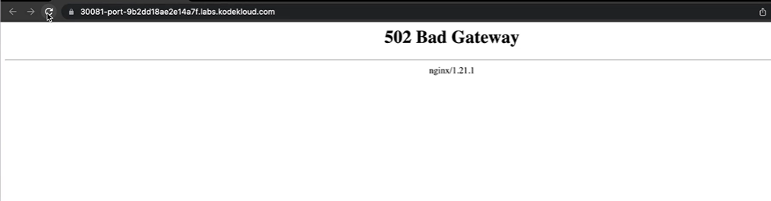

 

**ExamTips: Application Failure**

 

Error: Can't connect to MySQL server on 'mysql-service:3306' (Name
doesn't resolve)

 

\*If web application connects to database service, environment variable
on web deployment must be matched with exact name of database service

 

\*You can't change name of service by kubectl edit command. You must
delete the existing service and recreate the service with new name where
you can't use kubectl replace --force -f command

 

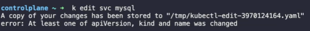

 

 

Error: Can't connect to MySQL server on 'mysql-service:3306' (Connection
refused)

 

\*Compare endpoint IP address and TargetPort in mysql service against IP
address and TargetPort of mysql pod

 

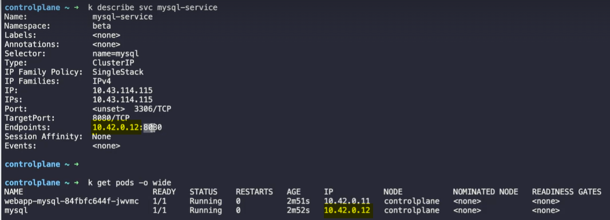

 

 

Error: 504 Gateway Time-out

 

\*In 504 Gateway Time-out error, troubleshoot should start from top to
bottom.

 

\*Compare endpoint IP address and TargetPort in web service against IP
address and TargetPort of web pod

 

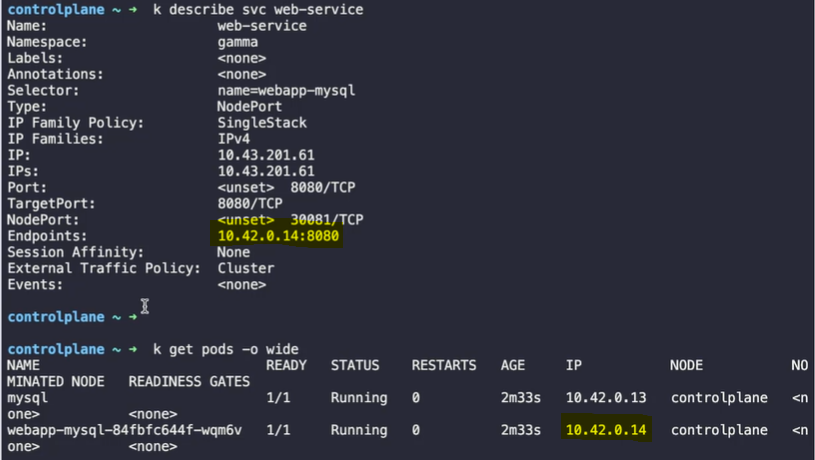

 

\*Compare selector on service and labels on pods. If selector and label
don't match, the endpoint on service shows **\<none\>.** In that case,
always edit selector on the service instead label on the pod.

 

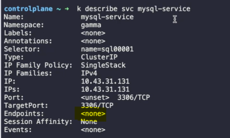

 

 

Error: Access denied 'sql-user'@'10.42.0.16' (using password: YES)

 

\*This error must related to user credentials who connects to database
pod from web pod or password set in database pod itself. Check the
username and password configured in environment variable in web pod or
database pod.

 

 

Error: 502 Bad Gateway

 

\*In 502 Bad Gateway error, troubleshoot should start from top to
bottom.

 

\*Check the nodeport on web application pod.

 

**Control Plane Failure**

 

*Check Node Status*

 

\>kubectl get nodes

 

\>kubectl get pods

 

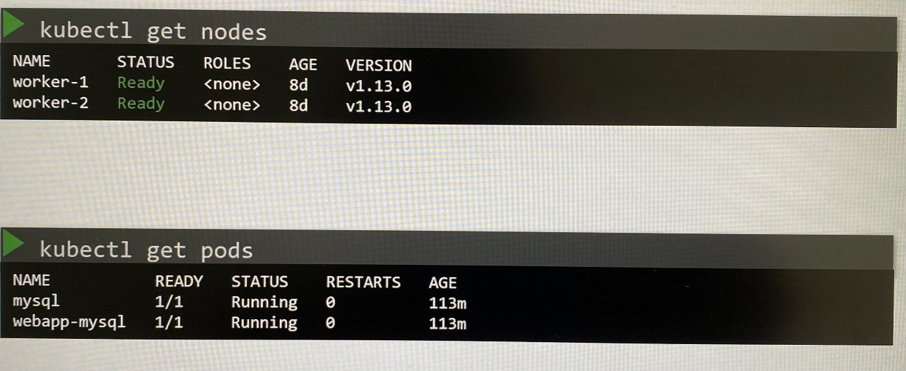

 

*Check Controlplane Pods*

 

If we deployed control plane components as pods in case of cluster
deployed with the Kubeadm tool,

 

\>kubectl get pods -n kube-system

 

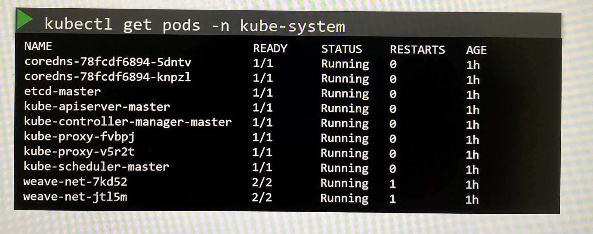

 

 

*Check Controlplane Services*

 

If the control plane components are deployed as services, check the
status of services such as Kube-API server, kube-controller-manager and
kube-scheduler on master nodes.

 

\>service kube-apiserver status

 

\>service kube-controller-manager status

 

\>service kube-scheduler status

 

 

 

Check the status of services such as kubelet and kube-proxy on worker
nodes.

 

\>service kubelet status

 

\>service kube-proxy status

 

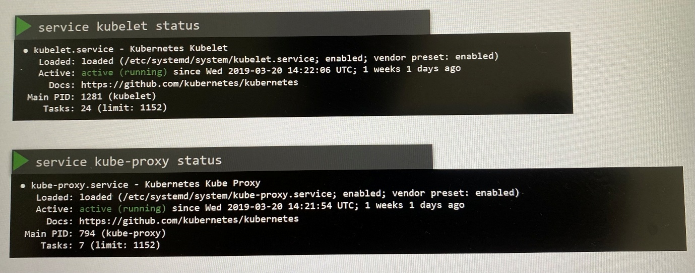

 

 

*Check Service Logs*

 

Check the logs of controlplane components

 

\>kubectl logs kube-apiserver-master -n kube-system

 

To view service logs using hosts logging, use journalctl utility.

 

\>sudo journalctl -u kube-apiserver

 

<img src="./images/media/image17.jpeg"
style="width:6.26806in;height:3.35in"
alt="kubectl logs kube-apiserver-master -n kube-system I0401 13:45:38.190735 1 server.go:703] external host was not specified, using 172.17.0.117 I0401 13:45:38.194290 1 server.go:145] Version: v1.11.3 I0401 13:45:38.819705 1 plugins.go:158] Loaded 8 mutating admission controller(s) successfully in the following order: NamespaceLifecycle, LimitRanger, ServiceAccount, NodeRestriction, Priority, DefaultTolerationSeconds, DefaultStorageClass,MutatingAdmissionWebhook. I0401 13:45:38.819741 1 plugins.go:161] Loaded 6 validating admission controller(s) successfully in the following order: LimitRanger, ServiceAccount, Priority, PersistentVolumeClaimResize,ValidatingAdmissionWebhook, ResourceQuota. I0401 13:45:38.821372 1 plugins.go: 158] Loaded 8 mutating admission controller(s) successfully in the following order: NamespaceLifecycle, LimitRanger, ServiceAccount, NodeRestriction, Priority, DefaultTolerationSeconds, DefaultStorageClass,MutatingAdmissionWebhook. I0401 13:45:38.821410 1 plugins.go:161] Loaded 6 validating admission controller(s) successfully in the following order: LimitRanger, ServiceAccount, Priority, PersistentVolumeClaimResize, ValidatingAdmissionWebhook, ResourceQuota. I0401 13:45:38.985453 1 master.go:234] Using reconciler: lease W0401 13:45:40.900380 1 genericapiserver.go: 319] Skipping API batch/v2alpha1 because it has no resources. W0401 13:45:41.370677 1 genericapiserver.go:319] Skipping API rbac.authorization.k8s.io/v1alpha1 because it has no resources. W0401 13:45:41.381736 1 genericapiserver.go:319] Skipping API scheduling.k8s.io/vlalpha1 because it has no resources. sudo journalctl -u kube-apiserver Mar 20 07:57:25 master-1 systemd[1]: Started Kubernetes API Server. Mar 20 07:57:25 master-1 kube-apiserver[15767]: 10320 07:57:25.553377 15767 flags.go:33] FLAG: |-address=&quot;127.0.0.1&quot; Mar 20 07:57:25 master-1 kube-apiserver[15767]: 10320 07:57:25.558273 15767 flags.go:33] FLAG: -- admission-control=&quot;[]&quot; Mar 20 07:57:25 master-1 kube-apiserver[15767]: 10320 07:57:25.558325 15767 flags.go:33] FLAG: 15767 flags.go:33] FLAG: -- admission-control-config-file=&quot;&quot; Mar 20 07:57:25 master-1 kube-apiserver[15767]: 10320 07:57:25.558339 -- advertise-address=&quot;192.168.5.11&quot; Mar 20 07:57:25 master-1 kube-apiserver[15767]: 10320 07:57:25.558353 15767 flags.go:33] FLAG: -- allow-privileged=&quot;true&quot; Mar 20 07:57:25 master-1 kube-apiserver[15767]: 10320 07:57:25.558365 15767 flags.go:33] FLAG: Mar 20 07:57:25 master-1 kube-apiserver[15767]: 10320 07:57:25.558413 15767 flags.go:33] FLAG: -- alsologtostderr=&quot;false&quot; -- anonymous-auth=&quot;true&quot; Mar 20 07:57:25 master-1 kube-apiserver[15767]: 10320 07:57:25.558425 15767 flags.go:33] FLAG: -- api-audiences=&quot;[]&quot; Mar 20 07:57:25 master-1 kube-apiserver[15767]: 10320 07:57:25.558442 15767 flags.go:33] FLAG: -- apiserver-count=&quot;3&quot; Mar 20 07:57:25 master-1 kube-apiserver[15767]: 10320 07:57:25.558454 15767 flags.go: 33] FLAG: -- audit-dynamic-configuration=&quot;false&quot; Mar 20 07:57:25 master-1 kube-apiserver[15767]: 10320 07:57:25.558464 15767 flags.go:33] FLAG: -- audit-log-batch-buffer-size=&quot;10000&quot; Mar 20 07:57:25 master-1 kube-apiserver[15767]: 10320 07:57:25.558474 15767 flags.go:33] FLAG: -- audit-log-batch-max-size=&quot;1&quot; Mar 20 07:57:25 master-1 kube-apiserver[15767]: 10320 07:57:25.558484 Mar 20 07:57:25 master-1 kube-apiserver[15767]: 10320 07:57:25.558495 15767 flags.go:33] FLAG: -- audit-log-batch-max-wait=&quot;0s&quot; 15767 flags.go:33] FLAG: Mar 20 07:57:25 master-1 kube-apiserver[15767]: 10320 07:57:25.558504 -- audit-log-batch-throttle-burst=&quot;0&quot; Mar 20 07:57:25 master-1 kube-apiserver[15767]: 10320 07:57:25.558514 15767 flags.go:33] FLAG: -- audit-log-batch-throttle-enable=&quot;false&quot; Mar 20 07:57:25 master-1 kube-apiserver[15767]: 10320 07:57:25.558528 15767 flags.go:33] FLAG: -- audit-log-batch-throttle-qps=&quot;0&quot; 15767 flags.go: 33] FLAG: -- audit-log-format=&quot;json&quot; " />

 

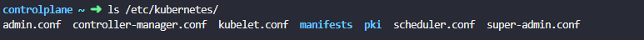

**ExamTips: Control Plane Failure**

 

A pod in deployment is pending state as kube-scheduler static pod is in
CrashLoopBackOff.

 

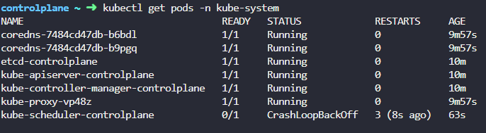

 

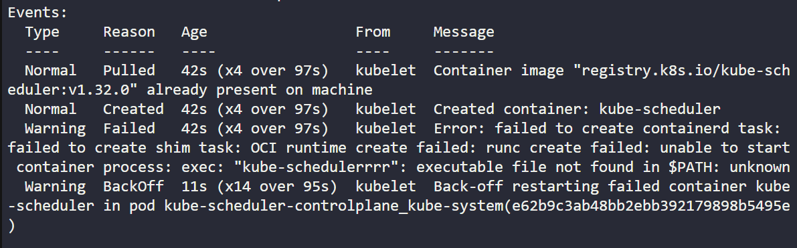

 

 

If static pods in controlplane node fails, check the events from kubectl
describe command or logs from kubectl logs.

 

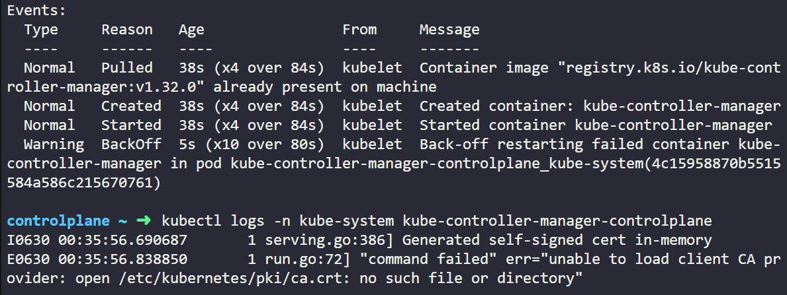

 

It appears the path /etc/kubernetes/pki is not mounted from the
controlplane to the kube-controller-manager pod. It is where CA
certificate is placed.

 

**Worker Node Failure**

 

*Check Node Status*

 

\>kubectl get nodes

 

\>kubectl describe node worker-1

 

Each node has set of conditions that can point why node is failed.
Depending on the status, they either set to true, false or unknown.

 

When the node out of disk space, the **OutOfDisk** flag is set to true.

When node is out of memory, **MemoryPressure** flag is set to true.

When disk capacity is low, **DiskPressure** flag is set to true.

When there are too many processes, **PIDPressure** flag is set to true.

If the node as a whole is healthy, **Ready** flag is set to true.

 

When worker node stops communicating with the master node due to crash ,
the status are set to **unknown**.

 

\*Check the **LastHeartbeatTime** field to find out the date/time that
the node is crashed.

 

 

 

*Check Node*

 

Check for possible CPU, memory and disk space on the nodes.

 

\>top

 

\>df -h

 

 

 

*Check Kubelet Status*

 

\>service kubelet status

 

Check the kubelet logs for possible issues

 

\>sudo journalctl -u kubelet

 

\>sudo journalctl -u kubelet -f

 

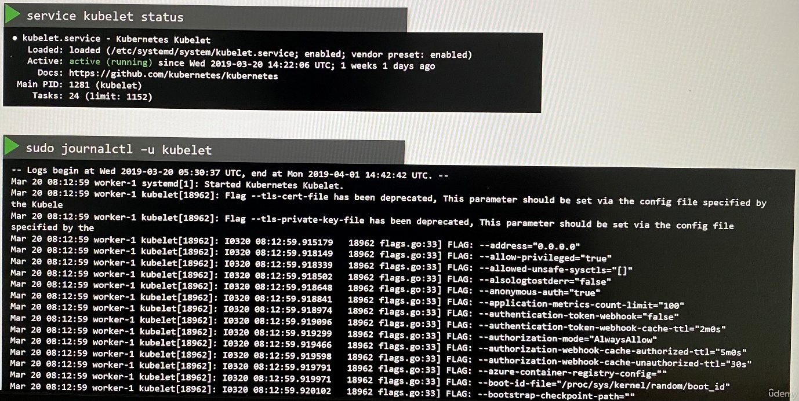

 

 

*Check Certificates*

 

Check the kubelet certificates and ensure they are not expired, they are
part of right group and the certificates are issued by right CA.

 

\>openssl x509 -in /var/lib/kubelet/worker-1.crt -text

 

 

**ExamTips: Worker Node Failure**

 

The worker node is NoteReady state. Check the kubelet service status
because kubelet helps in communication between a worker node and control
plane node

 

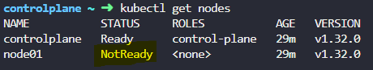

 

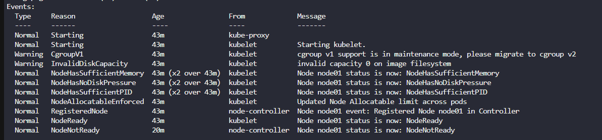

 

1.  If it is inactive(dead), start kubelet service with **service
    kubelet start** command

 

 

 

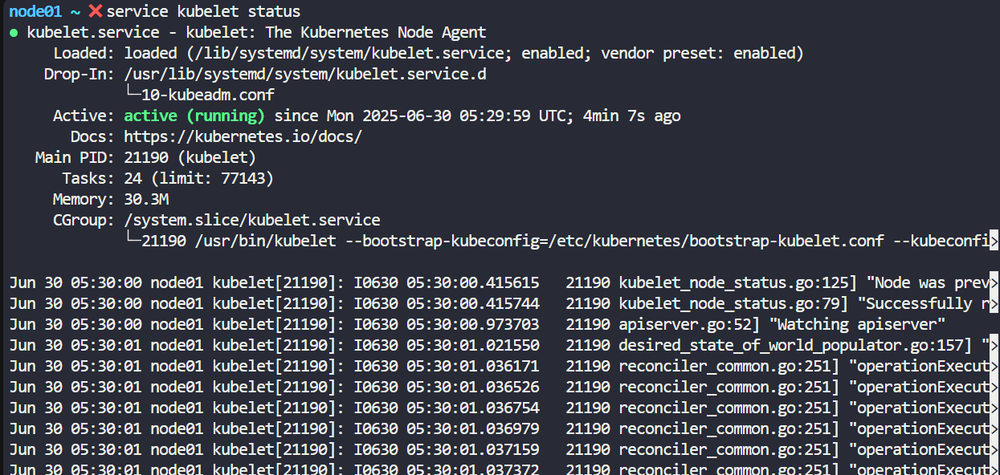

 

 

2.  Check the kubelet service status. If it is activating(auto-restart)
    stated and there is exit code(1/FAILURE). So follow these steps.

 

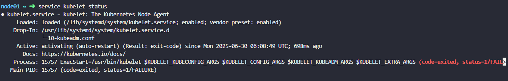

 

Attempt with **service kubelet start** command and check the status.
Then use **sudo journalctl -u kubelet** command to check kubelet logs.

 

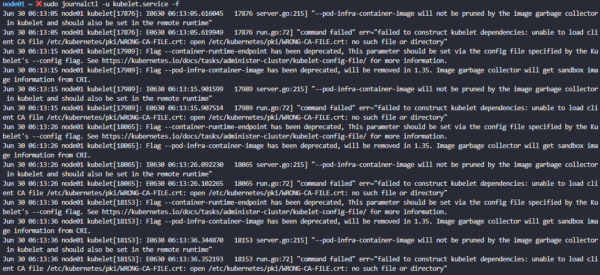

 

There appears to be a mistake path used for the CA certificate in the
kubelet configuration. The kubelet service picks the options from file
located in /var/lib/kubelet/

 

This can be corrected by updating the file /var/lib/kubelet/config.yaml
as follows:

 

x509:

clientCAFile: /etc/kubernetes/pki/WRONG-CA-FILE.crt

 

 

node01 ~ ➜ cat /var/lib/kubelet/config.yaml

apiVersion: kubelet.config.k8s.io/v1beta1

authentication:

anonymous:

enabled: false

webhook:

cacheTTL: 0s

enabled: true

x509:

clientCAFile: /etc/kubernetes/pki/WRONG-CA-FILE.crt

authorization:

mode: Webhook

webhook:

cacheAuthorizedTTL: 0s

cacheUnauthorizedTTL: 0s

cgroupDriver: cgroupfs

clusterDNS:

\- 172.20.0.10

clusterDomain: cluster.local

containerRuntimeEndpoint: ""

cpuManagerReconcilePeriod: 0s

crashLoopBackOff: {}

evictionPressureTransitionPeriod: 0s

fileCheckFrequency: 0s

healthzBindAddress: 127.0.0.1

healthzPort: 10248

httpCheckFrequency: 0s

imageMaximumGCAge: 0s

imageMinimumGCAge: 0s

kind: KubeletConfiguration

logging:

flushFrequency: 0

options:

json:

infoBufferSize: "0"

text:

infoBufferSize: "0"

verbosity: 0

memorySwap: {}

nodeStatusReportFrequency: 0s

nodeStatusUpdateFrequency: 0s

resolvConf: /run/systemd/resolve/resolv.conf

rotateCertificates: true

runtimeRequestTimeout: 0s

shutdownGracePeriod: 0s

shutdownGracePeriodCriticalPods: 0s

staticPodPath: /etc/kubernetes/manifests

streamingConnectionIdleTimeout: 0s

syncFrequency: 0s

volumeStatsAggPeriod: 0s

 

 

 

Update the CA certificate file WRONG-CA-FILE.crt to ca.crt.

 

Once this is fixed, restart the kubelet service with **service kubelet
restart**

 

 

3.  Check the kubelet service status. If it is active, follow these
    steps.

 

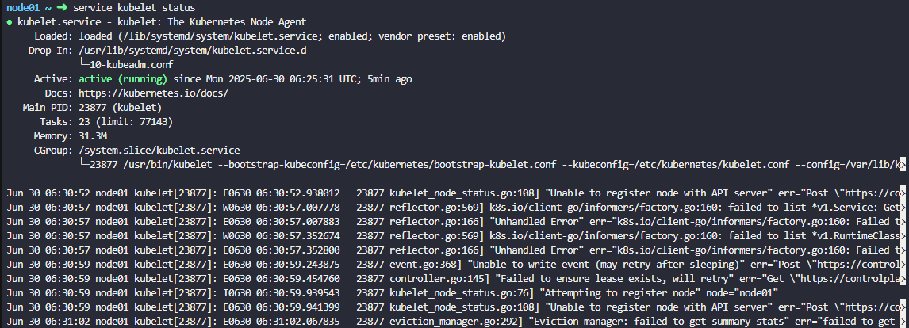

 

 

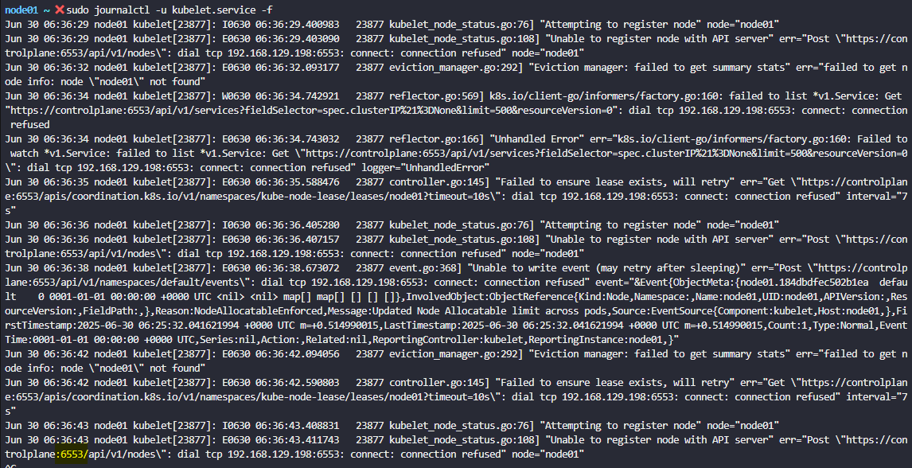

 

As we can clearly see, kubelet is trying to connect to the API server on
the controlplane node on port 6553. This is incorrect.

To fix, correct the port on the kubeconfig file used by the kubelet.

 

 

**Network Troubleshooting**

 

**Network Plugin in Kubernetes**

**--------------------**

*There are several plugins available and these are some.*

 

**1. Weave Net:**

 

To install,

 

kubectl apply -f
<https://github.com/weaveworks/weave/releases/download/v2.8.1/weave-daemonset-k8s.yaml>

 

You can find details about the network plugins in the following
documentation :

<https://kubernetes.io/docs/concepts/cluster-administration/addons/#networking-and-network-policy>

 

**2. Flannel :**

 

 To install,

 

kubectl apply
-f <https://raw.githubusercontent.com/coreos/flannel/2140ac876ef134e0ed5af15c65e414cf26827915/Documentation/kube-flannel.yml>

   

*Note: As of now flannel does not support kubernetes network policies.*

 

**3. Calico :**

   

   To install,

   curl
<https://raw.githubusercontent.com/projectcalico/calico/v3.25.0/manifests/calico.yaml>
-O

  *Apply the manifest using the following command.*

      kubectl apply -f calico.yaml

   Calico is said to have most advanced cni network plugin.

 

In CKA and CKAD exam, you won't be asked to install the CNI plugin. But
if asked you will be provided with the exact URL to install it.

*Note: If there are multiple CNI configuration files in the directory,
the kubelet uses the configuration file that comes first by name in
lexicographic order.*

 

 

**DNS in Kubernetes**

**-----------------**

Kubernetes uses **CoreDNS**. **CoreDNS** is a flexible, extensible DNS
server that can serve as the Kubernetes cluster DNS.

 

**Memory and Pods**

In large scale Kubernetes clusters, CoreDNS's memory usage is
predominantly affected by the number of Pods and Services in the
cluster. Other factors include the size of the filled DNS answer cache,
and the rate of queries received (QPS) per CoreDNS instance.

 

Kubernetes resources for **coreDNS **are:   

1.  *a service account named **coredns**,*

2.  *cluster-roles named **coredns** and **kube-dns***

3.  *clusterrolebindings named **coredns** and **kube-dns**, *

4.  *a deployment named **coredns**,*

5.  *a configmap named **coredns** and a*

6.  *service named **kube-dns**.*

 

While analyzing the coreDNS deployment you can see that the
the ***Corefile plugin*** consists of important configuration which is
defined as a ***configmap***.

 

Port **53** is used for for *DNS resolution*.

 

 

kubernetes cluster.local in-addr.arpa ip6.arpa {

pods insecure

7.  fallthrough in-addr.arpa ip6.arpa

8.  ttl 30

9.  }

 

This is the backend to k8s for *cluster.local and reverse domains*.

 

proxy . /etc/resolv.conf

 

Forward out of cluster domains directly to right *authoritative DNS
server*.

 

 

Troubleshooting issues related to coreDNS

1\. If you find **CoreDNS** pods in pending state first check network
plugin is installed.

2\. coredns pods have **CrashLoopBackOff or Error state**

If you have nodes that are running SELinux with an older version of
Docker you might experience a scenario where the coredns pods are not
starting. To solve that you can try one of the following options:

a)Upgrade to a newer version of Docker.

b)Disable **SELinux.**

c)Modify the coredns deployment to
set **allowPrivilegeEscalation** to *true*:

 

 

10. kubectl -n kube-system get deployment coredns -o yaml \| \\

11. sed 's/allowPrivilegeEscalation: false/allowPrivilegeEscalation:
    true/g' \| \\

12. kubectl apply -f -

d)Another cause for **CoreDNS **to have CrashLoopBackOff is when
a **CoreDNS** Pod deployed in Kubernetes detects a loop.

 

  There are many ways to work around this issue, some are listed here:

- Add the following to your kubelet config yaml: ***resolvConf:
  \<path-to-your-real-resolv-conf-file\>*** This flag
  tells ***kubelet*** to pass an alternate ***resolv.conf*** to Pods.
  For systems
  using** systemd-resolved**, ***/run/systemd/resolve/resolv.conf*** is
  typically the location of the ***"real" resolv.conf***, although this
  can be different depending on your distribution.

- Disable the local DNS cache on host nodes, and
  restore ***/etc/resolv.conf*** to the original.

- A quick fix is to edit your **Corefile**, replacing forward ***.
  /etc/resolv.conf*** with the IP address of your upstream DNS, for
  example forward **. 8.8.8.8**. But this only fixes the issue
  for **CoreDNS**, ***kubelet*** will continue to forward the
  invalid ***resolv.conf*** to all default dnsPolicy Pods, leaving them
  unable to resolve DNS.

 

3\. If **CoreDNS** pods and the** kube-dns** service is working fine,
check the **kube-dns** service has valid ***endpoints***.

              *kubectl -n kube-system get ep kube-dns*

If there are no endpoints for the service, inspect the service and make
sure it uses the correct selectors and ports.

 

 

**Kube-Proxy**

**---------**

**kube-proxy **is a network proxy that runs on each node in the
cluster. **kube-proxy **maintains *network rules on nodes*. These
network rules allow network communication to the Pods from network
sessions inside or outside of the cluster.

 

In a cluster configured with **kubeadm**, you can find **kube-proxy** as
a ***daemonset***.

 

**kubeproxy** is responsible for watching *services and endpoint
associated with each service*. When the client is going to connect to
the service using the *virtual IP* the** kubeproxy **is responsible
for *sending traffic to actual pods*.

 

If you run a kubectl describe ds kube-proxy -n kube-system you can see
that the** kube-proxy** binary runs with following command inside the
kube-proxy container.

 

 

13. Command:

14. /usr/local/bin/kube-proxy

15. --config=/var/lib/kube-proxy/config.conf

16. --hostname-override=\$(NODE_NAME)

 

    So it fetches the configuration from a configuration file
ie, ***/var/lib/kube-proxy/config.conf ***and we can override the
hostname with the node name of at which the pod is running.

 

  In the config file we define the **clusterCIDR, kubeproxy mode, ipvs,
iptables, bindaddress, kube-config** etc.

 

Troubleshooting issues related to kube-proxy

1\. Check **kube-proxy** pod in the **kube-system** namespace is
running.

2\. Check **kube-proxy **logs.

3\. Check **configmap** is correctly defined and the config file for
running **kube-proxy **binary is correct.

4. **kube-config** is defined in the **config map**.

5\. check **kube-proxy** is *running* inside the container

 

17. \# netstat -plan \| grep kube-proxy

<!-- -->

18. tcp 0 0 0.0.0.0:30081 0.0.0.0:\* LISTEN 1/kube-proxy

19. tcp 0 0 127.0.0.1:10249 0.0.0.0:\* LISTEN 1/kube-proxy

20. tcp 0 0 172.17.0.12:33706 172.17.0.12:6443 ESTABLISHED 1/kube-proxy

21. tcp6 0 0 :::10256 :::\* LISTEN 1/kube-proxy

 

 

***References:***

Debug Service issues:

                     
[*https://kubernetes.io/docs/tasks/debug-application-cluster/debug-service/*](https://kubernetes.io/docs/tasks/debug-application-cluster/debug-service/)

DNS Troubleshooting:

                     
[*https://kubernetes.io/docs/tasks/administer-cluster/dns-debugging-resolution/*](https://kubernetes.io/docs/tasks/administer-cluster/dns-debugging-resolution/)

**ExamTips: Network Troubleshooting**

 

1.  Both pods are in ContainerCreating state and no endpoint shows on
    service.

 

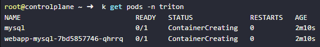

 

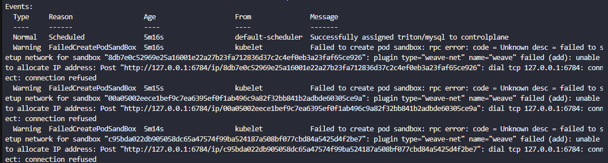

 

 

There are no any Weave Pods , which indicates it's not installed.
[Installing Addons \|
Kubernetes](https://kubernetes.io/docs/concepts/cluster-administration/addons/#networking-and-network-policy)

 

Install weave pods.

 

2.  Kube-proxy pod fails with CrashLoopBackOff.

 

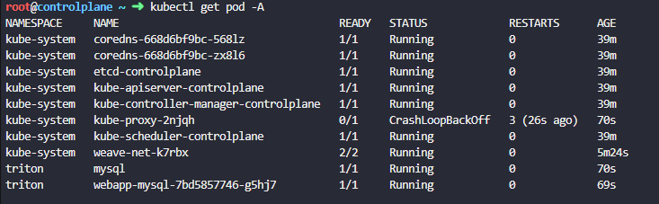

 

 

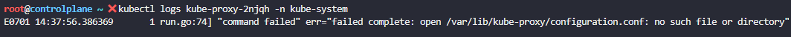

 

This means kube-proxy is failing because it cannot find its
configuration file at /var/lib/kube-proxy/configuration.conf.

 

Based on the logs (failed complete: open
/var/lib/kube-proxy/configuration.conf: no such file or directory), the
DaemonSet's --config argument points to configuration.conf, but the
ConfigMap provides its main configuration under config.conf

 

apiVersion: v1

data:

config.conf: \|-

apiVersion: kubeproxy.config.k8s.io/v1alpha1

bindAddress: 0.0.0.0

bindAddressHardFail: false

clientConnection:

acceptContentTypes: ""

burst: 0

contentType: ""

kubeconfig: /var/lib/kube-proxy/kubeconfig.conf

qps: 0

clusterCIDR: 10.244.0.0/16

configSyncPeriod: 0s

conntrack:

maxPerCore: null

min: null

tcpBeLiberal: false

tcpCloseWaitTimeout: null

tcpEstablishedTimeout: null

udpStreamTimeout: 0s

udpTimeout: 0s

detectLocal:

bridgeInterface: ""

interfaceNamePrefix: ""

detectLocalMode: ""

enableProfiling: false

healthzBindAddress: ""

hostnameOverride: ""

iptables:

localhostNodePorts: null

masqueradeAll: false

masqueradeBit: null

minSyncPeriod: 0s

syncPeriod: 0s

ipvs:

excludeCIDRs: null

minSyncPeriod: 0s

scheduler: ""

strictARP: false

syncPeriod: 0s

tcpFinTimeout: 0s

tcpTimeout: 0s

udpTimeout: 0s

kind: KubeProxyConfiguration

logging:

flushFrequency: 0

options:

json:

infoBufferSize: "0"

text:

infoBufferSize: "0"

verbosity: 0

metricsBindAddress: ""

mode: ""

nftables:

masqueradeAll: false

masqueradeBit: null

minSyncPeriod: 0s

syncPeriod: 0s

nodePortAddresses: null

oomScoreAdj: null

portRange: ""

showHiddenMetricsForVersion: ""

winkernel:

enableDSR: false

forwardHealthCheckVip: false

networkName: ""

rootHnsEndpointName: ""

sourceVip: ""

kubeconfig.conf: \|-

apiVersion: v1

kind: Config

clusters:

\- cluster:

certificate-authority:
/var/run/secrets/kubernetes.io/serviceaccount/ca.crt

server: <https://controlplane:6443>

name: default

contexts:

\- context:

cluster: default

namespace: default

user: default

name: default

current-context: default

users:

\- name: default

user:

tokenFile: /var/run/secrets/kubernetes.io/serviceaccount/token

kind: ConfigMap

metadata:

annotations:

kubeadm.kubernetes.io/component-config.hash:
sha256:906b8697200819e8263843f43965bb3614545800b82206dcee8ef93a08bc4f4b

creationTimestamp: "2025-08-31T04:44:10Z"

labels:

app: kube-proxy

name: kube-proxy

namespace: kube-system

resourceVersion: "270"

uid: 3ea871af-8846-4d13-894e-23737af460c4

 

 

We need to change the kube-proxy DaemonSet to point to the correct
configuration file name that exists in the kube-proxy ConfigMap , which
is : config.conf

 

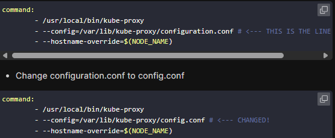

 

 

 
